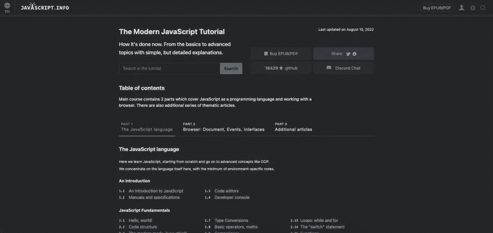
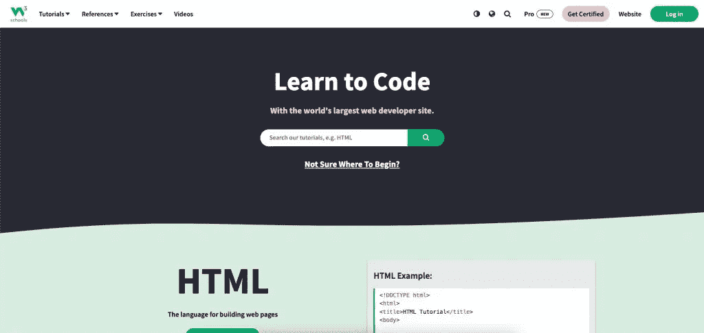
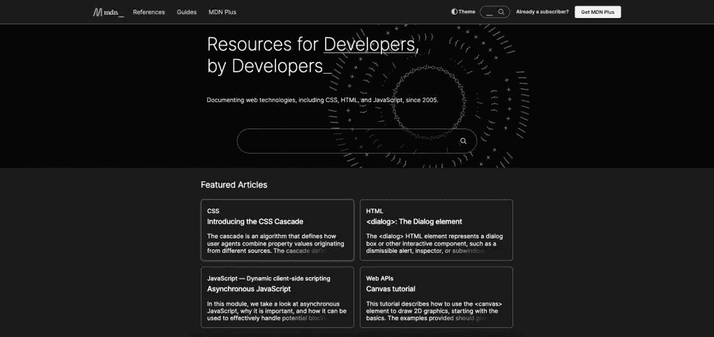
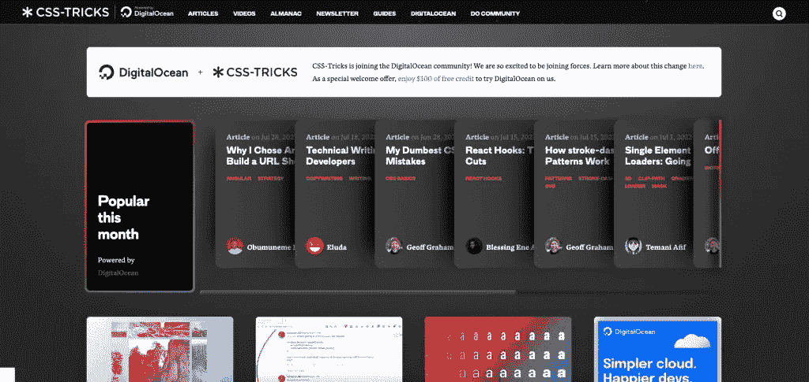
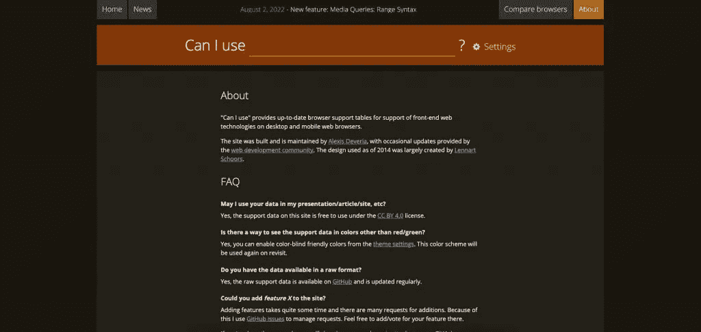
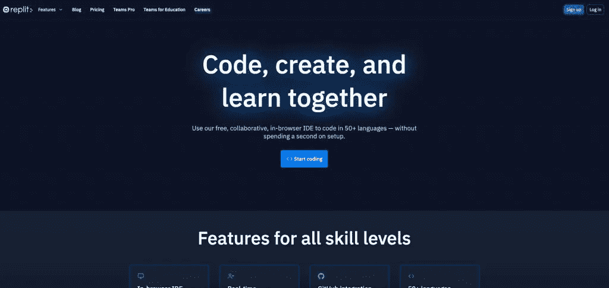
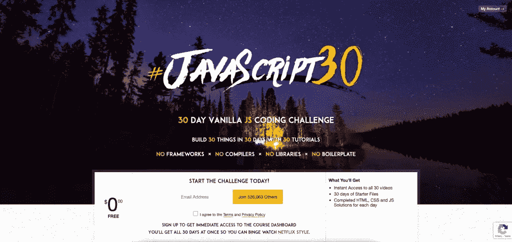

# 前端开发人员的 7 个网站

> 原文：<https://blog.devgenius.io/7-websites-for-frontend-devs-1814cdc16c78?source=collection_archive---------13----------------------->

# 1.JavaScript 信息

现代 JavaScript 教程现在是怎么做的。从基础到高级主题，有简单但详细的解释。

[JavaScript.info](https://javascript.info/) 是一个提供 JavaScript 相关信息的网站，包括教程、练习和参考资料。前端开发人员会喜欢这个网站上的资源，因为它提供了关于 JavaScript 初级和高级主题的信息。

链接:【https://javascript.info/ 

# 2.w3 学校

W3Schools 针对学习、测试和培训进行了优化。

W3Schools 是一个免费的在线资源,提供 14 种编程语言的教程和参考资料，包括 HTML、CSS、JavaScript、Python 和 C++。W3Schools 是一个开放访问平台，拥有成千上万的用户解决方案。

链接:-[https://www.w3schools.com/](https://www.w3schools.com/)

# 3.开发者 Mozilla

**MDN** Web Docs 站点提供了关于开放式 Web 技术的信息，包括用于网站和渐进式 Web 应用程序的 HTML、CSS 和 API。

MDN 由三部分组成:

*   出现在几乎所有 MDN 页面上的站点用户界面(或 UI)字符串，构成了文章的主要内容，并提供了导航和用户控件。
*   MDN 页面的主体由参考资料、指南和教程文章组成。本地化直接在 web 上完成。
*   宏字符串是宏模板的输出，这些宏模板构造了某些类型的导航、消息或生成的结构。这些字符串目前位于 GitHub 上，可以通过 pull 请求进行更改。

链接:-[https://developer.mozilla.org/en-US/](https://developer.mozilla.org/en-US/)

# 4.CSS-技巧

这个网站也有很多不同主题的教程，比如响应式设计、用户界面设计和跨浏览器兼容性。

[数字海洋于 2022 年 3 月收购了该网站](https://css-tricks.com/css-tricks-is-joining-digitalocean/)，因为它在前端开发者中非常受欢迎。尽管如此，它仍然是互联网上探索级联样式表的技巧和调整的最令人难以置信的资源。对于有 CSS 经验的开发人员来说，这是进一步学习这种语言的绝佳资源。

链接:-[https://css-tricks.com](https://css-tricks.com/)

# 5.我可以用 __？

提供最新的浏览器支持表，以支持桌面和移动 web 浏览器上的前端 web 技术。

*   对网页设计者/开发者有用
*   可能最终会被大多数浏览器实现
*   即使是旧的浏览器也不完全支持。这些功能可以进行搜索，但不包括支持表。

链接:-[https://caniuse.com/](https://caniuse.com/)

# 6.雷普利特

一个让你写代码和托管应用的编码平台。它还内置了许多教育功能，对教师和学习者来说都很棒。

**Replit** 是一个免费的 IDE(集成开发环境)，允许用户用几十种不同的语言编写自己的程序和代码。

传统的 ide 是下载到计算机上的软件程序，而 Repl.it 是完全基于 web 浏览器的，可以从任何支持互联网的设备(如电话、平板电脑或计算机)上访问。用户可以通过在浏览器中直接输入名字来访问该软件，名字是【replit.com·。

链接:-[https://replit.com/](https://replit.com/)

# 7.JavaScript30

他们的目标是帮助初学者到中级开发者，这些开发者希望熟悉 JavaScript 基础知识以及如何在没有库的情况下工作。他们通过应用和讨论理论问题来学习，比如我们如何解决这些问题。

*   即时访问所有 30 个视频
*   30 天的初始文件
*   每天完成的 HTML、CSS 和 JS 解决方案

链接:-[https://javascript30.com/](https://javascript30.com/)

# 结论:

因此，这些是前端开发人员经常使用的顶级网站，以获得他们问题的所有答案。你甚至可以[联系 Zluck Solutions](https://zluck.com/contact-us/) 获取更多信息。

如果你正在寻找一家公司来建立你的网站，那么 [Zluck Solutions](https://zluck.com/) 就是你的答案。凭借多年来在[网站设计和开发](https://zluck.com/services/web-services/)方面的经验，我们为您提供最佳的结果，不仅符合最新的设计趋势，而且满足您的要求。