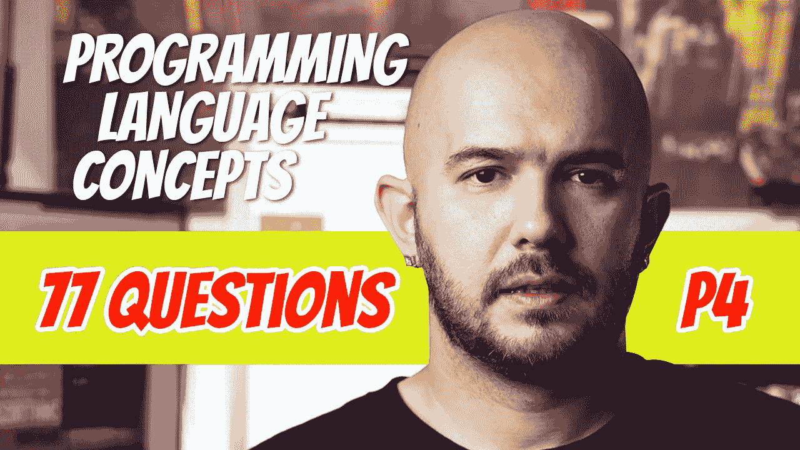

# 77 编程语言问答(P4)

> 原文：<https://blog.devgenius.io/77-programming-language-q-a-p4-71f7dc5cab3e?source=collection_archive---------7----------------------->

下面这篇文章讨论了当你被问到词法和语法分析时可能会遇到的问题和答案。查看页面底部的链接，我想出的其他问题和答案可以让你成为一名伟大的计算机科学家(当涉及编程语言时)。

## 324.实现编程语言的 3 种方法是什么？

-编译、纯解释和混合实现

## 325.语法分析器的工作是什么？

-检查程序的语法并创建一个解析树。

## 326.语法分析器基于什么？

-程序语法的正式描述，通常是 BNF。

## 327.使用 BNF 有什么好处？

-描述清晰简洁。
-语法分析器可以直接从 BNF 生成。
-基于 BNF 的实现易于维护。

## 328.语法分析的两个不同部分是什么，它们做什么？

-词法分析:处理小规模的语言结构，比如名字
-语法分析器:处理大规模的结构，比如表达式

## 329.词法分析从语法分析中分离出来的三个原因是什么？

-简单、高效和便携

## 330.词法分析器是做什么的？

-将输入字符收集到组(词位)中，并为每个组分配一个内部代码(标记)。

## 331.词汇是如何被识别的？

-通过将输入与模式进行匹配。

## 332.词法分析器执行的其他任务是什么？

-跳过词语之间的注释和空格。
-将用户自定义名称的词汇插入符号表。
-检测标记中的语法错误。

## 333.说出可以用来建立词法分析器的三种方法。

-编写语言的标记模式的正式描述，并使用软件工具自动生成词法分析器。
——设计一个描述语言令牌模式的状态转换图，并编写一个实现该图的程序。
-设计一个描述语言令牌模式的状态转换图，并手工构建状态图的表驱动实现。

## 334.状态转换图或 _________ 图是一种有向图。

-州

## 335.状态转换图或状态图是一个 _ _ _ _ _ _ _ _ _ 图。

-指导

## 336.描述一个状态图。

-节点标有状态名
-弧线标有输入字符
-弧线还可以包括转换时要完成的动作。

## 337.语法分析通常被称为 ________。

-解析

## 338.语法分析器的职责是什么？

-确定输入程序的语法是否正确。
-生成一个解析树。

## 339.当发现错误时，解析器必须做什么？

-产生诊断信息并恢复。

## 340.为什么使用恢复？

-以便编译器尽快找到尽可能多的错误。

## 341.解析器是如何分类的？

-根据他们构建解析树的方向。

## 342.两种不同的解析器类别是什么？

-自上而下
-自下而上

## 343.描述一个自顶向下的解析器。

-从根到叶建造一棵树

## 344.描述一个自底向上的解析器。

-从树叶到根构建一棵树。

## 345.自顶向下的解析器在 _________ 中跟踪或构建解析树。

-预购

## 346.当一个自顶向下的解析器按照 preorder 追踪解析树时意味着什么？

-在跟踪其分支之前，先访问每个节点。

## 347.自顶向下解析器采取的动作对应于一个 _________ 派生。

-最左边

## 348.________ _________ 解析器是直接根据语法语言的 BNF 描述编码的。

-递归下降

## 349.使用递归下降解析器的替代方法是什么？

-使用解析表

## 350.解析表和递归下降解析器都是 _______ _________。

- LL 算法。

## 351.LL 算法中 LL 代表什么？

-第一个 L:指定从左到右扫描输入
-第二个 L:指定生成最左边的派生

## 352.给定的右句子形式可以包括来自语法的一个以上的 RHS。要减少的正确 RHS 称为 ________。

-把手

## 353.最常见的自底向上解析算法属于 ___ 系列。

- LR

## 354.LR 算法中 LR 代表什么？

- L:从左到右扫描
- R:生成最右边的派生

## 355.适用于任何语法的解析算法的大 O 是什么？

- O(n)

## 356.商业应用中使用的解析算法的大 O 是什么？

- O(n)

## 357.递归下降解析器如何生成解析树？

-按自上而下的顺序

## 358.递归下降解析器对于语法中的每个 ___________ 都有一个子程序。

-非终结符

## 359._____ 非常适合描述递归下降解析器。

EBNF

## 360.______ __________ 给 LL 解析器带来了灾难性的问题。

-左递归

## 361.规则 A → A + B 中的左递归称为 _______ _________ _____。

-直接向左递归

## 362.真的还是假的？直接左递归出现在一个规则中。

-没错

## 363.ε符号代表什么？

-空字符串

## 364.以ε作为其 RHS 的规则称为 ______ _____。

-擦除规则

## 365.擦除规则为什么这么叫？

——因为在派生词中使用它，有效地从句子形式中抹去了它的 LHS。

## 366._____ _______ ________ 用于测试非左递归语法，以确定它是否可以用自顶向下的方式进行解析。

-成对不相交测试

## 367.成对不相交测试计算什么？

-第一组

## 368.自底向上的解析器可以接受左递归吗？

-是的

## 369.自底向上的解析器通过从最后一个句子形式(输入句子)开始，并返回到开始符号，产生最右边派生的 _____。

-倒车

## 370.在自底向上解析器的每一步中，解析器的任务是找到当前句子形式中必须重写以获得前一个句子形式的 ____。

- RHS

## 371.真的还是假的？一个正确的句子形式可以包括一个以上的 RHS。

-没错。即右边的句子形式 E + T * id 包括三个 RHS，E + T，T 和 id。

## 372.对于一个给定的右句子形式，自底向上分析器的任务是什么？

-找到独一无二的把手

## 373.什么是短语？

-由以整个解析树的一个特定内部节点为根的部分解析树的所有叶子组成的字符串。

## 374.什么是简单的短语？

-在一个步骤中从非终结符派生出来的短语。

## 375.一个正确的句子形式的句柄是 ________ _______ 短语。

-最左边的简单

## 376.自底向上的解析器通常被称为 ____ ______ 算法。

-换档减少

## 377.为什么自底向上解析器经常被称为移位归约算法？

因为移位和归约是它们的两个基本动作

## 378.在移位-归约算法中，移位操作有什么作用？

-将下一个输入标记移动到解析器的堆栈上。

## 379.在移位归约算法中，归约操作有什么作用？

-用相应的 LHS 替换解析器堆栈顶部的 RHS(句柄)。

## 380.大多数自底向上的解析器都属于 ___ 家族。

- LR

## 381.LR 解析器用什么？

-少量代码和一个解析表

## 382.唐纳德·克努特发明的原始 LR 算法叫什么名字？

-规范 LR 算法

## 383.为什么规范 LR 算法没有被广泛使用？

-生成一个解析表需要大量的计算机时间和内存

## 384.LR 解析器有哪些优点？

-可以为所有编程语言构建
-可以尽快检测语法错误
- LR 语法类是可由 ll 解析器解析的类的适当超集。

## 385.真的还是假的？手工生成 LR 解析表很容易。

-假的

## 386.LR 解析表一般是怎么产生的？

-使用将语法作为输入并生成解析表的软件

## 387.真的还是假的？如果 LR 解析器将堆栈内容的摘要保存在堆栈顶部的“state”符号中，它可以避免检查整个堆栈。

-没错

## 388.LR 解析器配置中的美元符号代表什么？

-输入结束标记

## 389.LR 解析过程基于解析表，该表有两部分:___ 和 _____。

-操作并转到

## 390.解析表指定了什么？

-解析器应该做什么

## 391.解析表如何指定解析器应该做什么？

-基于解析堆栈顶部的状态符号和下一个输入符号

## 392.除了 shift 和 reduce，解析表中还有哪两种可能的操作，它们是做什么的？

- Accept(解析完成)和 error(检测到语法错误)

## 393.GOTO 部分的值表示什么？

-完成归约后，应将哪个状态符号压入解析堆栈。

## 394.描述移位解析器操作。

-下一个输入符号与动作表中指定的状态符号一起被压入堆栈。

## 395.描述 reduce 解析器操作。

-首先，从堆栈中移除句柄。
-接下来，移除的符号数量是手柄中符号数量的两倍。
-接下来，将规则的 LHS 推送到堆栈上。
-最后，GOTO 表用于确定哪个状态必须被压入堆栈。

## 396.描述接受解析器操作。

-解析完成，未发现错误

## 397.描述错误分析器操作。

-解析器调用错误处理例程。

## 398.在命令式编程语言中，什么是变量？

-变量是冯·诺依曼架构的存储单元的抽象。

## 399.如何表征一个变量？

-通过属性的集合:名称、地址、值、类型、范围和生存期

## 400.真的还是假的？在函数式编程语言中，名字一旦被创建，就可以更改。

-假的

# 想要更多吗？

[P1。104 编程语言 Q&A](https://medium.com/@dinocajic/104-programming-language-conceptual-questions-and-answers-p1-8de4591299fe)T5[P2。95 编程语言 Q&A](https://medium.com/@dinocajic/95-programming-language-q-a-p2-4a7d87b89903)[P3。123 编程语言 Q & A](https://medium.com/@dinocajic/123-programming-language-q-a-p3-f4d5c141382)
[*P4。77 编程语言 Q&A*](https://medium.com/@dinocajic/77-programming-language-q-a-p4-71f7dc5cab3e)[P5。146 编程语言 Q & A](https://medium.com/dev-genius/146-programming-language-q-a-p5-d6ad7550c4a0)
[P6。94 编程语言 Q & A](https://medium.com/dev-genius/94-programming-language-q-a-p6-d7e00de0f48)
[P7。141 编程语言 Q & A](https://medium.com/@dinocajic/141-programming-question-q-a-p7-5b4a4325e886)

迪诺·卡伊奇目前是 [LSBio(生命周期生物科学公司)](https://www.lsbio.com/)、[绝对抗体](https://absoluteantibody.com/)、 [Kerafast](https://www.kerafast.com/) 、[珠穆朗玛生物](https://everestbiotech.com/)、[北欧 MUbio](https://www.nordicmubio.com/) 和 [Exalpha](https://www.exalpha.com/) 的 IT 主管。他还担任我的自动系统的首席执行官。他有十多年的软件工程经验。他拥有计算机科学学士学位，辅修生物学。他的背景包括创建企业级电子商务应用程序、执行基于研究的软件开发，以及通过写作促进知识的传播。

你可以在 [LinkedIn](https://www.linkedin.com/in/dinocajic/) 上联系他，在 [Instagram](https://instagram.com/think.dino) 上关注他，或者[订阅他的媒体出版物](https://dinocajic.medium.com/subscribe)。

[*阅读迪诺·卡吉克(以及媒体上成千上万其他作家)的每一个故事。你的会员费直接支持迪诺·卡吉克和你阅读的其他作家。你也可以在媒体上看到所有的故事。*](https://dinocajic.medium.com/membership)