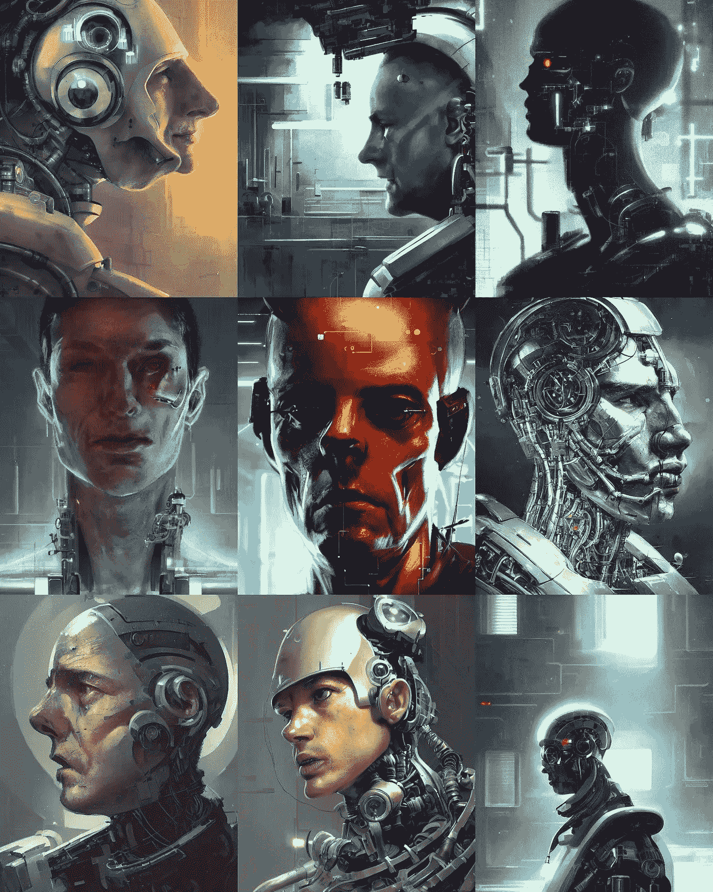

# 8 个疯狂的人工智能工具节省工作时间，你从来没有听说过。

> 原文：<https://blog.devgenius.io/8-crazy-ai-tools-saving-hours-of-work-youve-never-heard-of-1959cf77a525?source=collection_archive---------0----------------------->

## OpenAI、Midjourney、Jasper 或 Dall-E 不在名单上🤦

在 [code.store](https://code.store) ，我们用最先进的技术为客户打造令人惊叹的产品:[低码、](https://code.store/no-code-store)、[区块链](https://code.store/post/how-to-hire-web3-developers)、AI、[云原生函数](https://code.store/post/public-cloud-services-compared-2022)。如果您需要帮助，请联系我们！

这 8 个工具正在帮助我们的客户减少他们团队的巨大工作量，我们想分享它们。

 [## ChatGPT3 会终结我们的世界。

### 你不可能错过 ChatGPT 炒作。它产生说唱歌词，编写代码，创作音乐，并编写 DallE 提示。

medium.com](https://medium.com/@maximetopolov/chatgpt3-will-end-our-world-69125da7bb82) 

## [莱克斯。第](https://lex.page)页

Jasper 和 Copy.ai 被营销人员和 SEO 专家用来制作人工智能生成的内容。但是作家的经历太可怕了。Lex.page 是由作家为作家打造的。用户体验是惊人的:如果卡在什么东西上，点击“…”按钮，让 Lex 为你继续。

Lex.page 产品视频

**链接:**[**https://lex . page**](https://lex.page)

 [## 我如何在一周内创建了第一份完全由人工智能生成的报纸。

### 在 code.store，我们使用最先进的技术为我们心爱的人建立了许多有趣的数字项目…

medium.com](https://medium.com/graphql-portal/how-i-created-the-very-first-newspaper-entirely-generated-by-an-ai-within-a-week-fe97f452b3c2) 

## [Runway.ml](http://Runway.ml)

Climpchimp 还是 Adobe Premiere？不要！Runway.ml！

对于处理视频的内容创作者来说，这是一个非常棒的工具箱。您可以:

*   只需点击一下，即可移除视频背景
*   图像到图像生成
*   运动跟踪
*   绿色背景整合
*   文本到 3d 纹理

还有更多！

**链接:【https://runwayml.com/】**

** [## 5 个令人兴奋的人工智能工具，你必须加入哪一个

### 我写了一些非常酷的人工智能工具和一些不太为人所知的工具。但是今天，我要给你呈现 5 个…

medium.com](https://medium.com/@maximetopolov/5-mindblowing-ai-tools-which-waiting-list-you-must-join-a994376a9939) 

## [DiffusionBee.com](https://diffusionbee.com/)

DiffusionBee 是一个免费的 MacOS 应用程序，用于稳定的扩散人工智能图像生成。就像 Midjourney 或 Dall-E，你写一个提示，你就有了你的图像。但是，因为你在你的 Mac 上运行它，并且使用开源技术，所以它是免费的！

**链接:**[**【https://diffusionbee.com/】**](https://diffusionbee.com/)

 [## ChatGPT3 会毁掉世界上所有的软件。这就是为什么:

### ChatGPT3 体验是🤯它的能力还有待发现。

medium.com](https://medium.com/@maximetopolov/chatgpt3-will-blow-every-single-piece-of-software-in-the-world-this-is-why-f7ac57914877) 

## [Lexica.art](https://lexica.art/)

你是怎么用 AI 生成图像的？使用提示。提示是一项复杂的任务，掌握它需要大量的时间来尝试不同的方法和提示。现在，有一个搜索引擎的提示被用来生成美丽的图像。寻找一张工厂的图片，而不是花几个小时尝试 Dall-E 或 Stable Diffusion，去 Lexica.art 上搜索别人对工厂做了什么。找到您正在寻找的内容，并调整提示或探索类似的样式。

**链接:**[**https://lexica.art/**](https://lexica.art/)

 [## 如何让你的网站在 ChatGPT 上可见？

### 大型语言模型的出现极大地改变了我们在网上与企业互动的方式。

medium.com](https://medium.com/@maximetopolov/how-to-make-your-website-visible-on-chatgpt-32d92bd6c8b6) 

## [隐喻](https://metaphor.systems/)

你可能已经体验过谷歌有多蠢了。嗯，这是因为谷歌仍然依赖反向链接和关键字来索引和排名页面。借助现代人工智能，有可能理解用户到底在寻找什么，并预测链接，就像 GPT-3 预测你的营销博客文章的下一段一样。见见隐喻，第一个“智能”搜索引擎，你可以像提示 GPT3 一样提示你的搜索。

**链接:**[**https://metaphor.systems/**](https://metaphor.systems/)

 [## NoCode 的未来

### 在 2022 年 NoCode 峰会期间，我们关于“无代码的未来”的演讲取得了巨大成功。由于缺乏…

medium.com](https://medium.com/@maximetopolov/the-future-of-nocode-23e50cb05120) 

## [Soundraw.io](https://soundraw.io/)

如果你在制作视频，你需要一段背景音乐。使用 Soundraw，您可以设置任何流派、持续时间和每分钟节拍数，并生成数小时的不同音乐。质量很惊人，你不能说它是由一个 AI 生成的。

**链接:**[**https://soundraw.io/**](https://soundraw.io/)

 [## 这 12 种编程语言说明了你的心理？

### 告诉我你最喜欢的语言是什么，我就知道你是谁。

medium.com](https://medium.com/@maximetopolov/what-do-these-12-programming-languages-say-about-you-1474e3e9c6b7) 

## [Clipdrop.co](https://clipdrop.co/)

为电商或博客编辑照片？ClipDrop 将帮助您删除背景，提升您的照片，并清理或重新照亮它们。最重要的部分？它们提供了批处理编辑和 API，因此您可以将它们集成到您自己的应用程序中。

**链接:**[**【https://clipdrop.co/】**](https://clipdrop.co/)

 [## 乌克兰开发商如何撼动法国政府？

### 一个真实的故事，几年前发生在一个同事身上。

medium.com](https://medium.com/@maximetopolov/how-a-ukrainian-developer-quaked-the-french-government-b02a532b06ab) 

## [与书籍交谈(谷歌)](https://books.google.com/talktobooks/)

在你的文章中加入一些权威论点可以提高读者的参与度和信任度。在互联网上搜索报价通常会给你过度使用的报价。你现在可以在超过 100，000 本由谷歌索引的书中寻找引文。

**链接:**[**https://books.google.com/talktobooks/**](https://books.google.com/talktobooks/)

奖金工具？ [WeWeb.io](https://www.weweb.io/) 。里面没有人工智能，但是天啊，你可以用它建造任何东西:

在 [code.store](https://code.store) ，我们利用最先进的技术为客户打造令人惊叹的产品:[低代码、无代码](https://code.store/no-code-store)、[区块链](https://code.store/post/how-to-hire-web3-developers)、AI、[云原生函数](https://code.store/post/public-cloud-services-compared-2022)。如果您需要帮助，请联系我们！

现在您在这里，您可以享受其他工具列表:

 [## 您会喜欢的 25 种工具和资源(可能从未听说过)

### 无论是设计师还是开发者，你都会喜欢那些不太为人知的工具

medium.com](https://medium.com/@maximetopolov/25-tools-resources-you-will-love-and-probably-never-heard-of-765709f2868a) **