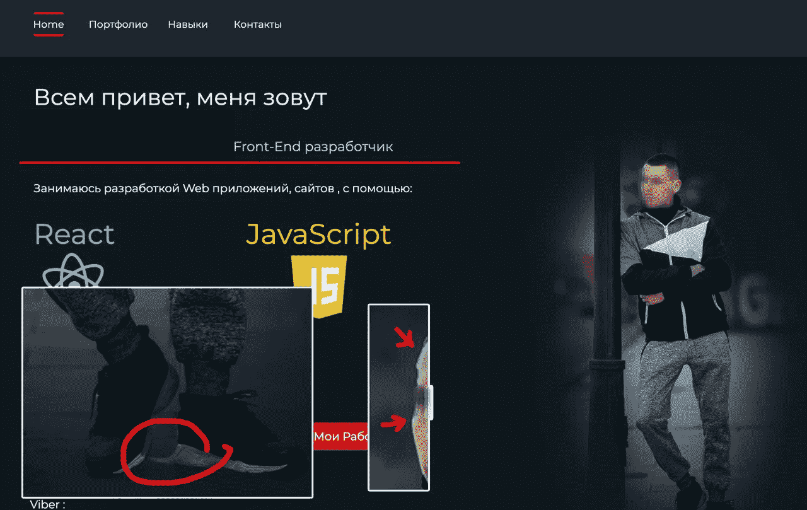

# 初级开发人员的 8 个禁忌

> 原文：<https://blog.devgenius.io/8-donts-of-a-junior-developer-c3ffe6d29279?source=collection_archive---------4----------------------->

多亏了一些欠火候的家伙和过度杠杆化经济的整体状况，多亏了超低利率和美联储的印钞机，我们可能会面临一场长期衰退。

初级开发者和宏观经济事件有什么关系？嗯，他们很少是项目的关键开发人员，如果公司不得不解雇一些人，猜猜会发生什么。如果我们面临经济衰退，软件开发的工作数量会减少，但初级专家的数量不会减少。相反，每年越来越多的毕业生会去寻找他们的第一份工作。

根据我招聘和管理人员的经验，如果你想被录用，这里有一些建议*不要做什么*。请在评论中不同意我的观点。

# 不要说谎

很明显的一个。一般来说，撒谎是一件坏事，尤其是当他们抓住你的时候。不要撒谎。

美化你的经验和专业知识是很自然的，尤其是在你职业生涯的初期。

> “也许面试官不会问我关于 Redux 的问题，或者认为我知道 [angularjs 数据绑定是如何工作的](https://medium.com/@alexandermikhalchenko/acing-the-code-interview-as-an-interviewer-4d5551d487ca)”

但是彻头彻尾的撒谎是另一回事。如果你把 GraphQL 放在你合作过的技术列表中，甚至不能描述它是什么，你认为我会忽略它或者开始质疑你的其他技能吗？

如果面试官很优秀，他们可能会发现你满嘴谎言。如果没有，你必须快速学习技术，如果你成功了，这并不坏，甚至给你一些吹嘘的权利。但是刚开始学习新技术很难，所以要谨慎从事。

如果发现你撒谎，我宁愿雇别人。

**加成提示**:千万不要把“ [rockstar](https://www.youtube.com/watch?v=DmeUuoxyt_E) ”、“guru”、“ninja”和一个“开发者”放在一句话里。*例外*:“我 10 岁想做忍者，16 岁想做摇滚明星，现在是开发者”。

# 不要把 TodoMVC 式的项目添加到你的工作经历中

TodoMVC 展示了如何使用不同的前端框架创建一个基本的待办事项列表应用程序。不是相关工作经历。

如果你没有其他东西可以放在简历上，你编写的假电子商务网站(我自己也看到了)可能可以算作一个项目，就像我在疫情之前买的 20 罐金枪鱼和 10 公斤大米可能被视为美食一样。但是无论如何，这都不是一个有效的工作经历。

不要想把这些作为“项目”放在你的“自由职业”之下。2010 年至 2011 年，我自己从一些可疑的低收入自由职业开始，用 PHP 和 jQuery 脚本创建了一些解析器。如果你想显示你有一些自由职业者的经验，列出实际的项目。

类似 TodoMVCs 的项目只会愚弄没有 IT 知识的无经验人力资源。甚至他们最终也会注意到，太多初级开发人员的简历上都有非常相似的项目。

相反，你可以做的是(同样，这也是我认为你应该做的，你可以不同意):

*   代码大战。去解决一些形。它不会教你框架，但它有希望帮助你理解问题解决，这是更重要也更难学的
*   [Stackoverflow](https://stackoverflow.com/) 。在那里开个账户，试着回答问题。不痛不痒(而且如果你受伤了，被否决了，可以删除你的问题；)).

# 不要遮住你的脸

我知道有一个疫情宣言，但你猜怎么着，你不能通过谷歌视频聊天工具感染冠状病毒，如果你认为有人看到你的脸就能蛊惑你…正式地说，我们很抱歉地通知你，你没有被你申请的职位选中。

(是的，我知道严格来说那不是外服)

戴着太阳镜摆姿势或者上传一张集体照并不太好，但是没有个人资料照片或者放一些不相关的东西绝对是不允许的。

经验法则是:如果这不是你的个人资料照片，改变它，让它成为你。

也许我会欣赏你对动漫的品味，但除非你是埃隆·马斯克，否则我想在那里看到你的脸。

**重要提示**:我听到一些大型招聘公司建议，由于“多样性原因”，你不应该把你的照片放在简历里。啊，美丽的新世界。不过，我还是想在那里看到你的照片。所以，这篇文章再次列出了我的建议。欢迎在评论中提出不同意见。

如果您有在线通话，打开视频上的**。你的房间最好是干净的。**

哦，那是什么？你不会是杂志封面上的顶级模特吧？我也不是，但我们玩好手中的牌。看到别人的脸有助于建立联系，并相信对方所说的话。

额外提示:如果我在 facebook/instagram/vk 上搜索你的名字或账号(我或任何称职的招聘人员都会这样做，唯一的问题是，他们会承认吗)，我会看到你穿着黑帮说唱歌手的服装，转发《共产党宣言》，或者，你唯一的粉丝的链接吗？

# 不要忽视编码问题

准备解决一个简单的编码任务。体验一下像 [Codewars](https://www.codewars.com/) 这样的服务绝对不会有坏处。大多数像样的公司都要求你通过编码测试。你想为一家体面的公司工作，不是吗？

也许，有一天我会写一篇关于编码任务的文章。

# 不要创建令人生厌的网站

有名人推荐人们创建自己的网站吗？比如，他们的个人网站上有他们简历的链接？如果你是一个[老牌开发者](http://dean.edwards.name/)，并且在 2010-2012 年间 [packer](http://dean.edwards.name/packer/) 被广泛使用，这是一回事，但是如果你是初级水平……你确定吗？

在浏览了许多电报渠道之一的简历列表后，我得出结论，就像冠状病毒一样，一些地区比其他地区更容易受到这种瘟疫的影响。

这个网站向全世界公开，但出于隐私考虑，我从截图中删除了一些个人数据。

我十几岁的时候也做过很多令人讨厌的事情。话虽如此:

旋转图标…我重复一遍，旋转图标，仿佛又回到了 2010 年，背景幻灯片，展示了来自 it 人群的抽象图像和场景。我肯定需要更多网站上的时钟，因为这就是我打开它们的原因:看看现在是什么时间。

哦，超人！我认为摇滚明星、忍者和古鲁在 2015 年或大约那个时候灭绝了。显然，超人没有。

讽刺的是，项目部分不起作用。链接到一个空的媒介是…思考未来，我猜？

等着看这个吧:那家伙 PS 了自己(！)放到背景上。为什么？不知道。

(我只模糊了脸部，其他都是作者自己做的)

运动服或运动裤并不是你期望会改变你 it 职业生涯的照片的最佳着装。我也反对深思远虑的眼神。

如果你是这些优秀网站的所有者之一，你想让我提供实际的链接，只需 dm 或电子邮件给我。

这样的网站能给你什么，除了在这里得到特色？也许只有我不是它的目标受众，但同样，这是我的博客和我的推荐名单。我建议你不要那样做。

# 不要发出难看的简历

**警告**:非常主观。

使用乳胶

我只想向你的祖父母致以最美好的祝愿，但你不应该让你视力不好的奶奶用 Word 给你写一份简历。这个建议非常主观，但是当我看到一个. docx 文件有一些彩色的布局、错位的列和十种不同的字体时，我真的被触发了。

从我的学生时代和国际青年数学家锦标赛开始，我就喜欢上了乳胶。我不认为人类发明了更好的工具来创建科学论文和简历。请随意使用[这个模板](https://github.com/treyhunner/resume)来创建你自己的[模板](https://github.com/strrife/CV/)。它给你一个严格、正式、美观的文档。使用它。

最后，如果你是一名程序员，为什么不写你的简历呢？

# 不要试图表现得好像你是最聪明的

虽然这通常是你找到工作后的一个问题，但你想保住它，对吗？

不要试图表现得好像你是最聪明的。如果你这样做，有两种可能:你要么是最聪明的，这意味着你的前辈在你的手艺方面并不比你好，要么你认为你是最聪明的。

如果是前者…你知道“如果你是房间里最聪明的人，那你就走错房间了”这句话吗？你可能来错公司了。但是，根据我的经验，后者更有可能。

你*认为*你是最聪明的，但是你声称是杰作的一段过度设计的代码只是一段过度设计的代码，会在未来造成麻烦，真的需要简化。或者你在代码中发现了一个[不相关的问题，或者，上帝保佑，你认为项目的某些部分需要重构，你无私地接受了这个任务，没有询问你的上级或管理层，期望在你完成后得到鼓励？](https://medium.com/@alexandermikhalchenko/bad-code-high-risk-places-in-your-project-7fe665eaa5ba#19d6)

你不用拍脑袋了，伙计

剧透提醒:你不会。你看，重构旧代码是一项需要经验或熟悉度的任务。有可能你在这方面做得很好，但是如果我打赌某个普通初级开发人员的自我启动的重构会成功结束或者导致许多新的错误，我会把我的钱押在错误上。

这并不是说你不应该开始做没有人问过你的事情。如果你有一个倡议，*问*。

# (奖金)不要试图证明你是一个开发者

这和找工作几乎没有关系。尽管你并不属于某个社会群体，但你要努力让自己看起来属于这个群体。

开发者们，你们好吗？

我们来玩“想成为开发者”的宾果游戏。

*   替换为[r/程序幽默](https://www.reddit.com/r/ProgrammerHumor/)或[типичныйпрограммист](https://vk.com/tproger)
*   从来没有在 IT 行业工作过，自称是软件开发人员
*   满怀激情地憎恨 PHP，却没有在其中写一行代码，也没有理解其中大量的问题和矛盾
*   *在不理解`==`操作符如何工作的情况下，单刀直入地*取笑 [wtfjs](https://www.youtube.com/watch?v=et8xNAc2ic8) 般的片段。
*   从不(几乎从不)使用库，因为“我会写得更好”
*   但是应该用`++i;`而不是`i++;`，因为它更快
*   对“真正的开发者”做什么做出大胆的声明
*   “真正的开发者”使用 C/C++

> **Pro 提示:**如果任何专业水平的 C/C++开发人员对 wtfjs 进行了 unironic 评论，请询问他们 C/C++中的两个字母[“U”和“B”](https://blog.regehr.org/archives/767)分别代表什么。如果这没有让他们哭着躺在地板上，问问 [GCC 编译器是否会引入关键漏洞](https://www.redhat.com/en/blog/security-flaws-caused-compiler-optimizations)。你再也听不到 js 的笑话了。

*   “真正的开发人员”使用 ASM
*   在与真人对话中使用&&或||
*   将你的社交网络背景切换到与编程相关的画面
*   *Unironically* 拥有这个:

# 结论

嗯…我想，祝你在新职位上好运？

如果你想让我和你一起工作，请随时在 Linkedin 上给我打电话，或者在 alex@xfuturum.com 的 T21 给我发短信。顺便说一句，我在招人。

干杯！