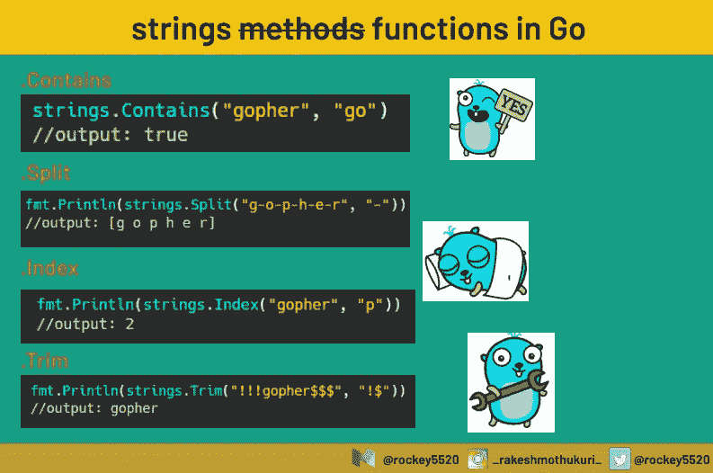

# Go 中字符串包的 8 个最常用函数

> 原文：<https://blog.devgenius.io/8-most-used-functions-of-strings-package-in-go-9e5263739d49?source=collection_archive---------1----------------------->

## 这个故事列出了 Go 中字符串包最常用的函数



# 介绍

标准的 Go 库 *strings* 包提供了许多与字符串相关的函数。这个博客列出了 Go 中 strings 包最常用的函数的描述，因为有很多可用的函数，而且不容易马上记住每一个，所以值得用书签标记，因为在需要的时候可能会很方便。下面是带有小示例代码片段函数列表。

**注:**我是围棋业余爱好者，如果你是围棋资深专业人士，在这里发现任何错误，请不要生气，如果你能指出错误，我会相应地纠正它们。

# 1 .比较

按字典顺序比较两个字符串[这个函数的结果是一个整数，可以是`0, -1 or 1`](https://en.wikipedia.org/wiki/Lexicographical_order)

**功能签名:**

`func Compare(a, b string) int`

**示例:**

```
package main
​
import (
    "fmt"
    "strings"
)
​
func main() {
    fmt.Println(strings.Compare("gopher19", "gopher20"))
    fmt.Println(strings.Compare("gopher19", "gopher19"))
    fmt.Println(strings.Compare("gopher20", "gopher19"))
}
​
Output :
-1
0
1
```

# 2 .包含

如果要搜索的字符串中存在给定的子字符串，contains 函数将返回适当的布尔值。

**功能签名:**

```
func Contains(s, substr string) bool
```

**示例:**

```
package main
​
import (
    "fmt"
    "strings"
)
​
func main() {
    fmt.Println(strings.Contains("gopher-20", "20"))
    fmt.Println(strings.Contains("gopher-20", "30"))
    fmt.Println(strings.Contains("gopher-20", ""))
    fmt.Println(strings.Contains("", ""))
}
​
output:
true
false
true
true
```

# 3 .数数

我发现这非常有用，尤其是在编码挑战中，他们要求你找出一个字符在一个字符串中重复的次数。

该函数将两个字符串作为输入，检查第二个字符串参数在第一个字符串参数中出现的次数，并返回整数形式的 count。

**功能签名:**

```
func Count(s, substr string) int
```

**示例:**

```
package main
​
import (
    "fmt"
    "strings"
)
​
func main() {
    fmt.Println(strings.Count("gopher-gopher-gopher", "g"))
    fmt.Println(strings.Count("gopher", "g"))
}
​
output:
3
1
```

# 4 .菲尔茨

如果你想用空白字符把一个字符串分割成一个字符串数组

这个函数接受一个字符串作为输入，通过字符串中的空格字符分割成一个数组，并返回一个字符串数组。

**功能签名:**

```
func Fields(s string) []string
```

**例如:**

```
package main
​
import (
    "fmt"
    "strings"
)
​
func main() {
    fmt.Printf("Fields are: %q", strings.Fields("gopher is sleeping."))
}
​
output:
Fields are: ["gopher" "is" "sleeping."]
```

# 5 .has 前缀

该函数接受两个字符串作为输入，并检查第二个参数字符串是否出现在第一个参数字符串的起始字符中。

**。HasPrefix** 有个弟弟叫**。HasSuffix** 做了完全相同的事情，但是这次它检查字符串的结尾部分。

**功能签名:**

```
func HasPrefix(s, prefix string) bool
```

**例如:**

```
package main
​
import (
    "fmt"
    "strings"
)
​
func main() {
    fmt.Println(strings.HasPrefix("gopher", "go"))
    fmt.Println(strings.HasPrefix("gopher", "java"))
    fmt.Println(strings.HasPrefix("gopher", ""))
}
​
output:
true
false
true
```

# 6 .替换

这个函数接受四个参数作为输入

*   罪犯字符串
*   旧弦
*   新字符串
*   错误字符串中新字符串替换旧字符串的次数

如果 n < 0 there is no limit on a number of replacements.

**函数签名:**

```
func Replace(s, old, new string, n int) string
```

**例如:**

```
package main
​
import (
    "fmt"
    "strings"
)
​
func main() {
    fmt.Println(strings.Replace("no-banana no-banana no-banana", "no", "yes", 2))
    fmt.Println(strings.Replace("no-banana no-banana no-banana", "no", "yes", -1))
}
​
output:
yes-banana yes-banana no-banana
yes-banana yes-banana yes-banana
```

另一个版本的**。更换**为**。ReplaceAll** 基本上替换所有

# 7 .裂开

该函数将两个字符串作为输入，并基于第二个参数字符串返回一部分子字符串

**函数签名:**

```
func Split(s, sep string) []string
```

**举例:**

```
package main
​
import (
    "fmt"
    "strings"
)
​
func main() {
    fmt.Printf("%q\n", strings.Split("gopher,19,gopher", ","))
}
​
output:
["gopher" "19" "gopher"]
```

的变化很少。存在分裂的有哪些[。分割后](https://golang.org/src/strings/strings.go?s=8004:8043#L310)。 [SplitAfterN](https://golang.org/src/strings/strings.go?s=6998:7045#L284) [。SplitN](https://golang.org/src/strings/strings.go?s=6461:6503#L272)

# 8 .TrimSpace

删除空格最常用的功能之一，这个函数接受一个字符串作为输入，并返回一个删除了前后空格的字符串。

**功能签名:**

```
func TrimSpace(s string) string
```

**示例:**

```
package main
​
import (
    "fmt"
    "strings"
)
​
func main() {
    fmt.Println(strings.TrimSpace(" \t\n Covid-19's vaccine will be invented and out soon to rescue us all from this insane. \n\t\r\n"))
}
​
output:
Covid-19's vaccine will be invented and out soon to rescue us all from this insane.
​
```

这是我认为最常用的**字符串**函数的结尾，但是如果你认为有什么东西你认为必须放在这个列表中，请给我留言，我会把它放在这里。