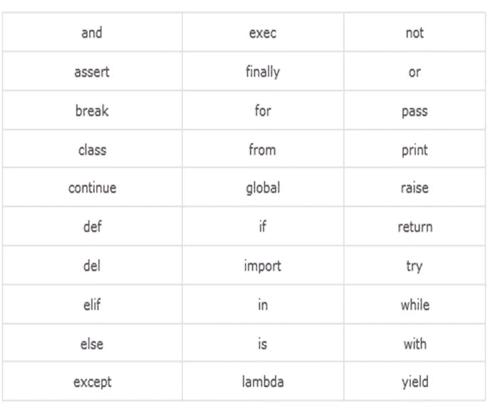

# Python 标识符:Python 完整教程—第 8 部分

> 原文：<https://blog.devgenius.io/8-python-identifiers-3241c4a341ff?source=collection_archive---------6----------------------->


照片由 [Christina Morillo](https://www.pexels.com/@divinetechygirl) 在 [Pexles](https://www.pexels.com/search/programming/) 拍摄

**在我们开始之前，让我告诉你:**

*   这篇文章是 Python 完全初学者到专家课程
    的一部分，你可以在这里[找到它](https://medium.com/@samersallam92/python-complete-beginner-to-expert-course-f7626916df30)。
*   所有资源都可以在下面的“资源”部分找到。
*   这篇文章也可以作为 YouTube 视频[在这里](https://youtu.be/i5NkUeis5-o)获得。

[https://youtu.be/i5NkUeis5-o](https://youtu.be/i5NkUeis5-o)

## 介绍

在你学会了如何安装 Python 并通过运行“hello world”程序迈出了使用 Python 的第一步之后，现在是时候学习如何在 Python 中识别变量了。

**因此，本文将涵盖以下要点:**

1.  [什么是标识符](#4a0d)
2.  [标识符命名规则](#332b)
3.  [保留关键字](#b482)

## 1.什么是标识符

**标识符**是一个名字，用于在 Python 中标识变量、函数、类、模块或任何其他对象。换句话说，我们可以说标识符是对象 ID。


照片由[布雷特·乔丹](https://unsplash.com/@brett_jordan?utm_source=unsplash&utm_medium=referral&utm_content=creditCopyText)在 [Unsplash](https://unsplash.com/s/photos/identity?utm_source=unsplash&utm_medium=referral&utm_content=creditCopyText) 上拍摄

然而，为了能够毫无问题地运行您的代码，当您想要给变量命名时，您必须遵守一些规则。否则，解释器将引发一个异常，您将无法运行您的代码。

那么，什么是标识符命名规则呢？

## 2.标识符命名规则

*   标识符应该以字母 **A** 到 **Z** 或 **a** 到 **z** 或下划线( **_** )开头，后跟零个或多个字母、下划线或数字( **0** 到 **9** )。
*   Python 不允许在标识符中使用标点符号，如 **( #、@、$、%)、**。
*   Python 是一种区分大小写的编程语言。因此，**人力**(大写 M)和**人力**(小写 m **)** 是不同的标识符。

注意:

您**不能**以数字开始您的标识符名称。


照片由[马克·达弗尔](https://unsplash.com/@2mduffel?utm_source=unsplash&utm_medium=referral&utm_content=creditCopyText)在 [Unsplash](https://unsplash.com/s/photos/rules?utm_source=unsplash&utm_medium=referral&utm_content=creditCopyText) 上拍摄

另一点，你必须小心的是保留的关键字。
那么，有哪些关键词呢？

## 3.保留关键字

**关键字**是在 Python 中有特殊含义(功能)的保留字，比如( **if，for，else)** 等等…

请记住，这些关键字**不能用作标识符。否则，你会有一些麻烦。**

**下表显示了 Python 中所有保留关键字的完整列表。**参考表 1。



表 Python 中的保留关键字。([https://py3programs.blogspot.com/](https://py3programs.blogspot.com/))

现在，让我们继续，举一些关于在 Python 中定义变量的实际例子。


Photo by [愚木混株 cdd20](https://unsplash.com/@cdd20?utm_source=unsplash&utm_medium=referral&utm_content=creditCopyText) on [Unsplash](https://unsplash.com/s/photos/wrong?utm_source=unsplash&utm_medium=referral&utm_content=creditCopyText)

定义一个名为 **a** 的变量，其值等于 **10** 并将其值打印在屏幕上。

**提示帮你:**

要定义一个新变量，输入变量名(a)，然后输入等号(=)，再输入变量值(10)

**方案输入:**

```
a = 10

print(a)
```

**输出:**

```
10
```

在一行代码中定义三个变量 **a** 、 **b** 和 **c** 并使它们的值等于 **1** ，然后在屏幕上打印它们的值。

**提示帮你:**

*   要在一行代码中定义多个具有相同值的变量，请键入变量的名称，并使用等号( *a = b = c* )分隔变量，因为它们彼此相等，最后键入值。

( *a = b = c = 10* )。

*   要使用一个打印语句打印多个变量，请键入 ***print*** ，并在括号之间键入您要打印的变量名称，并用 ***逗号*** 分隔它们。

**溶液输入:**

```
a = b = c = 1

print(a , b, c)
```

**输出:**

```
1 1 1
```

让我们通过定义三个变量 **a** 、 **b** 、 **c** 来使示例更高级，但是现在它们具有不同的值，并在一行代码中生成它们的值 **1** 、 **2** 、 **3** ，然后在屏幕上打印它们的值。

**帮助你的提示:**

您可以通过在 **变量名**和**值**之间使用*逗号* **来为变量分配不同的值。**

**方案输入:**

```
a, b, c = 1, 2, 3

print(a, b, c)
```

**输出:**

```
1 2 3
```

现在，为了确保 Python 区分大小写，定义两个变量 **A** ， **a** ，然后给它们不同的值，例如 **1，2** 并打印它们，你会得到什么呢？

**方案输入:**

```
a = 1

A = 2

print(a, A)
```

**输出:**

```
1 2
```

很好，到目前为止，一切都很清楚和简单，正如我所猜测的。如果尝试在变量名称中添加数字，会得到什么结果呢？

**方案输入:**

```
a0 = 1

A1 = 2

print(a0, A1)
```

**输出:**

```
1 2
```

在我们看到创建标识符的不同方法之后，让我们举一些会引发异常或错误的例子，以便在以后的代码中避免它们。

**首先是**，让我们试着以一个数字开始变量名。

**比如:**

```
0a = 5
```

**输出:**

```
SyntaxError: invalid syntax
```

**第二个**，让我们用关键字 **if** 作为变量名。

**输入:**

```
if = 5
```

**输出:**

```
SyntaxError: invalid syntax
```

**第三个**，定义一个名为' **hello** 的变量，并尝试打印名为' **Hello** 的变量

**输入:**

```
hello = 5

print(Hello)
```

**输出:**

```
NameError: name ‘Hello’ is not defined
```

**第四个**，在变量名中使用 **@** ，一个标点符号**，**。

**输入:**

```
c@ = 4
```

**输出:**

```
SyntaxError: invalid syntax
```

很简单，对吧？到目前为止，您已经尝试了 4 个用例，在定义变量的过程中犯了不同的错误，看看解释器如何用不同的消息引发异常。


Photo by [愚木混株 cdd20](https://unsplash.com/@cdd20?utm_source=unsplash&utm_medium=referral&utm_content=creditCopyText) on [Unsplash](https://unsplash.com/s/photos/wrong?utm_source=unsplash&utm_medium=referral&utm_content=creditCopyText)

## 现在，让我们总结一下我们在这篇文章中学到的内容:


照片由[安 H](https://www.pexels.com/@ann-h-45017/) 在[像素](https://www.pexels.com/)上拍摄

在本文中，您了解了以下内容:

*   **Python 标识符:**是函数、类、变量或模块的名称。
*   一个**标识符**名称**应该以(a-z 或 a-z 或 _)开始**，然后你可以添加(A-Z 或 A-Z 或 _ 或 0–9)，但是标点符号如#、@、%和&...是不允许的。
*   Python 是一种**区分大小写的**语言。
*   **不要**使用关键字作为标识符。

***附:*** *:非常感谢您花时间阅读我的故事。在你离开之前，让我快速地提两点:*

*   *首先，要想直接在你的收件箱里看到我的帖子，请在这里订阅*[](https://medium.com/@samersallam92/subscribe)*，*并且你可以在这里关注我*[](https://medium.com/@samersallam92)**。***
*   ***第二，作家在媒介上制造了数以千计的****$****。为了获得无限制的媒体故事并开始赚钱，* [***现在就注册成为媒体会员***](https://medium.com/@samersallam92/membership)**，其中* *每月只需花费 5 美元。报名* [***有了这个链接***](https://medium.com/@samersallam92/membership) *，可以直接支持我，不需要你额外付费。****

**

[萨梅尔萨拉姆](https://medium.com/@samersallam92?source=post_page-----3241c4a341ff--------------------------------)** 

## **Python 初学者到专家的完整课程**

**[View list](https://medium.com/@samersallam92/list/python-complete-beginner-to-expert-course-32d3a941c05e?source=post_page-----3241c4a341ff--------------------------------)****21 stories**************

**要回到上一篇文章，您可以使用以下链接:**

**[第 7 部分:运行 Python 中的第一个程序](/7-run-your-first-program-in-python-ef48ad97a119)**

**要阅读下一篇文章，您可以使用以下链接:**

**[第 9 部分:Python 中的注释](/9-comments-in-python-f8fed1dc9b88)**

## ****资源:****

*   **GitHub [此处**。**](https://github.com/samersallam/python-complete-beginner-to-expert-course/tree/main/Python%20Identifiers)**