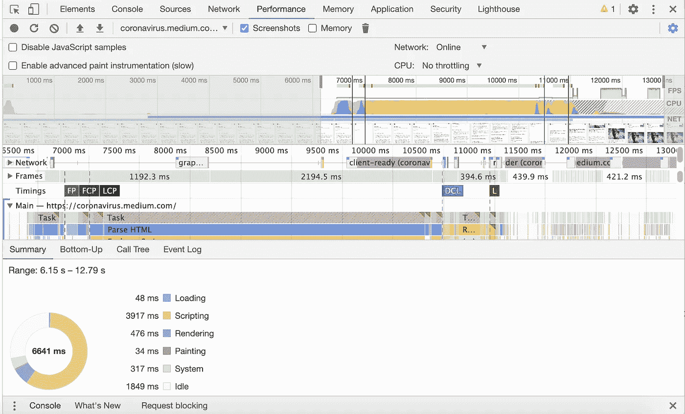
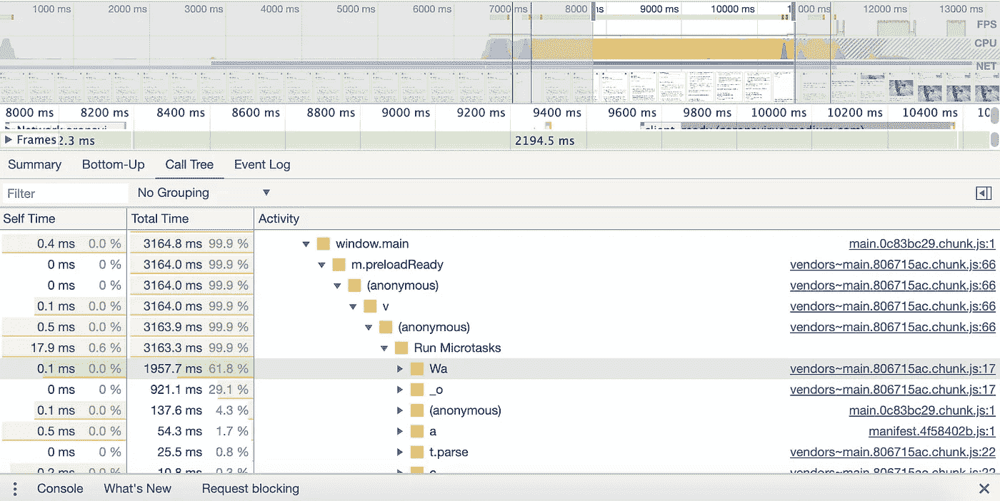
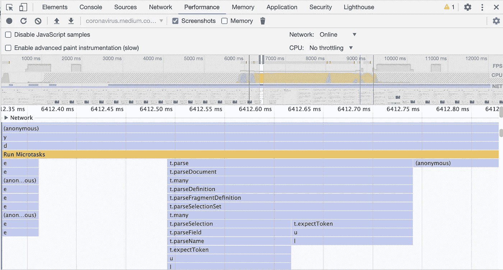
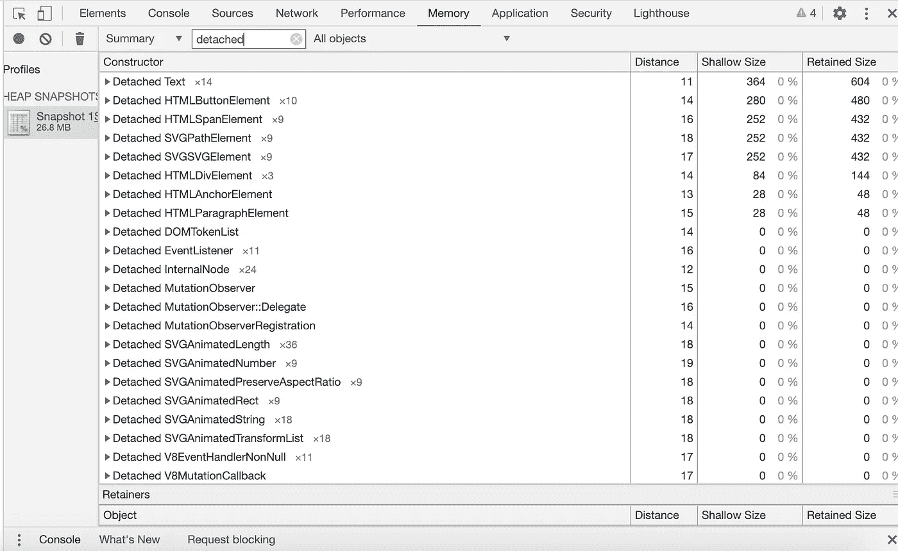

# 提高 React 应用程序性能的 8 种快速方法

> 原文：<https://blog.devgenius.io/8-quick-ways-of-improving-react-app-performance-4eb187608c4?source=collection_archive---------0----------------------->


图片来自[这里](https://www.ebay.com/i/222212508756?chn=ps&norover=1&mkevt=1&mkrid=711-117182-37290-0&mkcid=2&itemid=222212508756&targetid=917185845248&device=c&mktype=pla&googleloc=9060360&poi=&campaignid=10459991946&mkgroupid=100467642381&rlsatarget=pla-917185845248&abcId=2146000&merchantid=113800378&gclid=EAIaIQobChMIiYbf__W86gIVIwnnCh06GwNCEAQYASABEgJdRPD_BwE)

假设您的经理要求您*“提高我们 React 应用的前端性能。”*从哪里开始？

虽然这个清单上的大多数项目现在感觉像是第二天性，但是三、四年前的我会发现它们非常有用。

从基本原则的角度来看，您可以将性能归结为两个因素:内存和 CPU。使用量越低越好。

延迟也是需要考虑的重要因素。例如，网络请求的延迟比存储和读取缓存数据或资产的延迟高得多。改善延迟是一个值得讨论的话题，它将不会是本文的重点。你可以在这里查看常见的延迟数字:[https://gist.github.com/jboner/2841832](https://gist.github.com/jboner/2841832)

在这篇文章中，我将如何解决内存和 CPU 的使用分成几个部分。处理绩效的所有 8 种方法都属于这两类中的一类。

**TLDR:您可以通过**`**command+f**`***TLDR #*浏览此贴。**

# I .降低 CPU 消耗

CPU 消耗来自代码执行。例如，每次 React 组件渲染时，它都会占用 CPU。每次发出网络请求，都会占用 CPU。每次执行一个函数，它都会占用 CPU。

## 第 1 部分:消除无用的 React 组件重新呈现

这一节对于大多数使用过 React 的人来说应该很熟悉，但是我还是要写它。

如果一个组件在没有实际状态或道具改变的情况下重新渲染，这表明该组件正在不必要的重新渲染。

一个普通的组件(`React.Component`)在每次`setState`被调用时，或者当它从父组件接收到新的道具时重新渲染，不管实际值是否已经改变。

另一方面，PureComponent ( `React.PureComponent`)在重新渲染之前会对其状态和道具进行浅层比较。因此，如果状态和属性没有改变，使用 PureComponent 将消除重新渲染。

> TLDR #1:用`React.PureComponent`替换`React.Component`

在 Javascript 中`[] === []`为 false。Javascript 通过引用进行对象比较。因此，传递给组件的属性(数组或对象)的浅层比较将会失败。因此，您应该避免将对象或数组的新实例作为道具直接传入组件。

不要这样做:

```
<CorgiList corgis={(this.state.dogs || []).filter((dog) => dog.breed === 'corgi')} />
```

这里，我们调用`filter`，它每次都会创建一个新的数组。

> TLDR #2:不要把数组或对象的新实例作为道具传入组件

redux 中的连通分量也做自动浅层比较。在连接的组件中，还应该避免创建数组或对象的新实例。考虑这个例子:

```
const mapStateToProps = (state) => {
  return {
    corgis: (state.dogs || []).filter((dog) => dog.breed === 'corgi')
  }
}connect(mapStateToProps)(CorgiList)
```

每次 redux 商店发生变化，`mapStateToProps`就会被调用。因此，即使一个不相关的对象(例如，`state.cats`相对于`state.dogs`)由于 redux 动作而改变，这个`mapStateToProps`将运行并返回一个新的数组，导致`CorgiList`组件重新呈现。

因此，提高 React 性能的一个简单方法是删除`mapStateToProps`中所有新建的`{}`或`[]`对象。

实现这一点的方法是使用选择器。如果一个选择器的所有参数都没有改变，它将返回一个记忆化的结果。这意味着如果`state.dogs`没有改变，我们的`CorgiList`组件将不会重新渲染。

使用[重新选择](https://github.com/toomuchdesign/re-reselect)来考虑这个实现:

```
import { createCachedSelector } from 're-reselect';const getDogs = (state) => state.dogs;
const getBreed = (_state, breed) => breed;const getCorgiList = createCachedSelector(
  [getDogs, getBreed],
  (dogs, breed) => {
    return (dogs || []).filter((dog) => dog.breed === breed)
  }
)(
  // re-reselect keySelector (receives selectors' arguments)
  // Use "breed" as cacheKey
  (_state, breed) => breed
); const mapStateToProps = (state) => {
  return {
    corgis: getCorgiList(state, 'corgi')
  }
}
```

> TLDR #2:在`mapStateToProps by using selectors`中删除新`{ }`和`[ ]`的创建

## 第 2 部分:减少高频函数调用

如果应用程序正在快速连续地多次执行某个代码块，这是一个改进的机会。

考虑这个实现:

```
saveInput = (e) => {
  const text = e.target.value;
  fetch(SOME_URL, {
    method: 'POST',
    headers: {
      'Content-Type': 'application/json'
    },
    body: JSON.stringify({ text })
  });
}render() {
  return (
    <input
      onChange={this.saveInput}
      ...
    />
  )
}
```

对于输入字段的每个`onChange`事件，我们发出一个网络请求。如果这是一个在数百个文件的代码库中重复出现的模式，它将很容易提高 CPU 使用率。(注意，我可以在我的例子中调度一个动作，而不是`fetch`，这没关系。想法是我们不应该对每个事件都执行处理程序，因为处理程序很可能被高频率地触发)。

根据您的需要，以对您的应用有意义的时间间隔，将高频呼叫封装在[去抖](https://lodash.com/docs/4.17.15#debounce)或[节流](https://lodash.com/docs/4.17.15#throttle)中。

```
debouncedSaveInput = _.debounce((e) => {
  const text = e.target.value;
  fetch(
    ...
  );
}, SOME_INTERVAL);render() {
  return (
    <input
      onChange={this.debouncedSaveInput}
      ...
    />
  )
}
```

> TLDR #4:使用去抖或节流来限制高频通话

另一个常见的性能陷阱是遍历一个数组，并为数组中的每一项调用一个函数(比如调度一个动作)。

```
componentDidMount() {
  this.props.corgis.forEach((corgi) => {
    this.props.fetchOwnerInfoForCorgi(corgi);
  });
}
```

就性能而言，更好的设计模式是消除循环，取而代之的是获取给定的 CORBA 列表所需的所有信息。

```
componentDidMount() {
  this.props.fetchOwnerInfoForCorgis(this.props.corgis)
}
```

修复这个性能问题通常需要更多的努力和重构。如果这是你的代码库中的一种常见模式，从长远来看，在工程文化中采用批量优先的思想是有益的。

> TLDR #5:批量获取、创建、更新、删除等。

## 第 3 部分:减少页面上的代码量

页面上的代码越少，页面使用的 CPU 就越少。

Chrome dev tools 的 performance 标签有一个 Javascript CPU profiler。分析器可以按功能分解 CPU 的使用情况。[这是我跟随](https://blog.appsignal.com/2020/02/20/effective-profiling-in-google-chrome.html)学习如何使用性能工具的一个好帖子。

这是我对 https://coronavirus.medium.com/的侧写



页面负载分析

页面上有大量的脚本(黄色条)或 Javascript 代码评估。沿着调用树往下，您可以看到瓶颈在哪里:



看起来大多数脚本都来自供应商脚本/节点模块。

您还可以放大时间线以查看正在运行的确切功能:



告诉您正在运行哪些功能

不管所有这些脚本是否对那个页面是必要的，它把我带到了我的下一个观点。在页面上加载尽可能少的 Javascript。

> TLDR #6:找到减少捆绑包大小的方法

npm 很容易安装一个库来解决我们的问题，而不需要考虑额外模块的成本。不要这样做，尤其是当你只需要库的一部分功能时。注意可能会增加包大小的依赖项。在每个文件中只导入您需要的内容。

使用[包分割](https://medium.com/hackernoon/the-100-correct-way-to-split-your-chunks-with-webpack-f8a9df5b7758)或者使用 Webpack 进行代码分割(如果你还没有这样做的话)。

# 二。降低内存消耗

内存消耗来自存储。例如，redux 存储越大，内存使用就越多。Redux 存储大小也会影响 CPU，因为更大的存储意味着当状态改变时更多的计算。

## 第 1 部分:减少冗余大小

redux 存储规模过大的一个常见原因是预先加载了过多的必要信息。

解决大型 redux 商店的一个方法是延迟加载商店。这意味着不要填充整个商店；在用户请求时获取新项目。

惰性加载会产生额外的网络请求，从而导致应用程序的延迟更大。因此，对于小商店来说，这很可能不值得。

另一个可能的解决方案是预取数据并将数据保存到 indexDB(磁盘)。当用户请求数据时，从 indexDB 读取，而不是发出网络请求。正如这里的[所写的](https://gist.github.com/jboner/2841832)，从磁盘读取比发出网络请求的延迟要低。然而，像内存一样，磁盘也有[存储限制](https://developer.mozilla.org/en-US/docs/Web/API/IndexedDB_API/Browser_storage_limits_and_eviction_criteria#Storage_limits)。

> TLDR #7:懒惰装载大 redux 商店

## 第 2 节:修复内存泄漏

内存问题的另一个来源是内存泄漏。在 Javascript 中，当垃圾收集器无法清除未使用的变量时，就会发生这种情况。因此，应用程序中有一些在任何地方都不会用到的对象。

在 React 中，一个常见的泄漏源是卸载组件时未附加的事件侦听器。另一个泄漏源是来自`setTimeout`或`setInterval`的泄漏，这些泄漏在组件卸载时没有被清除。

这里有一个我发现的很酷的例子:[https://egghead . io/lessons/react-stop-memory-leaks-with-component will unmount-life cycle-method-in-react](https://egghead.io/lessons/react-stop-memory-leaks-with-componentwillunmount-lifecycle-method-in-react)

Chrome 开发工具显示内存泄漏在哪里。



本页[的剖析此处](https://medium.com/hackernoon/the-100-correct-way-to-split-your-chunks-with-webpack-f8a9df5b7758)

转到“Memory”选项卡，拍摄堆快照，然后过滤“detached”。[分离的对象是内存泄漏的常见原因](https://developers.google.com/web/tools/chrome-devtools/memory-problems)，因为这些对象没有被使用。

> TLDR #8:通过移除事件监听器和清除计时事件来修复内存泄漏

说到前端性能，少即是多，懒即是好。加载绝对最小值脚本，并做你能逃脱的绝对最小值计算。


柯基从[到这里](https://www.flickr.com/photos/milkyfactory/16223331172)

## 我是 Slack 的前端基础设施工程师。你可以在 LinkedIn 上找到我。

## 如果你觉得这篇文章有价值，介意为我鼓掌吗？我将不胜感激！😃