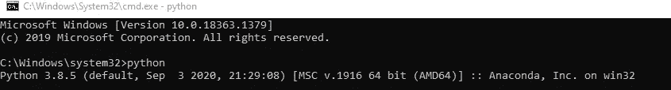
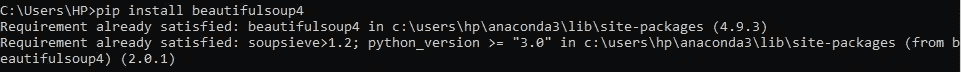
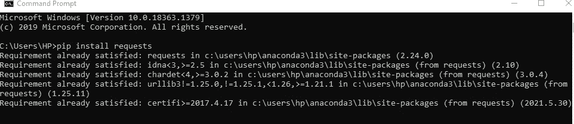
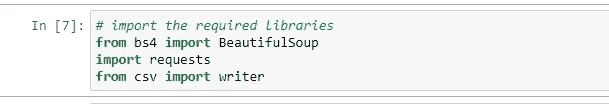
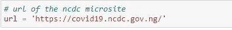
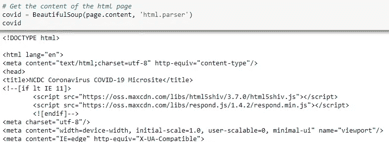
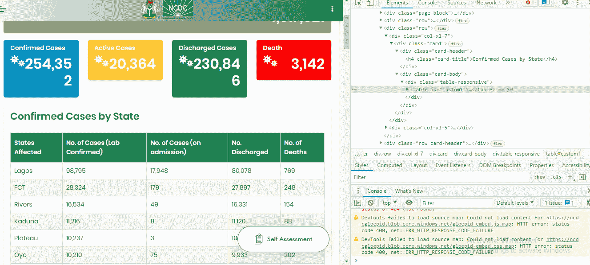
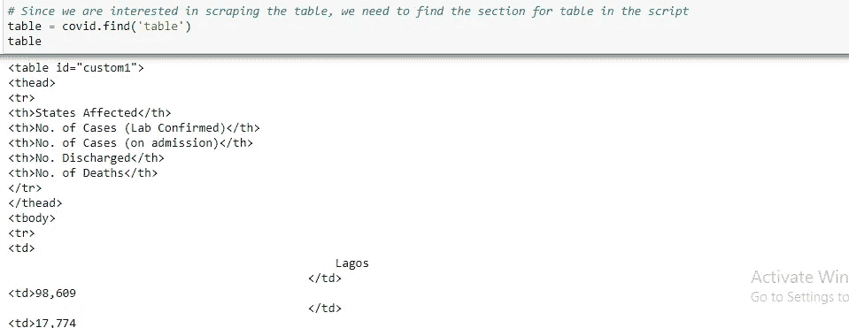
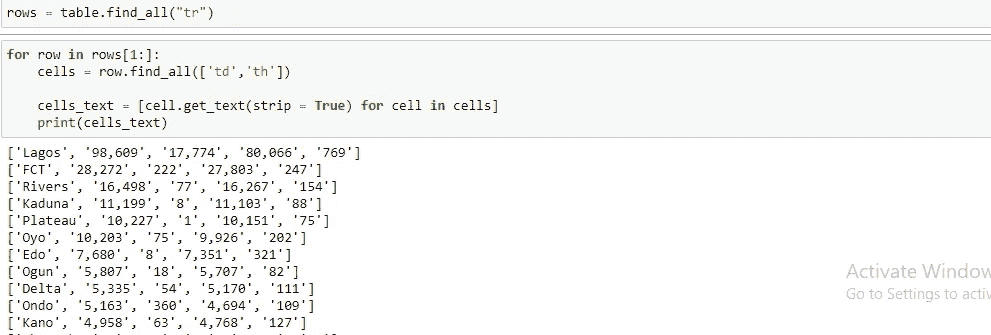
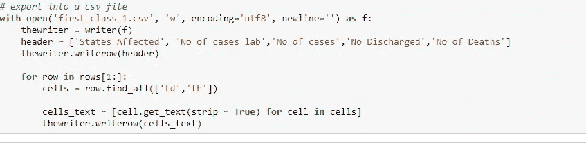

# 使用 Python 从网站抓取表格的 8 个步骤

> 原文：<https://blog.devgenius.io/8-steps-in-scraping-a-table-from-a-website-using-python-e9eca91c9779?source=collection_archive---------1----------------------->

作为一名数据科学家，数据是我们的食物，因此我们需要找到数据，无论它可能在哪里。大多数时候，我们会在一个网站上看到一些有趣的东西，并想在上面工作，如果你曾经有过这种感觉，那么这是给你的。今天，我们要刮 NCDC(尼日利亚疾病控制中心)关于新冠肺炎的网站。点击[这里](https://covid19.ncdc.gov.ng/)进入网站。

步骤 1:下载 python 或 anaconda

如果你在这里，那么我会假设你已经安装了 python，如果没有，检查[这里](https://medium.com/co-learning-lounge/how-to-download-install-python-on-windows-2021-44a707994013)。如果你不确定，那么你应该简单地打开你的命令提示符，你可以很容易地在搜索区域键入“cmd ”,它会弹出一个窗口，然后你键入“python ”,如果你安装了 python，它应该会显示类似这样的内容；

步骤 2:安装必要的库

要执行 web 抓取，需要安装某些库，并且您的工作越复杂，您就越可能需要其他库，然而，基本上，您需要漂亮的汤、请求以及您选择的任何解析器。你可以很容易地使用 pip 安装它。它显示了这样的东西:

步骤 3:打开 Jupyter 笔记本，开始导入所有必需的库

第四步:加载网站的网址

第五步:加载内容。在这里，你要做的是让 Jupyter notebook 能够通读你下载的 url 页面。这就是你美丽的声音库发挥作用的地方。美汤做的就是获取那个页面的内容，并解析通过；嗯，还有更多！！

步骤 6:检查 URL 以确定你需要抓取什么，以及它在 html 中是如何编码的。对于这个 covid 网站，我们打算刮表，因此，我对表的编码更感兴趣。要做到这一点，你可以右击网站的任何部分，然后点击 inspect，之后你就可以通过扫描来知道哪个代码是你需要的重要部分。对于我们这一桌，算是表了。如果你不熟悉 html 表格，请阅读[这个](https://www.w3schools.com/html/tryit.asp?filename=tryhtml_table_intro)例子。

右边突出显示的部分显示关键字是“table”

现在我们已经认识到关键字是“表”，我们使用 jupyter notebook 来查找该关键字。

这显示了表格的所有内容以及它们的编码

步骤 7:在 html 源代码中，每一行都用“tr”编码，每个头用“th”编码，每个数据点用“td”编码，有趣的是，th 和 td 通常都可以在一行中找到，因此接下来要做的就是得到它们；

第八步:现在我们已经把网站上的所有内容都放到了我们的 jupyter 笔记本上，我们可以决定把它转换成 csv 或者其他我们选择的文件格式。

瞧啊。您有一个 csv 文件，其中包含您刚刚刮擦的表格。好吧，刮刮也愉快。