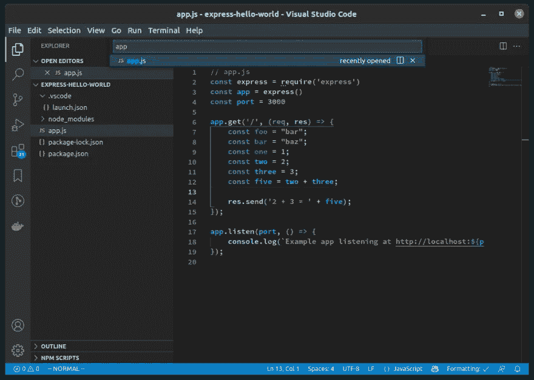

# 大幅提高开发人员工作效率的 8 种方法

> 原文：<https://blog.devgenius.io/8-ways-to-drastically-boost-your-developer-productivity-195c60af3ac?source=collection_archive---------0----------------------->



用这 8 个技巧来提高你的生产力

## 介绍

作为开发人员，这八个提高效率的技巧将会大大提高你的效率。你可以节省几个小时的时间，然后投资于其他活动。

这并不是你应该做的所有事情的完整列表，但是如果你还没有做的话，这些事情会极大地提高你的工作效率。

## 重复任务的少量时间是如何累积起来的

假设您正在用一个旧的 Java monolith 编写代码，并且您所做的每个更改的流程看起来都像这样:

*   保存文件(1 秒钟)
*   在 IDE 中构建项目(5 秒钟)
*   将应用程序 war 文件部署到旧 J2EE 容器中(30 秒)

对于每一个改变，你需要 36 秒才能得到反馈并尝试你的改变。这听起来可能不多，但是如果你对每个变化都这样做，这可能每天发生 50 次或更多次。这是 1800 秒，或者说半个小时，你可以用来做其他事情。

在 5 天的工作周中，总共损失了 2.5 小时的时间。在一个典型的工作年中，有 469800 秒或 5.4 天的时间可以用来做其他事情。因此，通过解决这个问题，你将获得额外一周的生产力。

一般的开发人员有许多他们可以自动化的重复性任务。如果自动化一个重复的任务可以为你节省 36 秒，相当于每年一个工作周，那么自动化 5 个同样耗时的任务可以让你每年节省 5 周。

我该如何解决这个具体问题？使用支持热重装的新框架。只需保存您的文件，更改就会自动编译并部署，无需重启容器。较新的 Java 框架如 Spring Boot 支持这一特性。我们将在本文后面更详细地讨论热重载。

## 使用脚本自动化重复性任务

如果有一件事最能提高你的生产力，那就是用脚本自动化重复的任务。我强烈推荐编写 [Bash 脚本](https://linuxconfig.org/bash-scripting-tutorial-for-beginners),因为它可以很容易地将多个命令链接在一起，而且这些命令也是您每天可能会经常运行的命令。

许多现代开发都是在命令行上使用类似`npm install`的命令完成的。其中一些东西有 IDE 集成，但是我强烈推荐学习和使用命令行，原因只有一个:它是可脚本化的。通常，键入命令比在 IDE 中点击几次来执行相同的任务要快。

每当你发现自己在重复做同样的事情或输入同样的命令时，考虑把它放到一个脚本中。一旦正确完成，脚本将总是以正确的顺序运行命令，并且永远不会出错。

与您花 30 秒钟的时间相比，这可能不到一秒钟(正如我们之前提到的，这可能会随着时间的推移而增加)。

脚本还意味着您不必记住常见命令的复杂语法，尽管您也可以使用外壳别名。

我在本地设置了一些随机脚本:

*   备份我的本地数据库
*   转储测试数据库的最新副本，并自动将其导入我的本地数据库。当然，它会调用前面的脚本先进行备份！
*   在本地启动并配置多个相互依赖的微服务。这是一个痛苦的手动做，但容易与脚本。

## 使用真正的调试器，而不是打印变量

当我还是一名中级工程师时，学习如何使用调试器本身就是一件提高我工作效率的事情。我可以在几个小时内完成可能需要一天时间才能完成的工作。修复 bug 和构建功能要容易得多。

我发现调试在探索我没有编写的不熟悉的代码库时特别有用。你可以很容易地看到即使是最复杂的逻辑以奇怪的方式写出来的结果。当你可以一行一行地运行复杂而费解的逻辑，并观察事物如何变化时，推理就容易多了。

如果您曾经使用 JavaScript 中的`console.log()`、PHP 中的`var_dump()`、Java 中的`System.out.println()`或者其他语言中的类似函数，将一个值打印到控制台，以便您可以看到代码中正在发生的事情，那么您可能知道，如果您试图调试复杂的东西，会有多乏味。

您一次打印一个值，并且通常需要为您想要查看的每个值编写一个新的日志语句。如果您查看的值发生了变化，则需要再次记录。这有点像蒙着眼睛或在黑暗中闲逛。让我们不要忘记您可能意外提交调试语句的可能性！。

人类的工作记忆是有限的，所以一旦你手动打印了足够多的变量，这些值就会开始从你的脑海中消失，然后你必须再次打印它们，或者把它们写在某个地方，并在它们改变时更新它们。尝试将所有内容都保存在工作记忆中需要宝贵的大脑资源，您可以将这些资源重定向到让代码按照您希望的方式工作，遵循最佳实践或编写干净的代码。

进入调试器:在代码中设置一个断点，然后运行应用程序。当您的应用程序到达您设置断点的行时，您将能够在调试选项卡中看到作用域中的所有变量。

没有必要在你的工作记忆中玩弄大量的价值观。只需一次操作，您就可以看到所有内容，而不是一次只看到一个值。

我开始只是调试我自己的应用程序代码，但随着时间的推移，我变得更有经验，我发现我可以通过调试框架和库代码(如`express`的代码)获得很大的洞察力。我能够找到甚至没有在各种框架和库的文档中列出的问题的答案，这些文档通常不完整或者写得很差。

调试器总是告诉你这些框架和库真正在做什么，而不管它们文档的准确性和完整性。我经常发现在阅读框架或库的文档之前先调试它们会更快——复杂的概念可能需要很多单词来解释，但是调试器可以很快给你答案。

如果您正在使用 Node，想了解如何在 vscode 中设置调试器，请参阅我的另一篇文章[通过调试提高您的 Node 生产率](https://dev.to/ciphercode/debug-a-nodejs-express-app-with-vscode-2bh2)。

## 使用模糊查找器

我们中的许多人仍然在使用大型的单片代码库，有时有数千个文件。

你应该如何在你的项目中的数千个`.js`文件和数百个文件夹中找到隐藏在`/src/authentication/userTypes/Employee.js`中的？手动通过目录树查找文件？再问一个更熟悉代码库的开发者？

不，只是用模糊查找器！输入`Employee.js`，你会在几秒钟内找到你的文件。

它是这样工作的。在中，按下`Ctrl+P`，然后键入您要查找的文件的名称。结果会立即出现。

*vs code 中的模糊查找器*


如果你用的是 IntelliJ 或者 WebStorm，快速按两次`shift`(又名双 shift)而不是按`Alt+P`。

## 使用热重装和自动保存

如果您正在为一个 web 应用程序或服务编写代码，并且您没有使用 PHP(它具有内置的热重新加载的优点)，那么您可能需要对您的代码进行以下一项或多项更改

*   做出改变
*   保存文件
*   编译代码(针对编译语言)
*   重启服务器
*   对于某些环境，重新部署您的代码并等待它被部署
*   测试您的代码
*   重复

也许这每次会花费你 30 秒到 1 分钟的时间，但是请记住，随着时间的推移，这将会持续几天甚至几周的时间。

使用热重新加载和自动保存，您可以将此减少到

*   做出改变
*   IDE 会自动保存您的文件
*   在后台，会自动检测和编译更改(如果需要的话),并且您正在运行的服务器会重新启动或使用新代码进行更新，通常不到 5 秒钟
*   测试您的代码
*   重复

在 Java 中，热重载通常被称为[热交换](https://docs.spring.io/spring-boot/docs/2.0.x/reference/html/howto-hotswapping.html)。对于 Node，您可以使用 [nodemon](https://www.npmjs.com/package/nodemon) 并将其指向您的入口点脚本。

在我的另一篇文章[中，我有关于为 Node 设置`nodemon`的更详细的说明，作为一个节点开发者，六种方法可以极大地提高你的生产力](https://dev.to/robbiecahill/six-ways-to-drastically-boost-your-productivity-as-a-node-developer-1mjd)。

大多数 ide 都有自动保存功能。在 vscode 中，它就像选择`File > Auto Save`一样简单。查看您的 IDEs 文档，了解如何启用它。

如果你担心自动保存会出错，你应该像`git`一样使用源代码控制，并且定期提交你的代码。然后，您可以快速恢复到代码的工作版本。

## 自动化您的测试

手动测试是普通开发人员工作中最耗时、最不愉快的任务之一。

当开发人员遵循旧的笨重的 SDLC 模型(现在大部分被敏捷所取代)时，人们常说测试花费的时间与“分析”和代码编写阶段的时间总和差不多。

您可能做了一行影响很大的更改，然后您需要花几个小时来测试它。

有不同类型的自动化测试，从可以像真实用户一样点击应用程序的浏览器测试，到单元测试。如何写每一种类型将需要另一个完整的指南(如果我应该写一个，请在下面的评论中告诉我？).所有类型的自动化测试都比手工测试要快。

即使对于最慢的常见类型的自动化测试(浏览器测试),您也可以坐下来观看测试运行，然后出去喝杯咖啡或做些有成效的事情。

在某些情况下，手工测试是不可避免的，但是如果你发现自己在重复测试同样的东西，考虑编写一个自动化测试来节省你的时间。

## 通过公共网址尽早分享您的作品

您知道吗，您可以从本地机器上的`localhost`或`127.0.0.1`获取节点应用程序的公共 URL，即使它位于防火墙或公司网络之后。它不需要任何网络配置，你可以用一个简单的命令`expose`来完成，例如`expose 80 as myapi.expose.sh`。

这使您能够尽早与合作者(如其他工程师、客户或产品经理)分享您的工作，并获得快速反馈，而无需建立完整的部署渠道。从长远来看，你越早分享你的工作，你需要做的返工就越少。

您可以编写一个后端 API，共享一个公共 URL，然后在与您合作的 React 前端开发人员从他们的应用程序向您的 API 发送请求时进行实时调试。

为什么不在 webhook 提供商向您发送 webhook 请求时进行实时调试，而不是花几个小时阅读他们的(通常不是很好的)文档？

如果你在 Linux 上，运行这个来安装`expose`

```
curl -s https://expose.sh/sh/install-linux.sh | sudo bash
```

如果您使用的是 Mac，运行

```
curl -s https://expose.sh/sh/install-mac.sh --output install-mac.sh && sudo bash install-mac.sh
```

对于 Windows，请转到[安装页面](https://expose.sh/install/)并下载`exe`文件。

然后你可以运行`expose <port>`，其中`<port>`是你的应用运行的端口号(例如`expose 80`)。更多详细说明见[文档](https://expose.sh/docs/)。

## 使用 Vimium，无需鼠标即可测试您的 web 应用程序

有时候，手工测试是不可避免的。众所周知，键盘比鼠标快。通常，包括测试网络应用程序在内的网络浏览需要您使用鼠标。但现在不是了！

输入 [Vimium](https://chrome.google.com/webstore/detail/vimium/dbepggeogbaibhgnhhndojpepiihcmeb?hl=en) 。这是 Chrome 和 Firefox 的一个扩展，允许你通过键盘使用网站和网络应用。

这意味着您可以完全使用键盘而无需任何鼠标输入来进行不同类型的手动测试(比如下订单)，从而节省您的时间。

## 如何成为 10x 开发者

10 倍开发者理论认为最好的开发者比最差的开发者的生产力高 10 倍。

这些技巧可以大大提高你的工作效率，但是它们本身并不一定会让你成为 10 倍的开发者。

与其他开发人员分享这些技巧可能会让你成为 10 倍的开发人员。这是因为，如果你在一家更大的公司工作，你不仅会提高自己的生产力，还可能提高整个团队甚至整个工程部门的生产力。

根据团队中自动化的手动任务的数量，这可能相当于额外增加了一两个团队成员。

请随意使用这篇文章作为点燃会谈或午餐&学习的材料。

## 结论

这并不是一个提高开发人员生产力的完整列表，但是这是一个很好的起点。

这些简单的事情可以节省你几个小时的不必要的工作，随着时间的推移，可以增加几天甚至几周。

如果你觉得这篇文章有用，请考虑分享它来帮助他人。

## 进一步阅读

如果您想了解更多关于 NodeJS 和 JavaScript 的生产率技巧，请参阅我的另一篇文章[作为一名节点开发人员大幅提高生产率的六种方法](https://dev.to/robbiecahill/.six-ways-to-drastically-boost-your-productivity-as-a-node-developer-1mjd)。

对于 NodeJS 特定的调试说明，请阅读[通过调试](https://expose.sh/blog/2021/11/17/learn-how-to-debug-node-express-with-vscode/)增强您的节点生产力。