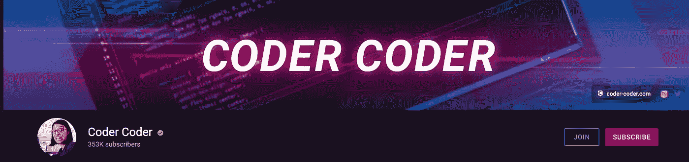
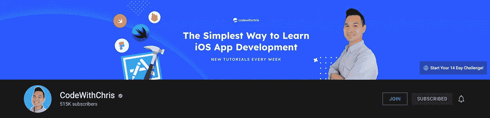
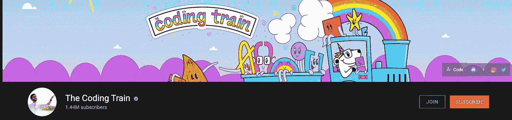
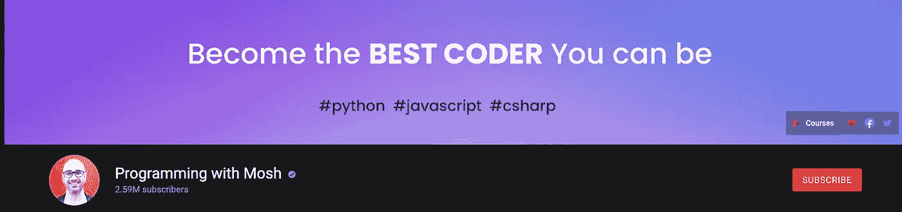
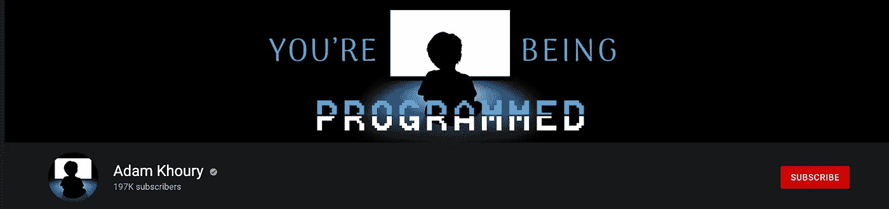
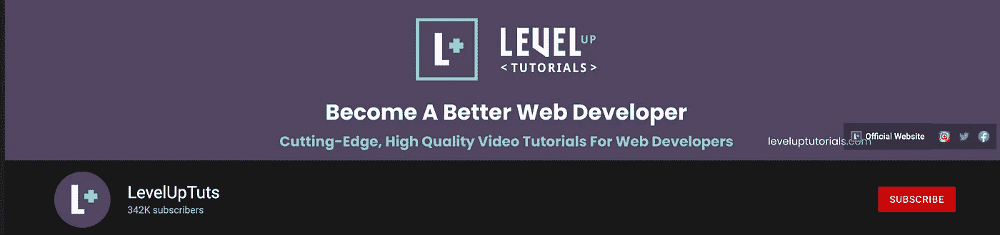
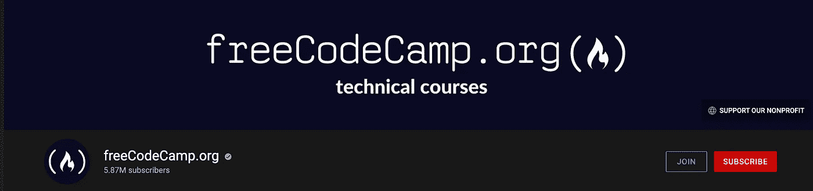

# 有抱负的 Web 开发人员应该知道的 8 个 YouTube 频道

> 原文：<https://blog.devgenius.io/8-youtube-channels-aspiring-web-developers-should-know-about-65346c7d0bd6?source=collection_archive---------8----------------------->

## 八个可以帮助你提高程序员水平的最佳渠道

诺德伍德主题公司在 [Unsplash](https://unsplash.com?utm_source=medium&utm_medium=referral) 上拍摄的照片

现在学习编程比以往任何时候都更容易，有大量不同的资源可供学习。

YouTube 是免费的，可以广泛使用，对于我们这些没有资源辞掉工作参加全职编程训练营的人来说，学习新概念是一个可行的选择。

作为一个走自学路线的人，我非常依赖 YouTube 来解释各种概念(或者跟随项目演示)。

这篇文章将涵盖我(和许多其他人)发现对提高编程知识有用的一些 YouTube 频道。

## 1.编码器编码器

链接:[https://www.youtube.com/c/TheCoderCoder/videos](https://www.youtube.com/c/TheCoderCoder/videos)

**关于**:这个频道是我最喜欢的频道之一，包含了短视频(解释一个特定的概念)和长教程(在这里你可以编码和构建项目)。这些项目以一种清晰有趣的方式进行解释，使其易于理解主题。

**何时使用**:对于理解特定主题(如 npm 或 CSS Flex Bot)或获得如何执行项目的概述非常有用。就个人而言，我真的很喜欢谷歌地图 API 视频和 CSS 技能教程。

## 2.与克里斯一起编码

**链接**:[https://www.youtube.com/c/CodeWithChris](https://www.youtube.com/c/CodeWithChris)

**关于**:如果你正开始学习如何开发 iOS 应用程序，那么《Chris 的代码》是一个一站式频道，它提供了深入的教程和所有帮助你入门的信息。教程是深入的(没有感觉慢)，他提供了所有必要的资源来完成项目

**何时使用**:适合任何学习 SwiftUI 并希望开始构建 iOS 应用的初学者。教程内容丰富，以项目为基础，适合任何级别的先前经验。高级用户可能不会像我一样从教程中获得太多的价值，因为当我开始学习 3 小时的入门课程时，我对 XCode 完全陌生。

## 3.编码列车

**链接**:[https://www.youtube.com/c/TheCodingTrain/featured](https://www.youtube.com/c/TheCodingTrain/featured)

**关于**:这个频道内容范围很大，适合各个层次的程序员。从初学者介绍视频开始，但主要集中在编码挑战。这些视频很短，是交互式的，重点是解决 HTML/CSS/JavaScript 的问题。

**何时使用**:如果你不想看 45 分钟的长视频，挑战的快节奏真的很适合你。这些项目/挑战涵盖的主题与我在其他地方看到的不同，这真的令人耳目一新。

## 4.凯文·鲍威尔

链接:[https://www.youtube.com/kepowob/videos](https://www.youtube.com/kepowob/videos)

**关于** : Kevin Powell 关注 CSS 操作指南和技巧&技巧。这些视频通常长达 10-15 分钟，涵盖一个特定的主题。凯文真正展示了 CSS 的力量，我从这个频道学到了很多。

**何时使用**:这个频道非常适合你熟悉基本 CSS 并想提升技能的时候。这些视频演示了何时使用各种属性以及如何制作响应性网页

## 5.用 Mosh 编程

**链接**:[https://www.youtube.com/c/programmingwithmosh/videos](https://www.youtube.com/c/programmingwithmosh/videos)

**关于**:这个频道有教程内容，涵盖了广泛的框架和语言。重点是学习不同概念的语法和应用，而不是基于项目的学习。视频非常详细，解释清楚。

**何时使用**:如果正在纠结一个特定的概念，这是一个很好的资源。这些视频分为多个主题，因此您可以快速找到您想要的概念，而不是浏览一个 2-3 小时的长视频，该视频将整个语言内容组合在一起。

## 6.亚当·胡里

**链接【https://www.youtube.com/c/AdamKhoury/videos】:**

关于:涵盖一系列主题和语言的网络教程。Adam 还在他的频道上介绍了 PHP 的学习，我个人在其他地方还没有发现如此详细的介绍。所有的主题都有清晰的解释，你可以在屏幕上输入一个例子。

**何时使用**:刚开始使用 PHP 时，我使用了 Adam 的内容，发现这些视频非常有用。也有大量的其他视频可用，都使用相同的循序渐进的信息丰富的教学风格。

## 7.升级教程

**链接**:https://www.youtube.com/c/LevelUpTuts/featured

**关于**:这个频道有一个非常清晰的布局，易于浏览视频播放列表。这些视频是教程，涵盖了各种语言和框架，包括 Figma、JS 和 React。还有一个关于使用 VS 代码的有用系列。

**何时使用**:我使用这个频道来帮助学习 React，因为教程清晰、简洁，有助于补充我在 Codecademy 课程中所学的内容。有很多关于 Svelte 的内容我不能评论，因为它不是我使用的框架，但如果你正在学习 Svelte，这个频道比我见过的任何其他频道都有更多的内容。

## 8.自由代码营

**链接:**[https://www.youtube.com/c/Freecodecamp](https://www.youtube.com/c/Freecodecamp)

**关于:**如果没有提到 Freecodecamp，这个列表就不完整。他们有深入的教程，涵盖了许多不同的编程语言，包括 CSS、JavaScript、PHP、Python 等等。这些视频从基础水平开始，介绍入门所需的所有概念。

**何时使用**:当学习一门新的编码语言时，这是一个很好的起点。这些视频很长，也很详细，因为它们从初级水平开始，并从那里开始学习每种语言。

这只是我最喜欢的频道的一小部分，让你开始，当然还有很多其他的频道。请在评论中告诉我你最喜欢的一个是否没有出现在这个列表中！

> ***感谢阅读！如果你喜欢这个帖子并想阅读更多，请务必查看我的个人资料或订阅类似帖子的*******。****
> 
> ****订阅 Medium，无限制获取所有可用的内容和想法。如果你通过这个链接加入了 Medium，我会从你的费用中收取很少的一部分——而且不会花你任何额外的费用！*T38***