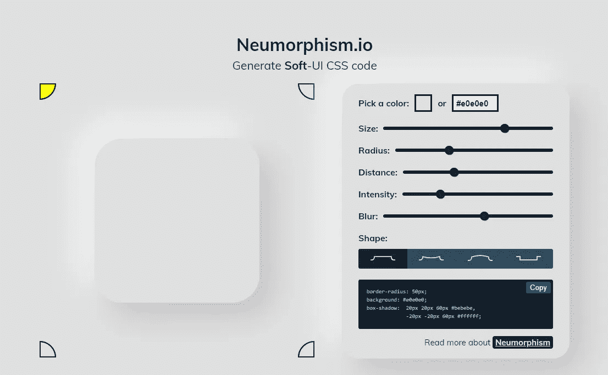
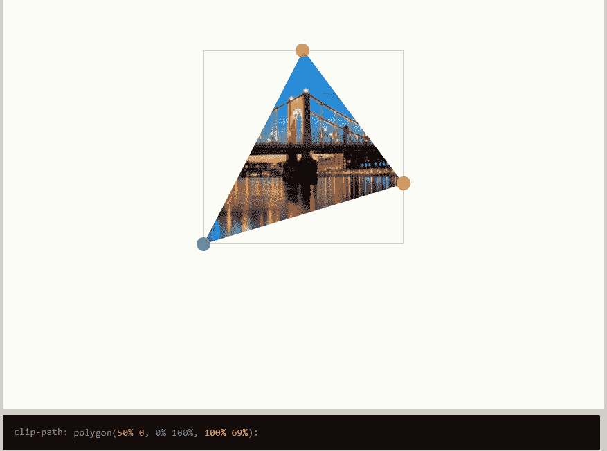
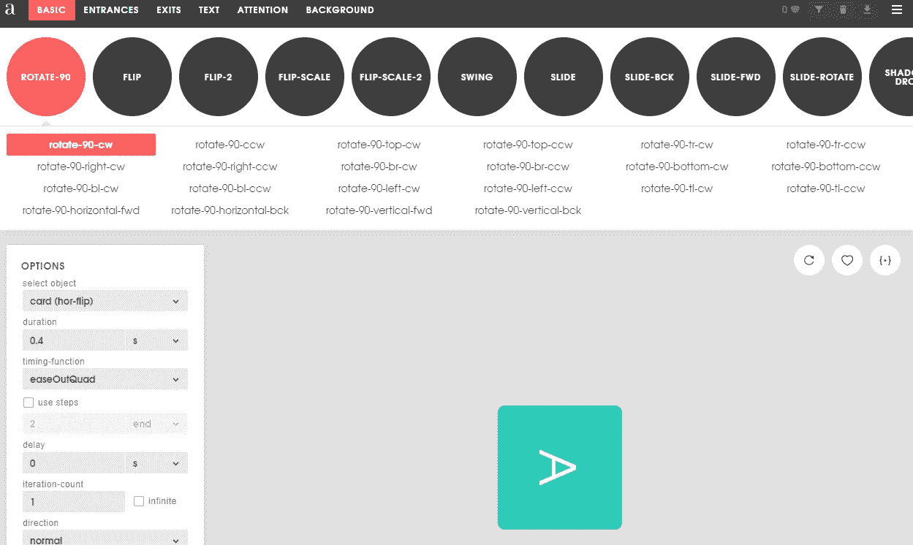
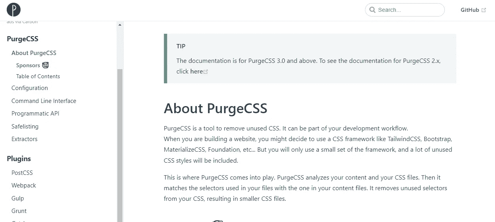
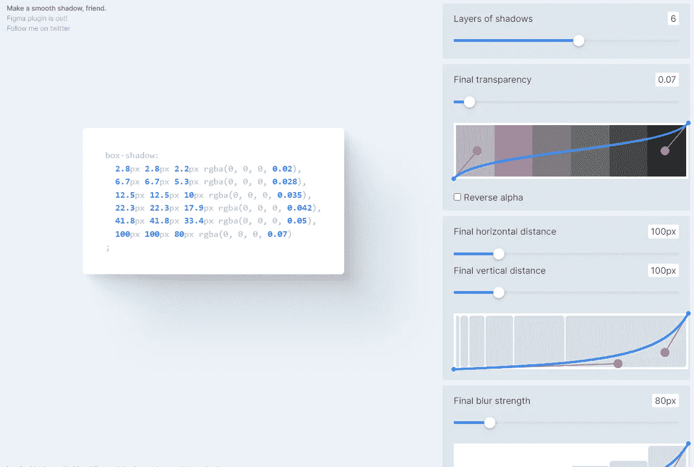
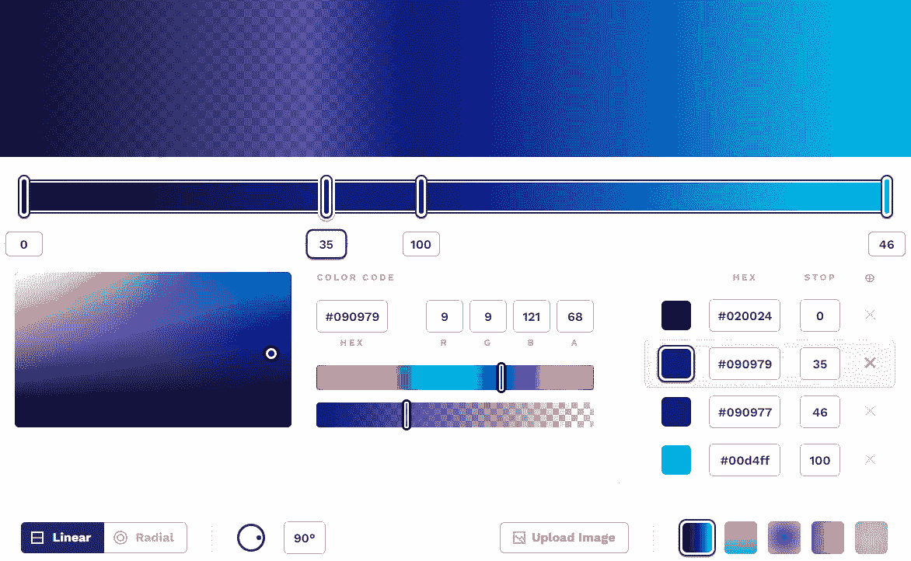
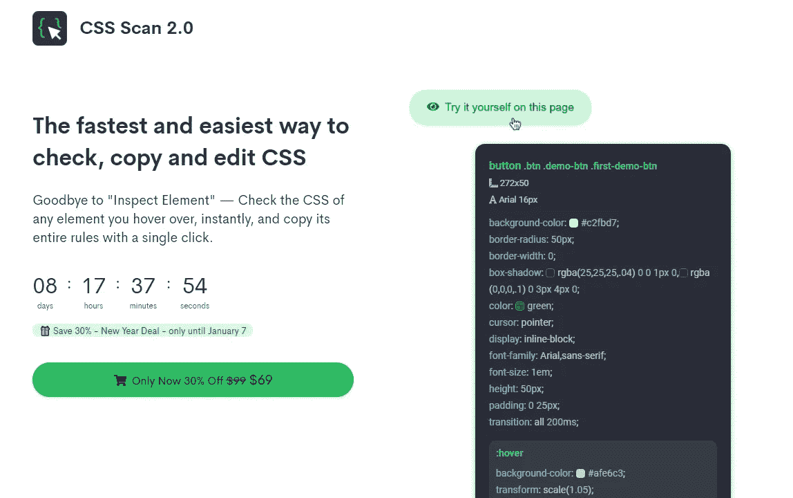
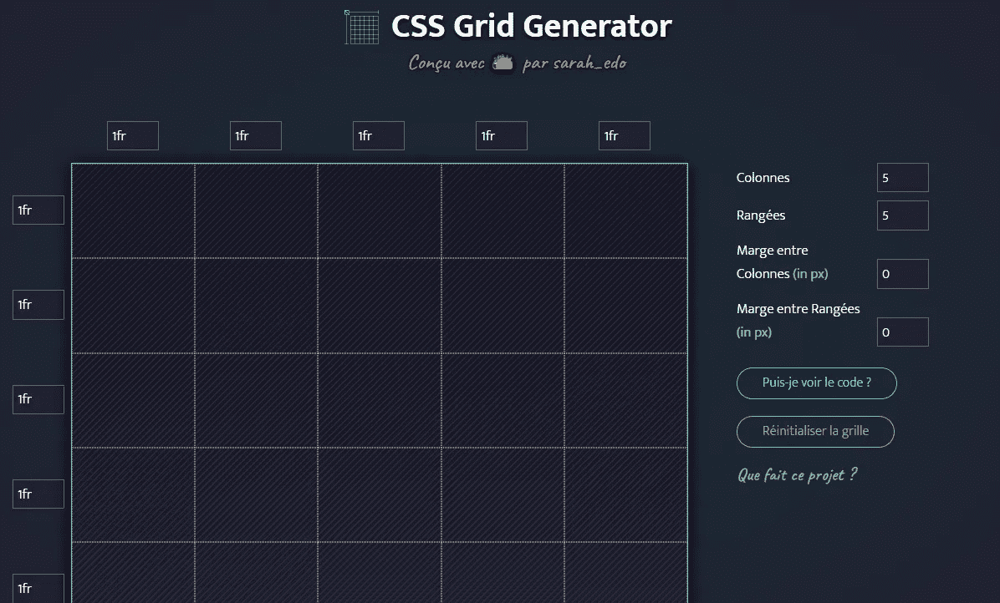
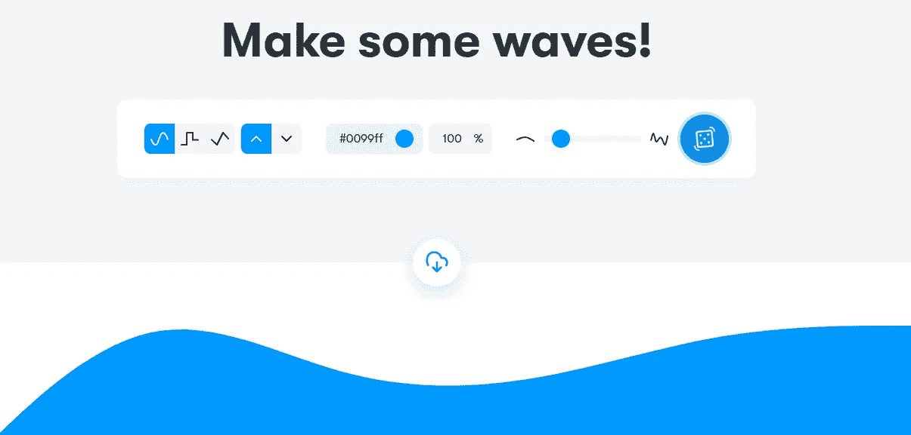

# 你应该在 2022 年使用的 9 个很棒的 CSS 工具

> 原文：<https://blog.devgenius.io/9-awesome-css-tools-that-you-should-use-in-2022-2155eed03c4c?source=collection_archive---------1----------------------->

## 有用的 CSS 工具和资源，以提高您的生产力。

照片由[妮可·沃尔夫](https://unsplash.com/@joeel56?utm_source=medium&utm_medium=referral)在 [Unsplash](https://unsplash.com?utm_source=medium&utm_medium=referral) 拍摄

作为一名 web 开发人员，编写 CSS 代码始终是您每天要做的主要任务之一。但是 CSS 是一种很棒的样式表语言，它允许我们对网页进行样式化，并使它们在所有用户设备上进行交互。试想一个没有 CSS 代码的网页。使用这种神奇的样式表语言，我们可以做很多事情。

然而，有时候从头开始编写好的 CSS 代码会花费很多时间，尤其是当你在做一个大项目的时候。但幸运的是，网上有很多免费的 CSS 工具。作为开发人员，这些工具对于节省时间和提高我们的编码效率非常有帮助。

这就是为什么在这篇文章中，我会给你列出一些有用的 CSS 工具，你可以在 2022 年使用。所以让我们开始吧。

# 1.神经形态

神经形态设计现在更流行，很多用户喜欢它，因为它是一种最小的设计。

neuromorphism 是一个很棒的工具，允许你为你的设计生成软 UI CSS 代码。这对于创建一个神经形态设计非常有用。您可以选择颜色、编辑大小、半径、距离等等。只要试一试，你就会爱上它。

由作者从 [Neumorphism](https://neumorphism.io/#e0e0e0) (媒体外的外链)捕捉。

# 2.CSS 剪辑路径生成器

这个工具基于 CSS 属性`clip-path`，它允许你创建复杂的形状(多边形、圆形、椭圆形等)。如果你不熟悉这个 CSS 属性，这没什么大不了的，因为剪辑路径生成器工具就在这里。

CSS clip-path maker 工具可以让你轻松地创建令人惊叹的形状，然后自动为你生成 CSS 代码。

由作者从 [bennettfeely](https://bennettfeely.com/clippy/) (媒体外的外链)截取。

# 3.泛灵论者

Animista 是你可以用来制作动画的最好的 CSS 工具之一。它为您提供了一个可以在 CSS 中使用的预先制作的动画集合。你可以选择你喜欢的任何类型的动画，并根据你的需要进行编辑。完成后，您可以为动画生成 CSS 代码，并在项目代码中使用它。

由作者从 [Animista](https://animista.net/) (媒体外的外链)抓取。

# 4.采购

[PurgeCSS](https://purgecss.com/) 是另一个有用的工具，可以移除 CSS 中不使用的代码。这个工具非常有用，尤其是当你使用 CSS 框架的时候。因为大多数时候框架会附带很多我们并不真正需要的代码。

由作者从 [PurgeCSS](https://purgecss.com/) (媒体外部链接)截取。

移除未使用的代码可以帮助您减小 CSS 文件的大小，从而提高性能。你可以通过阅读他们的文档来了解更多关于 PurgeCSS 的知识。

# 5.阴影布鲁姆

这是一个很棒的[工具](https://shadows.brumm.af/)，可以让你使用 CSS 轻松创建凉爽平滑的阴影。你只需要定义一些阴影选项，它就会自动为你生成代码。

如果你想在短时间内创建阴影，使用这个工具。

由作者从[影布鲁姆](https://shadows.brumm.af/)(外链外媒)截取。

# 6.CSS 渐变

CSS 渐变是一个神奇的工具，你可以用它来创建渐变背景。您可以选择不同类型的颜色和选项。因此，它会自动为你的渐变背景生成 CSS 代码。这是一个非常有用的工具，我在所有的项目中都使用它。

由作者从 [CSS 渐变](https://cssgradient.io/)(介质外的外链)中截取。

# 7.CSS 扫描

CSS Scan 是一个高级工具，允许你查看你在网页上悬停的任何元素的 CSS 代码。它还允许你复制你正在查看的所有代码。

由作者从 [CSS 扫描](https://getcssscan.com/)(媒体外的外链)抓取。

# 8.CSS 网格生成器

CSS 网格是目前在网页上创建响应式网格布局的好方法。有很多 CSS 网格属性和函数可以使用。

要了解更多的 CSS 网格，让自己更容易，可以使用 CSS Grid Gnerator，这是一个很棒的工具，可以为你生成 CSS 网格代码。您只需设置列、行和单位。因此，如果需要的话，您可以获得 CSS 甚至 HTML 代码。

由作者从 [CSS 网格生成器](https://cssgrid-generator.netlify.app/)(介质外的外链)抓取。

# 9.获得波浪

Get Waves 是另一个神奇的工具，它允许你使用 CSS 为你的项目创建 SVG waves。这让事情变得简单多了，你只需要选择选项，然后这个工具就会为你的 wave 设计生成正确的 CSS 代码。

如果你需要的话，你也可以下载你创建的 SVG wave。

捕捉由作者从工具[获取的电波](https://getwaves.io/)(外部链接外部媒介)。

# 结论

所以正如你在上面的列表中看到的。如果你想在 CSS 中节省时间和提高编码效率，这些工具会很有帮助。它们允许你在很短的时间内创建很棒的东西，而不必为此编写 CSS 代码。

*感谢您阅读这篇文章。此外，如果您发现我的内容有用，并且您不是媒体会员，您可以在此处获取您的媒体会员资格***(媒体推荐链接)以无限制访问媒体上的所有文章，并支持我们作为作家。**

* [## 通过我的推荐链接加入 Medium-Mehdi Aoussiad

### 作为一个媒体会员，你的会员费的一部分会给你阅读的作家，你可以完全接触到每一个故事…

mehdiouss.medium.com](https://mehdiouss.medium.com/membership) 

**更多阅读:**

 [## 你应该知道的 10 个强大的 JavaScript 代码片段

### 每个 web 开发人员都应该知道的 JavaScript 代码片段。

javascript.plainenglish.io](https://javascript.plainenglish.io/10-powerful-javascript-code-snippets-that-you-should-know-217363914589)  [## 你必须知道的 7 个有用的前端 Web 开发人员备忘单

### 作为一名前端 web 开发人员，帮助您节省时间的精彩备忘单。

blog.devgenius.io](/7-useful-front-end-web-developer-cheatsheets-you-must-know-32e9ef3c03bb)*