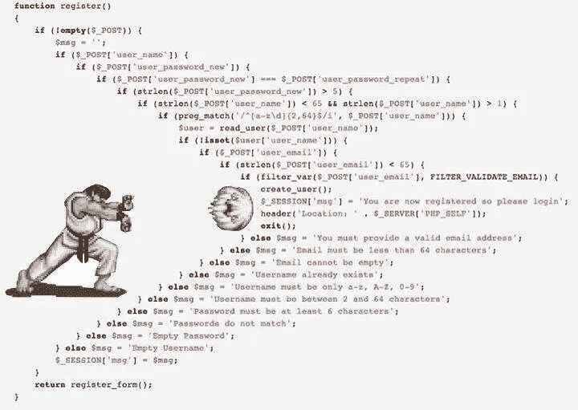

# 让你发笑的 9 个糟糕的 Java 片段

> 原文：<https://blog.devgenius.io/9-bad-java-snippets-to-make-you-laugh-82f5018e06e5?source=collection_archive---------0----------------------->

## 糟糕的 Java 代码让你感觉更好


来自 [Pexels](https://www.pexels.com/photo/landscape-fashion-man-love-5040576/?utm_content=attributionCopyText&utm_medium=referral&utm_source=pexels) 的 [Andrea Piacquadio](https://www.pexels.com/@olly?utm_content=attributionCopyText&utm_medium=referral&utm_source=pexels) 的照片

*这些你听过多少次了？*干净的代码、有意义的命名和测试。一直对你大喊大叫。你知道，我知道，每个人都知道。

*脏代码怎么办？以下是 9 个糟糕的代码片段。详细解释它们的重要性。*

让我们开始吧。

# 1.传递超过 255 个参数

`.java:796: error: too many parameters`

你看不到有超过 4 个参数的方法。在糟糕的一天，超过 5 个参数。你*认为这是惯例吗？错了，* [*关于参数个数还有疑问*](https://stackoverflow.com/questions/2244860/when-a-method-has-too-many-parameters) *。*

# 2.调用对象的构造函数

调用对象构造函数，所以我们 100%确定

没必要加`super()`。编译器会为您完成这项工作。

另一件事是，`getAdress`返回字符串而不是`a dress`。我们在日常工作中看到的错误期望。

# 3.一行程序

[感谢那个抄写烂代码的家伙。](https://www.reddit.com/user/MurdoMaclachlan/comments/lts8pr/to_the_people_who_are_following_me/)

一句话的家伙。一行写代码，觉得很酷。一行程序简单、简洁、易读。*对吧？*只适用于一句俏皮话的家伙。

# 4.Else-if

使用 else-如果很多，如图所示 16 次

可以看出这是为了教育的目的。所以，`switch`就足够了。它起作用了，而且对练习有好处。

对于经验丰富的开发人员来说，很少有解决方案。一种可能是创建`Room`类。`Room`会按住`roomNumber`，还有一个`message`。

# 5.箭头反图案

箭头反模式的可视示例

常见的反模式。反模式有一个名称、解决方案和迷因。 **Arrow 反模式**解决方案需要理清思路，以及良好的 OOP 实践。



Arrow 反模式模因

# 6.为 daysOfTheWeek 使用地图

使用 HashMap 表示一周中的几天

*业余代号*。从教育角度来说，还可以。*代码有什么问题？*有`[DayOfWeek](https://docs.oracle.com/javase/8/docs/api/java/time/DayOfWeek.html)` enum，已实现，准备应用。*专家采用默认实现，迭代速度更快，并且一致。*

*还有什么不正确的？星期一，不是实际的日子，而是数字。*周一默认编码为`1`。周一作为`0`会造成混乱，代码难以调试，而且不直观。*在代码中应用默认实现。*

*我输入“Tue ”,并在 10 天后找到第二天。我期待答案为“Fri”——*[*原帖*](https://stackoverflow.com/questions/63805385/find-day-from-string-array-based-on-iteration-using-java)

[另一个重新发明轮子的片段](https://stackoverflow.com/questions/63805385/find-day-from-string-array-based-on-iteration-using-java)

*XY 问题的一个明显例子*。在这里你提出了解决方案 Y ，而没有问题 X 。看问题，说明问题，不要展示你的解决方案。这里有一个解决这个问题的简单方法。

[简单的解决方法](https://stackoverflow.com/a/63805461/5999670)

查看 Java 文档。不要多此一举，似乎是老生常谈，但我们还是这样做了。努力使用 Java 实现，而不是你自己的。*使用默认实现更容易，经过测试，也更容易理解。*

# 7.计算字符串中的非空白字符

计数字符

根据原帖，这是一个高中老师的*【干净】*暗号。*一种可能的解决方案。*

```
input.replaceAll("\\s+", "").length();
```

有点干净，更容易阅读。但我不是教授，所以你决定吧。

# 8.创建对象而不指定它们

创建了新的 ArrayList()，但没有给变量赋值

*那为什么代码片段不好呢？这令人困惑，耗时，而且 init 最终会出现在字节码中。根据实验，[一个评论者做了](https://www.reddit.com/r/badcode/comments/fknzrm/javaproject_manager_guys_we_really_need_another/fkwwhil?utm_source=share&utm_medium=web2x&context=3)。字节码包含一个未赋值的行。*不要写这样的代码，因为字节码包含无用的行。**

现在还能看到这样的片段。甚至在官方[甲骨文文档](https://docs.oracle.com/javase/tutorial/essential/concurrency/runthread.html)中。*有什么区别？在 unassigned 实例上调用了一个方法。*

```
// correct usage of unassigned instance
public static void main(String args[]) {
        (new HelloThread()).start();
}
```

# 9.诡异的`isNegative`方法

isNegative 抛出奇怪的异常

*差评。*评论没有描述方法。虽然方法不好，但是评论不好。`isNegative`是谓语。A **正确注释:***“x 为负则返回 false，否则返回 true”。*

*对控制流使用异常。*最坏情况的 Java 代码。捕获异常后，代码返回 true。你不应该再深入下去了。刮这种代码。

使用`System.out.println`不好。*为什么？日志检查很困难，你可能会花上几个小时而失去注意力。*

当程序被部署时，这些日志会丢失。随着服务器日志记录丢失。使用 Logger 带来了故障级别，将它们保存在一个文件中，您可以关闭它们。*使用自定义* [*记录器*](https://www.baeldung.com/java-system-out-println-vs-loggers) *，而不是* `*System.out.println*` *。在我个人看来，伐木更容易。更容易进行事后分析、修复问题和编码。*

*你对* `*methodname*` *很好奇？有一种方法可以找到调用者方法。根据[的回答](https://stackoverflow.com/a/2924426/5999670)，最好使用`Reflection`。尽可能避免`Reflection`和[优化问题](https://stackoverflow.com/a/435568/5999670)。*

# 外卖食品

我们从坏的例子中学到了很多。坏的例子比好的例子教得更多。他们告诉你应该避免什么。

你对更多糟糕的片段感兴趣？阅读更多尽在 [***我的免费电子书***](https://zivce.gumroad.com/l/25BadJavaSnippets) 。

关键要点:

*   *争取一个简单的解决方案*
*   *检查你的代码是否有箭头反模式*
*   *应用 OOP 原则避免箭头反模式*
*   *接受默认的 Java 实现，不要多此一举*
*   *不要使用异常来控制流量*
*   *依赖自定义记录器而不是默认记录器*

*你有不好的例子可以分享吗？*贴在评论里。感谢阅读！

# 偷我的电子书

我已经写了很多糟糕的 Java 片段。你可以从[我的口香糖](https://zivce.gumroad.com/l/25BadJavaSnippets)里偷出来。

我发现了很多高质量评论的技巧。你可以在这里偷到它们[。](https://zivce.gumroad.com/l/become-high-quality-code-reviewer)

这些大多来自[子编辑](https://www.reddit.com/r/badcode/top/?t=month)。