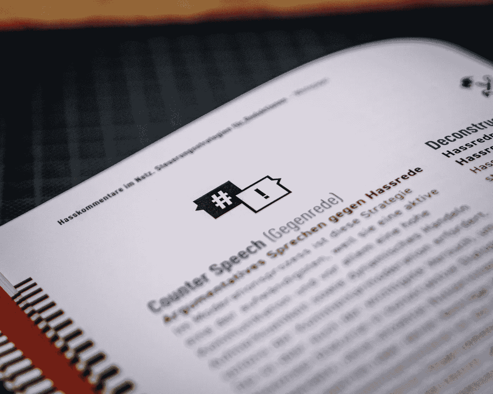
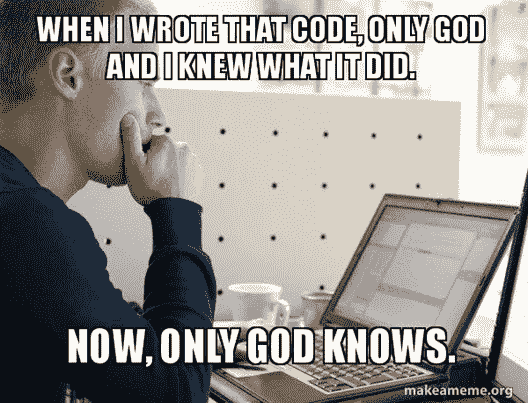

# Python 中的注释:Python 完整教程—第 9 部分

> 原文：<https://blog.devgenius.io/9-comments-in-python-f8fed1dc9b88?source=collection_archive---------22----------------------->



米卡·鲍梅斯特在 [Unsplash](https://unsplash.com/s/photos/comments?utm_source=unsplash&utm_medium=referral&utm_content=creditCopyText) 上的照片

**在我们开始之前，让我告诉你:**

*   这篇文章是 Python 完全初学者到专家课程
    的一部分，你可以在这里[找到它](https://medium.com/@samersallam92/python-complete-beginner-to-expert-course-f7626916df30)。
*   所有资源都可以在下面的“资源”部分找到。
*   这篇文章也可以作为 YouTube 视频[在这里](https://www.youtube.com/watch?v=8lZziCVGjVg)获得。

[https://www.youtube.com/watch?v=8lZziCVGjVg](https://www.youtube.com/watch?v=8lZziCVGjVg)

## 介绍

你有没有想过开发人员用它来提醒自己代码的每一部分是做什么的？或者在他们之间共享代码时，向对方解释他们代码的每个代码片段的目标是什么？

在本文中，您将了解如何记录您的代码以供将来参考。

**本文将涵盖以下要点:**

1.  [什么是评论？](#7b7b)
2.  [为什么评论很重要？](#faa8)
3.  [评论类型](#fd35)

## **1。** **什么是评论？**

注释是在计算机程序的源代码中用英语写的解释或注释。通常，注释作为提示来强调源代码在它们被编写的地方做了什么。然而，它们被编译器和解释器完全忽略了。换句话说，当你运行你的程序时，它们不会改变你程序的正常行为。


现在，让我们一起来看看为什么评论是重要的。

## **2。** **为什么评论很重要？**

通常当我想谈论评论的重要性时，我喜欢分享这个迷因。



从这个迷因中，你可以理解，例如，如果你一年后回到你的代码，你很难记住你做了什么，这里的评论会出现，提醒你你的代码做了什么。另外，当你想和其他人分享你的程序时，注释是很有用的。所以对他们来说，阅读你的代码并理解你的代码的每一部分是什么意思会更容易。

## **3。** **评论类型**

Python 主要支持两种类型的注释:

*   **单行评论:**

您只能在一行中写下此评论。为了编写这个注释，该行应该以散列符号 **#开始。**

**例如:**

```
# These variables refer to student name & agename = 'Huda'age = 25print('name is :', name,', age is :', age)
```

**输出:**

```
name is : Huda , age is : 25
```

从结果中可以看出，解释器完全忽略了以散列符号开头的行**，它只作为一个注释。**

**💡**如果要再写一行，就得再放`#`了，也可以用三重引号写多行注释。

*   **多行注释**:

三重引号`"""`用来写这些注释，通常这些注释写在函数、模块和类的开头。

**例如:**

```
"""Comments:Line 1Line 2Line 3"""course = 'Python programming language'print('Our course is for : ', course)
```

**输出:**

```
Our course is for :  Python programming language
```

正如你所看到的,“Python 编程语言”已经打印出来了，但什么也没有发生，因为你已经添加了这些注释，这是意料之中的，因为正如前面提到的，注释完全被解释器忽略了。此外，你可以得出结论，你可以毫无问题地写多行注释，因为你使用了三重引号。

## 现在，让我们总结一下我们在这篇文章中学到的内容:


照片由[安 H](https://www.pexels.com/@ann-h-45017/) 在[像素](https://www.pexels.com/)上拍摄

*   注释是对源代码功能的描述。
*   注释对于以后记住已经实施的内容非常重要。
*   Python 中可用的注释类型有:
*   **单条**-使用散列符号`#`的行注释——**多条**-使用三重引号的行注释`"""`

***附:*** *:万分感谢您花时间阅读我的故事。在你离开之前，让我快速地提两点*

*   *首先，要想直接在你的收件箱里看到我的帖子，请在这里订阅*[](https://medium.com/@samersallam92/subscribe)**，你可以在这里关注我*[](https://medium.com/@samersallam92)**。***
*   ***第二，作家在媒介上制造了数以千计的****$****。为了无限制地访问媒体故事并开始赚钱，* [***现在就注册成为媒体会员***](https://medium.com/@samersallam92/membership)**其中* *每月只需花费 5 美元。通过此链接* *报名* [***，可以直接支持我，不需要你额外付费。***](https://medium.com/@samersallam92/membership)***

**

萨梅尔·萨拉姆** 

## **Python 初学者到专家的完整课程**

**[View list](https://medium.com/@samersallam92/list/python-complete-beginner-to-expert-course-32d3a941c05e?source=post_page-----f8fed1dc9b88--------------------------------)****21 stories**************

**要回到上一篇文章，您可以使用以下链接:**

**[第 8 部分:Python 标识符](/8-python-identifiers-3241c4a341ff)**

**要阅读下一篇文章，您可以使用以下链接:**

**[第 10 部分:变量、数据结构和运算符简介](/10-introduction-to-variables-data-structures-and-operators-in-python-1d434a401f71)**

## ****资源:****

*   **GitHub[T43【此处。](https://github.com/samersallam/python-complete-beginner-to-expert-course/tree/main/Comments%20in%20Python)**