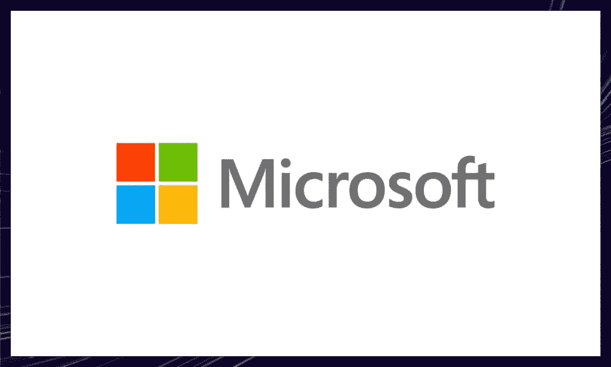

# 9 家在生产中使用铁锈的公司

> 原文：<https://blog.devgenius.io/9-companies-that-use-rust-in-production-9b8f6634b7b4?source=collection_archive---------0----------------------->

## 谁使用 Rust，选择这种编程语言对您的堆栈有什么好处？

凯文·Ku 在 [Unsplash](https://unsplash.com/s/photos/coding?utm_source=unsplash&utm_medium=referral&utm_content=creditCopyText) 上拍摄的照片。

如果你还没听说，Rust 是最有前途的和最受 T4 人喜爱的编程语言之一。

它最初由 Mozilla 开发，后来被 Dropbox、微软、脸书等公司采用。Rust 的主要好处是，它支持类似 C 的性能，同时仍然保持我们在用 JavaScript 和 Python 等语言开发时所习惯的内存安全。

在这篇文章中，我将关注九家使用 Rust 的大公司，并探究他们选择的原因。

# 9 个 Rust 成功案例

## Dropbox

Dropbox 的部分文件同步引擎使用了 Rust。由于该引擎是高度并发的，因此编写、测试和调试都很困难。所以团队选择用 Rust 重写。当您需要处理复杂的代码库和并发代码时，Rust 的静态类型和繁重的编译时检查使它比 Python 等动态类型语言更有优势。

> *Rust 是我们团队的力量倍增器，押注 Rust 是我们做出的最佳决定之一。除了性能，它的人体工程学和对正确性的关注也帮助我们驯服了 sync 的复杂性。我们可以在类型系统中编码关于我们系统的复杂不变量，并让编译器为我们检查它们。* [*(来源)*](https://dropbox.tech/infrastructure/rewriting-the-heart-of-our-sync-engine)

在他们的技术博客上阅读更多关于 Dropbox 使用 Rust [的信息。](https://dropbox.tech/infrastructure/rewriting-the-heart-of-our-sync-engine)

# Coursera

Coursera 使用 Rust 作为他们的编程作业功能，学生需要编写并运行一个计算机程序来解决问题。程序在 Docker 容器中运行、测试和分级。出于安全原因，开发团队需要为一些代码使用 Rust 这样的低级语言，他们认为 Rust 比 c 更安全。

> *虽然 C 是默认的低级全控编程语言，但这些二进制文件有严格的安全性和正确性要求。我们选择了 Rust，一种来自 Mozilla 的现代本地语言。Rust 的一个共同卖点是，由于其强大的类型系统，它对某些类别的安全漏洞完全免疫，这使它成为安全关键功能的绝佳选择。* [*【来源】*](https://medium.com/coursera-engineering/rust-docker-in-production-coursera-f7841d88e6ed)

你可以在他们的博客上获得更多关于他们使用 Rust 完成编程任务[的细节。](https://medium.com/coursera-engineering/rust-docker-in-production-coursera-f7841d88e6ed)

# 菲格玛

[Figma](https://www.figma.com/) 是一款基于网络的协作设计工具，用于矢量图形和界面原型制作。他们选择在 Rust 中重写他们的多人同步引擎(以前是在 TypeScript 中)，以提高性能，因为他们的服务器跟不上用户的增长。

> *我们选择 Rust 进行这次重写，因为它结合了一流的速度和低资源使用量，同时还提供了标准服务器语言的安全性。低资源使用率对我们来说特别重要，因为旧服务器的一些性能问题是由垃圾收集器引起的。* [*(来源)*](https://www.figma.com/blog/rust-in-production-at-figma/)

在这篇关于 Figma 生产中的[铁锈的文章中，了解更多关于他们使用铁锈的信息。](https://www.figma.com/blog/rust-in-production-at-figma/)

# npm

npm 是 JavaScript 的一个包管理器。它的工程团队选择在 Rust 中重写他们的主要服务，因为他们看到如果用户继续增长，服务的性能将很快成为瓶颈。他们拒绝使用 C 和 C++等技术，因为他们不相信自己能够处理 web 公开服务的内存管理。Java 被拒绝了，因为它涉及到在他们的服务器上部署 JVM。🙃

> 国家预防机制面临的挑战需要高效且可扩展的解决方案。当一项服务可以“部署并遗忘”时，这将节省宝贵的运营时间，并让他们专注于其他问题。npm 员工也重视在他们使用的任何技术周围有一个有益的社区。Rust 符合所有这些标准，目前正作为 npm 堆栈的一部分使用。 [*【来源】*](https://www.rust-lang.org/static/pdfs/Rust-npm-Whitepaper.pdf)

要了解更多，请阅读 Rust 主页上的[案例研究](https://www.rust-lang.org/static/pdfs/Rust-npm-Whitepaper.pdf)。

# 微软

微软最近一直在尝试将 Rust 集成到其大型 C/C++代码库中。

微软采用 Rust 的主要理由是 Rust 提供的内存安全性。在过去的 12 年里，微软发现的大约 70%的 CVE(常见漏洞和暴露)都与内存安全有关。微软已经尝试了各种方法来解决这个问题，比如广泛的开发人员培训和静态分析工具。然而，似乎唯一的出路就是让这些漏洞变得不可能。

想了解更多关于微软 Rust 的信息，请看这个演讲:

# 云耀斑

Cloudflare 在他们的核心 edge 逻辑中使用 Rust，作为对内存不安全的 C 的替代。

他们的 [GitHub](https://github.com/cloudflare) 展示了 18 个使用 Rust 的开源库，在他们的博客上，他们记录了使用 Rust 用于[防火墙规则](https://blog.cloudflare.com/how-we-made-firewall-rules/)，这是一个非常可定制的防火墙工具。

> *由于对性能、内存安全、低内存使用以及成为我们正在开发的其他产品(如 Spectrum)的一部分的能力等一系列要求，Rust 成为了最强有力的选择。* [*【来源】*](https://blog.cloudflare.com/building-fast-interpreters-in-rust/)

# 脸谱网

脸书用 Rust 重写了用 Python 写的源代码控制后端。他们在寻找一种编译语言来重写它，并被 Rust 的安全优势所吸引。从那以后，Rust 被源代码控制团队采用。作为采用的理由，他们提到了脸书的巨大错误成本和编译器反馈循环的简易性，与静态分析和代码审查形成对比。

> Rust 在编译时检测大量的严重错误。编译时一个 bug 的成本比生产时低几个数量级。

# 亚马孙

[AWS](https://aws.amazon.com/) 已经将 Rust 用于 Lambda、EC2 和 S3 等服务的性能敏感组件。此外，该公司公开支持和赞助该语言及其生态系统的开发。

亚马逊还开源了一项完全用 Rust 编写的服务。[鞭炮 VMM](https://firecracker-microvm.github.io/) 是一个虚拟机监视器，为 AWS Lambda 和 AWS Fargate 等服务而构建。

# 不调和

[Discord](https://discord.com/) 在他们的代码库的多个地方使用 Rust，包括客户端和服务器端。

例如，团队使用 Rust 和[酏剂](https://serokell.io/blog/introduction-to-elixir)，通过使用酏剂 NIFs (本地实现的功能)，扩展到 1100 万并发用户[。在这种情况下，Rust 使他们能够加速现有的药剂代码库，同时保持所有内存的安全。](https://blog.discord.com/using-rust-to-scale-elixir-for-11-million-concurrent-users-c6f19fc029d3)

他们还在 Rust(最初在 Go 中)中重写了他们的 Read States 服务。虽然 Go 版本的服务在大多数情况下足够快，但由于 Go 的内存模型和垃圾收集器，它有时会有很大的延迟高峰。

为了解决这个问题，Discord 转向 Rust，它提供了一个独特的内存分配系统，使得垃圾收集变得不必要。

> 除了性能，Rust 对工程团队来说还有很多优势。例如，它的类型安全和借用检查器使得当产品需求改变或发现关于语言的新知识时重构代码变得非常容易。此外，生态系统和工具是非常好的，并且有很大的推动力。 [*【来源】*](https://blog.discord.com/why-discord-is-switching-from-go-to-rust-a190bbca2b1f)

要阅读更多关于他们使用 Rust 的信息，请查看他们博客上的这篇文章。

# 铁锈的未来

在大多数这样的公司中，Rust 是 C 的一个更好的替代品——你可以看到 Rust 为避免性能下降而进行的重写模式。当团队需要额外的性能，但又想避免与 c 语言相关的内存问题时，他们就会使用它。

但是 Rust 有更多的好处:它使低级编程更容易访问，对 WASM 有极好的支持，并且对并发性非常好。我甚至不打算开始谈论这个社区。❤️

未来，随着越来越多的公司发现 Rust 如何改进他们的代码库，预计 Rust 的使用将会增加。

如果你想了解更多关于 Rust 的知识，我编辑了一个快速介绍，你可以在我们的博客上查看[。与此同时，在社交媒体上关注 Serokell，如](https://serokell.io/blog/rust-guide) [Twitter](https://twitter.com/serokell?lang=en) 和 [Medium](https://serokell.medium.com/) ，查看更多关于 Rust 和我们日常工作中使用的其他多种编程语言的帖子。