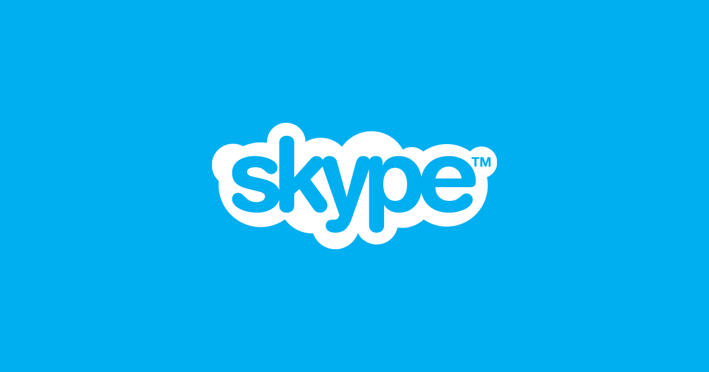
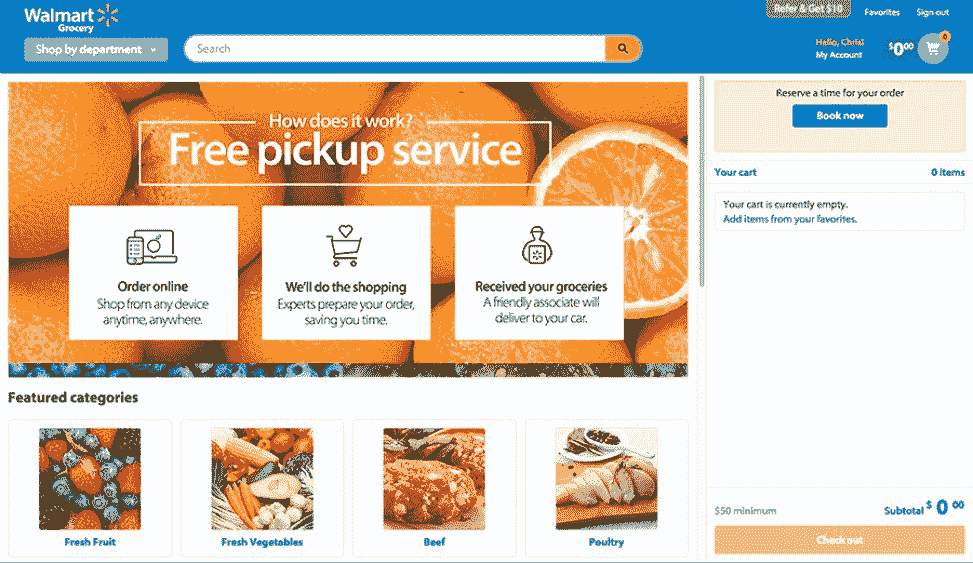

# React 本地应用程序的 9 个令人难以置信的例子表明了它的可靠性

> 原文：<https://blog.devgenius.io/9-incredible-examples-of-react-native-applications-that-shows-its-credibility-9ed1aaae0cb5?source=collection_archive---------2----------------------->

**图片来源:**progress.com

React Native 是一个加速构建移动应用程序的框架。这样做是因为您可以在它们之间重用大多数代码，如果您想知道这个叫做 react-native 的东西是什么，那么我们建议查看我们的文章，其中讨论了它的所有优点和缺点。

如今，本地应用是唯一的出路。移动设备已经成为我们获取信息、通过社交媒体与朋友和家人交流、或通过电子邮件发送自己最喜欢的国外电视剧集的主要手段，因此它们也应该对当今的大多数商业交易负主要责任！

**图片来源:**向着数据科学

但这一领域仍有改进的空间:许多开发人员发现他们有不止一名团队成员，他们不仅擅长不同的平台，还擅长完全独立的操作系统(例如，Android vs. iOS)。

开发人员往往最终雇佣两组承包商，仅仅是因为他们的应用程序需要不同世界之间的跨平台功能，如桌面 web 浏览和本地移动应用程序开发。

包括许多在应用程序开发工作中使用 React native 的制作公司的示例，其中包括用于 iOS 开发的 Apple 或用于 Android Studio 第二版的 Google。用户将在寻找另一条通往新技术的道路时，找到下一步该何去何从的灵感！

**脸书**

React Native 是脸书对高性能移动应用需求的回应。该公司在他们自己的黑客马拉松上启动了这个项目，他们希望我们所有的 web 开发人员都能够在 React Native 的基础上进行构建——例如轻松迭代，让一个团队构建您的整个产品，而不是您需要多个团队同时处理不同的项目，或者在每次需要对应用程序组件进行新的开发时在他们之间分配职责，如果任何人都使用除了他们自己之外的任何第三方库，那么在代码评审过程中没有任何东西会在用户面前丢失。

开发团队将脸书 iOS 应用程序中的事件仪表板功能转换为 React Native，这是一个受欢迎的框架，可以将上市时间缩短一半。这对任何应用程序都很重要，因为它对用户体验很重要，并决定了当他们从 iTunes Store(或其他市场)下载你的产品时，他们会留下还是离开你的产品。

如果你想创建一个像脸书一样的社交媒体应用，你可以在印度雇佣安卓应用开发者。

**Skype**

Skype 在 2017 年初宣布，它正在开发一款全新的应用 React Native。这对 Skype 的所有用户来说都是非常好的信息，因为这个设计和更新都相当好的应用程序随着时间的推移出现了许多问题，例如图标与各自的平台不匹配，或者应用程序在第一次打开时经常崩溃(特别是在更新后)。

新发布的版本充满了许多功能，包括重新设计的用户界面/UX，这是非常需要的，因为微软决定在移动设备和桌面 Windows 环境中也使用这项技术！

带有通用 Windows 平台插件的 Github repo 已经被他们接管，这表明他们的潜力不仅仅是在 iOS 或 Android 设备上开发原生应用程序。

**脸书广告**

React Native 是为移动设备构建应用程序的一种令人兴奋的新方法。脸书一直处于这项技术的前沿，开发了 Ads(该公司第一款基于 React 的应用)以及他们自己的社交网络平台，在全球每月拥有超过 20 亿用户！

**图片来源:** neilpatel

[图片来源](https://neilpatel.com/blog/spending-a-lot-on-facebook-ads/)

该框架似乎非常适合处理各种复杂的业务逻辑，当涉及到不同的广告格式(如时区或日期格式)时，需要准确性；已经编写了大量所需的 JavaScript 代码也是有帮助的，因为这使得他们可以通过消除克林顿·伯纳德关于类型转换的论文来加速开发。

与这个项目一起开发的许多组件在构建自己的产品或服务时非常有用，因为它们占用的时间比从头开始编码所需的时间要少！

**Instagram**

Instagram 接受了挑战，将 React Native 集成到他们现有的原生应用程序中，从最初存在于 WebView 中的简单推送通知视图开始。用这个框架实例化一个应用程序不需要任何导航基础设施，因为 UI 对开发人员来说非常简单明了；

**图片来源:** bbc

但他们在如何最好地发布内容方面存在问题:85%或更多的代码在 Android 和 iOS 应用程序之间共享，这取决于产品，使得开发人员的速度比完全没有跨平台考虑的情况高得多！

**特斯拉**

世界上最著名的电动汽车制造商特斯拉也加入了脸书的 React 土著社区。他们使用脸书的趋势框架为特斯拉车主开发了他们的应用程序，以诊断和定位车辆，并通过蓝牙连接用 iPhone 实时部分控制车辆！

**图片来源:** cleantechnica

该应用程序旨在让你不用起床就可以远程检查你的汽车——不再因为你的汽车在开车去工作或上学等重要地方时抛锚而整天在家等待(这在现在看来似乎是不可能的)。

除了正确使用时的成功率之外，还没有太多关于这个项目的信息发布；然而，在亲自试用了这些功能后，客户似乎总体上非常满意。

**沃尔玛**

美国跨国零售公司沃尔玛也在 React 原生用户名单中。沃尔玛在世界各地经营连锁杂货店和折扣百货商店，使用其应用程序为客户提供当地商店的价格信息，以及他们可能希望很快购买的商品的折扣，或者直接送货上门，而无需在交通堵塞等情况下步行穿过人群。

**图片来源:** corporate.walmart

根据这些天专家的报告，沃尔玛似乎选择了另一种技术——这一次，选择了一种全新的框架，称为“反应”沃尔玛报告称，一旦他们与其他平台分享他们的应用程序代码，他们的表现就非常出色。

96%的沃尔玛 iOS 和 Android 设计都是用更少的工时完成的，这使得他们比历史上任何时候都更快地做出改进。这一决定的好处是毁灭性的:由于在不同品牌的部门之间共享开发资源，降低了运营成本，提高了客户满意度。

**妖孽吃**

优步最近将 React 的创新功能引入其在线食品订购和交付平台 Uber Eats。由于现有功能有限，最初的应用程序在为用户发送推送通知声音时遇到了问题。

**图片来源:** techcrunch

由于涉及到三方，包括餐馆，他们可以输入如何在这个新的仪表板上处理他们的订单，该仪表板采用本地技术设计，而不是像以前那样通过单独的应用程序显示，甚至更糟的是，一些网站一起显示！

**印度的移动应用公司**正致力于提供像 Uber Eats 这样的解决方案，帮助企业取得成功。

**音云**

SoundCloud 一直是声音创作者和听众喜欢的平台。它提供音乐分发，以及上传你自己的音频文件或通过“哼唱”跟随其他用户创作的能力 Soundcloud Pulse 是由同一家公司开发的一款应用程序，它可以帮助您组织您帐户的各个方面，同时保持其活跃，从歌曲推广技能到每首歌曲值得多少好评！

**图片来源:** theguardian

他们需要 iOS 开发者，因为 Android 应用程序需要的技术与运行苹果操作系统的移动设备上的软件开发所用的技术不同——所以；发行版之间根本没有间隙；只有一个基于用户反馈的 React 本地原型应用程序。

**Wix**

Wix 提供一系列网络托管和设计服务，以满足任何企业的需求。通过拖放功能，用户可以在 HTML5 中创建自己的网站，而不需要任何编码技能！它们还通过提供许多导航选项，如 react -native、Wix React Native 导航、Airbnb 导航等，让您轻松使用。因此，没有必要自己维护或更新代码库。

**图片来源:** support.wix

Wix 是一家在线虚拟主机和设计服务公司，成立于 2006 年。任何人都可以使用 Wix 的拖放功能用 HTML5/CSS 构建自己的网站，快速开始构建任何类型的应用程序，无需编码技能！

WIX 提供了几个导航选项，如 react native，可以很好地处理不同类型的应用程序；Airbnb 也有自己的一套，当改变 React 原生应用程序(尽管还有其他应用程序)等平台时，它可以为开发人员提供代码库的轻松更新。人们可以选择他们喜欢的任何一个，同时根据项目的大小维护更新的副本。

如果你想创建一个像这样的应用程序，你可以联系印度的 [Android 应用程序开发人员](https://www.valuecoders.com/hire-developers/hire-android-developers?utm_source=guestblog-incredibleexample&utm_medium=S05) ，他们在 react native 方面有专长。

**包装**

React Native 正迅速成为想要创建移动应用的开发者的首选。它很灵活，并提供了无限的可能性，这使它成为一个优秀的替代应用程序开发工具。

正如我们所看到的，随着这个框架的兴起，Android 或 iOS 系统上的原生应用程序也越来越多。随着 Tizen 等新平台在寻找无需升级成本即可使用的各种设备的消费者中获得吸引力，React Native 可能会继续占据中心位置。