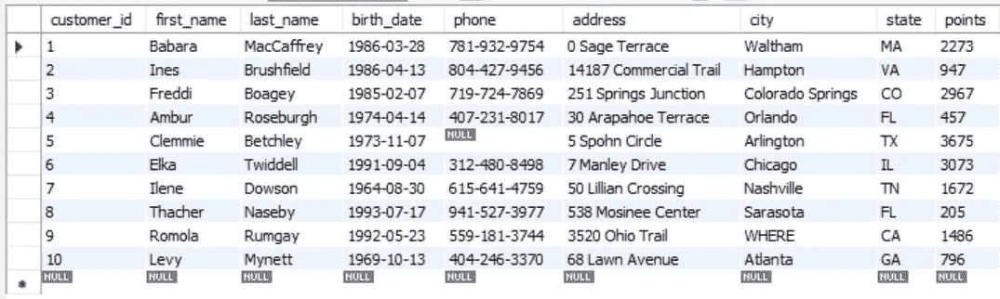
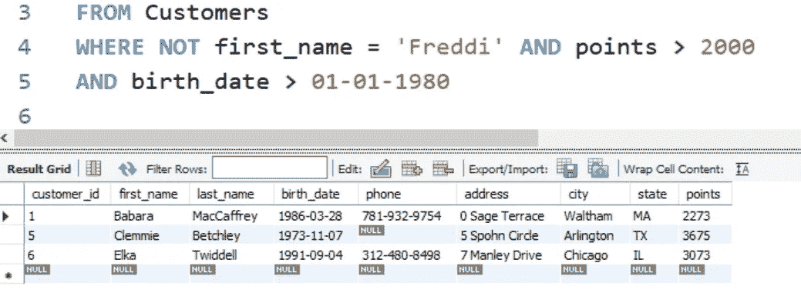

# 作为 SQL 开发人员必须知道的 9 个操作符

> 原文：<https://blog.devgenius.io/9-mandatory-operators-to-know-as-an-sql-developer-14c012e7d991?source=collection_archive---------2----------------------->

## 用真实的例子和使用案例解释


照片由 [Aron 视觉效果](https://unsplash.com/@aronvisuals?utm_source=unsplash&utm_medium=referral&utm_content=creditCopyText)在 [Unsplash](https://unsplash.com/s/photos/background?utm_source=unsplash&utm_medium=referral&utm_content=creditCopyText) 上拍摄

SQL 是非常容易查询的语言。很好理解和学习。这是要求某事的方式。而 SQL 的知识对于刚入门的程序员来说是绝对必要的。

有趣的是，作为初学者，这很容易掌握，因为要执行非常复杂的查询，只需要知道很少的操作符。

今天，我们将看到这些操作符中最重要的一个，并用真实的例子来解释，以便初学者能够理解这些操作符的原因和方式。

# 我们开始吧

开始之前，让我们选择一个要使用的数据库。这是一个保存客户信息的客户数据库。



作者图片

# 1.选择操作员:

第一个命令总是`SELECT`。运算符用于选择列。我们总是想从数据库中得到一些东西。而`SELECT`操作符帮助我们确定我们想要哪些特定的字段。

假设您只想得到客户中的`first_name`和`city`。然后你会写；

```
**SELECT** first_name , city
```

如果您需要关于客户的所有数据，请填写*

```
**SELECT *    <-- here * means everything**
```

此时，将从数据库中提取所有列。

# 2.来自操作员:

数据库中有许多表格。我们需要指定哪个表将提供我们的数据。目前，我们只有一张桌子，那就是`customers`。

所以我们将使用`FROM`操作符来告诉目标是哪个表。


作者图片

要看到结果，需要这两个命令。然后执行并在底部看到结果。

# 3.WHERE 运算符:

假设你想要一些 1000 分以下的客户。

那么你可以像下面这样实现它

```
SELECT * FROM CUSTOMERS **WHERE points < 1000     <-- see here**
```

然后你会看到；


作者图片

在这个 where 函数中，您可以使用适当的命令提出任何问题。比如，你只想要弗吉尼亚州的顾客。你只管写；

```
**WHERE** state = 'VA'
```

你应该记住的一点是，如果你想看到字符串(文本)，你需要使用单引号，比如' Orlando '。

对于这种操作，还有其他比较器

```
< Less than< = Less than or equal> Greater than> = Greater then or equal<> it means not equal!= it also means not equal
```

# 5.AND、OR、NOT 运算符:

使用这三个操作符，您可以一起编写多个查询。假设，您希望那些积分大于 2000 且出生于 1980 年 1 月 1 日之后的客户。那你是怎么发现的呢？这很容易。

```
**WHERE** points > 2000
**AND** birth_date > 01-01-1980
```

结果会变成；


作者图片

同样，您可以使用 OR，而不是命令。

如果你想使用`NOT`操作符，你应该把它写在`WHERE`命令之后。否则，它将不起作用。NOT 的另一个例子是；



这意味着一个人的名字是弗雷迪有更大的 2000 点。但是我写的不是他的名字，他的数据没有出现在这个查询中。

# 6.按操作员排序:

它有助于组织你的结果。这意味着您希望如何查看您的数据。可以是**上升**方式或**下降**方式。这些功能将变成`ASC`和`DESC`。

假设我想按字母顺序组织客户的姓名。所以，


作者图片

看，我没有用*标记和`select`命令。因为我只想知道顾客的姓和名。我用`order by`命令对名字和 DESC 分别使用了 ASC 和 last_name。然后执行了它。

# 7.操作员之间:

该命令用于显示**范围内**的数据，即你想要看到的数据。假设您需要积分在 1000 到 2500 之间的客户。那么怎么写呢；在这种情况下，您可能必须使用 **AND 或**运算符。


作者图片

在`ORDER BY`命令中使用`DESC`功能，我们将看到积分栏从小到大排列。

# 8.极限运算符:

它意味着你想在结果中看到多少数据。假设您使用`ASC`函数按字母顺序组织了客户的名字。但是您只需要前 4 个客户的名字。然后你将如何使用你的极限命令操作符；


作者图片

检查“名字”列。这很容易。让我给你另一个使用`points` 列的例子；


作者图片

此时，我使用`ORDER BY`命令，使用 `DESC`功能从最高值到最低值组织点。然后，我只想看到前 3 个最高分的客户。

# 9.空运算符:

假设，你有一个客户的电话号码列表。你知道有些顾客没有给你电话号码。现在，您需要从数据库中找出空白单元格。


作者图片

如果你需要所有的顾客，谁提供他们的电话号码。所以你应该只是写；

```
**WHERE** phone **is not NULL**
```

那很简单。你想要什么，你只要问正确的方法。

有更多的操作员可以方便地查询数据。这些都是绝对的基础。我们将在接下来的文章中深入探讨。

祝您愉快！

[](https://javascript.plainenglish.io/learn-join-in-mysql-database-a-practical-approach-1933c5c6bae6) [## 在 MySQL 数据库中学习 JOIN:一种实用的方法

### 电子商务数据库的分解

javascript.plainenglish.io](https://javascript.plainenglish.io/learn-join-in-mysql-database-a-practical-approach-1933c5c6bae6)