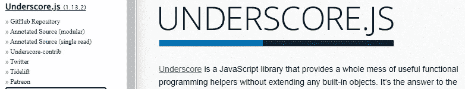
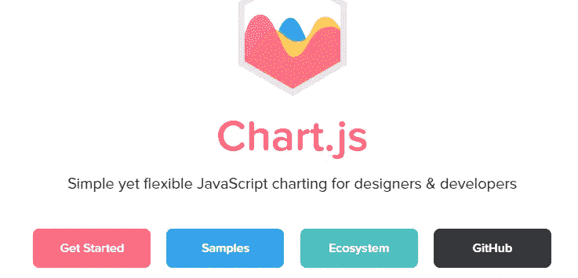
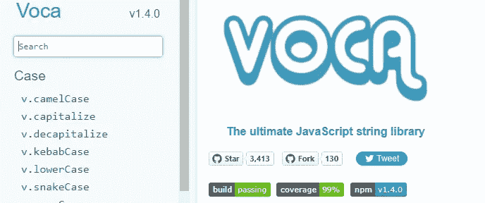
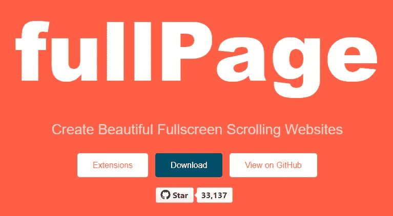
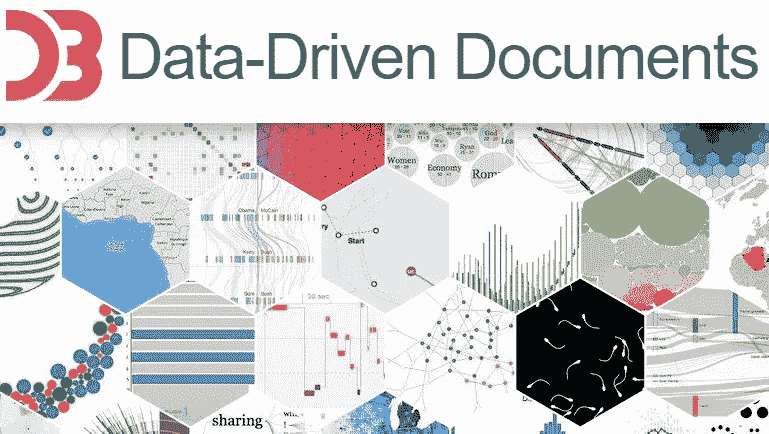
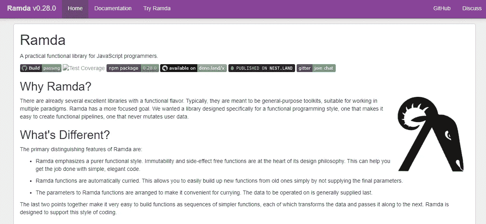
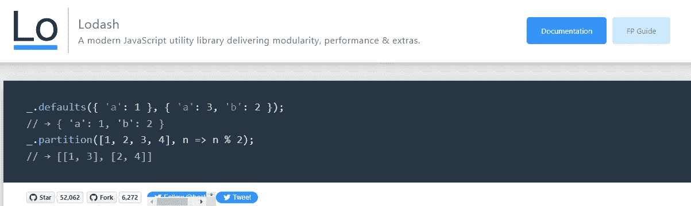
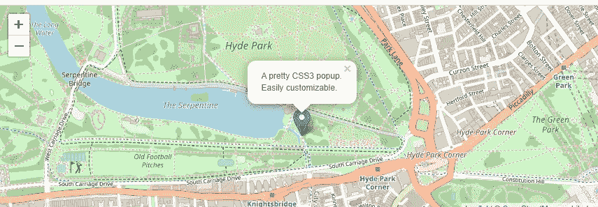
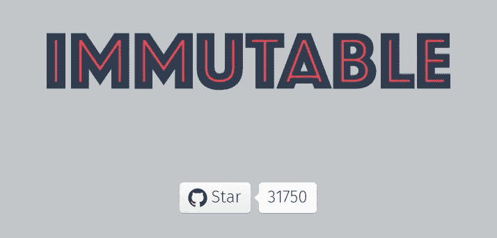

# 你需要知道的 9 个强大的 JavaScript 库

> 原文：<https://blog.devgenius.io/9-powerful-javascript-libraries-that-you-probably-dont-know-e923dff81cac?source=collection_archive---------1----------------------->

## 每个 web 开发人员都应该知道的有用的 JavaScript 库。

布鲁斯·马斯在 [Unsplash](https://unsplash.com?utm_source=medium&utm_medium=referral) 上的照片

如今，JavaScript 编程语言比以往任何时候都更加流行。毫无疑问，它是网络的头号语言。最棒的是，它可以用在浏览器上、服务器上、移动应用程序上，甚至更多。

除此之外，JavaScript 有一个非常丰富的生态系统，有很多有用的库和框架可以使用。由于使用了这些库和框架，您将能够节省编码过程的时间，并使您的生活更加轻松。

如你所知，从头开始一个新项目并自己编写每一行代码是一个艰难的过程，尤其是如果你正在处理有截止日期的紧急项目。这就是框架和库发挥作用来帮助您加速编码过程和提高生产率的原因。

在本文中，我将列出一些有用的 JavaScript 库，您可以使用它们来节省时间并简化任务。所以让我们开始吧。

# 1.强调

[下划线](https://underscorejs.org/)是一个非常有用的 JavaScript 库，可以帮助你进行函数式编程。它为您提供了一堆函数式编程助手和函数，帮助您轻松地在 JavaScript 中执行各种编程任务，而无需扩展任何核心对象。

由作者从[下划线. js](https://underscorejs.org/) 截取(链接到介质外)。

是的，这个实用程序库创建于 2009 年，但是很多开发人员仍然在使用它。下划线有 100 多个函数支持您的 workday 功能助手。除此之外，它几乎兼容所有的浏览器。

# 2.Chart.js

如果你想给你的项目添加漂亮的图表，这是一个非常棒的开源 JavaScript 库。

作者截取自 [Chart.js](https://www.chartjs.org/) (媒体外链接)。

当涉及到统计时，这是你可以使用的最好的库之一。您可以查看文档和他们的 GitHub 库来了解关于这个库的更多信息。在你的项目中很容易学习和实现。

# 3.Voca

Voca 是操纵字符串的最好的 JavaScript 库之一。它在所有主流浏览器上都得到支持，拥有超过 3000 颗 GitHub 星。

作者截取自 Voca。

该库提供了一组有用的函数来操作、格式化、截断、转义和查询字符串。Voca 有易于阅读的文档和 100%的代码覆盖率，没有依赖性。

# 4.全页. js

一个惊人的开源 JavaScript 库[帮助你轻松创建全屏滚动网站。](https://github.com/alvarotrigo/fullPage.js/)

作者截取自 [fullPage.js](https://github.com/alvarotrigo/fullPage.js/) (媒体外的外链)。

这个库提供了许多有用的特性，比如延迟加载、自动滚动、框架支持等等。它在 GitHub 上有超过 33000 颗星。

# 5.D3.js

[D3.js](https://d3js.org/) 是一个流行的 JavaScript 库，让你能够使用数据轻松操作文档。该库支持 HTML、CSS 和 SVG。

作者截取自 [D3.js](https://d3js.org/) (外链)。

D3.js 允许 web 页面上的数据可视化，并为您提供现代浏览器的全部功能。

# 6.拉姆达

Ramda 是另一个很棒的库，它让 JavaScript 函数式编程变得更加容易。

该库使创建功能管道变得更加容易，并且永远不会改变用户数据。

作者从拉姆达捕获。

*部分功能:*

*   自动创建定制函数。
*   无副作用和不变性的功能。

您可以通过查看他们的文档和 GitHub 资源库了解更多信息。

# 7.洛达什

[Lodash](https://lodash.com/) 是一个非常流行的 JavaScript 实用程序库，它让你更容易处理不同的数据类型(例如:数字、字符串、对象和数组)。

作者从洛达什捕获。

该库于 2013 年发布，但许多开发人员仍在使用它，因为它可以帮助您编写高性能代码并节省时间。它在 GitHub 上有超过 52000 颗星。

# 8.传单

[传单](https://github.com/Leaflet/Leaflet)是另一个令人惊叹的开源 JavaScript 库，用于创建漂亮的移动友好地图。它在 GitHub 上有超过 32000 颗星。

作者从传单上截取。

该库开箱即可在所有桌面和移动平台上运行。它拥有你需要的所有地图功能。

# 9.不可变的. js

[Immutable.js](https://github.com/immutable-js/immutable-js) 是一个非常有用的 JavaScript 库，它为你提供了不可变的数据结构，比如 list、stack、map 等等。

由作者从 Immutable.js 捕获。

该库拥有超过 31000 个 GitHub stars。您可以查看他们的文档以获得关于该库的更多信息。

# 结论

因此，这是一个有用的 JavaScript 库列表，您可以使用它来加速编码过程，并在构建新项目时节省时间。我并不是说你必须总是使用库，但是如果你想让你的生活变得更容易，有时为你的项目做点什么是件好事。

*感谢您阅读本文。此外，如果你觉得我的内容有用，而你不是一个媒体成员，你可以抓住你的媒体成员* [***这里***](https://mehdiouss.medium.com/membership) *(媒体推荐链接)获得无限制的访问媒体上的所有文章，并支持我们作为作家。*

 [## 通过我的推荐链接加入 Medium-Mehdi Aoussiad

### 作为一个媒体会员，你的会员费的一部分会给你阅读的作家，你可以完全接触到每一个故事…

mehdiouss.medium.com](https://mehdiouss.medium.com/membership) 

**延伸阅读:**

 [## 7 个免费的 React 模板可以用于您的项目

### 真棒 React 模板和主题，你可以开始建立你的下一个项目。

javascript.plainenglish.io](https://javascript.plainenglish.io/7-free-react-templates-you-can-use-for-your-projects-fb041304bf90)  [## 你必须知道的 7 个有用的前端 Web 开发人员备忘单

### 作为一名前端 web 开发人员，帮助您节省时间的精彩备忘单。

blog.devgenius.io](/7-useful-front-end-web-developer-cheatsheets-you-must-know-32e9ef3c03bb)