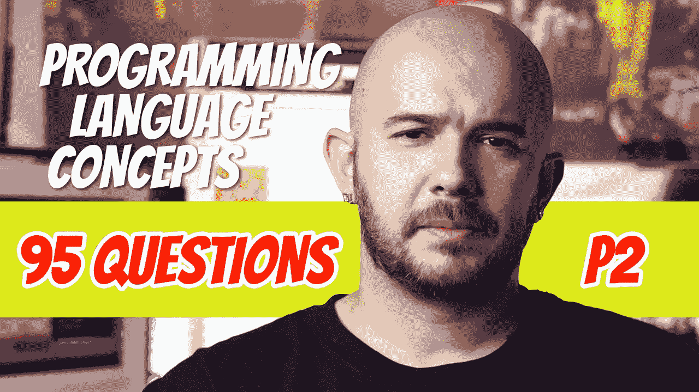

# 95 编程语言问答(P2)

> 原文：<https://blog.devgenius.io/95-programming-language-q-a-p2-4a7d87b89903?source=collection_archive---------10----------------------->

这里可以看到 PLC 问答系列的[第一部分。在本帖中，我们仍将关注语言发展的早期。本系列中的一些主题包括 Lisp、ALGOL、COBOL、BASIC、PL/I、APL、SNOBOL、SIMULA、Prolog、Ada 和 c。在浏览之前，您能回答这个问题吗？所有现代语言的设计都归功于 _____ 或 ______。](https://medium.com/dev-genius/104-programming-language-conceptual-questions-and-answers-p1-8de4591299fe)

## 105.Lisp 是谁开发的？

约翰·麦卡锡

## 106.Lisp 是什么类型的语言？

-函数式编程语言

## 107.真的还是假的？Lisp 是纯函数式的。

-没错

## 108.Lisp 中的两种数据结构是什么？

-原子和列表

## 109.什么是列表？

-括号中的一系列元素(A B C D)

## 110.列表中的元素可以是 ________ 或 ________ ________。

-原子或其他列表

## 111.Lisp 是怎么做计算的？

-通过对参数应用函数

## 112.真的还是假的？在 Lisp 中，赋值语句和变量都是必需的。

-假的。也不

## 113.Lisp 用什么做迭代？

-递归

## 114.真的还是假的？在 Lisp 中，程序代码和数据都是以列表形式编写的。

-没错

## 115.用 Lisp 描述列表(A B C D)中的程序代码。

-函数 A 后跟三个参数 B、C、D

## 116.举出几个 Lisp 的后代。

- Scheme、Common Lisp、MetaLanguage、Miranda、Haskell、F#

## 117.说出微软开发的一种函数式语言。

- F#

## 118.谁开发了 ALGOL 58？

弗里茨·鲍尔

## 119.ALGOL 58 中的赋值语句是什么样的？

-变量:=表达式

## 120.真的还是假的？ALGOL 58 接近数学符号？

-没错

## 121.真的还是假的？ALGOL 58 形式化了数据类型的概念？

-没错

## 122.真的还是假的？ALGOL 58 包含复合语句？

-没错

## 123.ALGOL 58 允许多少个数组维数？

-任何数字

## 124.ALGOL 58 中数组的下限是多少？

-是程序员指定的任何东西

## 125.真的还是假的？选择语句可以嵌套。

-没错

## 126.BNF 代表什么？

-巴克斯-诺尔形式

## 127.BNF 是干什么用的？

-描述编程语言语法。

## 128.说出 ALGOL 60 中引入的几个特性。

-递归过程
-堆栈-动态数组
-块结构
-作为值或名称传递给子程序的参数

## 129.谁编写了 ALGOL 60 的描述，他使用了哪种形式？

彼得·诺尔。他用了 BNF。

## 130.说出 ALGOL 60 的 3 个第一

-它是由一个国际组织设计的第一种语言
-它是第一种被设计成独立于机器的语言
-它是第一种语法被正式描述的语言

## 131.哪种语言被用作交流算法的唯一可接受的方式？

- ALGOL 60

## 132.列举 ALGOL 60 从未被广泛接受的几个原因。

-过于灵活
-缺乏 I/O 语句
- BNF 看起来奇怪而复杂
-缺乏 IBM 的支持

## 133.谁为哪个编程领域开发了 FLOW-MATIC？

-用于商业应用的格蕾丝·赫柏

## 134.COBOL 是谁开发的？

-由 Tierney 和朋友们开发的

## 135\. Where was the idea of COBOL developed?

- The Pentagon

## 136\. Name a few things COBOL was trying to achieve.

- Use English as much as possible
-不应该受到实现的限制
-易于使用

## 137.COBOL 代码被分成哪两部分？

-数据描述和可执行操作

## 138.哪种语言比其他任何编程语言使用得都多？

- COBOL

## 139.国防部授权的第一种编程语言是什么？

- COBOL

## 140.填空。_____ 是第一种具有宏构造的高级语言

- COBOL

## 141.COBOL 的变量名中可以有多少个字符？

-高达 30

## 142.COBOL 变量名中还允许使用什么字符？

-达什

## 143.谁开发了 BASIC？

约翰·凯米尼和托马斯·库尔茨

## 144.BASIC 为什么受欢迎？

-它用于较弱的微型计算机。

## 145.为什么 BASIC 开始不流行了？

因为微型计算机变得更加强大

## 146.BASIC 的主要目标受众是谁？

-初学者；非理科生

## 147.第一种广泛使用的允许通过连接到计算机的终端进行程序开发的语言是什么？

-基本

## 148.真的还是假的？BASIC 更重视计算机时间而不是用户时间。

-假的

## 149.第一次大规模尝试设计一种可用于广泛应用领域的语言是什么？

-损益

## 150.PL/I 试图实现什么？

-将商业和科学领域合二为一。

## 151.PL/I 的缺点是什么？

-功能太多，有些功能设计得不好。

## 152.APL 和 SNOBOL 都有什么？

-动态类型和动态存储分配

## 153.什么是动态类型？

-变量在赋值时获得类型

## 154.什么是动态存储分配？

-赋值时分配给变量的存储

## 155.谁开发了 APL？

-肯尼斯·艾弗森

## 156.为什么要开发 APL？

-描述计算机架构

## 157.APL 以什么闻名？

-大量运算符，如数组上的单元运算。

## 158.真的还是假的？APL 很容易阅读。

-假的

## 159.SNOBOL 是谁设计的？

贝尔实验室的法伯、格里斯沃尔德和波伦斯基

## 160.斯诺鲍以什么闻名？

-文本处理。具有强大的字符串模式匹配操作

## 161.SNOBOL 是用来写 _____ ____ 的。

-文本编辑器

## 162.我设计 SIMULA 是为了什么？

-模拟

## 163.谁开发了 SIMULA I？

-克利斯登·奈加特和奥莱·贾恩·达赫

## 164.哪种语言最先支持数据抽象？

- SIMULA 67

## 165.为什么在 SIMULA 67 中创建了数据抽象？

-支持协程

## 166.ALGOL 68 中的原始数据类型是什么？

-布尔、字符、整数、实数和复数

## 167.ALGOL 68 介绍了什么？

-未指定数组长度的隐式堆动态数组(flex 数组)

## 168.所有现代语言的设计都归功于 _____ 或 ______。

- ALGOL 60 或 ALGOL 68

## 169.谁开发了 Pascal？

尼古拉斯·沃斯

## 170.真的还是假的？Pascal 成为使用最广泛的入门语言。

-没错

## 171.真的还是假的？与 Fortran 或 c 相比，Pascal 是安全的。

-没错

## 172.C 是谁开发的？

丹尼斯·里奇

## 173.为什么最初开发 C？

-用于系统编程

## 174.C 受欢迎的一个原因是什么？

- UNIX 是用 C 写的

## 175.真的还是假的？c 有类型检查

-假的

## 176.Prolog 属于哪一类编程语言？

-逻辑

## 177.Prolog 是谁开发的？

罗伯特·科瓦尔斯基

## 178.Prolog 由两种类型的语句组成:______ _ 和 _ _ _ _ _ _。

-事实和规则

## 179.Prolog 使用 ________ 来尝试确定语句的真实性。

-分辨率

## 180.对于一种编程语言来说，最昂贵和最广泛的设计工作是什么？

-艾达

## 181.谁开发了 Ada？

-让·伊奇比亚

## 182.为什么要创造阿达？

国防部竞赛。国防部想要一种嵌入式系统的编程语言。

## 183.阿达的名字是从哪里来的？

奥古斯塔·爱达·拜伦

## 184.谁被认为是第一个程序员？

奥古斯塔·爱达·拜伦

## 185.Ada 的主要贡献是什么？

-包
-异常处理
-通用包和子程序
-任务

## 186.阿达为什么会被批评？

-太大太复杂

## 187.国防部的军用软件系统仍然需要 Ada 吗？

-没有

## 188.Ada 95 提供了哪些功能？

-受保护对象
-支持继承和多态的扩展类型

## 189.Ada 2005 有什么类型的接口？

-类似 Java

## 190.第一种完全支持 OOP 的语言是什么？

-闲聊

## 191.谁开发了 Smalltalk？

艾伦·凯

## 192.Smalltalk 是在什么平台上使用的？

- Dynabook(类似于大 iPad)

## 193.Smalltalk 中的所有计算是如何完成的？

-通过向对象发送消息来调用它的一个方法，该方法通过返回一个对象来应答。

## 194.真的还是假的？Smalltalk 中的类属于单一的类层次结构？

-没错

## 195.C++是谁开发的？

贝尔实验室的比雅尼·斯特劳斯特鲁普

## 196.真的还是假的？C++允许过程化和 OOP 编程？

-没错

## 197.真的还是假的？C++继承了 C 的大部分不安全性。

-没错

## 198.真的还是假的？可以链接 C++代码和 C 代码。

-没错

## 199.说出 C++中的几个特性。

-参数类型检查
-类
-继承组件的公共/私有访问控制
-构造函数和析构函数

## 200.真的还是假的？C++允许多重继承。

-没错

# 想要更多吗？

[P1。104 编程语言 Q & A](https://medium.com/@dinocajic/104-programming-language-conceptual-questions-and-answers-p1-8de4591299fe)
[*P2。95 编程语言 Q&A*](https://medium.com/@dinocajic/95-programming-language-q-a-p2-4a7d87b89903)[P3。123 编程语言 Q & A](https://medium.com/@dinocajic/123-programming-language-q-a-p3-f4d5c141382)
[P4。77 编程语言 Q&A](https://medium.com/@dinocajic/77-programming-language-q-a-p4-71f7dc5cab3e)[P5。146 编程语言 Q & A](https://medium.com/dev-genius/146-programming-language-q-a-p5-d6ad7550c4a0)
[P6。94 编程语言 Q & A](https://medium.com/dev-genius/94-programming-language-q-a-p6-d7e00de0f48)
[P7。141 编程语言 Q & A](https://medium.com/@dinocajic/141-programming-question-q-a-p7-5b4a4325e886)

迪诺·卡希奇目前是 [LSBio(寿命生物科学公司)](https://www.lsbio.com/)、[绝对抗体](https://absoluteantibody.com/)、 [Kerafast](https://www.kerafast.com/) 、[珠穆朗玛生物科技](https://everestbiotech.com/)、[北欧 MUbio](https://www.nordicmubio.com/) 和 [Exalpha](https://www.exalpha.com/) 的 IT 负责人。他还担任我的自动系统的首席执行官。他有十多年的软件工程经验。他拥有计算机科学学士学位，辅修生物学。他的背景包括创建企业级电子商务应用程序、执行基于研究的软件开发，以及通过写作促进知识的传播。

你可以在 [LinkedIn](https://www.linkedin.com/in/dinocajic/) 上联系他，在 [Instagram](https://instagram.com/think.dino) 上关注他，或者[订阅他的媒体出版物](https://dinocajic.medium.com/subscribe)。

阅读 Dino Cajic(以及 Medium 上成千上万的其他作家)的每一个故事。你的会员费直接支持迪诺·卡吉克和你阅读的其他作家。你也可以在媒体上看到所有的故事。