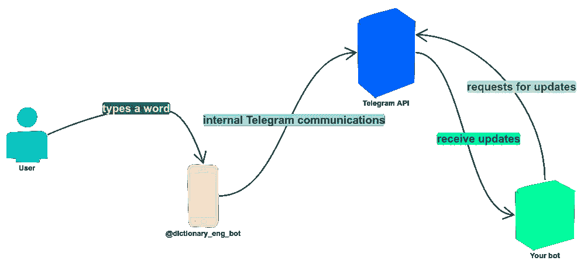
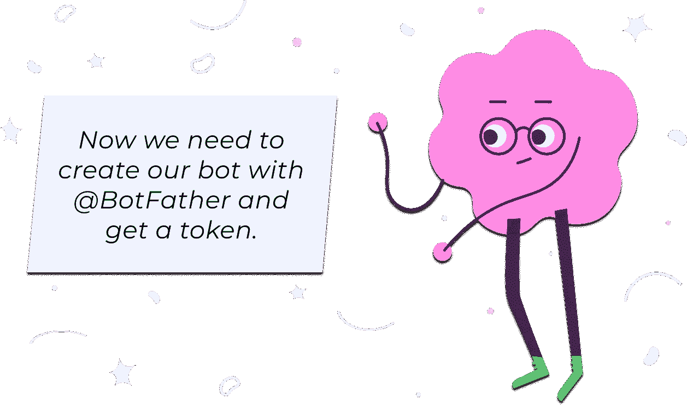
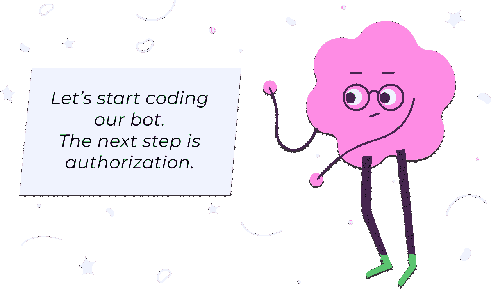
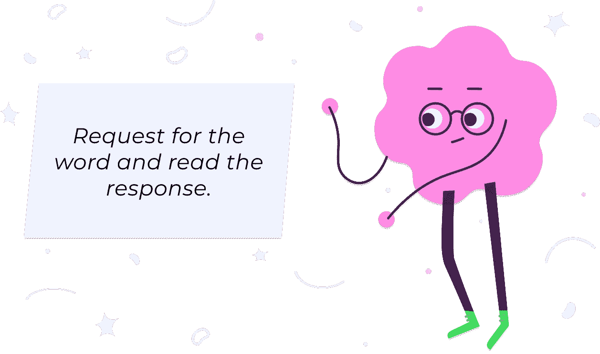
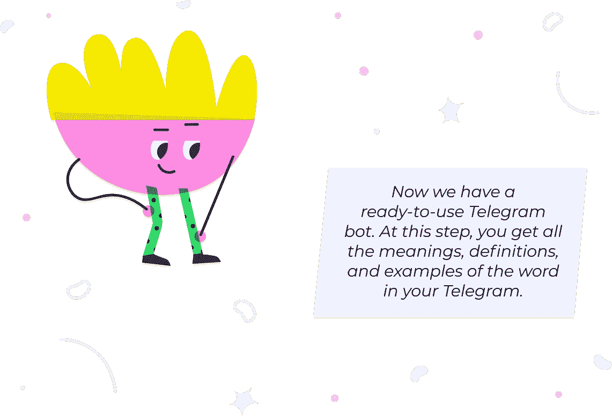

# 在 Go 中创建电报机器人的 4 分钟指南

> 原文：<https://blog.devgenius.io/a-4-minute-guide-to-creating-telegram-bot-in-go-ccf662986bbb?source=collection_archive---------2----------------------->

## 新手 Go 程序员的循序渐进指南


我一直在考虑为 Telegram 创建机器人。我经常使用电报，所以我有很多想法来帮助我简化我的日常工作。其中一个想法对语言学习者特别有用——字典。

在本指南中，我们将讨论如何为 Telegram 创建一个字典机器人。我试图让这种材料尽可能简单。我将整个编程过程分成几个*小*步骤:

1.  我们寻找一个英语词典 API，
2.  然后创建 bot，用@BotFather 生成一个电报令牌。
3.  之后，我们通过授权我们的机器人并接收来自聊天的消息来开始编码。
4.  然后，我们使用找到的字典 API 来请求和接收词义。
5.  格式化接收到的单词。
6.  并将其发送到聊天室。

在下图中，你可以看到当用户发送一个单词时，机器人是如何工作的:



图 1 .用户发送一个单词时机器人的工作

# 寻找字典 API

为了这个项目，我找到了一个[免费的 Google Dictionary API](https://github.com/meetDeveloper/googleDictionaryAPI) 。我们将只阅读完整回复中的含义、定义和示例字段。



# 获取令牌

在电报中搜索`@BotFather`。打开聊天。在聊天中输入`/newbot`。为你的新机器人选择一个名字。我给我们的机器人取名为`English_Dictionary`。然后，考虑一个用户名。我选择了`@dictionary_eng_bot`。

当您找到可用的用户名时，`@BotFather`会自动向您发送令牌以访问电报 API。切勿与任何人共享此令牌，否则令牌可能会被泄露。



# 授权 Bot

我们通过环境变量读取敏感凭证。然后，我们创建一个新的 BotAPI 实例，它接受给定的令牌。

## 审核进度

要构建和执行代码，请使用以下命令:

`$ token=x go run main.go`

如果连接已经建立，您应该会看到消息*“帐户授权您的 _ 电报 _ 用户名”*。如果连接失败，您会看到消息*“无法连接到电报 API”*。

在这一步，我们检查 bot 是否已经被授权。


# 获取新信息

我们通过更新从用户那里获得的所有信息。为此有两种方法:`getUpdates()`和`getUpdatesChan()`。我们使用`getUpdatesChan()`是因为这个方法返回一个“等待更新”的通道。

为了配置更新请求，我们创建了一个新的`UpdateConfig`实例。`UpdateConfig`包含*偏移*、*极限*和*超时*字段。为了简单起见，我们将这些参数归零。

```
config := tgbotapi.UpdateConfig{}
updates, err := bot.GetUpdatesChan(config)
if err != nil {
    return err
}
```

在前面的代码中，`updates`是存储来自电报 API 的响应的通道。

```
for update := range updates {
	// here we will process the word from the user
}
```

`update.Message.Text`是传入词。

## 审核进度

尝试从聊天中获取单词，并将其打印在屏幕上。

更改代码:

```
for update := range updates {
    fmt.Println(“word:”, update.Message.Text)
}
```

在 Telegram 中找到 bot，按 Start 并键入一个单词。在您的命令行中，您将看到您发送到聊天中的单词。



# 处理请求和响应

在下面的代码中，我们发出一个请求，读取响应的所有主体，解析 JSON 编码的数据，并将这些数据存储在`WordInfo`结构中。

这里省略了`requestWord()`功能。参见[完整代码](https://github.com/kozhevnikova/lang_bot)。

得到响应后，我们检查状态代码。如果状态代码为 200 OK，我们将收到单词信息。

如果状态代码不等于 200 OK，则响应不包含所需的数据。发生这种情况的原因有很多。例如，当单词不存在，或者单词拼写错误时。代码中返回错误。

## 审核进度

更改 main():

在 *"receivedWord:"* 之后，你得到一个填充了单词信息的结构。


# 格式化邮件

下面是 JSON 编码的`WordInfo`结构片段，因为一个词可以有很多含义、定义和例子。

在下面的函数中，我们迭代`WordInfo`以找到*定义*、*含义*和*示例*。

## 审核进度

要查看我们获得的单词参数是否正确，请更新 main():

代码执行后，您将在命令行中看到以下格式的消息:

```
Part of speech:
Definition:
Example:
```

当单词不存在或拼错时,`getWordInfo()`函数返回 nil 和 error。要检查这个问题，您可以键入一个错误的单词，然后在聊天中查看消息。


# 发送结果

我们用`tgbotapi.NewMessage()`方法创建一个`message config`。为此我们需要两个参数:`update.Message.Chat.ID`或者我们需要将消息发送到哪里，以及`wordParams`或者我们需要向用户发送什么。然后，使用`bot.Send()`方法将消息 config 发送给用户，如下例所示:

```
msg := tgbotapi.NewMessage(update.Message.Chat.ID, wordParams) _, err = bot.Send(msg)
    if err != nil {
        log.Println("Unable to send message:", err)
        return
    }
```

## 审核进度

更新您的代码:



# [完整代码](https://github.com/kozhevnikova/lang_bot)