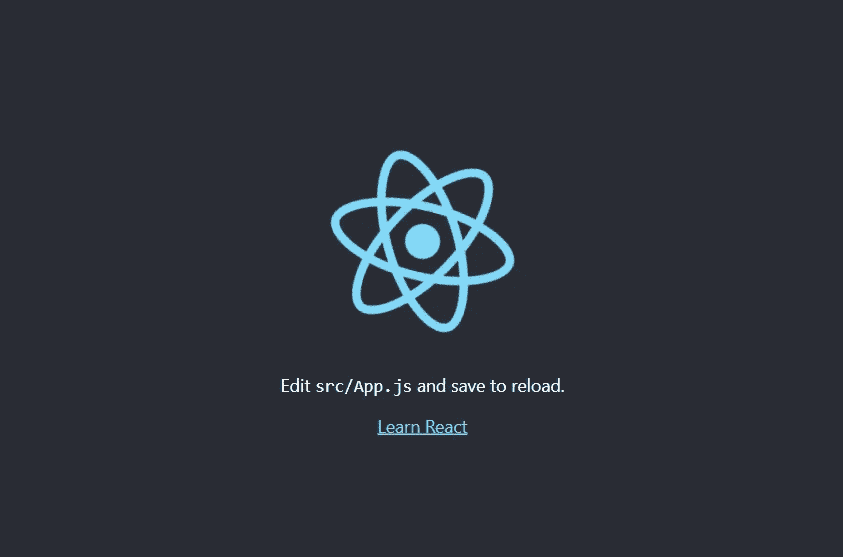
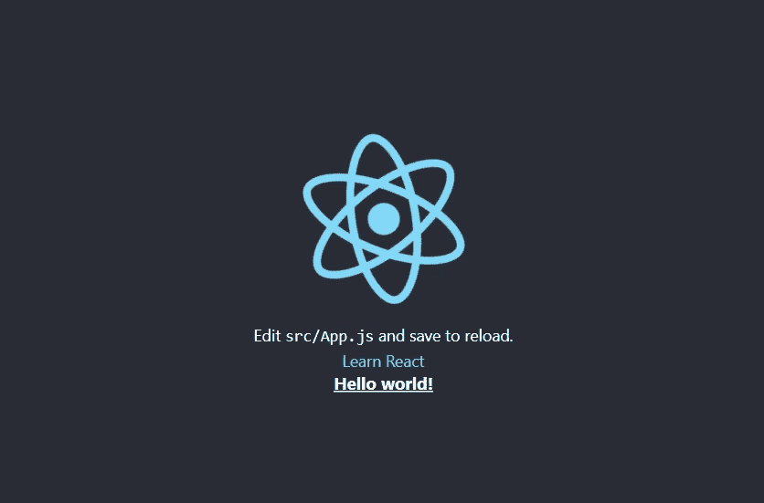
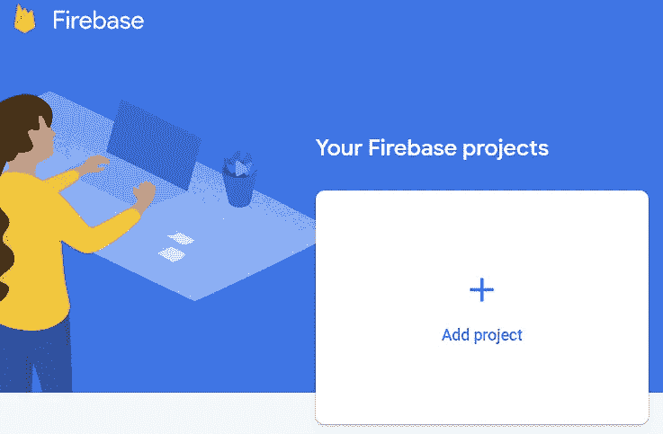

# 基本的反应、顺风和火力基地部署

> 原文：<https://blog.devgenius.io/a-basic-react-tailwind-and-firebase-deployment-fc96fcf43b6?source=collection_archive---------10----------------------->

## 脱离多年标准共享主机的刺激

照片由[阿迈尔·马亚诺维奇](https://unsplash.com/@just_amelo?utm_source=unsplash&utm_medium=referral&utm_content=creditCopyText)在 [Unsplash](https://unsplash.com/?utm_source=unsplash&utm_medium=referral&utm_content=creditCopyText) 拍摄

到目前为止，我所有的 web 项目都使用共享主机，仅限于 PHP 作为服务器端脚本语言。为了让我的技能与时俱进，我将踏上一段旅程，进入 NoSQL 的 NodeJs、React、Tailwind 的世界。全部托管在 Google 的应用开发平台 Firebase 上。

# 本地设置

我有一台 Windows 机器，使用 Visual Studio 代码作为我的 IDE。我安装了最新版本的 Node JS。

## 反应

我通过在终端中键入`npm install -g create-react-app`来安装 React。然后我用`npx create-react-app coin-toss`创建了我的 React 应用。这安装了构建和运行完整的 React.js 应用程序所需的所有依赖项。我将创建一个非常简单的正面或反面游戏，因此命名为*抛硬币*。你可以把这个改成*我的应用*或者你喜欢的任何东西。

我跑了`cd coin-toss`然后是`npm start`。这向我展示了 React 应用程序的一个本地实例，位于 [http://localhost:3000/](http://localhost:3000/)

我的 React 应用程序的本地实例位于 [http://localhost:3000/](http://localhost:3000/)

## 顺风 CSS

那些有任何网页设计经验的人在看到我的项目的一秒钟内就会知道我使用了 Bootstrap 库。我热衷于探索 Tailwind CSS 作为一种替代方案。我希望这能让我在设计选择上不那么懒惰，并迫使我拓宽我的 CSS 知识。

官方的 Tailwind 文档提供了与 React 一起安装的具体指南，我没有问题地遵循了这个指南。然后我可以在默认的 React 页面上添加一个“Hello World”。

React 应用程序中的顺风类

发现差异:顺风 CSS 的结果

## 重火力点

在不知道我的 web 应用程序将如何部署的情况下，我不想在学习一个新环境时过于兴奋。在阅读了 Heroku 和 Firebase 之后，我决定将后者作为一个主机选项。

我用我的 Gmail 账户登录 https://firebase.google.com/，按照向导操作，创建了一个新的 Firebase 项目。

一个友好的向导将引导您完成创建新的 Firebase 项目的过程。

在我的本地机器上，我用`npm install -g firebase-tools`安装了 Firebase 工具。下一步是用`firebase login` 登录，然而就在这时，我遇到了第一个障碍:

> firebase:无法加载文件 C:\ Users \ Russell \ AppData \ Roaming \ NPM \ firebase . PS1，因为此系统上禁用了运行脚本。
> 如需更多资讯，请参阅 https:/go . Microsoft . com/fwlink/？LinkID=135170。

这个解决方案非常简单，幸好没有绕过我的系统的*执行策略。*我只是删除了上面错误中引用的 firebase.ps1 文件，正如这个堆栈溢出回答中建议的[。在这之后，我成功运行了`firebase login`,并按照提示使用我创建 Firebase 项目时使用的 Gmail 账户登录。](https://stackoverflow.com/questions/60594178/firebase-cannot-be-loading-because-running-scripts-is-disabled-on-this-system)

# 部署

登录后，我可以轻松完成以下步骤来部署我非常简单的 React 应用程序:

1.  使用`npm run build` 命令创建 React 应用程序的生产版本。这在我的项目中创建了一个新的*构建*文件夹。
2.  用我的 React 应用程序和`firebase init`命令初始化我的 Firebase 账户。这允许我选择主机和我之前在浏览器中设置的项目。然后，我能够将 *build* 指定为包含本地机器上的生产资产的文件夹。
3.  最后，使用`firebase deploy`命令部署应用程序。这生成了一个类似 https://react-tail wind-demo . web . app 的唯一托管链接

# 新的工作流程

完成这些步骤后，我现在已经在本地机器上建立了一个开发环境，并且有了一个简单的方法来部署到 Firebase hosting。我已经把自己拖出了 PHP、FTP 客户端和共享主机的 2000 年代的世界。我很高兴打开了一个新的学习世界。