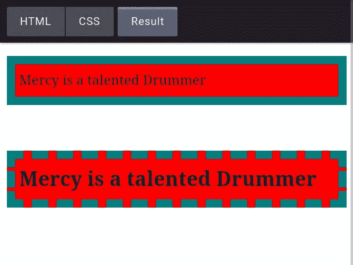

# CSS 盒子模型的基本演练。

> 原文：<https://blog.devgenius.io/a-basic-walkthrough-of-the-css-box-model-cf3cbc7ca1a?source=collection_archive---------18----------------------->


你好世界！

新年快乐

我很高兴能写一篇关于 CSS 盒子模型的博客，因为它是设计网站不可或缺的一部分。术语'*箱型'*多用于谈论设计和布局。那么，我们开始吧。

在我的上一篇文章中，我发布了一个[链接](https://codepen.io/mercysticks/pen/GRMmwJN)到我用 html 创建的注册表单。我现在添加了一些基本的 CSS 样式，让它看起来更好，你可以在这里查看。

如果您注意到了，我在设计表单时使用了 CSS box 模型。

盒子模型是整个 CSS 的重要组成部分之一。盒子模型代表了你的网页的外观和感觉。
盒子模型是理解元素如何在屏幕上布局的核心。不同的 CSS 属性如何影响不同元素的布局。
本质上，你应该把每一个 HTML 元素想象成一个有着不同层次的盒子。因此，术语盒模型。CSS 盒子模型是一个包裹每个 HTML 元素的盒子，它由以下内容组成:实际内容、填充、边框、边距。下图说明了什么是箱式模型。


CSS 盒子模型。

盒子模型定义了上面矩形的不同部分，这些部分被分成四(4)个部分、子盒子或层。

你放在网页上的每个块级 HTML 元素都是一个盒子。即使它通常看起来不像。例如，如果你添加一个`<p>`元素到你的网页并加载它，它最初看起来只是松散的文本。如果你添加一些 CSS 颜色，你可以看到矩形盒子的形状 **:**

```
<p> Mercy is a talented Drummer </p>
```


CSS 样式


向

元素添加背景色后的输出

让我们分别检查盒子的每一层。

**内容:**

元素的内容形成了最里面的框。称为内容的最里面的矩形可能包含文本或可视元素。使用上面的例子，内容是用红色背景色显示的整个区域。

**填充:**

填充是边框和元素内容之间的空间。内容周围的透明区域也共享背景色。一个元素的填充可以用以下属性定义: **padding-top，padding-bottom，padding-left，padding-right** 或者可以使用 **padding** 属性为所有四个边设置一次区域的大小，就像这样，padding:15px；它将元素的所有四边都设置为 15px 的填充。


使用速记填充属性设置样式。

让我们在下面的例子中使用这两种方法:

使用上面的 HTML，让我们添加下面的 CSS 样式。


对

元素应用填充属性后的输出。

**边境:**

边框是填充周围的区域，从填充框的外边缘延伸到边距的内边缘。border 属性允许我们在内容填充区域周围添加一条线并设置其样式。该线条的粗细、颜色和样式可以由 border-width、border-color 和 border-style 属性来定义，或者您可以使用速记 border 属性来定义这三个属性。边框样式值包括实线、虚线、虚线、双线、凹槽、屋脊和无。简写边框属性如下图所示:


让我们在下面的示例中应用 Border 属性:

```
<p> Mercy is a talented Drummer</p> <br><h2> Mercy is talented Drummer </h2>
```



你可以尝试自己改变边框样式[这里](https://codepen.io/mercysticks/pen/JjrpjVB)。

**边距:**

边距是将元素与其相邻元素或其他元素分隔开的空白空间。边距用于在元素外部留出空间。它的大小可以由以下属性定义:**左边距、右边距、上边距、下边距**属性或速记边距属性。

如果使用了速记属性，并且只定义了一个值，那么它适用于元素的所有边。如果定义了两个值，那么第一个值表示上边距和下边距，第二个值表示右边距和左边距。


使用 Margin 属性进行样式设置的简写。

```
<p> Mercy is a talented Drummer</p> <br><h2> Mercy is talented Drummer </h2>
```


恭喜你！哟！你大老远跑来了！

我相信你现在知道制作像素完美的网站的基本知识了吧？

这是你到达终点的奖章。❤💯

希望你喜欢这个？

你可以看看我用 HTML 和 CSS 创建的个人投资组合页面，并跟踪我的进展。[这里](https://codepen.io/mercysticks/pen/xxXYxez)！

您可以关注我，了解以下更多内容:

[**推特**](https://www.twitter.com/mercysticks)

[**Codepen**](https://medium.com/@mercykeilechi)