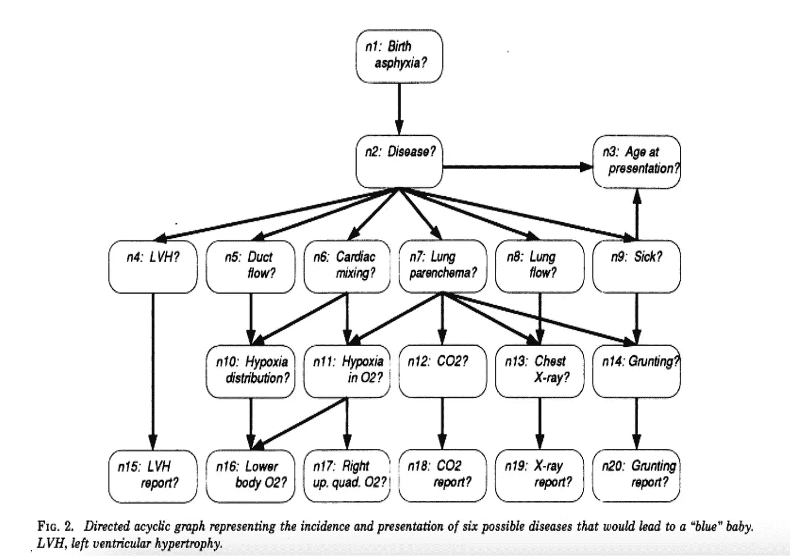
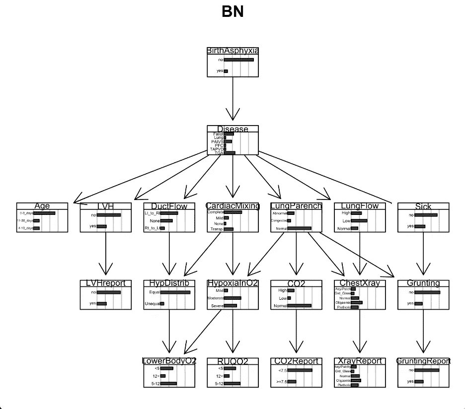
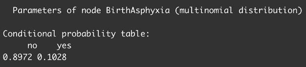
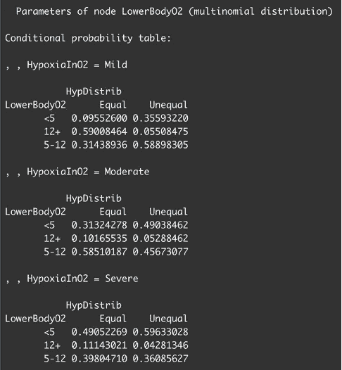
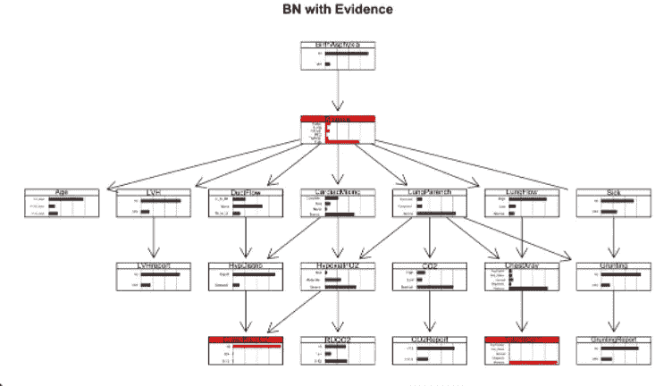
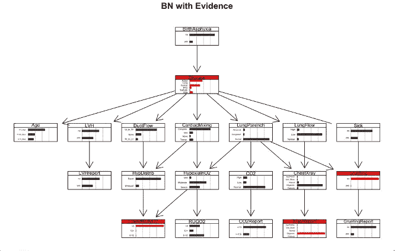
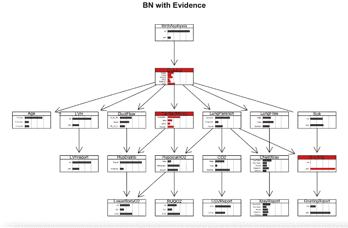
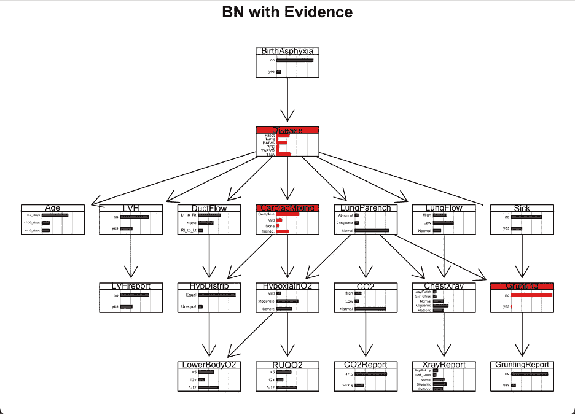

# R 中的贝叶斯网络

> 原文：<https://blog.devgenius.io/a-bayesian-network-in-r-4c2d2df89cc8?source=collection_archive---------6----------------------->

在这个分析中，我将基于医疗数据在 R 中构建一个贝叶斯网络，以根据婴儿的临床表现来识别六种可能疾病的可能性。

这一分析的想法和数据来自大卫·j·斯皮格尔哈特、a·菲利普·达维德、斯蒂芬·l·劳里岑、罗伯特·g·考威尔创建的儿童网络。这是一篇关于他们的工作和他们创建的贝叶斯网络结构的文章的引文:

《专家系统中的贝叶斯分析》，统计科学，统计学家。Sci。第八卷第三期，第 219-247 页(1993 年 8 月)

我将使用 Spiegelhalter 等人的模型作为建立网络结构的指导。然后，我将使用医疗数据进行参数化，可视化模型，并执行查询。我也将可视化基于证据的查询。

加载必要的包。

图书馆(bnlearn)

如果(！require(" bio manager "，quiet = TRUE))
install . packages(" bio manager ")

bio manager::install(" Rgraphviz ")

如果(！require(" bio manager "，quiet = TRUE))
install . packages(" bio manager ")

bio manager::install(" graph ")

【T2 库(Rgraphviz)】库(gRbase) 【T3 库(graph)

在 r 中构造 BN 结构。

#创建一个空图
dag < - empty.graph(nodes = c("出生窒息"、"疾病"、"年龄"、" LVH "、"导管流"、"心脏混合"、"肺泡"、"肺流"、"生病"、" HypDistrib "、"低氧血症 2 "、" CO2 "、" T5 "、"胸部 x 光"、"咕哝"、" LVHreport "、" LowerBodyO2 "、" RUQO2 "、" CO2 报告"、"x 光报告"、"咕哝报告"))

石英()
图(dag)

DagDisease
Dag<-set . arc(Dag，from = "Disease "，to = " Age)# Disease->出场时的年龄
dag < - set.arc(dag，from = "Disease "，to = " LVH)# Disease->LVH
Dag<-set . arc(Dag，from = "Disease "，to = " duct flow)# Disease->导管流量
dag < - set to = " LungParench ")# Disease->lung parenchema
Dag<-set . arc(Dag，from = "Disease "，to = " lung flow)# Disease->lung flow
Dag<-set . arc(Dag，from = "Disease "，to = " Sick)# Disease->Sick
Dag<-set . arc(Dag，from = "LVH "，to = " LVHreport)# LVH-【关键词 to = " HypDistrib ")#心脏混合- >缺氧分布
dag < - set.arc(dag，from = "CardiacMixing "，to = " hypoxiano 2 ")#心脏混合->O2 中缺氧
dag < - set.arc(dag，from = "LungParench "，to = " hypoxiano 2 ")#肺 parenchema->O2 中缺氧
dag < - set.arc(dag to = " chestx ray ")# lung parenchema->胸部 x 光
dag < - set.arc(dag，from = "LungParench "，to = " Grunting ")# lung parenchema->Grunting
Dag<-set . arc(Dag，from = "LungFlow "，to = " chestx ray)# lung flow->胸部 x 光
dag < - set.arc(dag from = " hypoxiano 2 "，to = " lowerbodyo 2 ")#低氧 in O2 - >下体 O2
dag < - set.arc(dag，from = " hypoxiano 2 "，to = " ruqo 2 ")#低氧 in O2 - >右上四通道 O2
dag < - set.arc(dag，from = "CO2 "，to = " CO2 report)# CO2->CO2 报告
Dag【t8

石英()
图(dag)

共同分配:

模型字符串(dag)

"[n1][N2 | n1][n3 | N2][n4 | N2][n5 | N2][n6 | N2][n7 | N2][n8 | N2][n9 | N2][n10 | n5:n6][n11 | n6:n7][n12 | n7][n13 | n7:n8][n14 | n7:n9][n15 | n4][n16 | n10:n11][n17 | n11][n18 | n12][n19 | n13][n20 | n14]"

"[出生窒息][疾病|出生窒息][年龄|疾病][LVH |疾病][管道流|疾病][肺循环|疾病][肺循环|疾病][病态|疾病][低血氧症|管道流:心脏混合][低氧血症:肺循环][二氧化碳|肺循环][胸部 x 射线|肺循环:肺循环][咕哝声|肺循环:有病][LVHreport | LVH][低血氧症|低氧血症 2][RUQO2

节点(dag)弧线(dag)

参数化网络。

子 dim(子)
head(子)

T2

quartz()
graphviz . chart(BN . mle，grid = TRUE，main = "BN ")

探索条件概率表；

比如 n1 的条件概率表是什么？
10 亿美元出生窒息

n16 的条件概率表是什么？
bn . mle＄lowerbodyo 2

对数据执行查询。

假设“下体 O2 < 5” and “X-ray report = Plethoric”, what can we deduce about the disease?

cpquery(bn.mle, event = (Disease == “Fallot”), evidence = ((LowerBodyO2 == “<5” & XrayReport == “Plethoric”))) #0.09681228

cpquery(bn.mle, event = (Disease == “Lung”), evidence = ((LowerBodyO2 == “<5” & XrayReport == “Plethoric”))) #0.02466368

cpquery(bn.mle, event = (Disease == “PAIVS”), evidence = ((LowerBodyO2 == “<5” & XrayReport == “Plethoric”))) #0.08390805

cpquery(bn.mle, event = (Disease == “PFC”), evidence = ((LowerBodyO2 == “<5” & XrayReport == “Plethoric”))) #0.01668521

cpquery(bn.mle, event = (Disease == “TAPVD”), evidence = ((LowerBodyO2 == “<5” & XrayReport == “Plethoric”))) #0.05727377

cpquery(bn.mle, event = (Disease == “TGA”), evidence = ((LowerBodyO2 == “<5” & XrayReport == “Plethoric”))) #0.7070707

library(gRain)
结< -编译(as.grain(bn.mle))

jedu

quartz()
graphviz.chart(bn.mle，grid = TRUE，main = " Original BN ")
graphviz . chart(as . BN . fit(jedu，including.evidence = TRUE)，grid = TRUE，
bar.col = c(出生窒息=“黑色”，疾病=“红色”，年龄=“黑色”，LVH =“黑色”，
DuctFlow =“黑色”，CardiacMixing =“黑色”，LungParench=“黑色”，
LungFlow=“黑色”，Sick=“黑色”
LungFlow="transparent "，Sick="transparent "，HypDistrib="transparent "，HypoxiaInO2="transparent "，
CO2="transparent "，ChestXray="transparent "，Grunting="transparent "，LVHreport="transparent "，
LowerBodyO2="red "，RUQO2="transparent "，CO2Report="transparent "，XrayReport="red "，
Grunting report = " transparent ")，main = "BN with Evidence ")

我们可以推断这种疾病很可能是 TGA 有 70%的可能性。

假设"下体 O2 < 5” and “X-ray report = Oligaemic” but the child is “not grunting”, what can we deduce about the disease?

cpquery(bn.mle，event = (Disease == "Fallot ")，evidence =((lowerbodyo 2 = = "<5 ")&(Xray report = = "少血")&(咕哝= = " no "))# 0.4626866

cpquery(bn.mle，event = (Disease == "Lung ")，evidence =((lowerbodyo 2 = = "<5”) & (XrayReport == “Oligaemic”) & (Grunting == “no”))) #00.01447527

cpquery(bn.mle, event = (Disease == “PAIVS”), evidence = ((LowerBodyO2 == “<5”) & (XrayReport == “Oligaemic”) & (Grunting == “no”))) #0.3218263

cpquery(bn.mle, event = (Disease == “PFC”), evidence = ((LowerBodyO2 == “<5”) & (XrayReport == “Oligaemic”) & (Grunting == “no”))) # 0.04091456

cpquery(bn.mle, event = (Disease == “TAPVD”), evidence = ((LowerBodyO2 == “<5”) & (XrayReport == “Oligaemic”) & (Grunting == “no”))) #0.009888752

cpquery(bn.mle, event = (Disease == “TGA”), evidence = ((LowerBodyO2 == “<5”) & (XrayReport == “Oligaemic”) & (Grunting == “no”))) #0.08656036

jedu

quartz()
graphviz . chart(BN . mle，grid = TRUE，main = " Original BN ")
graphviz . chart(as . BN . fit(jedu，including.evidence = TRUE)，grid = TRUE，
bar.col = c(出生窒息= "黑色"，Disease = "红色"，Age = "黑色"，LVH = "黑色"，
DuctFlow = "黑色"，CardiacMixing = "黑色"， LVH = "transparent "，
DuctFlow = "transparent "，CardiacMixing = "transparent "，LungParench="transparent "，
LungFlow="transparent "，Sick="transparent "，HypDistrib="transparent "，HypoxiaInO2 = " transparent "，
CO2="transparent "，ChestXray="transparent "，Grunting="red "，LVHreport="transparent "，
LowerBodyO2="red "，RUQO2="transparent "，CO2Report="transparent "，Xray report = " transparent "

我们可以推断该病最有可能是法洛氏病，概率为 46%；或者，有 32%的概率是 PAIVS。

比伊宝宝“咕哝”着“轻度心脏混合”。婴儿汉克是“不哼声”与“完全心脏混合”。我们能从这些婴儿身上了解到什么？

#Bea
cpquery(bn.mle，event = (Disease == "Fallot ")，evidence =((咕哝= = " yes ")&(CardiacMixing = = " Mild "))# 0.1809291

cpquery(bn.mle，event = (Disease == "Lung ")，evidence =((咕哝= = " yes ")&(CardiacMixing = = " Mild "))# 0.4311224

cpquery(bn.mle，event = (Disease == "PAIVS ")，evidence =((呼噜声== "yes") & (CardiacMixing == "轻度"))#0.01578947

cpquery(bn.mle，event = (Disease == "PFC ")，evidence =((咕哝= = " yes ")&(cardiac mixing = = " Mild "))# 0.1182796

cpquery(bn.mle，event = (Disease == "TAPVD ")，evidence =((呼噜声== "yes") & (CardiacMixing == "轻度"))#0.0234375

cpquery(bn.mle，event = (Disease == "TGA ")，evidence =((呼噜声== "yes") & (CardiacMixing == "轻度"))#0.1741573

jedu

quartz()
graphviz.chart(bn.mle，grid = TRUE，main = " Original BN ")
graphviz . chart(as . BN . fit(jedu，including.evidence = TRUE)，grid = TRUE，
bar.col = c(出生窒息=“黑色”，疾病=“红色”，年龄=“黑色”，LVH =“黑色”，
DuctFlow =“黑色”，CardiacMixing =“红色”，LungParench=“黑色”，
LungFlow=“黑色”，Sick=“黑色”，HypDistrib
LungFlow="transparent "，Sick="transparent "，HypDistrib="transparent "，HypoxiaInO2="transparent "，
CO2="transparent "，ChestXray="transparent "，Grunting="red "，LVHreport="transparent "，
LowerBodyO2="transparent "，RUQO2="transparent "，CO2Report="transparent "，XrayReport="transparent "，
Grunting report = " transparent ")，main = "BN with Evidence ")

Bea 最有可能患的疾病是肺病，概率为 43%。

#Hank
cpquery(bn.mle，event = (Disease == "Fallot ")，evidence =((咕哝= = " no ")&(CardiacMixing = = " Complete "))# 0.4435653

cpquery(bn.mle，event = (Disease == "Lung ")，evidence =((Grunting = = " no ")&(cardiac mixing = = " Complete "))# 0.001911132

cpquery(bn.mle，event = (Disease == "PAIVS ")，evidence =((Grunting = = " no ")&(cardiac mixing = = " Complete)))# 0.4176822

cpquery(bn.mle，event = (Disease == "PFC ")，evidence =((Grunting = = " no ")&(cardiac mixing = = " Complete)))# 0.01378327

cpquery(bn.mle，event = (Disease == "TAPVD ")，evidence =((咕哝= = " no ")&(cardiac mixing = = " Complete "))# 0.06555819

cpquery(bn.mle，event = (Disease == "TGA ")，evidence =((Grunting = = " no ")&(cardiac mixing = = " Complete)))# 0.05988727

jedu

quartz()
graphviz . chart(BN . mle，grid = TRUE，main = " Original BN ")
graphviz . chart(as . BN . fit(jedu，including.evidence = TRUE)，grid = TRUE，
bar.col = c(出生窒息=“黑色”，疾病=“红色”，年龄=“黑色”，LVH =“黑色”，
DuctFlow =“黑色”，CardiacMixing =“红色”，LungParench=“黑色”，
LungFlow=“黑色”，Sick=“黑色”，HypDistrib
LungFlow="transparent "，Sick="transparent "，HypDistrib="transparent "，HypoxiaInO2="transparent "，
CO2="transparent "，ChestXray="transparent "，Grunting="red "，LVHreport="transparent "，
LowerBodyO2="transparent "，RUQO2="transparent "，CO2Report="transparent "，XrayReport="transparent "，
Grunting report = " transparent ")，main = "BN with Evidence ")

汉克最有可能患的疾病是法洛氏病，概率为 44%。

总之，这是在 r 中构建贝叶斯网络的一个例子。我从构建网络的结构开始，然后展示了如何使用数据进行参数化。然后进行可视化和查询。