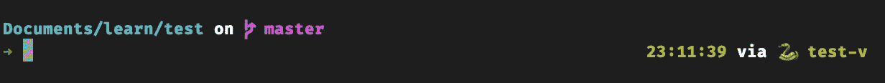
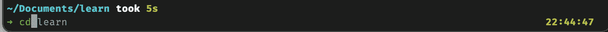
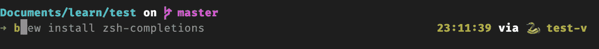
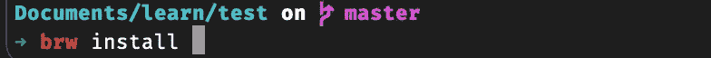
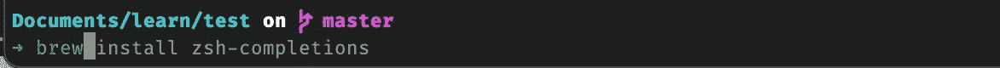

# 为你漂亮的 M1 Macbook 安装一个漂亮的 python 和终端

> 原文：<https://blog.devgenius.io/a-beautiful-python-and-terminal-setup-for-your-beautiful-m1-macbook-58486c95df4?source=collection_archive---------0----------------------->

马丁·卡特勒在 [Unsplash](https://unsplash.com?utm_source=medium&utm_medium=referral) 上拍摄的照片

现在你已经有了一台漂亮且速度极快的 M1 MacBook，让我们来确保它的设置和系统本身一样赏心悦目。这篇文章也将帮助你解决在一个相对新的 M1 芯片集上设置开发环境的复杂性。

像往常一样，第一步是安装`brew`。去 [brew.sh](http://brew.sh/) 看看你是否也能捐。就是这么俏皮优雅。一定要记得把啤酒放在你的路上。这是一些人容易忘记的一步。

一旦你安装了自制软件，继续安装`pyenv`。Pyenv 是管理多个版本 python 的最佳方式，有助于简化开发过程。 [Real Python](https://realpython.com/intro-to-pyenv/#:~:text=Install%20the%20latest%20development%20version,versions%20and%20virtual%20environments%20automatically) 有一篇关于这个主题的精彩文章，我鼓励你仔细阅读并跟进。不要忘记在`~/.zshrc`的启动脚本中添加`pyenv`。是的，新的操作系统都把`zsh`作为默认外壳。耶！以下是我需要添加的说明，但请检查您的`pyenv` install 命令的输出，它应该会给出确切的详细信息，或者只需键入`pyenv init`即可找到您的相关版本的详细信息。

在这一点上，我强烈建议您尝试一下`pyenv`并熟悉它。一旦完成，创建一个虚拟环境，这应该足以让你开始你的工作。我总是有一个困惑，如果在本地目录中我可以设置`pyenv local`，那么为什么需要`virtualenv`。是的，我知道利弊，但我总是思考和着迷于此。关于虚拟环境需要注意的重要一点是，虽然真正的 python 文章和官方文档说它应该用`pyenv`自动安装，但我不得不手动安装。下面的代码片段向您展示了安装步骤之后我得到的错误。看起来在`pyenv`确实有一个错误，并且有一张[票](https://github.com/pyenv/pyenv/issues/1340)也是一样的。

这可能需要一些时间，尤其是如果您的 brew 已有一段时间没有更新；是的，我们可以直接安装软件包而不需要整个更新，但这从来都不是一个好主意。如果你想这样做，`HOMEBREW_NO_AUTO_UPDATE=1 brew install <formula>`是这样做的方法，但这通常是不推荐的，因为有各种安全补丁，你可能会错过。

现在我们已经安装了虚拟环境，我们可以创建并激活一个。

是的，我正在努力提高我的离散优化技能:)。

在这一点上，我非常高兴，因为 python 已经正确设置了轻松处理多个版本和虚拟环境的能力，并且终端向我显示了我希望在提示符中看到的虚拟环境名称。所以如果你愿意，你可以停在这里。然而，在我早期的一个组织中，我真的很认真，花了一天的时间定制提示，包括花哨的主题、github 分支标识符、时间、venv python 版本以及下一步要做的事情。让我们继续。第一步，安装`oh-my-zsh`。

> "[哦，我的 Zsh](https://github.com/ohmyzsh/ohmyzsh)不会让你成为 10 倍的开发者…但你可能会觉得自己是一个开发者。",

安装非常简单。

现在以前不会这样了，但是现在我所有的设置都从`./zshrc`转移到了一个新创建的文件`./zshrc_pre_oh_my_zsh`。很明显，`pyenv`和其他东西现在都不起作用了。有一段时间我对发生的事情感到困惑，然后看到了这个文件。我把这里的内容复制到顶部的`./zshrc`，它又开始工作了。我想既然文件名是这样的，它就应该有在加载`oh-my-zsh`之前运行的所有命令，但事实并非如此，我必须将内容复制并粘贴到`/.zshrc`文件中。你生活，你学习。此外，在使用 zsh 之前，我更喜欢安装如此多样和令人惊叹的[电力线字体](https://github.com/powerline/fonts.git)。

完成后，验证字体是否已安装。打开“终端偏好设置”,前往“描述文件”,然后选择“字体”,然后选择“更改字体”。您应该会看到安装了许多电力线字体。我喜欢 Fira 代码字体，你可以从他们的 Github 下载。请务必遵循那里的说明，并为您最喜欢的编辑器启用它，对我来说它仍然是`sublime-text`。我已经试过了`pycharm`和`vscode`，虽然它们非常坚固和强大，但我敢说甚至更好，崇高在我心中占有特殊的位置。我用这个编辑器为我的创业公司、我赢得的各种黑客马拉松和我批准的采访编写了所有代码。顺便说一下，崇高文本 4 本身就很坚固。#升华结束

别再说那些粉丝了。有一次我设置了崇高文本的字体，我注意到了一个奇怪的问题——光标的大小对我来说太大了。一个简单的谷歌搜索帮我解决了这个问题。我们只需要编辑 Sublime 的配置。

让我们回到设置终端。安装字体后，选择一个主题。我没有最喜欢的主题。我之前用过`powerline10k`，但是想试试别的，发现`spaceship`看起来真的很酷。在 [readme](https://github.com/spaceship-prompt/spaceship-prompt) 文件中有非常清楚的说明，所以请随意尝试一下。现在，我的终端看起来如下，是的，我从离散优化转移到强化 CI/CD 技能，因此终端中有 CI。这么多东西要学，时间却这么少。当你需要的时候，TVA 在哪里？

还不错！我们能改善这一点吗？

看起来很酷，传达了很多信息。然而，我更喜欢改变这一点，这样做很容易也很有趣。经过调整后，这是我的提示——主要是在您的`./zshrc`文件中为`spaceship`启用右提示。

现在我们正在谈话！

一旦完成，我就安装一些插件，比如`zsh-autosuggestions, zsh-completions, zsh-syntaxhighlight and git`。我不是一个超级用户，我觉得我肯定可以在这里学到更多，但这将是另一天的主题和任务。不过有一点需要注意——当你试图安装`zsh-completions`时，你可能会得到一个关于权限的错误，解决这个问题的方法非常简单。

如果你有时间，请通读这篇精彩的 [SO](https://stackoverflow.com/questions/13762280/zsh-compinit-insecure-directories) 帖子，它详细解释了这一点。

另一个问题是关于`zsh-autosuggestions`。虽然官方文件确实说我们可以为此使用`brew install`，但它对我不起作用，我不得不手动克隆回购。

虽然插件的顺序对我来说并不重要，但对一些用户来说，只有在`./zsrc`文件中的插件末尾有了`autosuggestions`之后，它才起作用。检查此 [Github 螺纹](https://github.com/zsh-users/zsh-autosuggestions/issues/416)以供参考。

最后一切都正常了。正如你在下面的截图中看到的，我刚刚输入了`cd`，而`zsh`正在向我建议目录。不错！

自动建议发挥它的魔力

来自[正式文件](https://github.com/zsh-users/zsh-autosuggestions)

> *如果在光标位于缓冲区末端时按下→键(前向字符部件)或 End(行尾部件),它将接受建议，用建议替换命令行缓冲区的内容。如果您调用 forward-word 小部件，它将部分接受建议，直到光标移动到的位置。*

这就是现在一切的样子。你可以看到自动建议非常有效。

一切就绪的终端

通过`zsh-syntaxhighlight`语法高亮显示是另一个有用的特性。如果你在按下回车键之前输入了错误的命令，它会高亮显示。厉害！

突出显示时出错

很好地展示了命令的正确性

现在，在我阅读[的任何地方，我都发现我们需要在文件的末尾特别添加`source`语法高亮(`/.zshrc`)，但我不需要这样做，而且对我很有效。记住这一点，以防你遇到困难。](https://github.com/zsh-users/zsh-syntax-highlighting/blob/master/INSTALL.md)

最后一次通电是安装`z`。不用去`cd ../../../workspace`，你只要做`z workspace`，瞧，你就在那个文件夹里了。z 在一个名为`~/.z`的文件中记录了你 cd 进入的所有文件夹，当你访问一个文件夹后，你可以通过`z folder name`直接进入那个文件夹。要了解更多，请前往他们的[回购](https://github.com/rupa/z)——他们有许多选项和配置可用。

仅此而已。尝试不同的主题，让我知道什么最适合你。有一件事我还没有做到——在右边的提示符下，在虚拟环境名称旁边显示 python 的版本。我尝试了许多事情，虽然[官方文档](https://github.com/spaceship-prompt/spaceship-prompt/issues/410)确实提到如果全球 python 版本和虚拟环境 python 版本不同，他们会在环境名称旁边显示 python 版本，但我无法让它工作。你能帮忙吗？拜托了。

如果你想看看我的`/.zshrc`，你可以在这里找到。