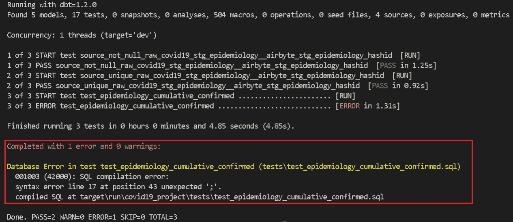

# dbt 测试初学者指南

> 原文：<https://blog.devgenius.io/a-beginner-guide-to-dbt-tests-31ddc4178170?source=collection_archive---------2----------------------->

## 为您的数据转换创建测试用例


[Firmbee.com](https://unsplash.com/es/@firmbee?utm_source=medium&utm_medium=referral)在 [Unsplash](https://unsplash.com?utm_source=medium&utm_medium=referral) 上拍照

**简介**

当使用数据构建工具( [dbt)](https://www.getdbt.com/) 运行您的 **ELT 管道**时，最好能够在早期执行简单的验证，一个很好的方法就是使用 dbt 测试。这是 dbt 项目中受支持的特性，它允许您为您的转换创建测试用例。这种测试允许您尝试在早期捕捉潜在的问题，这样可以节省您尝试在下游解决问题的努力。在本指南中，我将展示如何使用 dbt 测试来验证您的转换。

我将测试一个现有的 ELT 管道的 dbt 项目的公开可用的[谷歌大查询公共数据集项目](https://console.cloud.google.com/marketplace/product/bigquery-public-datasets/covid19-public-data-program?project=resonant-matter-297100)新冠肺炎数据。在本指南中，我将介绍在转换上创建和运行 dbt 测试的一些主要方面。我涉及的主题包括:

*   dbt 中的测试概述
*   dbt 核心内置测试
*   dbt 自定义测试


作者图片

**设置**

在这个 ELT 管道中，已经使用 [Airbyte](https://airbyte.com/) 完成了**提取**和**加载**步骤，还增加了一个**规范化**步骤，将结果 json blob 字段转换为列。这意味着我可以使用 dbt 直接进入**转换**步骤，我在前面添加了一些验证测试。这个项目的 dbt repo 在这里是[这里是](https://github.com/BayoAdejare/airbyte_dbt_covid19)，在整个指南中，我将使用 dbt Core 版本 1.2.0 来开发测试，dbt 项目连接到一个[雪花](https://www.snowflake.com/)数据仓库。

**概述**

一般来说，有两种类型的测试可以实现，第一种是**内置测试**，第二种是**定制测试。**内置测试是 dbt Core 自带的预定义测试，通常被定义为 model 文件夹的 yaml 模式文件中的属性，这就是为什么它们通常被称为模式测试。自定义或定制测试是在 tests 文件夹中编写的，这些一次性断言是 SQL SELECT 查询，根据返回值验证数据。除了这两个测试之外，您还可以从 dbt 包中实现测试，比如 [dbt-expectations](https://hub.getdbt.com/calogica/dbt_expectations/latest/) 和 [dbt-utils](https://hub.getdbt.com/dbt-labs/dbt_utils/latest/) 。

> 当编写 dbt 测试时，根据数据和需求以有意义的定性方式定义它们是很重要的，因为您从测试中获得的价值只和您定义的一样好。

在本指南中，我仅使用内置测试和一个示例定制测试来说明开始测试您的 dbt 项目是多么简单。

**内置测试**

在 dbt 项目的 models 文件夹 yaml 模式文件中，我使用 dbt 对资源(即数据源和模型)的内置测试来定义属性。dbt 可以运行四种不同类型的测试:

1.  **唯一性:**测试列是否具有唯一值。
2.  **Not null:** 测试列没有空值。
3.  **参照完整性:**测试列值是否与父参照表存在关系。
4.  **接受值:**测试该列仅包含指定的已定义值。

在我的项目中，我定义了一个对数据源的惟一性和各自 hashid 列的 not null 的测试。


定义唯一和非空测试(按作者)

为了测试源表上的特定测试，我使用以下命令:

`dbt test --select source:raw_covid19.stg_epidemiology`

使用`dbt test`命令，我可以执行所有的测试用例并得到一个结果。dbt 将运行测试并显示结果，默认结果可以是`PASS`、`WARN`、`ERROR`或`SKIP`，下面是具体数据源的测试运行结果:


通过测试结果:不为空，唯一(按作者)

如果测试运行导致一个错误，dbt 将输出错误细节，我通过运行一个包含以下错误的测试来说明这一点:



带有消息的错误测试结果(由作者提供)

对于参照完整性，也称为关系测试，我实现了一个模型测试，检查`epidemiology`模型中的每个`location_key`对应于`index`表中的一个`location_key`。


定义参照完整性测试(按作者)

对于可接受值测试，我测试了`location_key`只有预定义范围内的指定值。请注意，我还将严重性级别配置为`WARN`，这意味着它将显示一个警告，而不是一个错误异常，并提供更多详细信息。


定义可接受值测试(作者)

在上面的例子中，对于定义的可接受值，将测试任何与国家名称不匹配的记录，测试将在测试运行期间给出一个`WARN`，如下所示 244 条记录不匹配可接受值测试标准:


用消息警告测试结果(按作者)

**自定义测试**

自定义测试在您的 dbt 项目的`tests`文件夹中定义，它们是使用 dbt 的 SQL SELECT 语句和额外的 Jinja 模板编写的测试断言。定制测试有利于测试业务转换，并确保定性数据，例如，下面的定制测试示例:

```
-- Test assertion for cumulative confirmed cases greater than 0.select location_key, date, sum(cumulative_confirmed) as total_cumulative_confirmedfrom 
    {{ source('raw_covid19', 'stg_epidemiology' )}}group by location_key, datehaving not(total_cumulative_confirmed >= 0)
```

在下面的 dbt 沿袭图中，定义的测试包含在它的依赖项中，当执行不带选项的测试或运行命令时，还会执行自定义测试。


dbt 谱系图示例(按作者)

**结论**

这就结束了 dbt 测试的初学者指南，当然 dbt 测试还可以做更多的事情，例如创建通用宏测试、快照测试和实现测试包。在 dbt 中使用内置或定制测试简单明了，它有助于提高可观察性，并且应该成为任何 dbt 项目中的标准。总的来说，测试是一个很好的实践，而且越早包含在工作流程中越好。编写高质量的测试将有助于您的数据更加可靠，并增加可观察性。更不用说，您可以更早地发现数据质量问题，防止报告不准确。因此，使用 dbt，在早期开发测试，并随着时间的推移更新它们。

**参考文献**

*   [测试 dbt 文件](https://docs.getdbt.com/docs/building-a-dbt-project/tests)
*   [测试的 dbt 严重级别配置](https://docs.getdbt.com/reference/resource-configs/severity)
*   [数据测试入门](https://www.getdbt.com/blog/data-testing-why-you-need-it-and-how-to-get-started/)
*   [气生体转化与规格化教程](https://docs.airbyte.com/operator-guides/transformation-and-normalization/transformations-with-dbt)
*   [dbt 测试选项的 datacove 概述](https://datacoves.com/post/an-overview-of-testing-options-in-dbt-data-build-tool)

***感谢*** *的阅读！如果你想和我联系，请随时通过 adebayo.adejare@gmail.com 联系我或者我的* [*LinkedIn 个人资料*](https://www.linkedin.com/in/adebayoadejare/) *。也可以在我的*[*Github*](https://github.com/BayoAdejare)*中查看部分代码。*