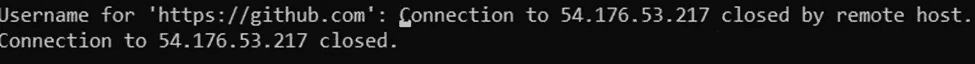

# 在 GitHub 上派生存储库的初学者指南。

> 原文：<https://blog.devgenius.io/a-beginners-guide-to-forking-a-repository-on-github-f9b545d741bd?source=collection_archive---------10----------------------->

> 无论你是经验丰富还是缺乏经验的技术人员，你都有可能遇到过术语 Git 和 GitHub。你怎么能不知道呢？考虑到 Git 和 GitHub 都是许多开源项目的开发工作流程中必不可少的部分。虽然将这两个词互换可能很有吸引力，但这两个词有天壤之别。那么，Git 和 GitHub 是什么？

***版本控制& Git。***

为了理解什么是 Git，我们必须首先检查版本控制。简单地说，版本控制(也称为源代码控制)只是一种记录手段。它允许随着时间的推移跟踪对一个或多个文件所做的更改。因此，Git 是控制软件的众多版本之一。

**协作& GitHub。**

另一方面，GitHub 是一个基于云的服务，允许你托管和管理你的文件或源代码。GitHub 还允许项目合作，因此通常被称为技术人员的社交网络。

**使用基于 CentO7 的服务器，本教程的目标是描绘出一幅易于理解的画面:“Git 安装&配置、在 GitHub 上派生存储库、存储库 Clobne、必要的更改和贡献、提交更改的 push 然后 pull 请求。”**

***先决条件。***

CentOS7 服务器。

命令行终端。

访问一个拥有 sudo(超级用户 do)权限的帐户，换句话说就是超级用户。

文本编辑器，如 VIM

GitHub 帐户

***第一步:Git 安装。***

一旦启动了终端并连接到服务器，就可以通过输入以下命令来安装 Git:*sudo yum install Git*。

系统会提示您输入密码。键入密码，然后按回车键。

一旦 Git 安装完成，使用 *mkdir* 命令*创建一个新目录。*创建目录后，使用 *cd name of directory/* 命令进入该目录。使用 *ls -l* 命令列出已创建目录的内容。然后使用 *git init* 命令初始化创建的目录。(视觉参考见下图)。

现在进行第二步。

***第二步:Git 配置。***

为了记录您的 Git 提交，您需要设置您的身份。需要两项信息，即您的姓名和电子邮件地址。

要设置您的用户名，请输入以下命令:*git config-global user . Name " Your Name "*

接下来，要设置您的电子邮件，请输入以下命令: *git config — global user.email“您的电子邮件”*

将此标记为完成，让我们继续下一步。

***第三步:分叉知识库。***

什么是分叉？简单地说，分叉就是将存储库复制到您自己的 GitHub 中的行为。它允许您在不影响原始存储库的情况下进行更改。在这一步中，您需要访问您想要派生的存储库的页面。要创建一个 fork，只需点击 GitHub 上存储库页面右上角的“fork”按钮。(叉子图标见下图)。

这个资源库的副本现在已经添加到您的 GitHub 帐户中。现在我们将需要克隆存储库(这在下面的步骤中会派上用场)。要克隆存储库，请单击绿色的“Code”按钮，并复制显示的 URL。(见下图)。

***第四步:储存库克隆。***

clone 命令从 GitHub 上的远程分支创建一个本地 Git 存储库。使用从 GitHub 复制的 URL(见步骤 3 或上图)，输入以下命令:*git clone*[*https://github.com/whateverurlcopied/*](https://github.com/whateverurlcopied/)*。*

这个存储库现在被克隆到我们的本地机器上。

***第五步:添加你的贡献。***

在这一步中，我们将使用文本文件编辑器“vim”来创建一个文件，我们将在其中对进行必要的更改。输入以下命令在 vim 中创建文件: *vim <文件名>*

更改完成后，通过输入以下命令将文件添加到暂存区域:*git add<filename>*

***第六步:提交文件。***

vim 中的提交是什么？简单地说，提交相当于在 Windows 中单击保存。“commit”命令用于将您的更改保存到本地存储库中。下面将提交对文件所做的修改并添加一个注释:g*it commit-a-m " Comment "*

谨防错别字。

让我们再试一次。

瞧啊。

***第七步:生成个人访问令牌。***

老实说，我们生活在一个必须记住许多不同的登录和密码的世界里。对于 GitHub 个人访问令牌，这是需要记住的最后一个密码。拥有一个 ***PAT*** (让我们确保跟上缩写)将在下面的步骤中派上用场。为了生成一个 ***PAT*** ，请遵循以下步骤

单击设置->开发人员设置->个人访问令牌

单击生成新令牌

插入注释以描述令牌的用途

选择访问权限:

单击生成令牌。复制您的令牌。

一旦我们的令牌被生成，项目和变更就可以被推送了。

***第八步:推&拉。***

git remote 命令允许您创建、查看和删除到其他存储库的连接。为了建立到 GitHub repo 的远程连接，输入以下命令: *git push* *remote -v.*

现在通过输入以下命令将文件推回 GitHub:*git push-u origin*

很遗憾，我的连接超时了。这绝对不是计划好的

进入“ *git push -u origin”后，*会提示您输入您的 GitHub 用户名和 ***PAT*** (个人访问令牌)作为您的密码。输入用户名和 PAT 后，进入 GitHub 仪表板，点击“拉请求”选项卡下的绿色“新拉请求”。(见下图)。

应该会出现一个消息框，其中可以列出您对项目的贡献。在消息框中列出您的贡献后，单击“创建拉动式请求”完成。

我们正在直播！！！是否将所做的更改添加到主分支机构完全由负责审查的一方决定。如果你已经做到了这一步，并且遵循了上面的步骤，那么你已经成功地在 GitHub 上创建了一个资源库。

直到下一次，

你友好的邻居云开发工程师。