# Python 索引和切片初学者指南

> 原文：<https://blog.devgenius.io/a-beginners-guide-to-indexing-and-slicing-in-python-feb61cd37203?source=collection_archive---------3----------------------->

## Python 列表和字符串的索引工作方式，以及对它们进行切片的技巧


照片由[本](https://www.pexels.com/@benstudio?utm_content=attributionCopyText&utm_medium=referral&utm_source=pexels)从[像素](https://www.pexels.com/photo/person-slicing-cucumber-vegetable-1441075/?utm_content=attributionCopyText&utm_medium=referral&utm_source=pexels)拍摄

# 索引

考虑下面的 Python 列表:

```
lst = [1, 2, 3, 4, 5, 6, 7, 8, 9]
```

我们可以用`print(lst)`打印整个列表。

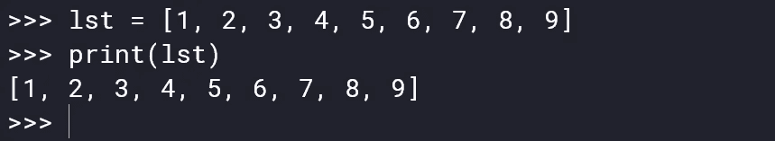

但是如果我们必须对列表中的每个元素分别进行一些操作，那么我们必须使用一个循环来访问这些元素。

```
*for* i *in* lst:
    print(i)
```

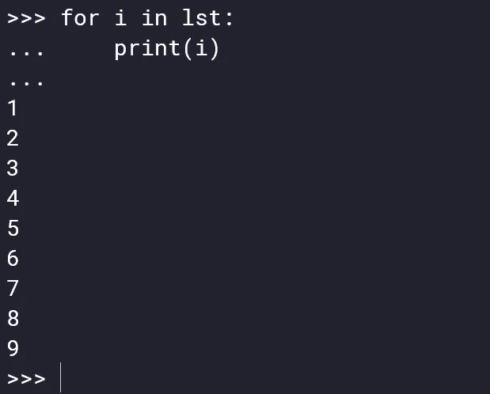

我们也可以用另一种方法来做。通过访问每个元素的索引。

```
*for* i *in* range(0, len(lst)):
    print(lst[i])
```

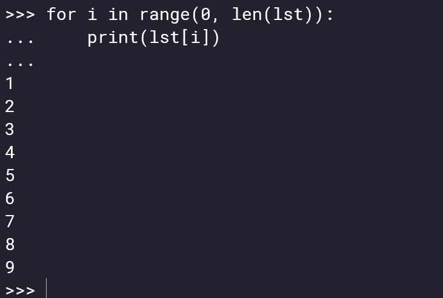

我们可以这样做，因为列表的每个元素都有一个索引。有了这个索引，我们就可以访问元素了。索引从 0 开始，从左到右递增 1。

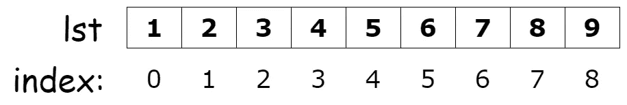

我们可以通过索引来访问列表中的元素。这里有`lst[0] = 1`、 `lst[1] = 2`、 `lst[2] = 3`、……和`lst[8] = 9`。

这是列表的正索引。负索引也是可能的。对于负索引，我们从列表的末尾开始。负索引从-1 开始，从右到左递减 1。

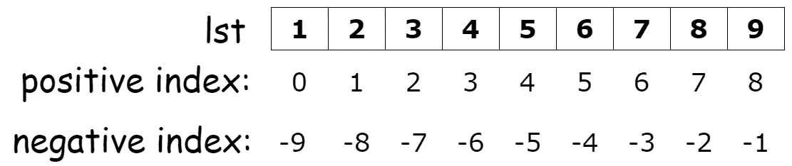

所以`lst[-1]`会给我们列表的最后一个元素。

字符串也是如此。字符串`“Hello world”`将具有如下索引:

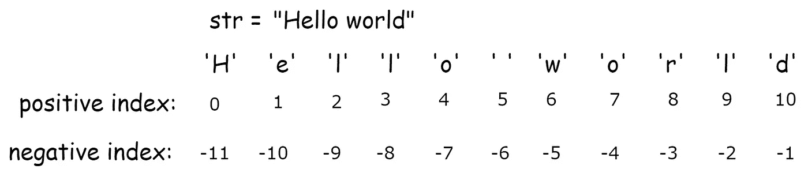

我们可以使用相关的索引来访问字符串中的每个字符，就像我们访问列表一样。`str[0] = ‘H’`、`str[1] = ‘e’`、`str[2] = ‘l’`等等。

# 切片列表

分割列表意味着提取列表的一部分。利用索引的思想，我们可以提取列表的一部分。切片是这样工作的:


>>假设我们想要列表中的前 5 个元素`lst`。我们只需要指定索引的开始和结束值。

```
lst[0:5]
```

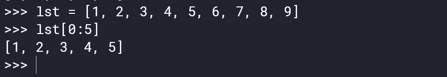

*注意:*对于结束索引，我们需要增加一个。在上面的例子中，我们从索引 0 到索引 4 提取元素。但是我们把`lst[0:5]`。因为像`[range()](https://docs.python.org/3/library/functions.html)`这里 Python 也少算一个。

>>我们可以混合正负指数。假设我们想从第二个元素提取到第三个元素。第二个元素的正索引是 1，倒数第三个元素的负索引是-3。但是正如我们之前讨论的，我们需要为结束索引增加一个额外的值。所以我们可以这样提取它们:

```
lst[1:-2]
```

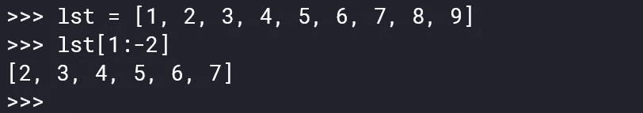

>>我们也可以指定步骤。假设我们只想从列表中提取奇数值。那么我们每次都需要跳过一个元素。

```
lst[0:9:2]
```

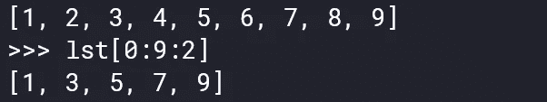

最后一个参数决定了要走多少步。默认情况下，它是 1。如果我们输入 1，它将简单地打印所有的元素。2 意味着我们想要得到每第二个元素。

>>如果我们想从特定的位置提取元素直到结束，我们可以简单地将第二个参数留空。假设我们想从第三个元素到列表的末尾。为此，我们可以将第二个参数留空。

```
lst[2:]
```

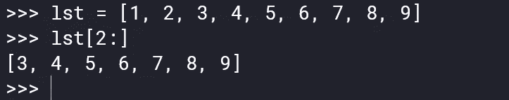

相反的情况也是如此。假设我们想从开头提取到倒数第二个元素。我们可以将第一个参数留空。

```
lst[:-1]
or
lst[:8]
```

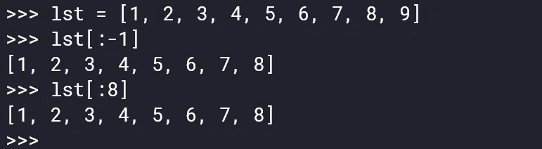

>>我们也可以按相反的顺序进行。在这种情况下，步长将是负的。

```
lst[-1::-1]
```

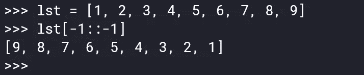

这里的最后一个-1 表示取所有元素，但顺序相反。我们也可以每隔一个元素。

```
lst[-1::-2]
```

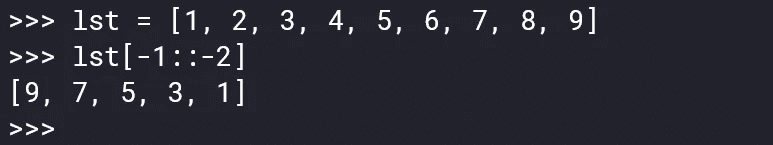

为了颠倒整个列表，我们甚至不需要放第一个-1。我们只需要指定我们想要采取相反的步骤。

```
lst[::-1]
```

# 分割字符串

我们也可以在一个字符串中执行上述所有切片操作。让我们考虑一下我们的`“Hello world”`字符串。

```
str = “Hello world”
```

假设我们只想从中提取“Hello”。现在对我们来说应该很容易了。

```
lst[0:5]
or 
lst[:5]
```

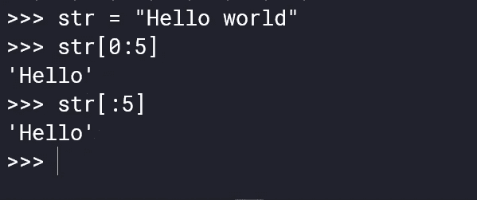

我们只从中提取`“world”`怎么样。

```
lst[6:]
```

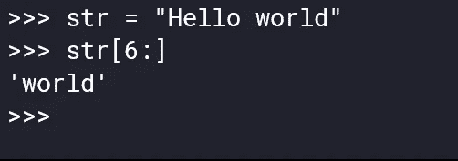

我们也可以反转字符串，就像我们反转列表一样。

```
str[::-1]
```

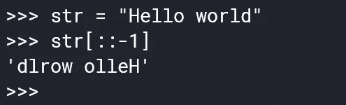

索引和切片是 Python 中一个基本而强大的概念。在本文中，我尽可能简单地解释了索引和切片。希望对你有帮助。感谢阅读。