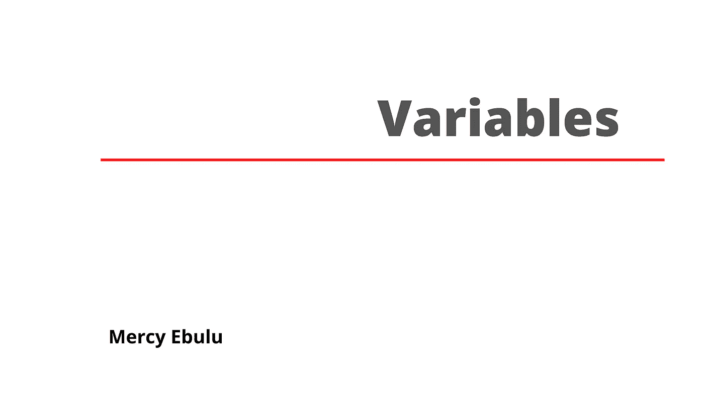

# JavaScript 变量初学者指南。

> 原文：<https://blog.devgenius.io/a-beginners-guide-to-javascript-variables-93852b554f37?source=collection_archive---------13----------------------->



当编写 JavaScript 代码时，变量是我们经常使用的东西的一部分。这是我们经常使用的东西。本文将讨论变量的功能以及如何在 JavaScript 中使用它们。

**先决条件:**你应该对 HTML 和 CSS 有一个基本的了解。

**什么是变量？**

变量更像是一个存储值或不同数据类型的容器。考虑一个里面塞满了多本书的包。这些书可以包括化学、数学或任何其他学科的教科书，都方便地装在一个袋子里。这就是变量的运算。让我们继续想象一个里面有书的包，现在想象房间里有五个包。这些包都有不同的颜色(黑色、绿色、红色、黄色和蓝色)，每个包里都有各种各样的书和玩具。让我们检查一下每个袋子里装的是什么。

黑色的书包里有化学、数学和物理的课本，绿色的书包里有一个玩具，红色的书包里有两本课本和两个玩具，黄色的书包里什么也没有，蓝色的书包里装满了各种各样的玩具。回到变量是什么的问题？我们可以说它是各种数据类型的容器，比如数字、字符串、对象、数组、布尔值和其他可能在 JavaScript 中找到的数据类型。

在 JavaScript 中使用变量之前，您应该了解以下准则。

1.  变量必须有唯一的名称，并且
2.  变量必须在使用前声明。

**如何在 JavaScript 中声明变量。**


来源:[https://spill code . hash node . dev/let-const-var-how-they-different-CK 1 TSD DOX 008 qaqs 1 xw 071 umu](https://spillcode.hashnode.dev/let-const-var-how-they-differ-ck1tsddox008qaqs1xw071umu)

在 JavaScript 中有三种声明变量的方法。其中包括:

使用 var

使用 let 和

使用常量

早在 2015 年 ECMA Script6 (ES6)出现之前，`var`关键字对于每一个 JavaScript 开发者来说都是用于变量声明的。ES6/modern JavaScript 的引入为编写 JavaScript 的开发人员带来了很多变化和额外的好处。`let`和`const`关键字是作为在 JavaScript 中声明变量的替代方法引入的。

让我们看看可以在 JavaScript 中使用的多种类型的变量声明。我们将研究它们中的每一个，它们是如何工作的，以及何时应该应用它们。

**VAR**

```
var FirstName = 'Mercy';
```

如前所述，在引入 ES6 之前，用 JavaScript 编写代码的开发人员通常使用关键字`var`或者根本不使用关键字来声明变量。在我们上面的声明中，使用关键字`var`我们声明了一个名为`firstName`的变量，我们也给它赋值`mercy`，这是一个字符串。换句话说，我们可以说`firstName`将值`Mercy`存储在其中。因此，如果我们`console.log(firstName);`，它将在控制台中显示值`Mercy`。同样，如果我们`alert(firstName)`它会在网页`Mercy`上弹出一个窗口。

**让**

```
let x = 10;
let y = 3;
let z = x + y;
```

从上面的例子中，我们可以看到这里有几个变量。我们给变量`x`赋值`10`，给变量`y` 赋值`3`。我们还创建了另一个名为`z`的变量，并将`x + y`赋给它。所以当我们`console.log(z)`时，它会为我们返回值`13`。

**常量**

使用上面的例子使用`const`来声明变量，让我们看看这是如何工作的。

```
const x = 10;
const y = 3;
const z = x + y;
```

**变量的命名约定。**

JavaScript 中命名变量的规则包括:

1.  变量可以包含字母、数字、下划线(_)和美元符号($)。
2.  变量名以字母开头。即使您可以在变量名中包含上述字符。作为初学者，你应该用一个字母作为变量名的开头。
3.  也可以用下划线(_)或美元符号($)作为变量名的开头。注意,$通常用于引用 DOM 元素。
4.  JavaScript 变量名区分大小写，不像 HTML 标签那样区分大小写。在 JavaScript 中，我们经常使用或者强烈建议使用 camelCase 结构来命名变量。


来源:[https://en.wikipedia.org/wiki/Camel_case](https://en.wikipedia.org/wiki/Camel_case)

camelCase 印刷约定最适用于名称由两个单词组合而成的变量。例如，如果我们想创建一个变量来存储您的名字。使用 camelCase 结构，我们的变量名将是`firstName`。

```
let firstName = mercy;
//This will assign  mercy to the variable name firstName.
```

**结论**

我已经花了很长时间学习 JavaScript 中的变量以及它们是如何工作的。这是一篇初学者友好的文章，因为这篇文章向你展示了在 JavaScript 中声明变量的不同方法。在接下来的文章中，我们将讨论不同的关键词`var`、`let`和`const`，以及何时适合使用它们。

我希望这篇文章是一篇好文章，对你有帮助？我想知道你的想法，如果你有任何问题，可以在评论区提问。我会确保照顾他们。

感谢您的阅读。

继续写脚本。

你可以在推特上和我联系。