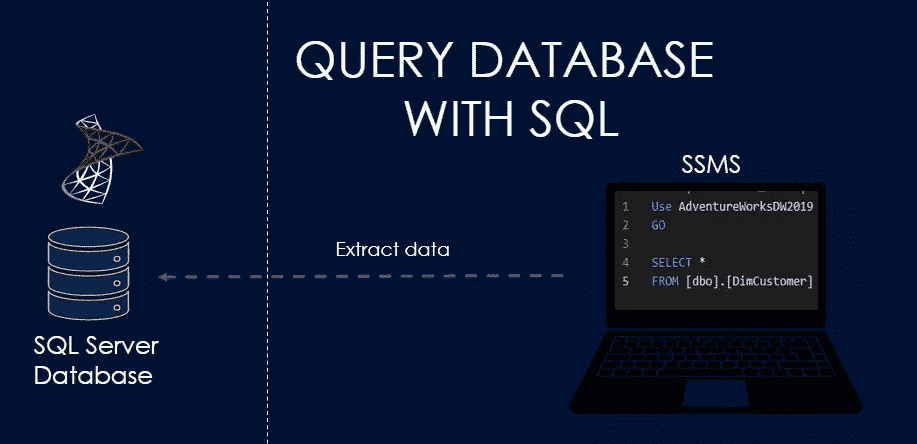
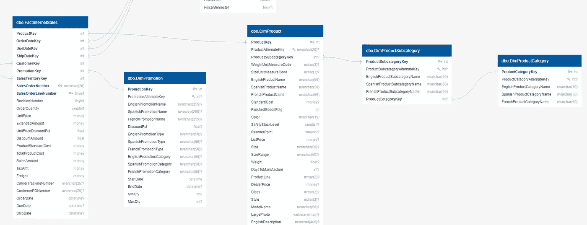
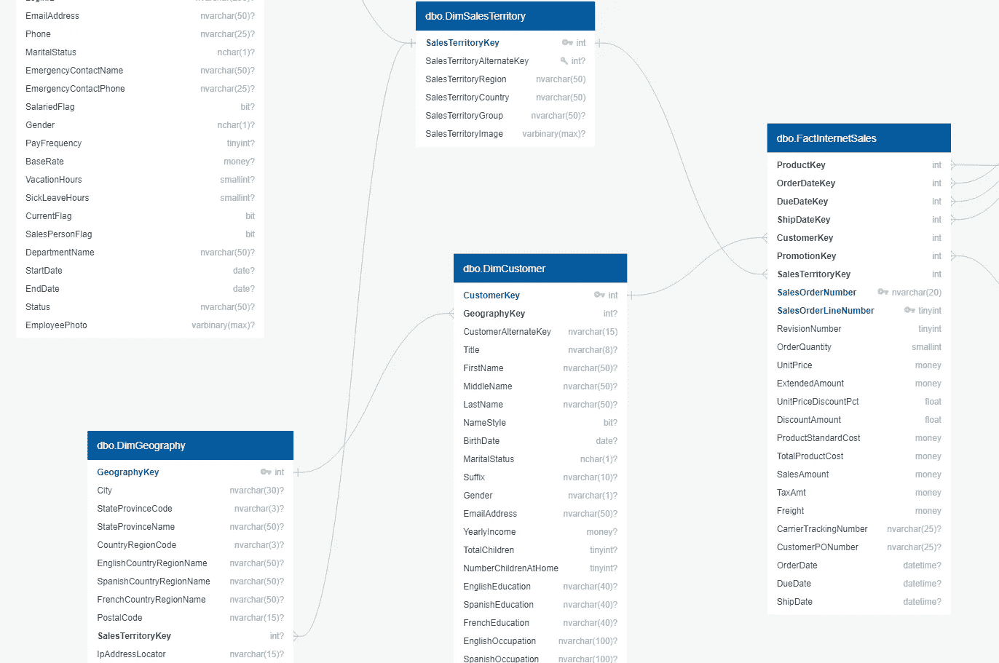

# 结构化查询语言初学者指南:你需要知道的一切

> 原文：<https://blog.devgenius.io/a-beginners-guide-to-structured-query-language-everything-you-need-to-know-3df6a0379b67?source=collection_archive---------10----------------------->



用 SQL 查询数据库

结构化查询语言，通常称为 SQL(发音为 see-kwl)，是一种用于管理和操作关系数据库中的数据的数据库语言。它受到流行的关系数据库系统的支持，如 MySQL、Oracle、Postgres 和 SQL Server。除了数据工程师使用之外，数据分析师和数据科学家在日常工作中也经常使用 SQL。SQL 是数据分析的流行选择，因为它使分析师能够访问存储的数据。分析师不需要将数据复制到其他应用程序中，而是可以使用 SQL 直接找到数据源。SQL 非常容易学习，它可以解决非常复杂的问题。所以，我们来分解一下 SQL 的基础知识。

SQL 语言分为两类:数据定义语言(DDL)和数据操作语言(DML)。DDL 用于创建、修改和删除数据库结构。DML 用于查询和修改数据库表中的数据。

**数据定义语言(DDL)** 语句用于定义数据库结构或模式。DDL 的一些例子有:

*   创建—创建数据库和/或数据库中的对象
*   改变—改变数据库或对象的结构
*   删除-从数据库或数据库中删除对象
*   截断-从表中删除所有记录

**数据操作语言(DML)** 语句用于管理模式对象内的数据。DML 的一些例子有:

*   选择—从数据库中检索数据
*   插入-将数据插入表格
*   更新-更新表中的现有数据
*   删除—从表中删除所有记录
*   合并-向上插入操作:插入或更新

我们将关注 SQL 的 DML 部分，尤其是用 SQL 分析数据的“Select”。

如果你是视觉学习者，那么我在 [YouTube](https://www.youtube.com/watch?v=H4qS5j_mykc&t) 上有一个附带的视频，里面有完整代码的演示。

**设置:**

我们需要建立一个环境来练习 SQL。如果需要设置环境，那就去查这个[教程](https://www.youtube.com/watch?v=e5mvoKuV3xs&t)。在本教程中，我们安装了 SQL Server Express、Management studio 并恢复了 AdventureWorks 数据库。一旦您的环境准备就绪，我们就来学习和练习 SQL。

**SQL 基础知识:**

在我们开始之前，需要了解一些基本的东西，SQL Server 是后端数据库，Management Studio 或 SSMS，通常称为关系数据库管理系统(RDBMS)。我们使用 SSMS 与后端数据库引擎进行交互。

在开始编写查询之前，我们将从 SQL 的基础知识开始。我们将探索数据库的实体关系(ERD)图，并首先检查逻辑查询处理。这是编写高效 SQL 查询的基本技能。一旦我们掌握了基础知识，我们就可以在此基础上解决更复杂的问题。

此 SQL 概述将使您能够:

*   熟悉 SQL 查询是如何处理的
*   如何阅读 ERD 图
*   如何使用 SQL 查询和分析数据

**逻辑查询处理**

```
(5) SELECT (5-2) DISTINCT (5-3) TOP(top_specification) (5-1) select_list(1) FROM (1-A) left_table join_type JOIN right_table ON on_predicate(2) WHERE where_predicate(3) GROUP BY group_by_specification(4) HAVING having_predicate(6) ORDER BY order_by_list
```

您可能注意到的第一件事是，SQL 没有按照编写的顺序进行处理。处理的第一个子句是 FROM 子句，而最先出现的 SELECT 子句几乎是最后处理的。你得到命令了吗？在使用 SQL 几年后，这对我来说也是一个惊喜。另一个启示是，每一步都会生成一个虚拟表，作为下一步的输入。但是，作为用户，我们只能看到作为结果返回的最终表。

逻辑查询处理步骤:

1.  FROM:它标识查询的源表和进程表操作符。每个表操作符应用一系列子阶段。例如，From 子句中有多个相位；首先是加入让我们称之为(1A)。FROM 阶段生成一个虚拟表 T1。接下来是 on 子句，它根据 ON 子句中出现的谓词过滤 T1 表中的行。只有谓词评估为真的行才会被插入到 T2 中。
2.  WHERE:这个阶段根据出现在 WHERE 子句(2)中的谓词过滤来自 T2 的行。只有谓词评估为 TRUE 的行才会被插入 T3。
3.  GROUP BY:这个阶段根据 GROUP BY 子句中指定的列列表将 T3 中的行分组，生成 T4。最终，每个组将有一个结果行。
4.  HAVING:这个阶段根据 HAVING 子句()中出现的谓词过滤来自 T4 的组。只有谓词评估为真的组才被插入 T5。
5.  SELECT:这个阶段处理 SELECT 子句中的元素，生成 T6。

5.1 选择列表:评估表达式该阶段评估选择列表中的表达式，生成 T6-A。

5.2 DISTINCT:这个阶段从 T6-A 中删除重复的行，生成 T5-B。

5.3 TOP:该阶段根据 ORDER BY 子句定义的逻辑顺序，从 T6-B 中过滤指定的顶部行数或百分比，生成表 T6-C。

6.ORDER BY:这个阶段根据 ORDER BY 子句中指定的列列表对 T6-C 中的行进行排序，生成最终输出。

**实体关系图(ERD)**



实体关系图(ERD)

现在您已经熟悉了查询是如何处理的。当你写查询时，这会给你一个思维导图。在逻辑查询处理的帮助下，我们可以编写高效的 SQL 查询。

另一个有用的工具是 ERD 图。这为我们提供了数据库实体或表的概述，以及这些表是如何相互关联的。让我们关注一下产品表。我们注意到我们有三个与产品相关的表。产品详情在 *DimProduct* 表中。此表定义了产品的属性，如名称、尺寸、颜色和价格。这些产品汇总到产品类别和子类别。这些分布在两个不同的表上。它们之间的线条称为“鱼尾纹”符号，表示表之间的关系。这是关系的许多方面，这是一个方面。这意味着 *DimProductCategory* 的一行如何与 *DimProductSubcategory* 的多行相关联。你可以在这里阅读更多关于鱼尾纹符号[的内容。产品表就是我们所说的维度。维度表是关于可测量事件的参考信息的集合。维度表为存储在另一种名为 fact 的表中的可测量销售值提供了上下文和标签信息。在这种情况下 *FactInternetSales* 是一个事实表。它包含销售交易，但是如果没有维度表， *FactInternetSales* 值将没有任何意义。](https://vertabelo.com/blog/crow-s-foot-notation/)

我们的 *DimProduct* 表与事实表 *FactInternetSales* 有关系。因此，我们可以连接这两个表，并获得产品级别的销售额。我希望这有意义。ERD 图帮助我们了解表之间存在的关系。当我们需要在查询中定义表之间的连接时，这很方便。我认为这是一个跳入 SQL 的好时机。

**第一个 SQL 查询**

让我们开始编写一些简单的查询来查看客户数据。我将提出一个基于场景的问题，我们将编写一个 SQL 查询来回答这个问题。

*   假设我们被要求向客户关系经理提供客户信息。因此，在这种情况下，我们需要查询客户的表。所以任务提示是；编写一个 SQL 查询来检索我们所有客户的数据。

好的。我们需要客户数据。它存放在哪里？所有内容都存储在一个表中吗？如果没有，我如何找到与客户相关的表？嗯，你可以问一个已经在公司工作了一段时间的同事。或者要一张 ERD(实体关系图)。让我们回到冒险工厂的 ERD 图。



客户尺寸(红色)

我们可以看到我们有一个 *DimCustomer* 表。它加入了 *FactInternetSales* 和 *DimGeography* 表。Geography 表依次连接到 *DimSalesTerritory* 表。客户信息在一个表中，但是客户的地理位置信息分布在多个表中。如果您需要销售区域或地区，那么您需要加入*dimsalestirect*表。邮政编码、州和国家信息在 *DimGeography* 表中。因此，我们需要连接这些表来全面了解客户。

在 management studio 中，我们将查询 *DimCustomer* 表。

SQL 中的第一个子句是 select，在 select 之后，我们可以指定我们想要的列。如果我们想选择一切，那么我们使用星号。在星号后面，我们写“From”子句，然后是我们的模式“dbo”。这是一种将数据库中的相关表组合在一起的方法。如果您有一个大型数据库，那么您可能会看到多个模式。模式之后是我们的表名 *DimCustomer* 。我们的查询准备好了。让我们执行它。

```
Use AdventureWorksDW2019
GoSelect * from dbo.DimCustomer
```

查询成功执行，我们可以从 *DimCustomer* 表中看到客户数据。

我们会看到客户的详细信息，例如，他们的姓名、出生日期、联系方式、婚姻状况、收入、教育水平、是否有房。各种细节都在这里。因此，逻辑查询顺序应该是:首先选择表，然后进入 select 子句，然后选择所有列。当您编写 SQL 时，这是一个很好的映射。

这是我们的客户信息数据。我们可以将它复制到 excel 中，然后交给客户关系经理。

好的。干得好。我们有一个来自用户的后续问题。他不想要所有的数据。他只对某些顾客的属性感兴趣。他希望客户名称包括所有客户的头衔、名字和姓氏。还有他们的联系方式和收入。所以现在我们将选择包含这些信息的列。我们必须键入列名，并用逗号分隔每一列。

```
Use AdventureWorksDW2019
GOSELECT 
[Title],[FirstName],[LastName],[MaritalStatus] ,[EmailAddress],[Phone] ,[YearlyIncome]FROM [dbo].[DimCustomer]
```

好的。我们的数据集看起来很棒，这是用户要求的。我们把这个打包在 Excel 里发过去。

我们得到了积极的反馈，但还有一些调整。客户关系经理要求我们将头衔、名字和姓氏合并成一列。还有，他不明白 Null 是什么意思。所以，他让我们处理这些值。他只对有房子的顾客感兴趣。

好的。让我们更新我们的查询来匹配新的需求。我们可以用加号或竖线符号将两列组合起来。无论你选择什么，保持一致。我们将在标题后使用加号，然后添加一个带空格的单引号，以便在标题和名字之间留出空间。我们可以对最后一个名字重复这个过程。然后我们给这个列一个名字。我们可以用 as 关键字作为一个列的别名，在它之后我们可以提供列名。让我们称之为客户名称。我们在标题中有空值，因此我们可以使用 T2 合并函数，并在遇到 T4 空值时提供一个默认值。我将提供一个空间，所以它将是空白的，每当它是空的。最后，我们需要限制拥有房子的客户的数据。我们有一面屋主旗。它有两个值 0 和 1。一个表示房屋所有者，因此我们需要将该数据限制在其中 *HouseOwnerFlag* 为一。让我们利用 SQL where 子句来过滤这个数据集。因此，在我们的 From 子句之后，让我们写下关键字 where，然后写下列 *HouseOwnerFlag* ，并将其设置为 1。

```
Use AdventureWorksDW2019GOSELECTCOALESCE([Title],'') + ' ' + [FirstName] + ' ' + [LastName] as CustomerName ,[MaritalStatus] ,[EmailAddress],[Phone] ,[YearlyIncome],HouseOwnerFlagFROM [dbo].[DimCustomer]WHERE HouseOwnerFlag = 1
```

好的。我们将运行查询并检查结果。我们的行数从 18，000 下降到 12，000，所以过滤器生效了。让我们检查一下 *HouseOwnerFlag* 列，看看是否所有的值都是 1。这看起来很棒。现在，我们可以将更新后的数据发送给我们的客户端。我将留给您一些练习题来帮助您磨练 SQL 技能。如果你在下面的评论中遇到任何问题，请告诉我。

这些是 SQL 的基础。在我的下一篇文章中，我们将探索 SQL 中的高级主题。

**结论:**

*   我们简要介绍了什么是 SQL 以及 SQL 的不同类别。
*   我们讲述了 SQL 的基础知识；逻辑查询处理和 ERD。
*   我们使用 SQL 查询了一个数据库，并研究了各种 SQL 子句。

**几道 SQL 练习题:**

*   为通勤距离为 0–1 英里的所有客户提供数据？
*   为所有拥有不到一辆汽车的客户提供数据？通勤距离为 0-1 英里？
*   Adventure Works 有多少独立客户？