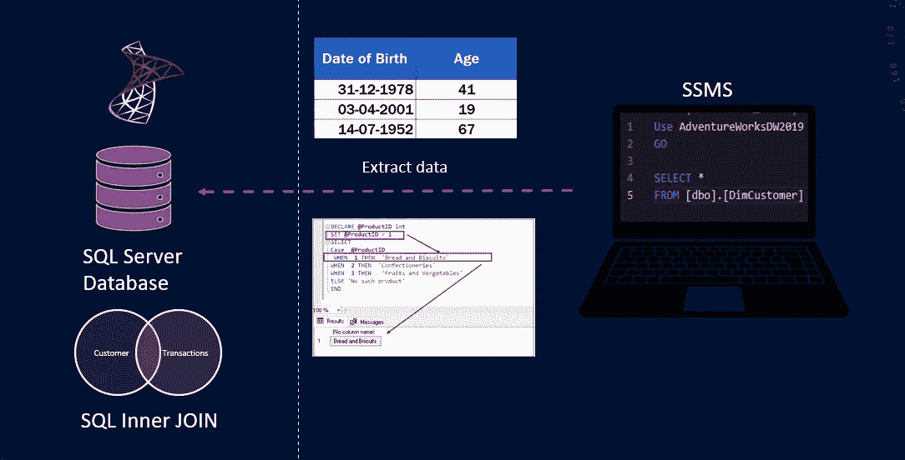
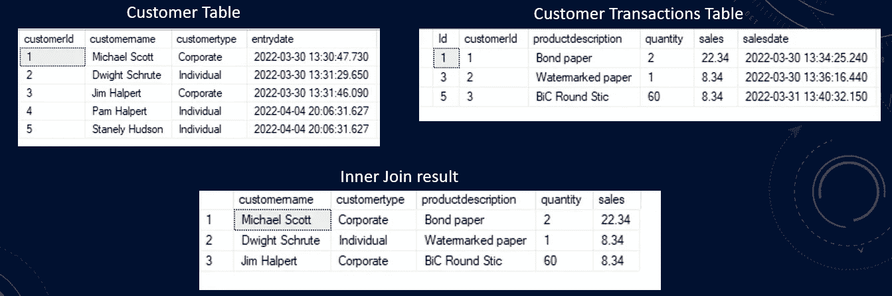

# 结构化查询语言初学者指南:连接、条件逻辑和年龄计算

> 原文：<https://blog.devgenius.io/a-beginners-guide-to-structured-query-language-joins-conditional-logic-and-age-calculation-da6abf398ecb?source=collection_archive---------17----------------------->



SQL 基础知识

今天我们将继续学习 SQL 系列。在前一篇文章中，我们介绍了 SQL 的基础知识；逻辑查询处理和实体关系图。我们编写了一些基本的 SQL 查询来回答一些业务问题。我们留下了几个练习题供你自己练习。让我们快速讨论一下练习题和上一节课的内容。

视频教程可以在 YouTube 上找到。

1.  为通勤距离为 0–1 英里的所有客户提供数据？

要检索通勤距离为 0 到 1 英里的客户的数据，我们可以在通勤距离列上进行筛选，并将筛选条件设置为单引号中的 0–1 英里。

2.为所有拥有不到一辆汽车的客户提供数据？通勤距离为 0-1 英里？

这个问题建立在前一个问题的基础上。在这里，我们可以过滤拥有的汽车数量。这将把我们的查询结果限制为没有汽车的客户。我希望你明白我的意思。如果你是一家自行车公司，你想瞄准那些没有车并且通勤距离短的客户。也许有针对性的促销活动可以帮助 AdventureWorks 向这些客户销售自行车。

3.Adventure Works 有多少独特的客户？

这个比较简单。我们可以选择客户键列，这将为我们提供唯一的客户号。我们将使用一个聚合函数，该函数将对行进行合计并给出一个数字。为了获得客户总数，我们将使用*计数*函数。我们可以说 cout()并在括号中提供一个列， *CustomerKey* 或一个星号。这给了我们 *18，484* 。我们可以通过使用 customerkey 列并对其调用 distinct 子句来仔细检查它。Distinct 语句用于仅返回不同的(或唯一的)值。这将返回相同的值。因为这是一个正确的维度表，其主键是 *CustomerKey* 列。这意味着每行唯一地标识一个客户。该表中没有重复的 *CustomerKey* 。好的。现在我们知道我们有 18000 多个客户。

```
Use AdventureWorksDW2019GoSELECT
 COALESCE([Title],'') + ' ' +  [FirstName] + ' ' +[LastName] AS  CustomerName,
 [EmailAddress],
 Phone,
 [YearlyIncome],
 HouseOwnerFlag
FROM [AdventureWorksDW2019].[dbo].[DimCustomer]
Where HouseOwnerFlag = 1
 and CommuteDistance = '0-1 Miles'
 and NumberCarsOwned < 1
```

让我们回到正常的日程安排上来。我们将改进我们的查询以满足客户的数据要求。我们的客户关系经理带着一个改进请求回来了。他希望我们在这个数据集中添加一个完整的客户地址。他想要街道地址，包括公寓号码，如果有的话？此外，他想要客户的城市、州、邮政编码和国家。这一增加使请求变得具有挑战性。然而，我们可以把这个问题分成几个步骤，然后逐步解决。

第一个请求是客户的街道地址。我们在客户表中有两列，*地址行 1* 和*地址行 2*。我们用加号连接*地址行 1* 和 2。第一列包含街道地址，第二列包含公寓号(如果有的话)。

所以，我们可以包括这两列。 *AddressLine2* 列为空。我们将对其应用合并功能。让我们在 *AddressLine1* 和 two 之间添加单词“APT”。由于 *AddressLine2* 列被稀疏地填充，我们将在 *AddressLine2* 中添加“APT”值，否则我们将显示该列。这可以通过 SQL 中的 if else 逻辑来实现。我们将用 cast 语句写出第一个条件逻辑。

*CASE* 语句遍历条件，并在满足第一个条件时返回值(类似于 if-then-else 语句)。所以，一旦条件为真，它将停止读取并返回结果。如果没有条件为真，它将返回 ELSE 子句中的值。如果没有 *ELSE* 部分并且没有条件为真，则返回 *NULL* 。

```
case 
  when AddressLine2 IS NULL
  then COALESCE(AddressLine2, '')
  else ' APT ' + COALESCE(AddressLine2, '')
end AS Address 
```

对于我们的第二个任务，我们需要添加客户的地理位置属性。它们位于 DimGeography 表中。为了将这些列加入到我们的查询中，我们将使用 SQL 连接。JOIN 子句用于根据两个或多个表之间的相关列来组合它们中的行。由于这是一个关系数据库，每个表都通过一个相关列与另一个表相关。

**不同类型的 SQL 连接**

以下是 SQL 中不同类型的联接:

*   **(内部)联接**:返回在两个表中都有匹配值的记录
*   **左(外)连接**:返回左表所有记录，右表匹配记录
*   **右(外)连接**:返回右表中的所有记录，以及左表中匹配的记录
*   **完全(外部)连接**:当左表或右表中有匹配时，返回所有记录

假设我们有一个包含五条记录的客户表和一个包含客户交易的交易表。只有三个客户交易。最后两位顾客 Pam 和 Stanley 没有购买。一旦我们在 customerId 上连接这两个表，我们只能得到三个匹配的行。所以内部连接只返回两个表中匹配的行。



SQL 内部联接

```
SELECT
 COALESCE([Title],'') + ' ' +  [FirstName] + ' ' +[LastName] AS         CustomerName,
 [EmailAddress],
 Phone,
 [YearlyIncome],
 HouseOwnerFlag
FROM [AdventureWorksDW2019].[dbo].[DimCustomer] c
**INNER JOIN [dbo].[DimGeography] g ON c.GeographyKey = g.GeographyKey**
Where HouseOwnerFlag = 1
  and CommuteDistance = '0-1 Miles'
  and NumberCarsOwned < 1
```

现在，我们可以将 geography 表中的列引入到查询中。我们可以引用 geography 作为 g，让我们将这些列放在 address 列之后。所以，它将是 g 点城市，g 点州省名，go 点邮政编码，最后是 g 点英语国家地区名。我们将使用 as 关键字重命名该列，并将其命名为 country。

好的。让我们运行查询来确认它是否正常工作。我们可以看到地理表中的列。这很好。我们的行数仍然是 1980，这是另一个很好的迹象。有时，当您对一个不是好的连接候选的键进行连接时，您的查询的行数将比连接前显著增加。这表明我们加入的键中有重复项。所以，一方的关系是无效的。我们需要找到正确的专栏来解决这类问题。这里一切看起来都很好。

```
SELECT
 COALESCE([Title],'') + ' ' +  [FirstName] + ' ' +[LastName] AS         CustomerName,
 [EmailAddress],
 Phone,
 [YearlyIncome],
 HouseOwnerFlag,
 **g.City,
 g.StateProvinceName,
 g.PostalCode,
 g.EnglishCountryRegionName as Country**
FROM [AdventureWorksDW2019].[dbo].[DimCustomer] c
INNER JOIN [dbo].[DimGeography] g ON c.GeographyKey = g.GeographyKey
Where HouseOwnerFlag = 1
  and CommuteDistance = '0-1 Miles'
  and NumberCarsOwned < 1
```

我们会跟进将客户的年龄添加到该数据集中。我们知道在 customer 表中有 *DateFirstPurchase* 。我们可以将该列与从“getdate()”函数获得的当前日期一起使用。这是 SQL Server 中的内置函数之一。SQL server 内置函数比较多。如果你好奇的话，我会留下一个包含这些功能的链接。让我们在查询中添加这两列并执行它，看看我们得到了什么。我们有客户的第一个订单日期和当前日期。利用这两列我们可以计算年龄。

为此，我们将使用另一个内置函数 *DATEDIFF* 。这给了我们两个日期之间的差异。我们希望获得年和月级别的客户年龄。

```
Cast(DATEDIFF(MONTH, DateFirstPurchase  ,getdate()) / 12 as varchar(2)) +  ' Years ' + CAST(DATEDIFF(MONTH, DateFirstPurchase  ,getdate()) % 12 as varchar(2)) +  ' Months' as CustomerLifetime
```

这是我们在 SQL 查询中计算年龄的方法。这些是 SQL 的一些基本知识。在我的下一篇文章中，我们将探索 SQL 中的高级主题。

**结论:**

*   我们讲述了 SQL 连接以及如何连接两个表以将数据放入单个查询中。
*   我们讨论了派生列的条件逻辑。SQL *CASE* 语句。
*   我们使用两个日期列来计算客户的年龄。