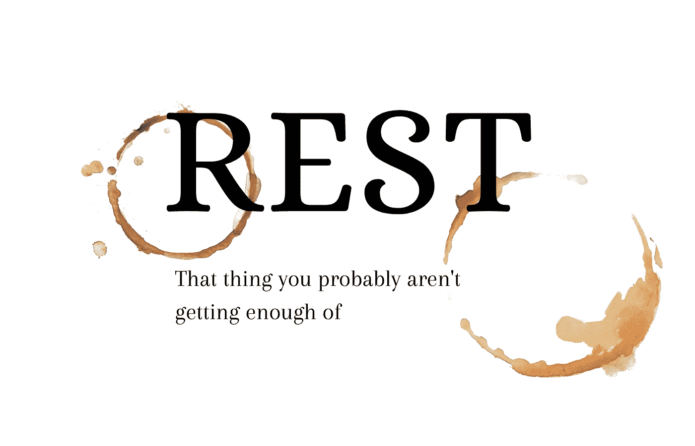

# 理解 REST 的初学者指南

> 原文：<https://blog.devgenius.io/a-beginners-guide-to-understanding-rest-de9041cc8d90?source=collection_archive---------4----------------------->

代表性状态传输的高级概述，以及它基于应用程序编程接口(API)和超文本传输协议(HTTP)的原理。

休息，你可能还没有得到足够的休息

# 介绍

正如我之前在另一篇文章中所写的，我参加了一个软件工程实习，在这个实习中，我学到了很多关于我希望开始职业生涯的行业的知识。在那次实习中，我学到了很多我在软件工程学位中没有学到的东西。

在我之前的文章中，我写了关于 Docker 的内容，以及我开始实习时对它的了解是多么的少。按照类似的思路，我认为继续解释那些我在大学里了解很少，相反却在行业中大量使用的技术是有好处的。所以在这篇文章中，我将尝试用初学者可以理解的语言来解释表征状态转移或 REST。为了帮助解释 REST 架构，我将首先解释应用程序编程接口(API ),因为 REST 使用 API 来操作，并且通常被称为 RESTful API。

## 应用编程接口

API 是软件定义的接口，允许多个软件相互通信。API 的概念被描述为一种将程序的功能和数据库访问从独立的图形用户界面中抽象出来的方式[1]。

通过创建一个 API，你可以从消费者那里抽象出一个软件的实现。这允许开发人员在利用一个软件或服务时采取[黑盒](https://en.wikipedia.org/wiki/Black-box_testing)方法，因为他们不需要理解接口背后的实现，而只需要理解它的输入和输出。

要在实践中做到这一点，需要有一个由 API 定义的契约来描述接口的输入和输出。关于 API 需要注意的重要一点是，它们并不局限于机器对机器或软件对软件的通信，而是还可以根据实现允许人类使用，这就是本文的亮点所在。

> ***TLDR/TLDU*** : API 是一种在不知道每个软件内部如何工作的情况下，在多个软件之间进行通信的方式。把它想象成一个商店里的交易，就像面包店一样。你不知道也不需要知道他们是如何制作巧克力蛋糕的，但是你可以买下来，做任何你想做的事情。同样，面包店不需要知道你是如何赚到你付给他们的钱的。面包店墙上的价格表是 API 定义的合同的一个例子，它解释了输入和输出。如果你付正确的钱，他们会给你一个蛋糕。

## 代表性状态转移

REST 架构由服务器和客户端组成，客户端是有状态的，并且可以根据从服务器请求中接收到的资源来改变状态。服务器本身是无状态的，将来自客户端的每个请求视为一个新的独立请求。采用这种方法可以获得更好的服务性能，因为资源不会锁定到单个客户端。

RESTful web 服务使用四个主要过程来执行操作，它们是创建、读取、更新和删除(CRUD)。如果您熟悉数据库，您可能听说过这些，并且有一个很好的理由来说明与数据库操作的相似性。这是因为 RESTful APIs 通常用于与数据库交互，是网页或应用程序等前端客户端存储和检索数据的一种方式。

REST 依赖于 [HTTP](https://en.wikipedia.org/wiki/Hypertext_Transfer_Protocol) 进行操作，并使用 URL 来标识和表示其接口资源，通常称为端点。CRUD 操作可以分别直接映射到 HTTP 动词 POST、GET、PUT 和 DELETE 这是由 Roy Fielding 设计的，他是 HTTP 1.0 的作者之一，在他的博士论文中定义了代表性状态转移[2]。REST 架构没有规定任何资源类型或表示，因此它的资源可以是任何类型的数据，也就是说，RESTful APIs 通常使用 JSON、XML 或 HTML 来传输数据。这是因为它们非常容易被人类阅读和理解，也很容易使用 JavaScript 等编程语言进行解析和操作。

为了使用 REST API 存储新的内容，我们在正确的 URL 上使用 POST 方法，并可以传递要存储在 HTTP 请求体中的数据。同样，要使用 REST API 删除某些内容，我们可以使用 DELETE 方法，使用正确的端点 URL，GET 和 UPDATE 方法也是如此。关于这些 HTTP 方法中的每一个所使用的 URL，需要注意的重要一点是，它们都可以是相同的，因为它们可以通过所使用的方法来区分。因此，一旦使用了正确的 HTTP 动词，就可以使用“mywebsite.com/account”在 mywebsite.com 上创建、读取、更新和删除帐户。像上面给出的例子一样，URL 通常是不言自明的，所以在进一步研究之前，您应该知道“mywebsite.com/account”可能与帐户有关，而“mywebsite.com/articles”可能与文章有关。

> **TLDR/TLDU** : REST 实际上只是在应用程序(如前端网页和后端服务器)之间实现 API 的一种方式，但它并不局限于此，还可以用于服务器到服务器的通信，如基于微服务的系统。让我们回到面包店的类比，把 REST 想象成一个面包师，一旦完成，他就会忘记你的整个交易。你交出你的钱，他们给你你的蛋糕，交易完成。然后，面包师转向下一个顾客，不再需要注意你，除非你回来买另一个蛋糕。如果你回来买另一个蛋糕，这个交易将是一个全新的交易，并与原来的交易分开。

# 包扎

我希望这篇文章对你有所启发，如果不是全部的话。如果你发现文章中有任何不准确的地方，请随时联系我，告诉我我的错误！我写这篇文章是为了给自己和他人一个教育经历，所以我欢迎建设性的反馈。
如果你喜欢这篇文章，考虑[订阅](https://n-murray.medium.com/subscribe)我未来文章的更新，如果你还不是 Medium 的会员，你可以使用[我的会员链接](https://n-murray.medium.com/membership)加入

# 参考

[1]^j.·艾拉·w·科顿和弗兰克·s·格雷托雷，《远程数据结构和技术》，*管理需求知识，国际研讨会*，旧金山，1968 年。

[2]^n.·s·威廉姆斯，《面向 Web 应用的 Java》，印第安纳波利斯:约翰·威利父子公司，2014 年。