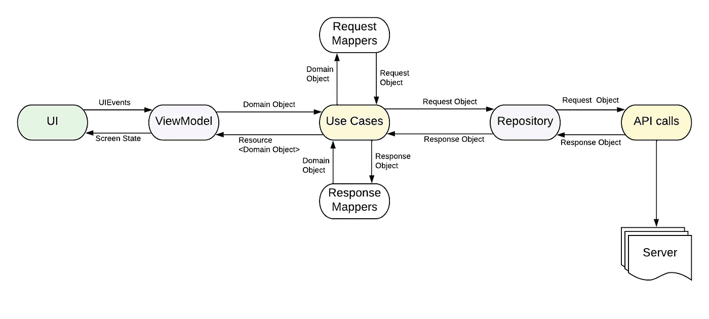

# 将数据从 Api 传递到 Composable 的更好方法——Jetpack Compose

> 原文：<https://blog.devgenius.io/a-better-way-to-pass-data-from-api-to-composable-jetpack-compose-android-b844ec1da072?source=collection_archive---------1----------------------->

> 给我们的器官注射免疫增强剂！


如果您已经将 api 响应直接用于应用程序的 UI 部分，那就不足为奇了。作为 Android 开发者，这是一种普遍的倾向。虽然这不是一个完全错误的做法，但这甚至不是一个好的做法。有时，api 格式是为应用程序设计的，所以可以直接使用。

因此，在本文中，我们将尝试理解将从 api 接收的数据有效地传递给我们的组件的许多方法中的一种。

为了理解这一点，让我们考虑一个场景。想象一下，如果我们有天气应用程序屏幕，我们正在显示如下图所示的数据。出于明智的目的，忽略数据转换。我们只是展示我们得到的数据。


显示天气数据的应用程序屏幕

因此，当我们启动这个应用程序时，我们集成了第三方 api，并将它的响应传递给我们的存储库、视图模型，然后传递给 UI。一切都好。不疼。但是过了一段时间，需求来了，我们需要替换 api 并使用一个具有全新响应的新 api。UI 一点都没变。现在怎么办？

最有可能的是，如果我们开始根据新的响应进行更改，我们所有的层都将被修改，因为我们的 api 格式正在驱动我们所有的层，这根本不是我们所期望的。从架构的角度来看，这也是不正确的。那么如何将数据从 api 传递给我们的组件呢？



数据流

以上面从 Api 到 UI 的流程为例。

*   我们通过存储库调用我们的 api。存储库从服务器接收准确的响应对象，并将其传递给用例。
*   用例层接受响应对象，将其转换成域对象，将其包装成 ***资源*** 对象，并将其转发给视图模型。
*   视图模型获取该资源并将其更新到屏幕状态对象中。
*   一旦状态更新，具有屏幕状态对象的可组合组件将重新组合自身。

现在从 UI 到 API 采取同样的方法。

*   UI 将包装在 UIEvent 对象中的任何事件传递给视图模型。
*   视图模型然后按照 UI 上的动作处理计算。这是 api 调用。它将域对象传递给用例。
*   用例将域对象转换成 api 请求对象，并传递给存储库。
*   然后，存储库使用请求对象进行 api 调用。

这里，我们的用例维护了 UI 和数据层之间的契约。这个契约使我们的 UI 在 api 格式方面不受影响，反之亦然。

让我们也来谈谈为什么我们的数据流中会出现以下对象？

## 资源

资源对象基本上是一个密封的类，如下所示。

这个类用于用例与视图模型之间的通信。因为视图模型可能会更新 UI 状态，所以这个类为我们提供了一种更清晰、更易读的方式来理解我们是收到了成功还是错误。

## UIEvent

与资源类类似，为了保持我们的 UI 与视图模型的交互清晰，我们有 UIEvent 类，它定义了用户在 UI 上所有可能的动作或者其他需要的动作。

> 如果你想阅读关于为什么 UIEvent 类的细节，请阅读我的文章。

## 屏幕状态

屏幕状态基本上是一个可变的状态，它包含了我们的可组合组件所依赖的数据的状态。这有助于管理 jetpack compose 中的 UI 状态。

> 如果您想了解更多关于如何在 Jetpack compose 中管理 UI 状态的信息。结账我的[条](https://proandroiddev.com/updating-ui-using-state-management-in-jetpack-compose-e6120db7d695)也一样。

## 返回天气应用场景

现在我们已经了解了我们是如何传递数据的，让我们来看看上面天气应用场景中数据流的技术方面。

从 api 端开始，我们的存储库获取响应对象并传递给用例，其中我们已经创建了一个流，它将在每个步骤上发出数据，如下所示:

这个流在我们的视图模型中收集如下:

并且视图模型为每个接收到的值更新屏幕状态对象。

将我们的天气应用程序更新到这个设置，并再次考虑我们已经集成了一个 api 的场景，现在我们必须用一个具有新响应格式的新 API 来更新它。我们需要在哪些方面做出改变？

嗯！有了这个设置，我们的 api 格式变化就被限制在从 api 到数据流用例的范围内。怎么会？因为我们在用例中有 UI 合同。

```
*val* result = apiResponse.body()
emit(Resource.Success(result.*toWeatherData*()))
```

仔细观察，我们看到结果被转换为天气数据对象，这是我们在传递到视图模型之前使用 mapper 类的契约对象。我们可以将任何 api 响应转换为这些映射器中的契约对象。

Bamn！现在，我们的可组合组件独立于 api 及其用于获取数据的格式。

在整个实践中要理解的要点是，我们应该只在它们所属的地方进行更改，而可能不在其他任何地方。虽然没有一个架构是理想的，但我们可以尽可能地消除混乱。

github 上天气应用示例的源代码:

[](https://github.com/aqua30/WeatherDomainLayerSampleApp) [## GitHub-aqua 30/weatherdomainsersampleapp:该项目演示了拥有合同的用法…

### 该项目演示了在我们的 api 响应和 ui 对象之间使用契约来消除依赖性…

github.com](https://github.com/aqua30/WeatherDomainLayerSampleApp) 

喔！目前就这些。

如果你想让我写一篇你想理解的文章，请在评论中告诉我。

如果文章对你有帮助，那就在 [medium](https://saurabhpant.medium.com/) 或者 [github](https://github.com/aqua30) 上连线吧。

订阅电子邮件以获得每篇新文章的通知。

再次见到你。

直到下一次…

干杯！