# 更好的 Windows 体验

> 原文：<https://blog.devgenius.io/a-better-windows-experience-ee8e506b7e00?source=collection_archive---------15----------------------->

## 初学者指南

在 Windows 上共享 2 个让我的生活更轻松的应用。Wox 和 Droplr。

在我看来，Windows 操作系统还不够完美，因为还有一些功能我们无法通过快捷键调用。这可能对你来说没什么，但是我想说快捷键可以节省时间并提高你的工作效率。我开始编码已经几个月了，我发现有两个部分可以优化我的性能:

1.  快速切换和打开应用程序(Wox)
2.  更好的截图(Droplr)

# 出口伤

[Wox](http://www.wox.one/) 是 GitHub 上发布的基于 python 的应用。与`alt + tab`不同，当你`alt + spacebar`时，Wox 提供搜索和打开功能。它给了我不离开键盘控制我的电脑的灵活性，换句话说，它是任务栏上的替代搜索栏，可以通过快捷键调出。

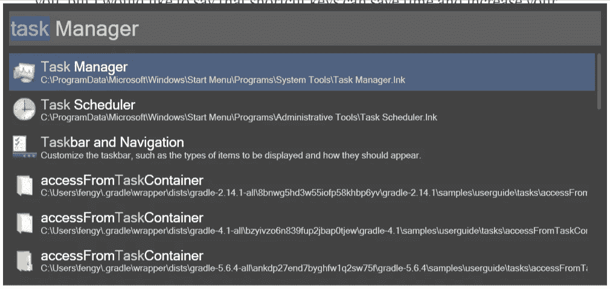

Wox 和插件(字典、youtube 视频搜索……)的安装以及 Wox 的定制会在本文最后分享。

# Droplr

Droplr 是一个付费程序，但提供免费帐户。我个人认为，对于没有录屏需求的用户来说，免费账户应该足够了。它基本上有两个版本:谷歌 chrome 扩展和桌面版。推荐桌面版，因为桌面版提供快捷键。此外，这两个版本都将你的截图保存在 Droplr cloud 上，并提供图片的短链接，而下载到桌面始终是一个选项。

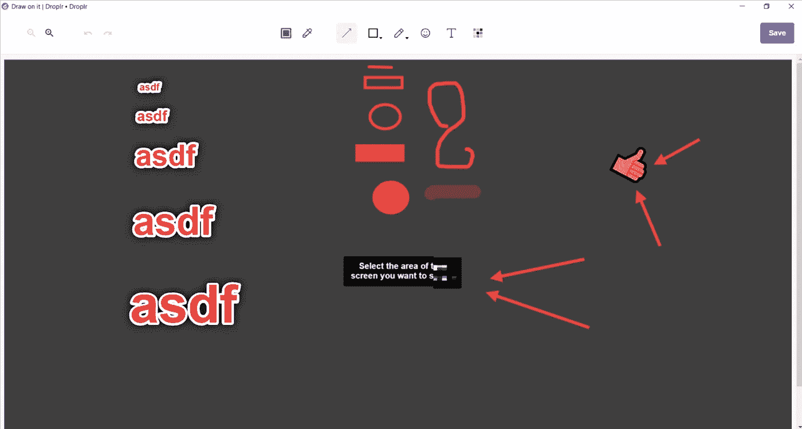

上面是截图后的窗口，它为用户提供了简单而方便的功能，可以在截图上指出并留下评论。它对我很有用，尤其是当我想分享我的代码时，它让询问过程变得简单多了。

# 希望这两款应用能给你更好的 Windows 体验。

## [Wox 安装](http://www.wox.one/):

[链接](http://www.wox.one/)。当你点击页面上的下载按钮时，它会引导你到 Wox GitHub 页面。

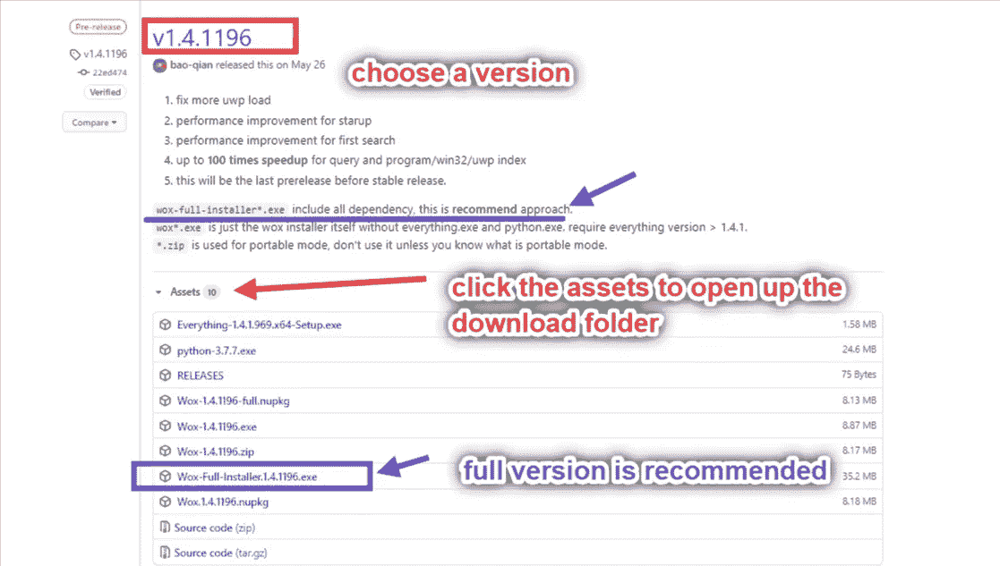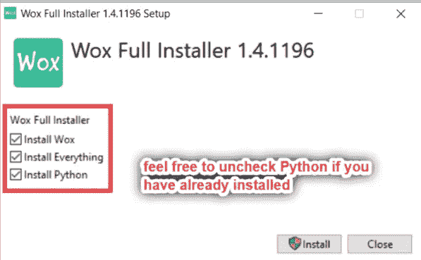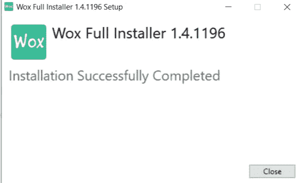

你可能会看到一个 windows 安全弹出窗口说“一切”请求许可，这个应用程序是 wox 成功运行的子应用程序。

## Wox 定制:

在搜索栏中键入设置，然后通过“调整此应用程序”获得该设置。

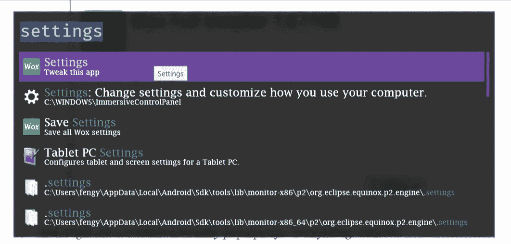

随意编辑 Wox 主题和热键。

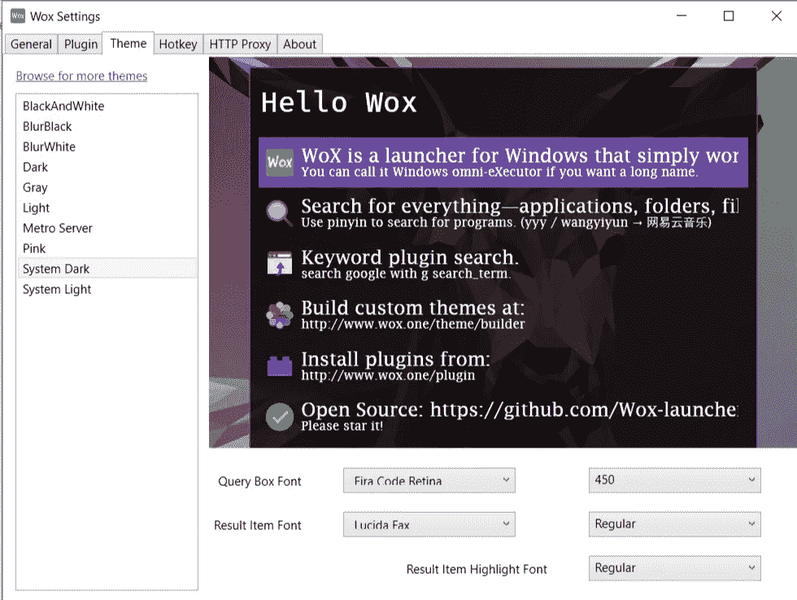

## [Wox 插件](http://www.wox.one/plugin):

[链接](http://www.wox.one/plugin)。安装插件并不复杂，大多数插件会有一个如何安装的解释，如果他们在安装命令后要求额外的行动。

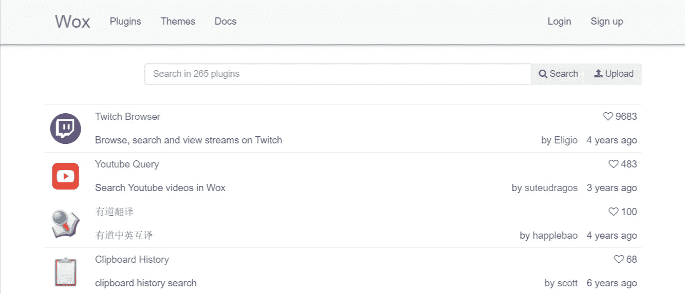

Wox 是一个开源程序，你可以编写自己的插件并发布到那里。

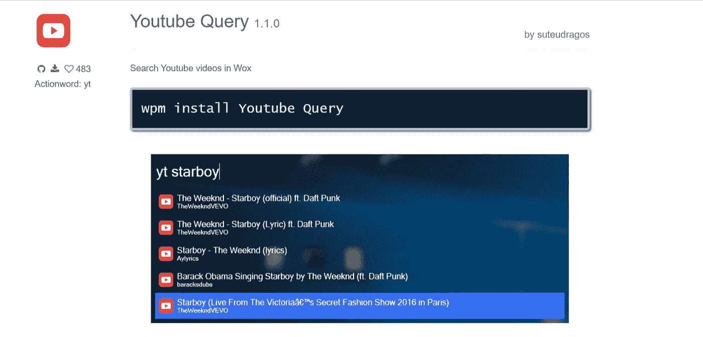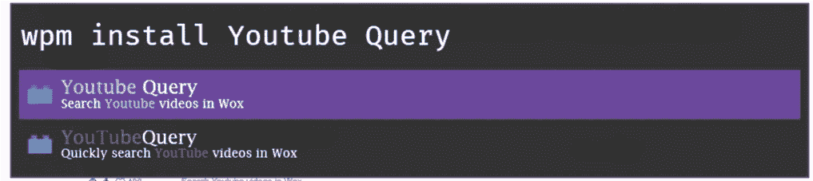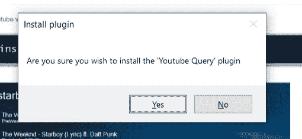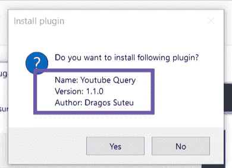

在您点击“是”之前，请检查插件信息是否与您希望安装的相匹配，因为有许多插件具有相似的名称。

要卸载插件，只需运行`wpm uninstall plugin_name`。

# Droplr 设置:

默认设置还好但是在我看来，所有快捷键如果都在同一边应该更好。要修改热键，你需要去任务栏上的后台运行应用程序图标找到 Droplr。

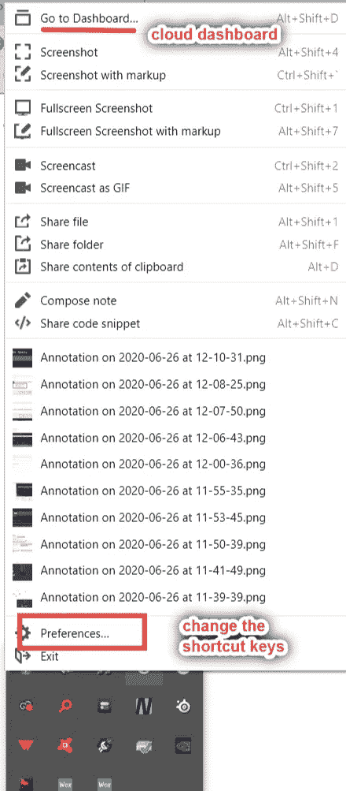

选择热键设置的首选项。

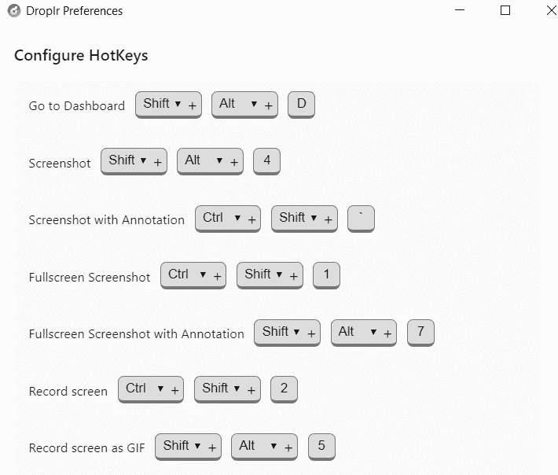

# 感谢您的阅读。希望这两个应用程序可以帮助您加快日常工作:)