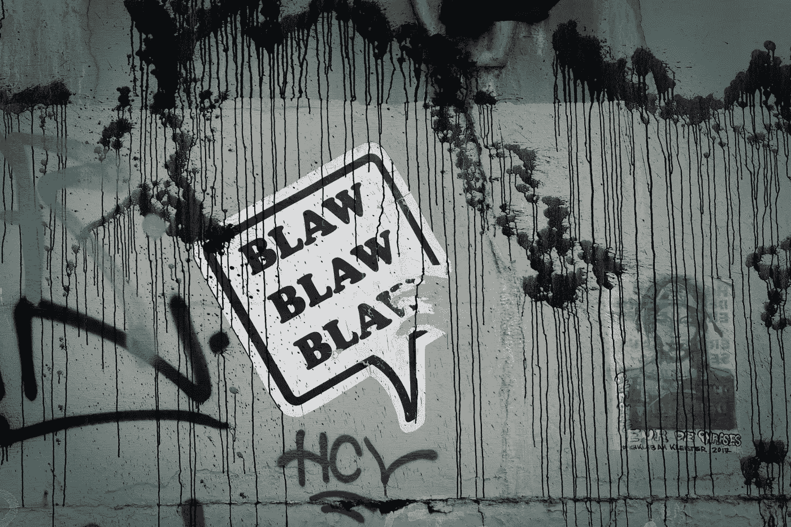
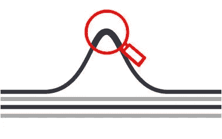
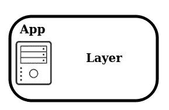
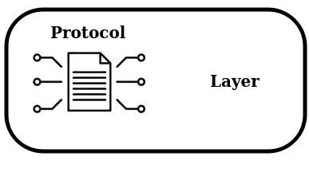

# 关于 DDoS 的一点理论。第 1 部分 DDoS 攻击的类别

> 原文：<https://blog.devgenius.io/a-bit-of-theory-about-ddos-part-1-categories-of-ddos-attacks-9f71d55d9c99?source=collection_archive---------14----------------------->

这份材料是为提供信息而准备的。进行 DDoS 攻击可以被法律起诉。这篇文章不是呼吁行动。本系列文章中的所有材料都来自公开的公共资源。

以下更多的是对一般教育信息的参考，有助于更详细地理解 DDoS 攻击的实施过程。

**简介**

不知何故，在我职业生涯的开始，我开始记理论笔记。它包括解决各种任务，这些任务有时会在项目之间重复。

还有一个关于各种技术的理论部分，特别是关于 DDoS:关于攻击的实施，攻击的级别，它们的类型，等等。

该摘要的一部分已决定向公众公开。如果有一天对某个人有帮助，我会很高兴。

*了解敌人的能力，你就能更有效地保护自己。*

我们开始吧！

**理论**

简而言之关于 DDoS。DDoS 是一种对 web 服务的攻击，目的是使其失败。也就是说，创建服务将无法处理来自真实用户的请求的条件，这可能会影响目标业务或服务。

绝大多数 DDoS 攻击持续时间不超过一小时，几乎四分之一的攻击持续时间不到五分钟。这意味着公司需要能够在造成损害之前立即检测和减轻攻击的保护。

DDoS 攻击可能是混合型的，但可以分为三类:

*   卷攻击；
*   应用级攻击；
*   协议级攻击。

一些类别可能跨越多个网络层。

**体积攻击**

容量攻击旨在超过信道的带宽。体积 DDoS 攻击能力以每单位时间的位数来衡量。针对这种攻击的最有效的保护是在例如电信运营商的级别上的流量清理。

例如，HTTP flood 用大量的 HTTP 请求使服务器过载，以获取大量的站点元素。选择请求的方式使得响应量最大。因此，从服务器到客户端的反向通道因 HTTP 响应流量而过载。

UDP flood 使用来自不同地址的大量 UDP 请求，结果是服务器被恶意 UDP 数据包淹没，使整个连接线路都负载了这些数据包。

ICMP flood 是基于从不同的 IP 地址发送大量的恶意 ICMP 数据包，用虚假的请求使服务器超载。每次服务器收到这样的请求时，它必须诊断其网络的状态。因此，ICMP 请求流本身会使传入通道过载。

放大攻击(DNS 放大)是基于代表受害者向 DNS 服务器发送许多带有虚假 IP 地址的请求。此类请求需要冗长的回复，并被发送到受害者的网站上。

**应用层攻击**

应用层攻击尤其具有破坏性，并且难以检测，因为它们可以模仿合法流量。它们被设计成使应用服务器基础设施的元素过载，并使它们失效或崩溃。在这一级别，网络罪犯使用资源密集型调用和应用程序互连来激发系统攻击自身。

BGP(边界网关协议)黑客攻击的目标是用于标准化路由数据和交换与变化的 IP 路由相关的信息的网关协议。这种攻击旨在将互联网流量路由到非预期目的地。

Slowloris 攻击(会话攻击)以 HTTP 连接请求为目标，以保持尽可能多的并发连接。网络犯罪分子会打开许多连接，并尽可能长时间地保持每个连接都打开，直到超时。结果，服务器变慢，来自真实用户的请求被忽略。

慢速 POST 攻击是基于向服务器发送定义良好的 HTTP POST 头，但头体以较浅的速率传输，在某一点中断连接并开始新的连接。因为消息头是正确的，所以服务器响应请求。因此，服务器会打开许多这样的连接，从而消耗资源。

慢速读取攻击原则上类似于慢速 POST 攻击，但方向相反。不同的是，在 POST 攻击的情况下，消息的正文发送得很慢，而在慢速读取攻击的情况下，HTTP 请求是故意以很浅的速度接收和读取的。服务器必须保持这样的请求打开—这增加了负载。

低速攻击是基于非常缓慢的小流量。通过这种方法，网络犯罪分子逐渐使服务器超载，导致真实用户的连接请求被拒绝。这些攻击需要很少的带宽，并且难以防范，因为它们生成的流量与真实用户的流量相似。

大负载 POST 攻击基于可扩展 XML 标记语言的使用。服务器接收被网络罪犯修改的 XML 编码数据。这些数据的实际大小要大很多倍，所以当它们到达服务器时，它的内存会被占满。

模拟页面浏览量。这种类型的 DDoS 攻击模仿应用程序页面上真实用户的行为模式，导致访问者数量急剧增加，难以从僵尸网络流量中过滤合法流量。перед покупкой

**协议级攻击**

协议级攻击消耗服务器或硬件资源。在这种情况下，网络犯罪分子的任务是通过向服务器发送恶意数据包来排除处理真实用户数据包的可能性。

SYN flood 利用了 TCP 握手系统中的漏洞，即 SYN 请求、SYN-ACK 和 ACK 数据包。SYN 请求被发送到服务器，服务器用 SYN-ACK 消息进行响应。服务器期待用户发送确认数据包作为响应，但网络罪犯的设备配置为确认数据包永远不会到达。大量此类请求会导致服务器崩溃。

碎片数据包攻击(泪滴)以 TCP/IP 协议的最大可能吞吐量为目标。网络犯罪分子向受害者的服务器发送许多碎片数据包，但数据包在传输过程中会发生移位，并且在重新组装过程中会出现数据包重叠的情况。这种重叠会导致服务器出错并使系统崩溃。

Smurf DDoS 攻击是基于使用受害者的 IP 地址向许多网络设备发送请求。网络犯罪分子利用网络广播向不同的设备发送带有受害者地址的虚假请求。收到这样的请求后，这些设备会通过增加到受害者机器地址的流量来做出响应。

**小计**

在 21 世纪初和中期，这种犯罪活动相当普遍。然而，成功的 DDoS 攻击数量正在下降。这可能是由以下因素造成的:

*   警方的调查导致世界各地的罪犯被逮捕；
*   成功用于对抗 DDoS 攻击的技术对策。

但这导致了平均攻击时间的缩短，并增加了他们的力量。

在下一部分，我们将讨论 DDoS 攻击的分类标准。