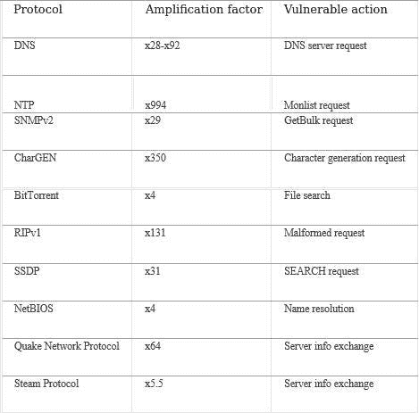

# 关于 DDoS 的一点理论。第 2 部分更多关于 DDoS 攻击的分类

> 原文：<https://blog.devgenius.io/a-bit-of-theory-about-ddos-part-2-more-about-the-categories-of-ddos-attacks-7f3208597688?source=collection_archive---------13----------------------->


为了检测和防范分布式拒绝服务攻击，您需要对它们进行分类并了解它们是如何工作的。

*系列文章的第 1 部分是* [*这里是*](/a-bit-of-theory-about-ddos-part-1-categories-of-ddos-attacks-9f71d55d9c99) *。*

在本材料中，作为分类标准，我们将考虑攻击所针对的目标。在这种情况下，有几种主要的攻击类别与 ISO OSI 模型的级别相对应。

**1。慢速攻击:**

**1.1 SlowLoris**

**攻击等级:运输级(L4)。**

描述和工作原理:

Slowloris DDoS 攻击通过不断发送挂起的 HTTP 请求，在服务器上建立许多开放的连接。在某些时候，Slowloris 会为每个请求发送以下 HTTP 头，但不会终止连接。如果以最佳频率发送请求，服务器将开始等待打开的连接完成。在这种情况下，服务器资源保持相对空闲，但是服务器本身停止为新的连接提供服务。

重点是 Apache 1.x、Apache 2.x、dhttpd、GoAhead WebServer 和 Squid web 服务器支持有限数量的同时打开的连接。但是 Slowloris 不会对 IIS、Lighttpd 或 NGINX 服务器构成威胁。它们具有高效的负载平衡机制，并使用工作线程池——“工作线程池”，允许您在存在空闲资源的情况下保持任意数量的打开连接。

**1.2 慢速 HTTP POST/GET**

**攻击等级:运输级(L4)。**

描述和工作原理:

DDoS 攻击基于 HTTP 协议中的漏洞。慢速 HTTP POST 攻击发送带有“内容长度”字段的 POST 标头。web 服务器知道它需要接收多少数据。之后，POST 消息的主体以非常低的速率传输。这允许您长时间使用服务器资源，并随后干扰其他请求的处理。这种攻击对于微软 IIS 和 Apache，以及在 HTTP、HTTPS、SSL 和 VPN 协议中具有标准设置的 NGINX web 服务器来说是危险的。此外，攻击可以配置为使用 SMTP 和 DNS 服务器。

这种类型的拒绝服务攻击可以通过代理进行。此攻击的流量与合法流量相似。

**1.3 应力**

**攻击等级:运输级(L4)。**

描述和工作原理:

攻击如下。如果 web 服务器的对象大于内核为连接分配的发送缓冲区。然后你可以强制内核不接受数据，服务器会尝试发送一段数据，占用连接栈、处理器资源、内存。如果有大量这样的连接，TCP 堆栈将会填满，并且不会打开新的连接。

**2。任意包攻击:**

**2.1 HTTP 洪水**

攻击层:链路层(L2)，应用层(L7)。

描述和工作原理:

这种 DDoS 攻击基于向 web 服务器的第 80 个端口发送最大数量的 HTTP 请求的机制。攻击的目标可以是服务器的根目录或资源密集型元素。这种攻击的结果是，可以终止通过 HTTP 提供服务，并且合法用户很难访问该站点。您可以通过检测对 web 服务器和服务器日志的某些元素的请求数量的快速增加来识别攻击。

**2。UDP-Flood**

攻击层:链路层(L2)，应用层(L7)。

描述和工作原理:

UDP flood 攻击基于向一些服务器端口发送大量 UDP 数据包。它必须确定收到的每个数据包的应用程序，验证它是否处于非活动状态，并发回 ICPM“不可用”消息。这样一来，被攻击的服务器所耗费的资源会增加，带宽会被 UDP 包填满。UDP 协议没有检查数据包发送方的机制；因此，攻击者可以伪造 IP 地址并确保匿名。

**2.3 SYN-Flood**

**攻击级别:链路层(L2)，传输层(L4)。**

描述和工作原理:

SYN flood 攻击使用 TCP 协议中的握手机制。工作原理如下。带有 SYN 标志的数据包被发送到受攻击的服务器。它被迫发送回带有 SYN+ACK 标志的数据包。攻击者忽略服务器的 SYN+ACK 数据包，并且不发送 ACK 数据包作为响应。要么伪造 SYN 数据包的 IP 地址，以便将响应 SYN+ACK 发送到错误的地址。这种攻击的目的是用许多半开连接填充 TCP 栈，结果是服务器停止与新客户端建立连接。服务器收到的连接请求存储在一定大小的堆栈中，这取决于操作系统。它们一直在堆栈上，直到服务器从客户端收到有关已建立连接的信息。

**2.4 ICMP 洪水**

**攻击等级:渠道等级(L2)。**

描述和工作原理:

这种类型的泛滥针对的是网络设备。这种 DDoS 攻击的原理是，请求大小较小的 ICMP 数据包需要设备做大量的工作。当发送相对少量的 ICMP 请求时，网络设备会过载，并且会丢失很大一部分合法请求。更改源 IP 地址的攻击者会向属于 bot-no 的特定计算机发送 ICMP 回应请求数据包。这些计算机会以 ICMP 回应回复数据包作为响应，将其发送到更改后的 IP 地址。要增强攻击能力，请使用局域网(LAN)并启用定向广播(directed-broadcast)选项。

**3。SSL 攻击**

**攻击等级:应用等级(L7)。**

描述和工作原理:

安全套接字层(SSL)是一种安全协议，用于保护通信和数据传输网络的完整性。SSL 可以在传输层加密网络连接。SSL 协议加密、解密和关键交换过程会消耗大量系统资源。基于 SSL 协议的攻击有两种类型。

第一种利用握手机制，耗尽被攻击服务器的资源。攻击者向服务器发送无效的 SSL 数据，处理过程会消耗大量的计算能力。

第二种类型使用连接重新验证特性— SSL 重新协商。建立安全连接和 SSL 重新验证在服务器上消耗的计算能力是客户端的许多倍。因此，有可能实施攻击并耗尽受攻击服务器的资源。一般来说，HTTPS 是在组织网络深处解密的，那里的服务器和模块更容易受到恶意流量的攻击。攻击者也使用这个协议来绕过安全机制。因此，隧道其他攻击是可能的。

**4。用 SMTP-Flood 攻击邮件服务器**

**攻击等级:应用级(L7)。**

描述和工作原理:

在这种类型的 DDoS 攻击中，攻击者试图建立到邮件服务器的连接，或者向随机生成的地址发送随机电子邮件，或者闲置直到超时，保持连接打开。每个 SMTP 连接都会消耗一些服务器资源，因此攻击者会试图造成拒绝服务。

这项技术是，当我们从一个不存在的收件人那里写电子邮件时，SMTP 服务器会使用(发件人的)电子邮件警告我们该电子邮件不会到达。我们向 SMTP 服务器发送许多请求(写邮件)并指出不是所有的邮件都是有效的，而是发件人(攻击的目标)。他们将被告知信没有来。多个 SMTP 服务器将向攻击目标发送流量。

**5。不正确的包/片段:**

**5.1 UDP 碎片泛滥**

**攻击等级:应用等级(L7)。**

描述和工作原理:

这种类型的 DDoS 攻击基于发送 UDP 数据报，这些数据报随机引用流中不存在的数据报。这导致受攻击服务器的内存消耗增加。在 UDP 片段泛洪攻击中，攻击者发送大量 UDP 数据包来耗尽信道的带宽。

**5.2 不正确的 IP 碎片**

**攻击等级:应用级(L7)。**

描述和工作原理:

这种类型的 DDoS 攻击利用了 IP 数据包碎片支持中的漏洞。这种类型的攻击之一是 IP 碎片的交叉。它是利用操作系统漏洞实现的，该漏洞存在于组装零碎的 IP 数据包中。在组装过程中，在接收到的片段上形成循环。然后从它们中复制信息部分并传输到 IP 层。开发者提供了对过量复制信息的检查，但是没有引入对复制负长度片段的检查。复制一个负长度的信息块相当于复制一个非常大的信息块。这会导致覆盖大面积的内存并扰乱系统。

有两个程序在执行 IP 片段交集的机制的常数上略有不同:newer 和 teardrop。它们从给定的 IP 地址向任何端口发送数据包，无论端口是打开的还是关闭的。这种攻击的另一个变种是 bonk。组装片段后，包装中会留有空白空间。这导致操作系统内核的故障和电子计算设备运行的中断。这些漏洞存在于旧版本的操作系统 Windows 和 Linux 中。迄今为止，大多数网络操作系统都受到保护，不会因这种攻击而出现故障。

**5.3 数据包报头中的错误值**

**攻击等级:应用级(L7)。**

描述和工作原理:

这些 DDoS 攻击的目标是某些不能正确处理数据包报头中无效值的应用程序和操作系统。陆地

这次攻击就是这种攻击的一个例子。在这种情况下，攻击者确定数据包中的源地址和目的地址相同。这导致了将服务器连接到自身的循环。

**6。扩增攻击(N-扩增攻击)**

**攻击等级:渠道等级(L2)。**

描述和工作原理:

这些 DDoS 攻击基于 UDP 协议中缺乏发送方验证。响应被发送到数据包报头中指定的目的地。攻击者可以在发送的数据包报头中用受攻击服务器的 IP 地址冒充他们的 IP 地址。攻击的本质还在于，与请求相比，响应量经常被超过。因此，攻击者可以匿名发起大流量攻击。要实施这样的 DDoS 攻击，您可以使用基于 UDP 协议的服务:DNS、NTP、SNMP、rsyslog 和许多其他服务。事实是，提供这些服务的网络设备在网络中分布广泛。服务在默认情况下是启用的，并且经常配置错误。

表 1 显示了研究期间进行的扩增攻击的类型。此外，它还显示攻击是在哪个协议上进行的、它们的放大系数以及用于实施攻击的易受攻击的命令。



**6.1 NTP 放大攻击**

**攻击等级:渠道等级(L2)。**

描述和工作原理:

攻击者使用受攻击服务器的 IP 地址向 NTP 服务器发送一个 monlist 请求。Monlist 的回复包括一份 600 名最近 ntpd 客户的名单。放大的本质是，攻击者向易受攻击的服务器发送一个小请求，大量的 UDP 流量就从它发送到被攻击的服务器。易受攻击的 NTP 服务器是攻击中不知情的中介。ntpd 4 . 2 . 7 p26 之前的版本容易受到攻击。

**6.2 DNS 放大攻击**

**攻击等级:渠道等级(L2)。**

描述和工作原理:

该攻击基于这样一个事实，即攻击者使用受攻击服务器的 IP 地址向易受攻击的 DNS 服务器发送请求。DNS 服务器向受害者发送一个比请求大很多倍的响应。因此，被攻击服务器的带宽被耗尽。

我们可以突出攻击的关键点:

反射效应:IP 地址欺骗允许您将所有 DNS 服务器的响应重定向到受攻击的服务器。

攻击放大因子:(放大因子):可以取 28 到 92 的值。也就是说，对于 1 个查询字节，一组 DNS 服务器将发送 28–92 个字节的响应。这使得交通量成倍增加。

“打开解析器”问题:这是一个错误配置或旧版本的 DNS 服务器。它允许您从第三方网络接收请求，对它们执行递归请求，并在没有必要的初步检查的情况下发送响应。

**6.3 HTTP flood 使用服务**

**攻击等级:应用级(L7)。**

描述和工作原理:

启用了 Pingback 的 WordPress 站点可被用来在其他站点上发起 HTTP 洪水攻击。他们向被攻击的站点发送大量带有随机参数的请求("*？a=a* 等。)，它绕过页面缓存。此操作会快速消耗受攻击服务器的资源，并中断其运行。攻击者可以使用大量的普通 WordPress 站点进行 DDoS 攻击，并且不用担心使用对 XML-RPC 文件的 Pingback 请求被检测到。例如，Google 使用 FeedFetcher 来缓存 Google 电子表格中通过公式插入的任何内容:

```
*=image(«link»)*
```

如果我们将公式插入表格单元格:

```
=image(«*http://web_site/note.txt*»)
```

然后 Google 会发送 FeedFetcher 来下载这个 PDF 文件，并缓存它以便在表中进一步显示。但是如果你给图片 URL 加一个随机参数(from "？r=1“到”？r=1000”)，FeedFetcher 每次都会再下载一次。这将导致被攻击服务器的流量限制耗尽。攻击者可以使用只打开一个选项卡的浏览器在 web 服务器上发起大规模 HTTP GET flood 攻击。

**小计**

以上是对 DDoS 攻击类别的描述，接下来会谈到工具。