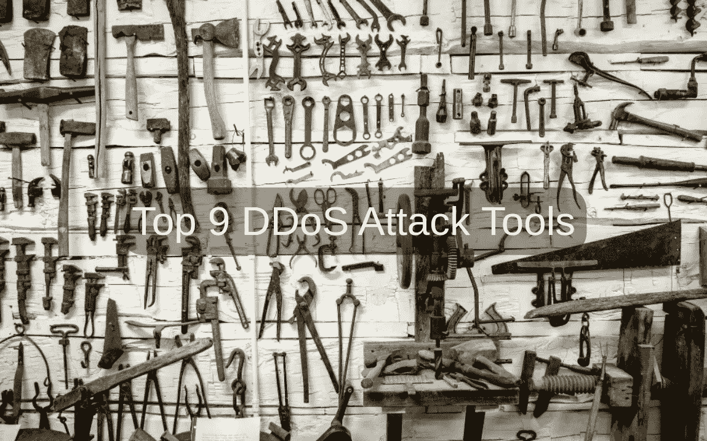

# 关于 DDoS 的一点理论。第 3 部分 9 大 DDoS 攻击工具

> 原文：<https://blog.devgenius.io/a-bit-of-theory-about-ddos-part-3-top-9-ddos-attack-tools-a42c256fd4c8?source=collection_archive---------10----------------------->

这是入门材料。本文中的所有信息都不是行动号召。

*系列文章的第 1 部分是* [*这里是*](/a-bit-of-theory-about-ddos-part-1-categories-of-ddos-attacks-9f71d55d9c99) *。*

*系列文章的第 2 部分是* [*这里的*](/a-bit-of-theory-about-ddos-part-2-more-about-the-categories-of-ddos-attacks-7f3208597688) *。*

在我看来，这是最有趣的事情，它是尝试一些东西，当然，最好是在你的基础设施上尝试，我们正在建立一个安全的服务，对不对？

**1。黄金眼**

黄金眼工具通过向服务器发送 HTTP 请求来实施 DDoS 攻击。它使用 KeepAlive 消息和缓存控制选项来保持套接字连接打开。

特性:

*   该工具使用应用服务器上的所有 HTTP/S 套接字进行 DDoS 攻击。
*   可以任意创建用户代理。
*   它随机化 GET 和 POST 以获得混合流量。
*   这是一个用 Python 编写的简单易用的应用程序。

**2。达沃斯论坛**

DAVOSET 是利用任何网站功能的 DDOS 攻击软件。这个命令行工具将帮助您执行分布式拒绝服务攻击，而不会给 DAVOSET 带来任何麻烦。

特性:

*   它提供对 cookies 的支持。
*   该工具提供了执行攻击的命令行界面。
*   DAVOSET 还可以帮助您执行 XML 外部实体攻击(对解析 XML 输入的应用程序的攻击)。

**3。托尔的锤子**

Tor'shammer 是一个应用层 DDoS 程序。您可以将此工具用于 web 应用程序和 web 服务器定位。它根据用于加载网页的浏览器发出互联网请求。

特性:

*   这允许您使用 Markdown(一种纯文本格式语法工具)创建富文本标记。
*   Tor 的锤子会自动把网址转换成链接。
*   这个应用程序使用 web 服务器的资源，创建了大量的网络连接。
*   您可以快速链接项目中的其他工件。
*   它支持 1000 到 30000 秒之间的 HTTP POST 请求和连接。

**4。幽门**

幽门是一种软件产品，旨在测试互联网上的分布式拒绝服务(DDoS)攻击的网络漏洞。这有助于控制管理不善的并发连接。

特性:

*   它提供了一个易于使用的 GUI(图形用户界面)。
*   该工具允许您使用 HTTP 请求报头进行攻击。
*   它拥有最新的代码库(一组用于构建特定软件系统的源代码)。
*   可以用 Python 脚本启动幽门。
*   该工具支持 Windows、Mac OS 和 Linux。
*   它提供了一个高级选项，限制为 50 个线程，每个线程总共有 10 个连接。

**5。浩克**

HTTP 不可承受之重王(HULK)是一个 web 服务器 DDoS 工具。它专门用于在 web 服务器上生成流量。

特性:

*   这可以绕过缓存服务器。
*   此工具将帮助您生成独特的网络流量。
*   HTTP 不可承受之重王(浩克)可以很容易地用于研究目的。

**6。HOIC**

高轨道离子炮是一个免费的拒绝服务工具。它旨在同时攻击多个 URL。该工具帮助您使用 HTTP(超文本传输协议)发起 DDoS 攻击。

特性:

*   最多可以同时攻击 256 个网站。
*   它有一个计数器帮助你测量输出。
*   可以移植到 Linux 或者 Mac OS。
*   您可以选择当前攻击中的线程数量。
*   HOIC 允许你控制低，中，高设置的攻击。

**7。LOIC**

LOIC(低轨道离子炮)是一款开源的 DDoS 攻击软件。这个工具是用 C#写的。该工具向服务器发送 HTTP、TCP 和 UDP 请求。

特性:

*   LOIC 帮助您测试网络性能。
*   这允许您对他们管理的任何站点发起 DDoS 攻击。
*   即使代理服务器关闭，Loic 也不会隐藏 IP 地址。
*   这将帮助您执行压力测试，以检查系统的稳定性。
*   这种软件可以用来识别黑客用来攻击计算机网络的程序。

**8。OWASP HTTP POST**

HTTP Post OWASP(开放安全应用程序项目)软件允许您测试您的 web 应用程序的网络性能。这将帮助您从一台机器上执行拒绝服务。

特性:

*   这使您可以分发该工具并与其他人共享。
*   您可以出于商业目的自由使用该工具。
*   OWASP HTTP POST 将根据它提供的许可证帮助您共享结果。
*   该工具允许您测试应用程序级攻击。
*   这将帮助您确定服务器的容量。

**9。鲁迪(你死了吗？)**

鲁迪是 R U Dead 的简称。它将帮助您轻松执行 DDoS 攻击。它通过终止 web 服务器上可用的会话来针对云应用程序。

特性:

*   这是一个简单的轻量级工具。
*   它会自动扫描目标网站并检测嵌入的 web 表单。
*   RU-Dead-Yet 允许您使用长字段提交表单进行 HTTP DDoS 攻击。
*   该工具提供了一个交互式控制台菜单。
*   它自动确定提交数据的表单字段。

结论

这是最少的基数，如果有的话。容错系统就像一门独立的科学。你总是可以改进你系统的任何部分。最重要的是，现在您可以试验自己的基础设施/系统。找到它的弱点，并正确地重新配置它们。

回头见！