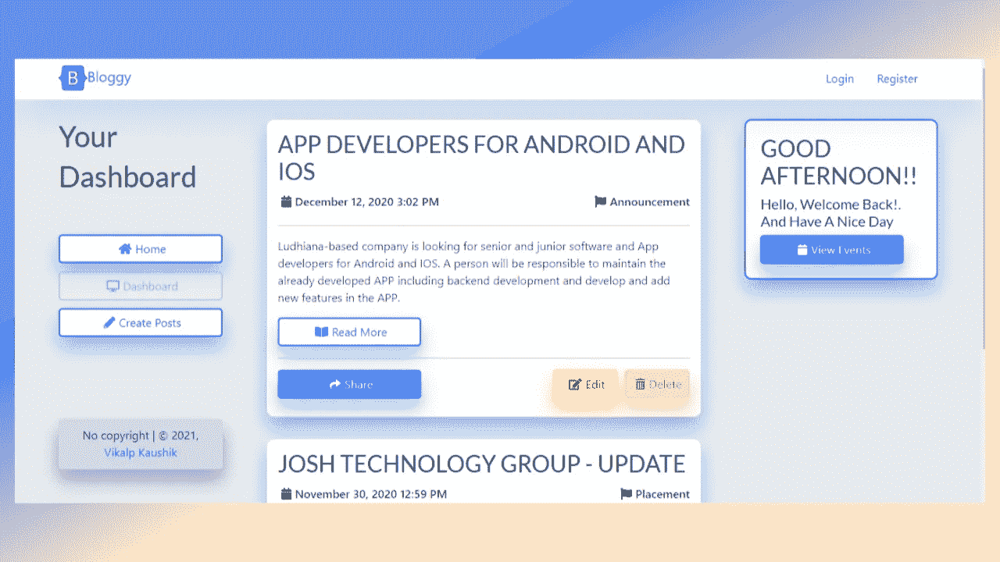
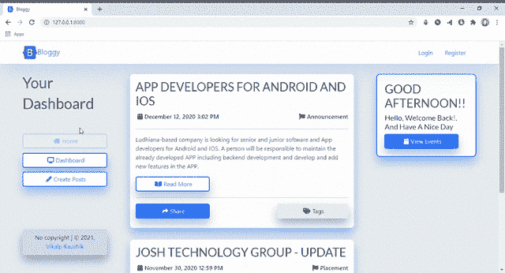
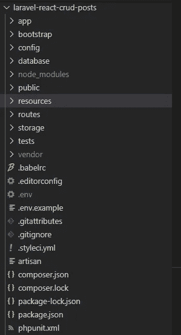

# 带有 Laravel-React (CRUD)的博客/帖子应用程序。

> 原文：<https://blog.devgenius.io/a-blogs-posts-app-with-laravel-react-crud-c714c6c5944f?source=collection_archive---------0----------------------->

## 一个 crud 操作 web 应用程序，你可以在其中创建，检索，更新，删除文章。Laravel PHP 框架中的后端和 React JS 框架中的前端。



# 主要特点:

1.  完整的 CRUD 操作(创建、检索、更新、删除)
2.  完全格式化每个帖子的时间戳。
3.  一个新的帖子总是出现在最上面。
4.  一个柔软的用户界面设计
5.  根据时间显示问候信息。
6.  响应所有设备！！
7.  即将添加认证(与 GitHub 连接)

**这里是项目** [**GitHub 仓库**](https://github.com/vikalp2502/laravel-react-crud-posts) **，你可以克隆或者下载完整的项目，这个项目的最终结果会是这样的**



完整演示

# 现在让我们开始吧

要打开这个项目，需要 Laravel 的**“PHP”、“Composer”**和 React 的**“Node Js”【NPM】**。如果你有，那么它很好，如果没有，那么下载一切并安装它。

对于 web 开发作品来说，Visual Studio 代码已经足够好了。我在 react 和其他网络技术工作中使用它。你可以使用任何你喜欢的，但我强烈建议你使用。

从 [GitHub 库](https://github.com/vikalp2502/laravel-react-crud-posts)下载或克隆项目文件。在 VSCode 中打开文件夹。项目目录或文件夹结构应该如下所示。



图片作者。

**步骤 1:** 进入 vscode 内部的终端，更改目录以下载项目。

```
$ cd laravel-react-crud-posts
```

**步骤 2:** 复制. env.example 并粘贴在那里，重命名为。包封/包围（动词 envelop 的简写）

```
$ DB_CONNECTION= mysql 
  DB_HOST=127.0.0.1 
  DB_PORT=3306 
  DB_DATABASE= Whatever table name you have in MySQL
  DB_USERNAME= root
  DB_PASSWORD=
```

现在，写吧

```
$ composer install
$ npm install
```

它将安装 laravel 和 react 的所有包和依赖项，这将需要几分钟时间。

第四步:写完后

```
$ php artisan key:generate
```

第五步:现在启动项目，在两个不同的终端上写作

```
$ php artisan serve
$ npm run watch
```

它将在本地服务器端口 8000 上启动项目。

# 让我们从头开始创造

## 设置:

```
$ composer create-project --prefer-dist laravel/laravel ProjectName
```

打开项目，现在我们将 React Js 与 laravel 集成在一起

```
$ composer require laravel/ui
$ php artisan ui react
$ npm install
```

**Resources =>Views =>welcome.blade.php**文件，这里我们要链接 css、javascript 文件。

现在在本地主机/服务器 8000 上启动项目

```
$ php artisan serve
$ npm run watch
```

在两个不同的终端中运行这两个命令，并在。环境文件。现在您的项目成功运行。

# 后端:

创建迁移文件、模型文件和控制器文件。

```
$ php artisan make:migration create_posts_table
$ php artisan make:controller postsController --resource
$ php artisan make:model Posts
```

现在，**database =>migration =>current _ time _ create _ posts _ table . PHP**文件中，添加了新的字段。

现在，app = > Http = > Controllers = > postscontroller . PHP 并添加 crud 函数。

现在，**app =>Models =>Posts.php**并添加表格的可填写明细。

```
$ php artisan migrate
```

现在在**routes =>web.php**文件中定义所有后端路由，并添加所有路由。

# 前端:

在**resources =>js =>components =>example . js**中添加前端路由

现在，创建一个文件**“dashboard . js”**来显示所有的帖子。

创建一个文件**“create posts . js”**用于创建新帖子。

创建一个文件 **"EditPosts.js"** 用于编辑选中的文章。

# 万事如意！！！

感谢你阅读这篇文章，我希望这篇文章对你有帮助，并且你喜欢我的作品。与你的朋友分享这篇文章。

# 与我联系:

网址: [shape4.netlify.app](http://shape4.netlify.app)

**Instagram:** [vikalp。_.考希克](https://instagram.com/vikalp._.kaushik)

**Linkedin:**[vikalp-kaushik-99966 a1 ab](https://linkedin.com/in/vikalp-kaushik-99966a1ab)

**GitHub:**vikalp 2502