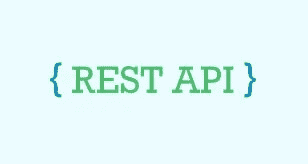

# Rest APIs 简介

> 原文：<https://blog.devgenius.io/a-brief-about-rest-apis-7e9a135cffb1?source=collection_archive---------7----------------------->



我想你在看这篇文章之前已经听说过 REST APIs 了。但是也许你不知道基本知识，或者你可能不明白它的意思。

所以，我们从基础开始，看看 **API** ，(应用编程接口)，

主要是指客户机和服务器之间的通信。通过不同的 Restful web 服务访问资源只不过是一种架构风格。例如

如果您想要处理来自您的服务的所有用户，您必须创建一个 API 来与您的服务器后来的数据库进行通信。

**解剖一个请求:** **获取所有用户:**

```
URL: https://example.com/api/v1/users METHOD: GET REQUEST BODY: None HEADERS: Authorization: Bearer Token "....", Content-Type: application/json
```

您会得到所有用户的回复:

```
{
  "User": [
    {
      "property": [
        {
          "name": "username",
          "value": "nimadmin"
        },
        {
          "name": "password",
          "value": "AAAAEDFsjJUDxVV9PK+2putOEiUsoPzGAcDjnMGFie4NC01Z"
        }
      ]
    },
    {
      "property": [
        {
          "name": "username",
          "value": "nimuser"
        },
        {
          "name": "password",
          "value": "AAAAEI6OGUMkIH/VZWc1wS+G2qTf9QUtmYdjOLdK/PJQLHZo"
        }
      ]
    }
  ]
}
```

**请求端点**

1. **URL 或端点**:路径决定了你所请求的资源，你一定见过类似:username，{username}，/authors？name=ankit 等。可以通过 HTTP 请求发送路径、查询参数和表单。

API 查询参数可以定义为可选的键值对，出现在 URL 中的问号之后。基本上，它们是 URL 的扩展，用于根据交付的数据帮助确定特定的内容或操作。使用“？”将查询参数附加到 URL 的末尾。问号符号用于分隔路径和查询参数。例如

```
https://example.com/articles?sort=ASC&page=2 http//www.techopedia.com/search.aspx?q=database&ion-allA. GET: It is used to get or fetch all or specific resources among the server. Commonly used to show data to the client side.B. POST: The post method is used to pass the data from client to server, Suppose a new user creation, then data would be further saved in the database with the help of the POST Method.C. PUT: PUT is similar to POST in that it can create resources, but it does so when there is a defined URL wherein PUT replaces the entire resource if it exists or creates new if it does not exist. D. PATCH: Unlike PUT Request, PATCH does partial updates e.g. Fields that need to be updated by the client, only that field is updated without modifying the other field. E. DELETE: If you perform a DELETE request, the server deletes an entry in the database and tells you whether the deletion is successful. A DELETE request performs a DELETE operation. F. OPTIONS method returns info about API. G. HEAD method returns info about resources.
```

3.**头**:这是一个 **HTTP** 头，可以在 **HTTP** 请求中使用，提供关于请求上下文的信息，以便服务器可以定制响应。例如，`Accept*`头指示响应的允许格式和首选格式。其他头可以用于提供认证凭证(例如*)、控制缓存、获取关于用户代理或推荐者的信息等。*

*4. **Data/Body** :数据包含了你想要发送到服务器的信息。该选项仅用于`POST`、`PUT`、`PATCH`或`DELETE`请求。例如*

*XML 响应:*

```
*<Person> <mobile>1234567890</mobile> <firstName>Shanaya</firstName > <lastName>Mehta</lastName> <age>25</age> </Person>*
```

*JSON 回应:*

```
*{ "mobile":"1234567890", "firstName":"Sub", "Lastname":"Stack", }*
```

*说明不同 RESTful API 端点的表格*

*让我们也理解为什么它被称为 **REST** ，(表述性状态转移)，当浏览器(客户端)能够向服务器发送多个请求时，服务器不需要关于客户端本身的信息，因此它是一个**无状态数据事务。**
Restful Routes 是一套标准的规则，通过使用一套 **HTTP 方法**来完成服务器请求，用来执行 **CRUD** 操作。*

*客户端和服务器之间的通信必须是无状态的。这意味着从客户端到服务器的每个请求都必须包含完成交易所需的所有信息。*

*这种约束的主要优点是系统能够更好地伸缩，因为服务器不必存储请求之间的客户端状态。不必记住客户机状态信息释放了服务器资源，因此它可以同时为更多的客户机服务。*

```
*An operation is said to be idempotent if it doesn't change the result even when applied multiple times. The multiple operations will have the same effect leaving us with the same result that we obtained when it was applied initially for the first time.*
```

*最初，当我们用 1 乘以 1 时，我们得到的结果是 1。之后，无论我们做多少次同样的乘以 1 的运算，最终结果都是一样的。因此，这是一个幂等运算。*

*上面的乘以 5 的运算不是幂等的。因为每次应用该操作时，最终结果都会像 25、125、…*

> ****REST API 和幂等:****

*当我们说一个 HTTP 方法在 REST API 上下文中是**等幂的**时，我们的意思是如果我们一个接一个地发送多个相同的请求，只有最初的请求会导致系统底层状态的改变，而所有后续的请求将保持状态不变**。***

```
*Method  Is Idempotent  Is Safe
HEAD        yes         yes
OPTIONS     yes         yes
GET         yes         yes
POST        no          no
PUT         yes         no
PATCH       no          no
DELETE      yes         no*
```

*如果你想知道**是安全的**栏是什么意思，那就是任何不修改服务器状态的 HTTP 方法都被归类为安全方法。如果你看一下这个表，所有用来检索数据的方法(GET、HEAD、OPTIONS)都是安全的，因为它们的处理程序本质上是一个读端点。*

*当客户端请求服务器时，服务器提供 HTTP 响应状态代码，这允许我们了解网站后端发生了什么，并确定需要修复哪些错误。所有 HTTP 响应状态代码分为五类。*

*状态代码的第一个数字定义了响应的类别。第一位有五个值:
***1xx(信息):*** 浏览器发起的请求正在继续。
***2xx(成功):*** 请求被服务器成功接收、理解并处理。
***3xx(重定向):*** 请求的信息不再位于所提供的地址，需要采取进一步的措施来完成请求。
***4xx(客户端错误):*** 客户端的请求出现问题时。
***5xx(服务器错误):*** 当客户端发出有效请求，但服务器无法完成转账。*

*这就对了。关于 RESTful APIs，你需要知道的差不多就这些了！*

*我希望阅读这篇文章能让你对相同的工作有一个简单的概念。请让我知道你想知道更多关于 RESTful APIs 的内容，以及你想让我给这篇文章添加什么，以便它能提供更多的信息，更容易理解，尤其是对初学者来说！*

*我还建议您动手做一个自己的 rest API。*

***还有，跟我上媒:**[**https://jinxankit.medium.com**](https://jinxankit.medium.com)*

*参考:*

*[https://developer . Mozilla . org/en-US/docs/Learn/JavaScript/Client-side _ web _ APIs/简介](https://developer.mozilla.org/en-US/docs/Learn/JavaScript/Client-side_web_APIs/Introduction)[https://www.w3.org/Protocols/rfc2616/rfc2616-sec10.html](https://www.w3.org/Protocols/rfc2616/rfc2616-sec10.html)[https://medium.com/edureka/what-is-rest-api-d26ea9000ee6](https://medium.com/edureka/what-is-rest-api-d26ea9000ee6)[https://medium . com/codex/everything-about-rest-API-4 ab 4 ee 9 ea 2 c 8](https://medium.com/codex/everything-about-rest-api-4ab4ee9ea2c8)*

**原载于 2022 年 8 月 6 日 https://jinxankit.substack.com**[*。*](https://jinxankit.substack.com/p/a-brief-about-rest-apis)**