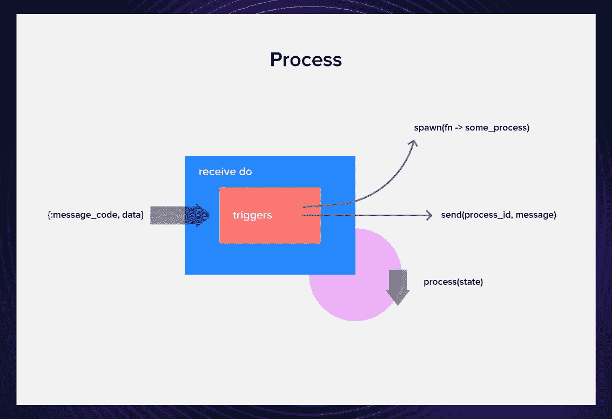

# 酏剂中 OTP 的简要指南

> 原文：<https://blog.devgenius.io/a-brief-guide-to-otp-in-elixir-c466dee41118?source=collection_archive---------0----------------------->

## 了解如何在 Elixir 中释放 Erlang 的力量


由 [Mathyas Kurmann](https://unsplash.com/photos/fb7yNPbT0l8) 在 [Unsplash](https://unsplash.com/) 上拍摄的照片。

Elixir 的一个主要优点是它非常适合服务器端系统。忘记在数据持久性、后台作业和服务崩溃恢复等方面使用一百万种不同的技术，OTP 可以为您提供一切。

*那么这个神奇的东西到底是什么呢？*

在本文中，我将向您介绍 OTP，查看基本的流程循环、GenServer 和 Supervisor 行为，并了解如何使用它们来实现存储资金的基本流程。

(本文假设你已经熟悉了灵药的基础知识。如果你不是，你可以在 Elixir 的网站上查看[入门指南](https://elixir-lang.org/getting-started/introduction.html)，或者使用我们的 [Elixir 指南](https://serokell.io/blog/learn-elixir)中列出的其他资源。)

# 什么是 OTP？

OTP 是一套很棒的工具和库，Elixir 从 Erlang 继承而来，[一种编程语言，它在它的 VM 上运行](https://serokell.io/blog/history-of-erlang-and-elixir)。

OTP 包含了很多东西，比如 Erlang 编译器、数据库、测试框架、profiler、调试工具。但是，当我们在 Elixir 的上下文中谈论 OTP 时，我们通常指的是基于轻量级流程的 Erlang actor 模型，它是使 Elixir 如此高效的基础。

# 处理


在 OTP 的基础上，有一些微小的东西叫做进程。

不像操作系统进程，它们是非常非常轻量级的。创建它们需要几微秒的时间，一台机器可以轻松地同时运行数千个。

流程遵循[角色模型](https://en.wikipedia.org/wiki/Actor_model)。每个进程基本上都是一个可以接收消息的邮箱，并且为了响应这些消息，它可以:

*   创造新的演员。
*   向其他参与者发送消息。
*   修改其私有状态。



# 产卵过程

生成进程最基本的方法是使用 spawn 命令。我们打开 IEx，推出一个。

```
iex(1)> process = spawn(fn -> IO.puts("hey there!") end)
```

上述函数将返回:

```
hey there! 
#PID<0.104.0>
```

第一个是函数的结果，第二个是 spawn-PID 的输出，这是一个惟一的进程标识号。

同时，我们的流程有问题。虽然它完成了我们要求它做的任务，但它现在好像……死了？😱

让我们使用它的 PID(存储在变量`process`中)来查询生命迹象。

```
iex(2)> Process.alive?(process) 
false
```

想想也有道理。这个过程做了我们要求它做的事情，完成了它存在的理由，并且关闭了它自己。但是有一种方法可以延长这个过程的寿命，使它对我们来说更有价值。

# 接收-执行循环

事实证明，我们可以将流程函数扩展为一个循环，该循环可以保存状态并修改它。

例如，假设我们需要创建一个流程来模拟皇宫金库中的资金。我们将创建一个简单的过程，您可以在其中存储或提取资金，并请求当前余额。

我们将通过创建一个循环函数来做到这一点，该函数响应某些消息，同时将状态保持在其参数中。

在函数体中，我们将 receive 语句和模式与我们希望流程响应的所有消息相匹配。每次循环运行时，它都会检查邮箱底部是否有符合我们需要的邮件，并对它们进行处理。

如果该流程看到任何包含原子`store`、`withdraw`、`balance`的消息，这些消息将触发某些操作。

为了让它变得更好，我们可以添加一个`open`功能，还可以转储所有我们不需要的消息，以免污染邮箱。

虽然这看起来很简洁，但是已经隐藏了一些样板文件，我们甚至还没有讨论生产级代码所必需的极限情况、跟踪和报告。

在现实生活中，我们不需要用 receive do 循环编写代码。相反，我们使用比我们聪明得多的人创造的行为之一。

# 行为

许多过程遵循某些相似的模式。为了抽象这些模式，我们使用行为。行为有两部分:我们不必实现的抽象代码和特定于实现的回调模块。

在本文中，我将向您介绍 [GenServer](https://hexdocs.pm/elixir/GenServer.html) ，简称 *generic server* ，以及 [Supervisor](https://hexdocs.pm/elixir/Supervisor.html) 。这些并不是唯一的行为，但它们肯定是最常见的行为之一。

# 根服务器


首先，让我们创建一个名为`Treasury`的模块，并将 GenServer 行为添加到其中。

```
defmodule Palace.Treasury do
   use GenServer 
end
```

这将为行为引入必要的样板文件。之后，我们需要为我们的特定用例实现回调。

以下是我们将在流程中使用的回调:

*   `init(state)`初始化服务器，通常返回`{:ok, state}`
*   `handle_cast(pid, message)`处理不需要服务器应答的异步调用，通常返回`{:noreply, state}`
*   `handle_call(pid, from, message)`处理要求服务器应答的同步调用，通常返回`{:reply, reply, state}`

让我们从最简单的开始——`init`。它获取一个状态，并以该状态开始一个进程。

```
def init(balance) do
  {:ok, balance}
end
```

现在，如果你看看我们用`receive`写的简单代码，有两种类型的触发器。第一个(`store`和`withdraw`)只是要求财政部异步更新其状态，而第二个(`get_balance`)则等待回答。`handle_cast`可以处理异步的，而`handle_call`可以处理同步的。

为了处理加法和减法，我们需要两次造型。它们接受带有命令和交易金额的消息，并更新状态。

```
def handle_cast({:store, amount}, balance) do
  {:noreply, balance + amount} 
end def handle_cast({:withdraw, amount}, balance) do
  {:noreply, balance - amount} 
end
```

最后，`handle_call`获取 balance 调用、调用者和状态，并使用所有这些来回复调用者并返回相同的状态。

```
def handle_call(:balance, _from, balance) do 
  {:reply, balance, balance} 
end
```

这些是我们所有的回调:

为了隐藏实现细节，我们可以在同一个模块中添加客户端命令。因为这将是宫殿中唯一的库，所以让我们在用`start_link.`生成它的时候给进程起一个和它的模块名一样的名字，这样会更容易引用它。

让我们试一试:

```
iex(1)> Palace.Treasury.open() 
{:ok, #PID<0.138.0>} 
iex(2)> Palace.Treasury.store(400) 
:ok 
iex(3)> Palace.Treasury.withdraw(100) 
:ok 
iex(4)> Palace.Treasury.get_balance() 
300
```

它工作了。🥳

这里有一张关于 GenServer 的备忘单，可以帮助你记住在哪里放什么。

# 监督者


然而，仅仅让一个国库在没有监管的情况下运行是有点不负责任的，也是让你失去资金或脑袋的好方法。😅

谢天谢地，OTP 为我们提供了[主管行为](https://hexdocs.pm/elixir/Supervisor.html)。主管可以:

*   启动和关闭应用程序，
*   通过重启崩溃的进程提供容错，
*   用于构建一个分层监督结构，称为*监督树*。

让我们给我们的国库配备一个简单的监督员。

在最基本的情况下，一个监控器有两个功能:`start_link()`，它将监控器作为一个进程运行，以及`init`，它提供监控器初始化所必需的参数。

我们需要注意的是:

*   **孩子的名单。在这里，我们列出了我们希望管理程序启动的所有进程，以及它们的 init 函数和启动参数。每个过程都是一个映射，其中至少有`id`和`start`键。**
*   **主管的** `**init**` **功能。为此，我们提供了子进程列表和监督策略。这里，我们使用`:one_for_one`——如果一个子进程崩溃，只有那个进程会被重启。还有[多几个](https://hexdocs.pm/elixir/Supervisor.html#module-strategies)。**

运行`Palace.Treasury.Supervisor.start_link()`函数将会打开一个金库，这个金库将会受到流程的监督。如果财政部崩溃，它将以初始状态- 0 重新启动。

如果我们愿意，我们可以向这个监管器添加几个与财务功能相关的其他流程，比如一个可以将被掠夺的物品兑换成货币价值的流程。

此外，我们还可以复制或持久化国库流程的状态，以确保我们的资金在国库流程崩溃时不会丢失。

既然这是一个基本指南，我就让你自己调查一下可能性。

# 进一步阅读

这个介绍非常基础，可以帮助您快速理解 OTP 背后的概念。如果你想了解更多，这里有很多很好的资源:

*   [**仙丹**](https://www.youtube.com/watch?v=CJT8wPnmjTM) **中的 OTP 介绍。**视频格式的 OTP 简介。
*   [**用 OTP 设计药剂系统**](https://pragprog.com/titles/jgotp/designing-elixir-systems-with-otp/) **。了解如何构建您的 Elixir 应用程序并正确使用 OTP。**
*   [**OTP 作为你应用的核心**](https://akoutmos.com/post/actor-model-genserver-app/) **。关于用 GenServer 创建一个实际有用的应用程序的很酷的两部分系列。**
*   [**小仙丹& OTP 指导手册**](https://www.manning.com/books/the-little-elixir-and-otp-guidebook) **。一本关于灵药和 OTP 的方便的书，它有一个关于天气数据的很酷的玩具项目。**