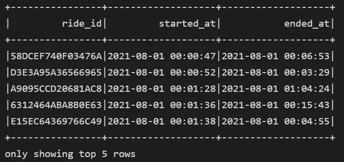
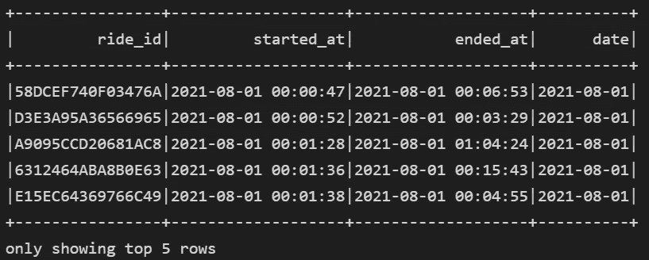
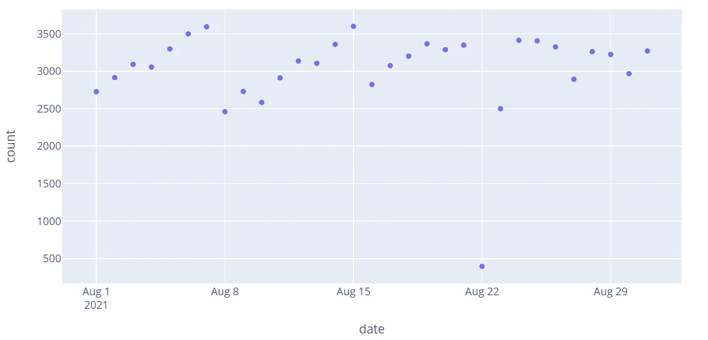
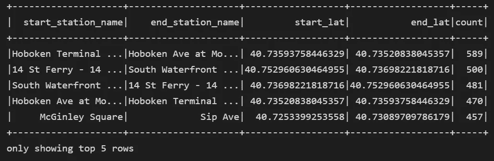
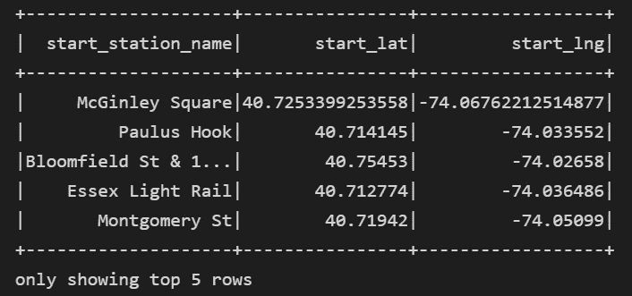

# PySpark 简介

> 原文：<https://blog.devgenius.io/a-brief-intro-to-pyspark-552e3be1bd60?source=collection_archive---------11----------------------->

PySpark 是 Spark 的 Python API，通常用于大容量数据应用。它的分布式计算框架通常跨云平台使用，尽管它具有可扩展性，但它不像 Pandas 这样的框架那样受欢迎。您可能从未遇到过需要昂贵的 Spark 集群来运行计算的情况，但是您仍然可以在本地使用该框架并进行尝试。在本文中，我将向您展示一个使用 PySpark 进行数据探索的简单练习，让您感受一下 PySpark 和 Pandas 之间的语法和差异。


来源:[www . data bricks . com glossary/py spark](http://www.databricks.comglossary/pyspark)

# 安装和会话初始化

您可以通过 PyPi 安装 PySpark，方法是打开终端窗口(在 VS 代码中，您可以通过按 Ctrl +')并使用以下命令:

```
pip install pyspark
```

第一步是初始化一个会话。从文档来看，“SparkSession 可以用来创建一个**数据帧**，将**数据帧**注册为表，对表执行 SQL，缓存表，以及读取 parquet 文件”。

在我的例子中，我将分析花旗自行车的数据，这是纽约的一个自行车共享系统，因此得名“自行车”。

```
#Initialize Spark Session
from pyspark.sql import SparkSessionspark = SparkSession \
    .builder \
    .appName("Bikes") \
    .config("spark.some.config.option", "some-value") \
    .getOrCreate()
```

# 获取数据

我将使用的数据可以来自花旗自行车网站。[在这里](https://ride.citibikenyc.com/system-data)你可以访问历史数据。在我的例子中，我选择了几个小文件，因为这只是为了演示。我下载了 CSV 格式的文件，并以这种格式阅读。如果您想下载 S3 桶中的所有数据，您可能需要编写更复杂的管道来确保您不会得到重复的数据。

```
df_main = spark.read.format("csv").option("header","true").load('nyc/07-04-2022-202108-nyc.csv')df_main.columnsOutput: ['ride_id',  'rideable_type',  'started_at',  'ended_at',  'start_station_name',  'start_station_id',  'end_station_name',  'end_station_id',  'start_lat',  'start_lng',  'end_lat',  'end_lng',  'member_casual']
```

我想分析的第一件事是我们每天实际乘坐的次数，以及这个月的变化情况。此外，我们所看到的日期间隔是多少

首先，让我们选择足够的列来使用`.select()`方法执行我们的查询。这是熊猫相当于写作`dataframe[‘ColumnName’]`。然后，让我们在旅程开始时订购，以便更轻松地可视化数据。

```
df_light = df_main.select('ride_id', 'started_at','ended_at').orderBy('started_at')
df_light.show(5)
```



如果我们想计算每天有多少行，我们不能使用时间戳。但是，我们可以添加一个列- `.withColumn()-`，并使用`to_date()`将等价日期传递给它。

```
from pyspark.sql.functions import to_datedf_light = df_light.withColumn('date',to_date(df_light.started_at))
df_light.show(5)
```



添加了新的日期列。

我们也可以用下面几行得到最小和最大日期。因为我们不能在 Pyspark 中对 Column 对象执行`max()`,所以我们本质上是将 Dataframe】到一列`row` 对象中，并使用索引查询来查找字符串值。请注意，数据框已经订购。

```
# Getting Minimum and Maximun date in the Intervalmax_value = df_light.agg({"date": "max"}).collect()[0][0]
min_value = df_light.agg({"date": "min"}).collect()[0][0]print('min, max : ' , min_value,max_value)
Output: min, max :  2021-08-01 2021-08-31
```

我们现在可以在`.count()`上`.groupBy()`日期，以获得每日乘车次数。

```
df_light_agg = df_light.select('date').groupBy('date').count().orderBy('date')df_light_agg.show()
+----------+-----+ 
|      date|count| 
+----------+-----+ 
|2021-08-01| 2727| 
|2021-08-02| 2915| 
|2021-08-03| 3092|
```

下一个合乎逻辑的步骤是想象这一趋势。为了绘图，我使用`.toPandas()` 方法将 PySpark 数据帧转换为 Pandas，并使用 Plotly 绘图。使用 Plotly，如果您转换您的数据帧，它会容易得多，因为该框架与 Spark 数据帧不兼容。

```
import plotly.express as pxfig = px.scatter(df_light_agg.toPandas(), x="date", y="count")
fig.show()
```



八月份每日乘车次数。

现在，进行第二轮分析，让我们了解我们的数据中有多少个站，哪些路线最繁忙。首先，选择必填字段。

```
df_stations = df_main.select('ride_id',
 'started_at',
 'start_station_name',
 'end_station_name', 'start_lat',
 'start_lng',
 'end_lat',
 'end_lng')
```

按组合数分组，即按包含起点站和终点站的路线分组。

```
df_stations_combinations = df_stations.select('start_station_name',
 'end_station_name', 'start_lat',
 'start_lng',
 'end_lat',
 'end_lng').groupBy('start_station_name',
 'end_station_name','start_lat',
 'start_lng',
 'end_lat',
 'end_lng').count().orderBy('count', ascending=False)
```

注意到前面语句的输出，我注意到有一条路线记录了不寻常的乘车次数(是第二多的路线的 3 倍)。这条路线的起点和终点都有相同的车站，这意味着这可能是自行车不能正确停靠和计算多次行程的问题。使用`.where()`方法，我们可以选择具有不同起点和终点的路线。使用`.col()`方法对数据帧列执行逻辑运算。

```
df_stations_combinations = df_stations_combinations.where(col('start_station_name') != col('end_station_name')).orderBy('count',ascending=False)df_stations_combinations.select('start_station_name','end_station_name', 'start_lat','end_lat','count').show(5)df_stations_combinations.count()
output : 4798 #count of distinct journeys
```



显而易见，两条主要的旅游轴线位于霍博肯码头和霍博肯大道之间，以及 14St 渡轮和南海滨之间(双向)。

现在，为了获得网格中的站点数量(对于我们正在处理的数据集)，因为我们已经采取了所有路线的组合，这意味着我们有一个包含所有站点(作为终点或起点站点)的小样本行。通过用`.union()`合并这两列并选择不同的值，我们可以推断网格中`distinct` 站的数量。

```
df_unique_stations = df_stations_combinations.select('start_station_name','start_lat','start_lng').union(df_stations_combinations.select('end_station_name','end_lat','end_lng')).distinct()df_unique_stations.count()
output: 176
df_unique_stations.show()
```



现在我们有了一个站点列表和站点之间的乘车次数，我们可以潜在地使用它们来绘图或进一步分析。

这是对 PySpark 的一个非常简短的调查，但是我希望它能让你有兴趣自己去看看。我想再写一些关于 PySpark 更高级方面的文章，并且可能写一些非常重要的流水线方面的文章。

我真的很喜欢 PySpark，因为它让我可以编写带有某种 SQL 风格的 Python。在本教程中，当使用像`.select()`、`.groupBy()`、`.where()`和`.distinct()`这样的命令时，这一点很清楚。

如果你喜欢它并且想要更多这些文章，请在评论中告诉我。

祝你愉快，

若昂

