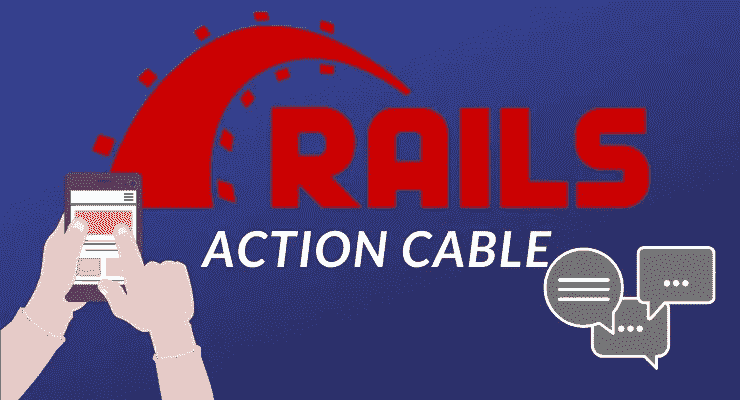

# 动作索简介

> 原文：<https://blog.devgenius.io/a-brief-introduction-to-action-cable-cfc230c33367?source=collection_archive---------19----------------------->

随着网站开始变得越来越复杂，用户交互的需求也越来越大，网络早期的问题之一就是它的单向性。用户能够检索信息，但发送消息，更不用说实时交互了，是一个非常困难的挑战。



信用:[sulmanweb.com](https://sulmanweb.com)

早期的 web 以 java 小应用程序的形式实现了一些解决方案，这些小应用程序是在网页内运行的完整程序，但是它们也很慢并且需要大量资源。然后通过 javascript 进行轮询，每隔几秒钟就向服务器请求任何变化，并相应地刷新，但不切实际的是相同的。在 websockets 出现之前，业界使用了一些解决方案，如 DHTML、微软的 XMLHTTP(XMLHttpRequest 的基础)和 ajax，都取得了不同程度的成功。

# 什么是 websockets？

Websockets 是一种位于 TCP/IP 之上的协议，允许单个全双工连接。这意味着，与 regulat HTTP 不同，在 regulat HTTP 中，客户端请求，服务器提供并关闭连接，使用 websockets，我们可以随时打开连接，等待来自任何一方的请求或响应，而不必进行昂贵的页面重新加载或诉诸怪异的技巧来呈现数据。

# 我们能用 websockets 做什么？

几乎任何涉及改变页面上已经呈现的内容的事情。金融行情、消息通知、在线聊天、体育比赛结果，应有尽有！

# 酷，我如何在 Rails 中使用它？

幸运的是，我们在 Rails 中使用 Websockets 所需要的一切都是现成的，并且非常容易设置。首先，我们有一个数据存储，在我们的例子中是 [Redis](https://redis.io/) ，它将充当发送和接收消息的服务器。然后我们有一系列的**频道**，我们的用户**订阅**。这些订阅是实际的 websockets。值得注意的是，除了初始设置之外，我们不会直接与 Redis 交互，因为 Rails 会处理所有的事情。我们开始吧！

## 初始设置

首先我们需要安装 Redis。发出`brew install redis`就可以通过 Homebrew 安装在 Mac 上。如果你在 Arch Linux 上，你可以运行`sudo pacman -Syu redis`，如果你在 Ubuntu 上，你可以运行`sudo apt install redis-server`。Windows 用户可以用一个[非常过时的端口](https://github.com/dmajkic/redis/downloads)或者[微软自己的 spin](https://github.com/microsoftarchive/redis/releases/tag/win-3.2.100) 试试运气，这也是过时的，所以我会建议运行 WSL，为 Ubuntu 安装。安装 Redis 后，您可以保留所有的默认值，但是如果您想看一看或者改变一些东西，请登录`/etc/redis.conf`。

接下来，我们将创建一个新的 Rails 应用程序，启动我们的代码编辑器，检查`./config/cable.yml`，并更改`adapter`和`url`的开发值:

```
development:
  adapter: redis
    url: redis://localhost:6379/1
```

然后我们需要生成一个通道，所以键入`rails g channel general`。这将创建一些文件，但我们感兴趣的是:

*   `./app/channels/general_channel.rb`:这个文件告诉 Rails 当用户订阅和取消订阅一个频道时该做什么。
*   这是我们将要定义通道前端逻辑的地方。如果你想测试你的设置，你可以在`connected()`方法中`console.log`一个消息。请注意，直到下一步它才会起作用，但是当您打开一个页面时，它应该会立即显示出来。

为了完成设置，我们转到`./app/channels/general_channel.rb`并将`subscribed`方法改为包含`stream_from "general_channel"`。这样，我们的聊天就设置好了，现在只需要将所有东西连接在一起。

首先是我们的路线，我们只需要其中的三条:

```
get '/', to: 'chat#index'
  post '/messages', to: 'chat#create'
  get '/messages/new', to: 'chat#new'
```

接下来，我们需要一种方法来保存我们的消息，因此键入`rails g model Message content:text`我们还需要一个用于我们的动作的控制器，因此键入`rails g controller chat`并在其中定义以下方法:

```
def index
        @messages = Message.all
        @message = Message.new
    end def show
        @messages = Message.all
    end def create
        @message = Message.create(msg_params)
        if @message.save
            ActionCable.server.broadcast "general_channel", content: @message.content
        end
    end def new
        @message = Message.new
    end private  def msg_params
        params.require(:message).permit(:content)
    end
```

除了我们的 create 方法之外，这里没有什么新东西。第一部分创建一条新消息，如果保存了该消息，则触发第二部分，即向`general`频道广播消息正文。

现在我们需要一个视图来使用我们的新超能力，所以去`./views/chat`创建一个新的`index.html.erb`。在内部，我们将构建一个简单的表单:

```
<h1>Chat</h1><div id="chat-container">
<ul id="message-list">
<% @messages.each do |message| %>
    <li><%= message.content %></li>
<% end %>
</ul>
</div>
<hr>
<%= form_with model: @message, html: {class: "message-form"} do |f| %>
<%= f.text_field :content, class:'message-input' %>
<%= f.submit "Send message!", class: "send-button" %>
<% end %>
```

如果你发送一条信息，什么也不会发生。我知道你很兴奋，但是你发的任何东西都被保存到数据库里了！如果你刷新页面，你可以看到你的消息，所以我们现在需要做的就是更新我们在`./app/javascript/general_channel.js`的 dom:

```
consumer.subscriptions.create("GeneralChannel", {
  connected() {
    // Called when the subscription is ready for use on the server
    console.log("Connected to General channel");
  }, disconnected() {
    // Called when the subscription has been terminated by the server
  }, received(data) {
    // Called when there's incoming data on the websocket for this channel
    console.log(data);
    addMessage(data.content);
  }
});function addMessage(message) {
  const messageList = document.getElementById("message-list");
  const containerDiv = document.getElementById("chat-container");
  let newComment = document.createElement("li");
  const messageInput = document.getElementsByClassName("message-input")[0];
  newComment.innerText = message;
  messageList.appendChild(newComment);
  messageInput.value = '';
  containerDiv.scrollTop = containerDiv.scrollHeight;
}
```

我们正在定义一个名为`addMessage()`的函数，它将一条消息作为参数，然后用我们的消息内容更新 dom。现在我们只需要几种风格:

```
body {
    box-sizing: border-box;
}.chat-container {
    width: 700px;
    margin: 0 auto;
    height: 500px;
    border: 1px solid #ddd;
}h1 {
    text-align: center;
}hr {
    border-top: 1px solid #ddd;
    border-bottom: none;
    width: 700px;
    margin: 0 30px 0 30px  auto;
}#chat-container {
    width: 700px;
    margin: 0 auto;
    height: 500px;
    overflow-y: auto;
    border: 1px solid #ddd;
}.message-form {
    display: flex;
    flex-flow: row wrap;
    align-items: center;
    width: 700px;
    margin: 0 auto;}.message-input {
    vertical-align: middle;
    height: 28px;
    width: 530px;
}.send-button {
    border: none;
    background-color: #0086c3;
    color: #fff;
    padding: 8px 16px;
    margin-left: 16px;
    // width: 80px;
}.send-button:hover {
    background-color: #29b6f6;
    cursor: pointer;
}
```

就是这样！现在去聊天吧！