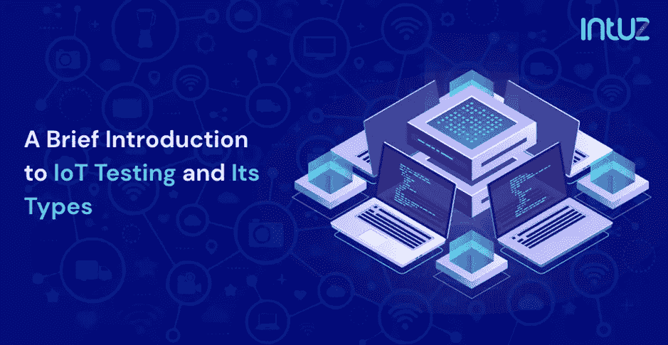
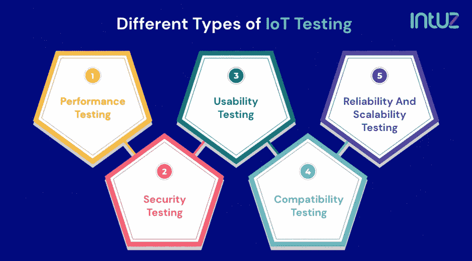
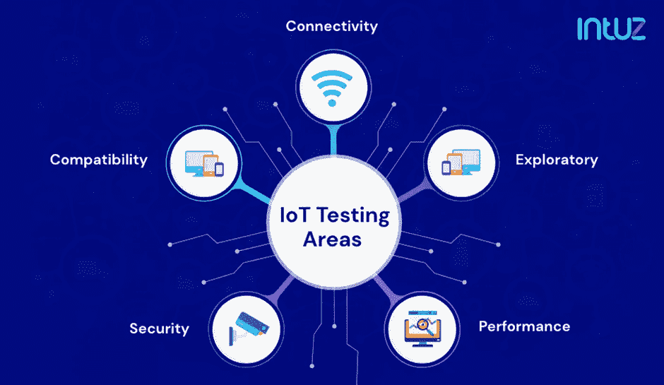

# 物联网测试及其类型简介

> 原文：<https://blog.devgenius.io/a-brief-introduction-to-iot-testing-and-its-types-4138a4659ba?source=collection_archive---------6----------------------->

物联网不同于任何其他技术实现。设备和后端系统之间的通信是实时的，数据处理是即时的，有大量的传感器协同工作等等。当跨行业和细分市场的一些最重要的流程和责任(从自动化机械和设备到支持物联网的监控系统和自动驾驶汽车)被赋予物联网的潜力时，必须采取足够的措施来优化和保持物联网单元的性能。

此外，如果我们要继续谈论物联网将如何成为所有运营的未来，或者在未来几年内世界上将有超过 750 亿台联网设备，我们必须确保该技术在部署时尽可能密闭。这就是为什么物联网测试的概念与物联网开发过程具有同等的重要性。

后者确保终端物联网产品或解决方案得以开发和推出，而前者决定其部署后的影响和有效性。在本帖中，我们将探讨什么是物联网测试，它在使物联网解决方案密封方面的重要性，以及不同类型的物联网测试方法。

让我们开始吧。

# 什么是物联网测试？

物联网测试是验证设备、外围设备和软件应用性能的复杂和分层的过程。物联网测试服务与您可能熟悉的传统软件开发测试协议和流程非常不同。软件测试和物联网测试的一个主要区别是，在软件测试中，重点是识别和消除 bug。另一方面，物联网测试完全是为了确保物联网生态系统中的任何设备、单元或系统都不会出现错误。

测试过程包括评估连接的设备是否单独或一起正常工作，网络和基础设施是否配置为处理数据传输，应用程序是否正确执行其所有功能，以及整体安全架构是否密封。

# 物联网测试的优势

测试物联网实施很困难。由于其分散的性质，开发人员和测试人员在多个平台、方法和外围设备上工作，以构建和推出稳定的物联网解决方案。这就是为什么，如果操作得当，它会带来以下好处:

●确保在传感器、云、物联网设备和门户之间建立稳固的连接

●验证物联网基础设施是否能够持续运行并交付结果

●验证是否遵守了所有合规性和协议

●评估跨设备生成的数据是否不会受到网络钓鱼、恶意软件或其他有针对性的攻击

●消除物联网生态系统中的所有漏洞

●确保系统针对自动化等进行了优化

# 了解不同类型的物联网测试

物联网解决方案中的数据不是从单个接触点生成的。你有来自设备、传感器、边缘系统、嵌入式解决方案、人、可穿戴设备、产品日志、机器和设备、库存和其他来源的数据。当来自这些不同资源的数据汇聚到一个生态系统中时，必须部署多个测试程序来验证和确认几个方面。

让我们看看这是如何通过不同类型的物联网测试服务来实现的。

# 性能试验

一切最终归结为用户体验。您可能有最具创新性的想法来通过您的物联网解决方案解决现实世界的问题，但如果它无法执行其任务，它就无法达到其目的。此外，消费者对可能导致他们中断的微小故障和滞后越来越敏感。这就是物联网解决方案的整体功能和性能至关重要的原因。

性能测试解决了所有这些问题，让开发人员和测试人员通过多种性能指标来验证物联网解决方案，如数据库性能、应用程序加载速度、有效正常运行时间、负载容忍度、数据传输速度、数据包丢失等。测试人员还在性能测试中评估数据如何从一个节点或网络传输到另一个节点或网络。我们的目标是推出一个解决方案，性能测试通过让开发人员和测试人员通过多种性能指标来验证物联网解决方案，如数据库性能、应用程序加载速度、有效正常运行时间、负载容忍度、数据传输速度、数据包丢失等。测试人员还在性能测试中评估数据如何从一个节点或网络传输到另一个节点或网络。目标是推出一个为不间断性能而构建的解决方案。

# 安全测试

在测试和优化物联网环境时，安全性可能是最重要的方面。即使一个设备或外围设备受到威胁，整个网络也很容易瘫痪。此外，物联网环境中可能存在大量敏感信息，如用户详细信息、支付和交易详细信息、位置和 GPS 详细信息等。为了避免此类数据的泄露，解决方案必须确保达到最佳水平。

在不安全测试中，专业人员致力于评估和检测任何潜在的安全缺陷和漏洞，并缓解它们。它们还检查数据干扰、启动时的身份验证、凭证和密码、防火墙性能等。为了领先入侵者一步，还会不断推出更新和补丁。

# 可用性测试

这一切都是为了评估和验证你的应用带给用户的整体体验。为数据、数字处理和可视化构建高级模块是好的，但你的应用程序是为了易用而设计的吗？用户使用你的应用需要学习曲线吗？对于非技术用户开始使用是否足够直观？

可用性测试涵盖了使用你的[物联网平台](https://www.intuz.com/blog/top-iot-development-platforms-and-tools?utm_source=Medium&utm_medium=IoT+Testing&utm_campaign=November-2021)和应用的所有前端方面。这包括测试应用程序的设计、导航、模块、功能及其可用性、内容的清晰度及其色调、配色方案等。

# 兼容性测试

物联网环境是多种架构和协议的融合。每一个设备或外围设备都按照自己的标准运行。虽然有些可能很简单，但大多数都很复杂。将它们整合在一起形成一个统一的解决方案不仅繁琐，而且复杂。

从修改框架和协议到确保它们跨操作系统、设备、网络、浏览器、平台等协同工作，涉及几个过程。此外，在这个过程中还必须实现数据互操作性。

这些正是兼容性测试中发生的事情。

# 可靠性和可扩展性测试

设备和外围设备必须在不同的环境和操作条件下进行性能测试。由于互联设备可以部署在任何地方，因此可靠性测试变得不可避免，以最终证明解决方案的结果是可靠的。

另一方面，可扩展性测试可以确保您是否可以从物联网生态系统中添加或删除设备，并且仍然期望解决方案能够提供无缝的结果。这可确保您的解决方案发挥最大潜力，即使添加了更多设备或更多用户同时使用您的解决方案。

# 物联网测试中的常见挑战

物联网测试面临诸多挑战。其实挑战比解决方案多。随着物联网开发解决方案变得更加小众和具体，闻所未闻的挑战也开始涌现。为了让您有所了解，以下是物联网测试中的一些常见挑战:

●训练物联网模块的训练或测试数据的可用性是一个挑战。这是因为为了获得最精确的结果，测试数据需要是相关的、上下文相关的和最新的。

●很难重新创建一个环境来测试物联网设备。例如，考虑可靠性测试。复制海上石油钻塔或煤矿的条件具有挑战性。

●合适硬件的可用性也是一个令人困扰的问题，在现实环境中部署时，缺少合适的硬件会影响性能和结果。

●同时，高质量硬件的可用性也至关重要。传感器必须精确，设备必须正确校准等等。

●网络配置是下一个挑战。网络的设计是否能够处理复杂的流程和负载？它是否兼容多种设备？

# 包扎

我们今天看到或体验到的每一个物联网实施都是持续和严格测试的结果。除此之外，公司和组织根据他们的业务和用例需求，提出他们自己独特的测试策略和协议。我们真诚地相信，您现在已经更好地理解了什么是物联网测试，以及使物联网解决方案稳定和密封的复杂过程。

*更多内容尽在*[*blog . dev genius . io*](http://blog.devgenius.io)*。*