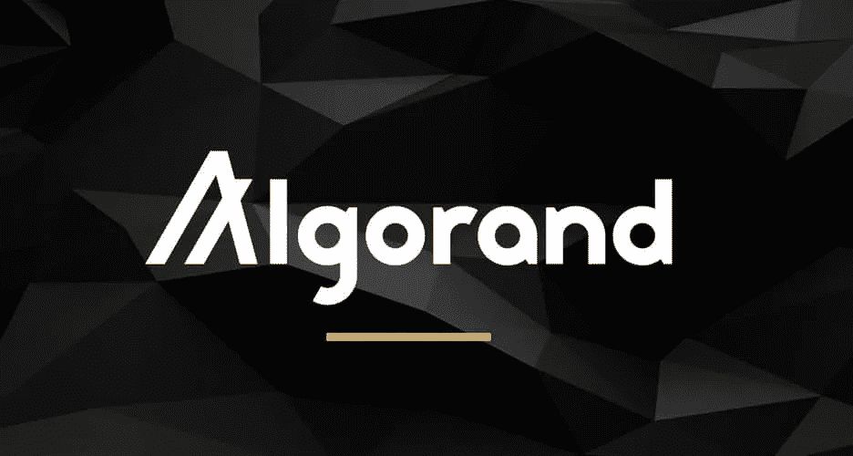
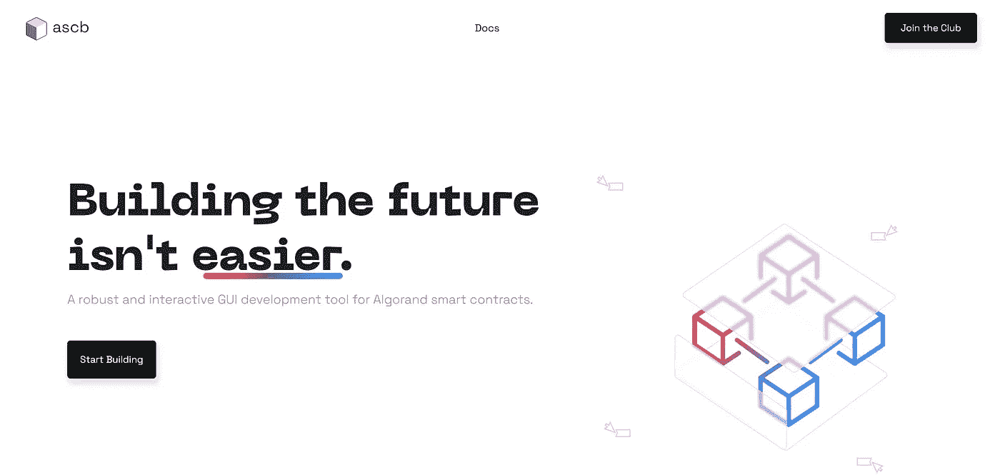
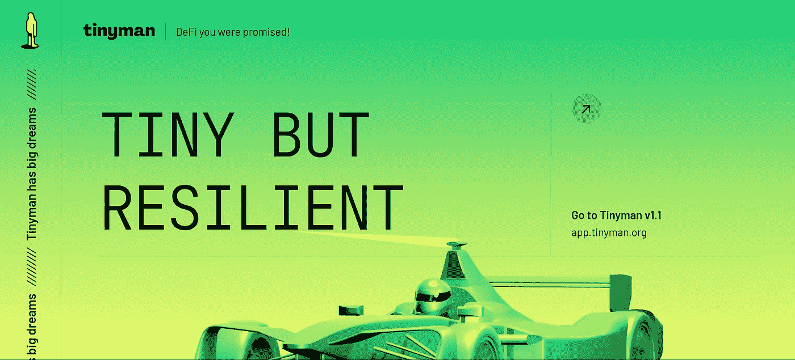
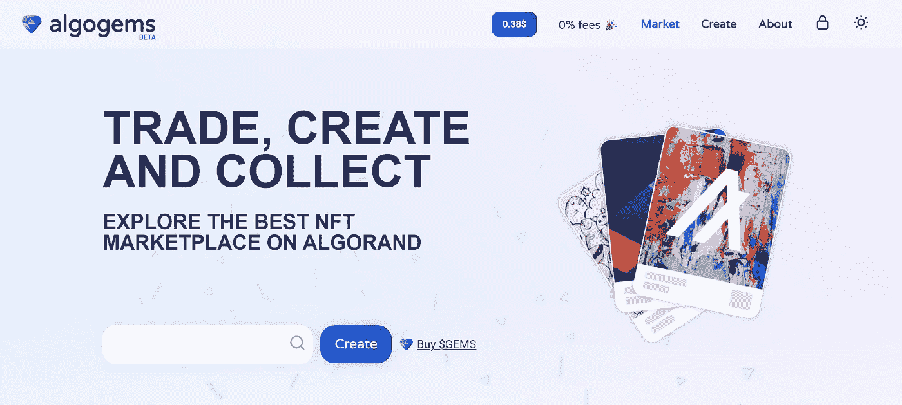
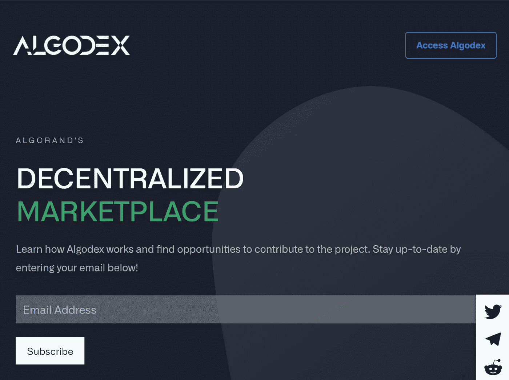
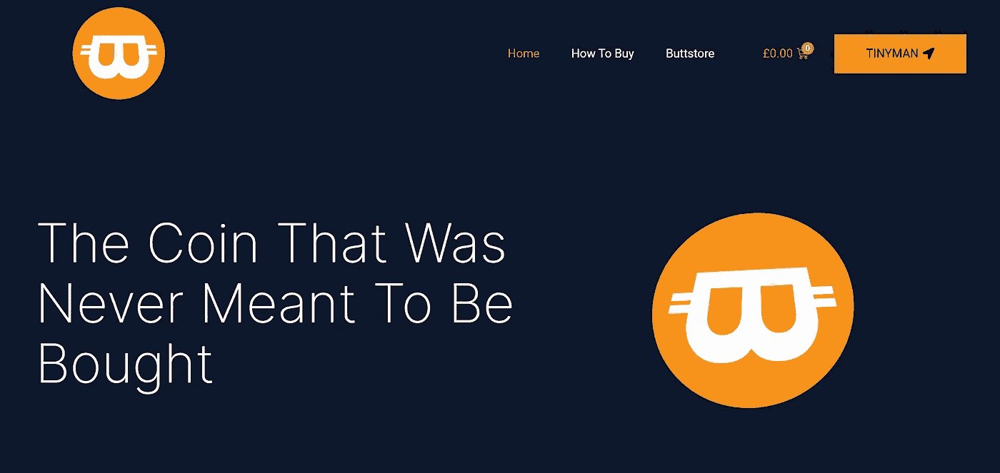

# 生态友好型区块链 Algorand 简介。

> 原文：<https://blog.devgenius.io/a-brief-introduction-to-the-eco-friendly-blockchain-algorand-9c084cbf7db4?source=collection_archive---------11----------------------->

图片来源:https://icodrops.com

lgorand 确实是一种新的区块链，由麻省理工学院教授兼计算机科学家希尔维奥·米卡利在 2017 年创建。其共识方案是基于纯粹的利害关系证明(PPoS)和拜占庭协议协议。它是一个高效、可扩展的链，旨在解决区块链三难问题(安全性、去中心化和可扩展性)。

围绕区块链基础设施和生态系统，有几个概念、原则和术语，包括互操作、项目等。这将在本文中详细讨论。

Algorand 发展非常迅速、高效和可靠，我会向任何人推荐它，因为我已经成为这个美丽社区的一部分，并受益于其基础设施的健壮性(目前拥有 6k TPS，大约 3.6s)。终结时间，零分叉，从创世纪开始就没有停机时间),对此没有遗憾。

# **阿尔格兰德区块链的特点**

**账户:**Algorand 账户代表一个钱包地址，可用于识别区块链上的参与者、实体或持有人，或智能合约托管账户。它是一个 58 个字符的字符串，仅由字母数字字符组成。它是由伪随机助记符生成的，使其能够被导入/导出。

任何 Algorand 账户必须始终保持 0.1 美元 ALGO 的最低余额才有效。账户每选择一项资产或拥有一项资产，其最低余额就会增加 0.1 美元 ALGO。这意味着，如果一个账户有 3 项资产，其最低持有余额将变成 0.4 美元 ALGO，这意味着 0.1 美元 ALGO 和 0.3 美元 ALGO 分别为其余的 3 项资产。Algorand 帐户的最低余额还取决于他们创建的资产、他们选择加入的应用程序以及他们存储的应用程序中的数据。

通常，Algorand 账户有能力持有尽可能多的资产。

**智能合约:** Algorand 智能合约(ASC)可在第 1 层和第 2 层上运行，通常被赋予应用 id，这些 id 是从 1 到无穷大的数值。他们拥有充当托管账户并控制应用程序交易方面的钱包。

它们有本地状态，即作为键-值对唯一地存储在单个用户钱包中的数据，它们还有全局状态，这些状态存储在整个应用程序中，可以跨整个应用程序访问。它们还通过创建者地址来归属，该地址代表用于在区块链上部署智能合约的帐户。智能合约开发的本地语言是 TEAL(交易执行和批准程序)，这是一种运行在 AVM(algrand 虚拟机)上的 op 代码类型语言。开发人员社区还开发了其他一些工具(SDK 和模块/脚本)来帮助开发智能合约，如 Reach(用 JavaScript 创建)、Pyteal(用 Python 创建)等。

**网络:**algrand 区块链像几个区块链一样有三个网络:MainNet、TestNet 和 BetaNet，这是几个操作可以精简到的网络。

**ASA:** ASA 是“Algorand Standard Asset”的首字母缩写，它代表 algrand 区块链上的单个令牌(或资产)，可以在交易所(DEXes 或 CEXes)进行估值和交易(上市)。资产是在与智能合约不同的层上部署(创建)的，因为它们的操作原理不同。

通常，如前所述，一个帐户可以创建无限数量的 asa。对于能够进行 ASA 交易的账户，其必须选择该资产(即向其自身发送 0 单位该资产),并且其最低余额将增加 0.1 $ALGO。Algorand 区块链上的资产(令牌)由 ASA IDs 标识，ASA IDs 是从 1 到无穷大的数值，不包括$ALGO。要在 MainNet、BetaNet 或 TestNet 上创建 Algorand 资产，您可以通过此链接选择使用 algo desk:[https://algo desk . io .](https://algodesk.io.)

**交易费用:**在 Algorand 上，所有交易的上限为 0.001 美元 ALGO(按当前市场汇率计算，目前约为 0.0004 美元)，除非交易费用池发挥作用的特殊情况。

大多数情况下，一些交易的影响包括账户最低余额的增加(如选择加入 ASC、持有/创建 asa)。

有趣的事实:阿尔格兰德是交易费用最低的区块链之一。

**钱包应用(协议):**在 algrand 上可以使用的三种最广泛的钱包协议是:AlgoSigner(浏览器扩展)、myAlgoWallet (web 应用)和 Pera Algorand 钱包(移动应用)。

这些有助于用户通过 GUI 体验与网络进行交互，并在用户授权下签署交易。

要访问 myAlgoWallet，请访问:[https://wallet.myalgo.com。](https://wallet.myalgo.com.)

Pera Algo 钱包可通过以下链接下载:

**iOS:**【https://apps.apple.com/us/app/pera-algo-wallet/id1459898525】T2

【安卓:】[https://play.google.com/store/apps/details?**id = com . algrand . Android**](https://play.google.com/store/apps/details?id=com.algorand.android)

AlgoSigner 是一个浏览器扩展，可以通过[https://Chrome . Google . com/web store/detail/algo signer/kmmolakhbgdlpkjkcjkkebenjhenagdm](https://chrome.google.com/webstore/detail/algosigner/kmmolakhbgdlpkjkcjkebenjheonagdm)在谷歌浏览器商店上访问

**AlgoExplorer:** 就像 BSCScan 一样，AlgoExplorer 是由 RandLabs 创建的 Algorand 著名的区块链浏览器，用于查看整个 Algorand 区块链的交易、已提交区块、应用、资产、账户和许多其他信息。它还拥有开发者 API，可以用来查询区块链信息和向区块链发布交易。可通过链接进入:[https://algo explorer . io .](https://algoexplorer.io.)

# **开发者工具&资源**

作为一名来自其他区块链的开发人员，开始在阿尔格兰德区块链上开发应用程序可能是一个乏味的过程。通常，首先，我会列举一些核心工具来指导您完成开发。

在我们继续之前，用于在区块链上编码的最流行的编程语言是:Python、JavaScript 和 Rust。这并不限制你探索区块链的资源。

Algorand 上的 dApps (web3)可以使用 algoSDK 开发。它是一个模块/库，可用于向区块链发布 TXs，构建通过钱包协议签名的交易以及查询区块链。资源的链接可以在这里找到:[https://www.npmjs.com/package/algosdk](https://www.npmjs.com/package/algosdk)。

智能合约是使用[**Reach**](https://reach.sh/)**(JavaScript)**[**Pyteal**](https://pyteal.readthedocs.io)**(Python)**开发的，或者是使用[**【TEAL**](https://developer.algorand.org/docs/get-details/dapps/avm/teal/specification/#assembler-syntax)(前面提到的)开发的。

要在 Algorand 区块链上查询交易信息，AlgoExplorer 提供了丰富的 API，您可以通过以下链接访问这些信息:

**信息:**[https://algo indexer . algoexplorerapi . io](https://algoindexer.algoexplorerapi.io)

**发帖和 TXs:**[https://node . algoexplorerapi . io](https://node.algoexplorerapi.io)

也可以查看以下文档:[https://www . algrand . com/resources/blog/区块链-development-build-your-first-dapp-algrand](https://www.algorand.com/resources/blog/blockchain-development-build-your-first-dapp-algorand)

# **探索 Algorand 生态系统项目**

## ASC 生成器

图片来源:https://ascbuilderapp.com

ASC Builder 是由 [Algoknox](https://algoknox.org) 开发的用于 Algorand 智能合同的强大交互式 GUI 开发和部署工具。它使不太懂技术的用户能够拖放 UI 小部件，然后生成 PyTEAL 代码，这些代码可以编译成 TEAL 并部署到 Mainnet、Testnet 和 BetaNet。

这个项目的链接是[https://ascbuilderapp.com。](https://ascbuilderapp.com.)确保在 [Twitter](https://twitter.com/Algoknox) 上关注 Algoknox。

## **打杂的**

图片来源:[https://tinyman.org](https://tinyman.org)

Tinyman 是 Algorand 区块链上最大的 DEX 平台(或 dApp)，它使用 AMM(自动做市商)算法来执行其流程。流动性是可以增加的，它还涉及到一个赌注池，交易商、流动性提供者和开发商都可以利用它。这是一个安全、可靠和持久的生态系统项目。在 2021 年早些时候，Tinyman 的系统被黑客利用，给了剥削者窃取流动性池令牌的机会，这导致了开发的彻底检查和 tiny man 1.1 版的发布。可以通过[https://tinyman.org](https://tinyman.org)进入。

## **AlgoGems**

图片致谢: [https://algogems.io](https://algogems.io)

AlgoGEMs 是阿尔格兰德区块链上最大的 NFT 市场，提供免费铸造、现代内容浏览、交易和拍卖 NFT，并与阿尔格兰德区块链上的几个生态系统项目合作，如 FairMeme。项目的链接是 [https://algogems.io](https://algogems.io) 。

## **算法索引**

AlgoDEX 是 Algorand 区块链上的一个高度分散的交易所，由高级订单簿功能运行，允许用户以点对点的方式交易生态系统资产。可以通过 https://algodex.com 的[访问。](https://about.algodex.com)

## ButtCoin ASA

图片致谢: [https://buttcoin.cc](https://buttcoin.cc)

Buttcoin 是作为一个笑话而创建的，是在 Reddit 上以 r/CryptoCurrency 发布的关于如何在 algrand 区块链上创建硬币的教程的一部分，也是目前 algrand 上最好的 Meme coin(如果我没有弄错的话)。

在社区开始参与并接管这个项目之前，它收集了数千张赞成票。该项目现在由所有想进一步推进该项目的志愿者组成。

它的流动性在几个月内从大约 20 ALGO 美元上升到超过 4 万 ALGO 美元。

访问 [https://buttcoin.cc](https://buttcoin.cc) 进入他们的官网。

要查看 Algorand 上的其他 meme 币和 NFT 项目，请访问专门讨论它们的文章。

# **有用链接**

以下链接指向 Algorand 生态系统上的有用资源，可以帮助您开始探索它所提供的功能:

开发者目录:[https://developer.algorand.com](https://developer.algorand.com)

不和谐服务器:[https://discord.com/invite/84AActu3at](https://discord.com/invite/84AActu3at)

官方网站:[https://algorand.com](https://algorand.com)

# **总结**

本指南仅提供 Algorand 区块链的入门级介绍，内容可能会更新(内容可以添加、修改或删除)。它的目的不是提供任何形式的财务建议，而是完全出于教育和信息的目的。

我最大的愿望是详尽地解释那些对新进入生态系统的人以及希望进入丰富生态系统的区块链爱好者可能不清楚的概念。

感谢你停下来阅读这篇文章💚。

PS:algo rand 系统的成员被称为“algofam”。

我是一名 Algorand 开发者，你可以通过[https://github.com/EdinyangaOttoho](https://github.com/EdinyangaOttoho)查看我的 GitHub。