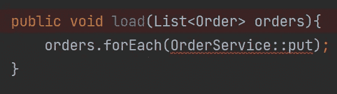

# 工作中遇到的一个关于 Java 静态关键字的案例

> 原文：<https://blog.devgenius.io/a-case-about-java-static-keyword-during-my-job-53cebb6af597?source=collection_archive---------1----------------------->

本周二，在工作中，我遇到了一个关于静态关键字用法的案例，我认为这是一个有趣的分享。

## 方案

在一个*orderservice*类中，我们有一个包含订单项目*信息的散列表。在同一个类中，我们有一个 *put()* 方法来接受一个 *Order* 对象，并将其放入提到的 map 中。为了便于说明，我们使用 *orderId* 作为键，使用 *itemId* 作为下面的值。*

**订单服务类**

```
public class OrderService { private final Map<String, String> orderItemMap = new HashMap<>(); //class constructor public void put(Order order){
        orderItemMap.put(order.getOrderId(), order.getItemId());
    }
}
```

**订单类别**

```
private class Order{
    String orderId;
    String itemId;

// getters and setters
}
```

下午，我的同事提交了一个新代码，在 *OrderService* 类中有一个 *load()* 方法。这个 *load()* 方法接受一列 *Order* 对象，并遍历所有对象以调用 *put()* 方法，并将 *orderId-itemId* 作为键-值对存储在映射中。

```
public void load(List<Order> orders){
    orders.forEach(OrderService::put);
}
```

看起来没错吧？

顺便说一下，这里我的同事使用 Java 函数式编程技术使代码更简洁，而不是使用一个笨拙的 while 循环进行列表迭代。如果您想使用函数式编程来提高您的编码技能，请在这里阅读我的文章。

[](https://medium.com/geekculture/java-coding-tip-functional-programming-1b6278e48efa) [## Java 编码技巧—函数式编程

### 方案

medium.com](https://medium.com/geekculture/java-coding-tip-functional-programming-1b6278e48efa) 

回到故事，在同一个提交中，新的 put 方法添加了' *static* '关键字，对于 map 对象也是如此。

```
private static final Map<String, String> *orderItemMap* = new HashMap<>();public static void put(Order order){
    *orderItemMap*.put(order.getOrderId(), order.getItemId());
}
```

在看新代码的时候，我想知道为什么它们被添加了静态关键字。一个 *orderItemMap* 应该特定于一个 *OrderService* 实例类。如果它变成静态的，那么每个 *OrderService* 实例将共享地图的相同副本。


使用静态关键字


没有静态关键字

因此，我试图删除 *orderItemMap* 字段和 *put* 方法的静态关键字。以下错误显示:



forEach 方法中出现“不能从静态上下文引用非静态方法”错误。

## 为什么会这样呢？

在我同事的 commit 中，在对订单列表进行迭代时，给出了 *OrderService* 类中 *put()* 的方法引用。这个 OrderService 类是类路径中的“主”类，而不是实例类。因此，方法引用期望即使没有创建 *OrderService* 类的实例，也可以调用 *put()* 方法。如果在 IntelliJ IDE 中按 **Alt + Enter** ，建议的解决方案是在 *put* 方法和 map 字段中添加 *static* 关键字，这就是为什么我们看到上面添加了 *static* 关键字。

## 如何化解？

知道 map 字段和 put 方法都是特定于实例的，我们只需要从一个实例类调用，而不是从主 *OrderService* 类调用。我们所要做的就是将方法引用类从 *OrderService* 改为 *this* 关键字:


"*这个*关键字指的是当前的实例类。因此，这里的 *put* 方法不再来自于 *OrderService* 主类。这有助于我们避免在其他地方添加静态关键字。

我希望这篇文章对你有所帮助。如果你像我一样，渴望学习 Java 和更多关于后端工程的知识，或者定期反思工作和生活，请关注我的频道，了解我在日常工作和生活中获得的灵感。

> ***阅读更多:***[*JVM 中字节码到类对象转换一瞥*](https://medium.com/geekculture/a-glance-on-conversion-from-bytecode-to-class-objects-in-jvm-e828559984d9)[*如何自动生成重复的 Java 代码以节省时间*](https://medium.com/geekculture/how-to-auto-generate-repetitive-java-code-to-save-your-time-c89a57652e90)