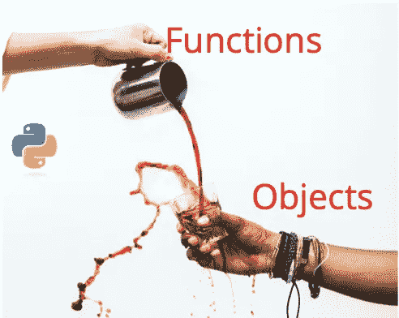
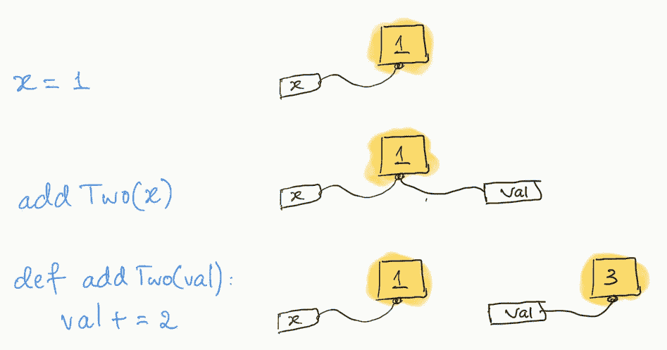
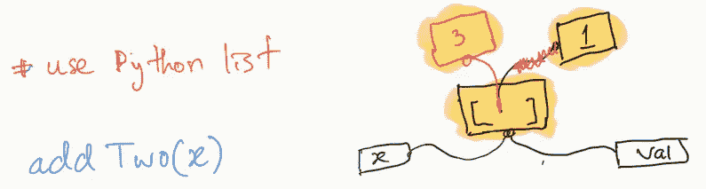
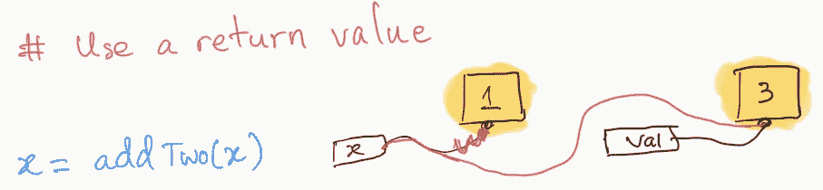
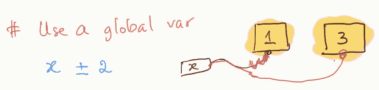

# 在 Python 中使用函数时的一个常见错误

> 原文：<https://blog.devgenius.io/a-common-mistake-when-using-a-function-in-python-6ac507a95e4f?source=collection_archive---------12----------------------->



图片来源:泰勒·尼克斯[https://unsplash.com/photos/wVexcTg7oXY](https://unsplash.com/photos/wVexcTg7oXY)

你有没有把一个 Python 变量(对象)传递给一个函数进行修改，但是函数运行完之后，变量并没有显示出预期的修改？下面我们来看看 addTwo()这个函数。

```
**# Common Mistake
def** addTwo(val):
  val += 2                **
  print**(val, end=" ")x = 1                    
addTwo(x)
**print**(x)**# Output   3 1
# Expected 3 3**
```

> **是什么导致了这个问题？为什么函数运行后 x 还是 1？**

正如在输出中看到的，我们只修改了‘val’而没有修改‘x’。因为修改‘val’不会导致‘x’的变化，所以它们是两个不同的对象吗？没有。它们是同一个对象。下面是我们运行上面的代码时 Python 所做的事情。



在 Python 中，对象通过赋值来传递。它的意思是当我们调用一个函数时，我们创建一个新的名字标签，并把它贴在输入对象上。对于上面的例子:

*   当我们将 1 赋给' x '时，我们实际上创建了一个名称标记' x ',并将其标记为一个值为 1 的整数对象。
*   当调用 addTwo(x)时，我们创建另一个名为‘val’的名称标记，并将其标记为与‘x’相同的整数对象。

> **那么如果‘x’和‘val’是同一个宾语，为什么修改‘val’(val+= 2)不会改变‘x’？**

*   我们实际上不会用‘val+= 2’表达式来修改‘val’。我们所做的是将“val”重新标记为不同的对象。首先，我们将标记对象的值 1 与 2 相加，然后将名称标记“val”分配给一个新对象，该对象的相加结果值为 3。
*   因此，在函数运行后，‘x’和‘val’标记为两个不同的对象。

> **有办法修改整数对象 1 吗？**


没有。一个 **Integer** 对象是一个不可变的对象，和其他**不可变的对象一样，比如 string、tuple、boolean、tuple、frozenset 和 float，**我们不能在它们被创建后修改它们。因此，如果我们想修改不可变对象，就不应该将它们传递给函数。

# 修改 Python 变量(对象)的三种不同方式

> **我们如何修改函数内部的对象？**

# **a .使用可变对象**

对于第 1 节中的例子，我们可以将一个 Python 列表(它有一个值为 1 的整数对象)赋给“x ”,并将其传递给一个函数。因为列表是一个可变的对象，我们可以在创建它之后修改它。

```
**# Use Python List
def** addTwo(val):
  val[0] += 2                **
  print**(val[0], end=" ")x = [1]    # use a list                 
addTwo(x)
**print**(x[0])**# Output   3 3
# Expected 3 3**
```

下面是调用 addTwo(x)后的情况。该函数通过取消标记整数对象 1 并标记新的整数对象 3 来修改列表。虽然现在涉及到了一个不同的整数对象，但是列表对象仍然由函数和它的调用者共享。我们达到了改变来电者所见的目的。



因此，如果我们想通过一个函数修改一个对象，这个对象必须是一个可变的对象，比如一个列表、集合、字典或自定义对象。

# **b .从函数中返回一个整数**

我们可以将“x”重新标记为一个从函数返回的新的整数对象，而不是修改“x”的整数对象。

```
**# Use function return value
def** addTwo(val):
  val += 2                **
  print**(val, end=" ")
  return valx = 1                   
x = addTwo(x) # assign a return value to x
**print**(x)**# Output   3 3
# Expected 3 3**
```

下面是 addTwo(x)返回后的情况。x '将其自身重新标记为新返回的值为 3 的整数对象。



# **c .使用全局变量(不推荐)**

addTwo()可以通过使用“global”关键字来访问“x”的整数对象。因此，该函数可以将“x”重新标记为一个新的整数对象，该对象的相加结果的值为 3。然而，这并不是修改变量的推荐方法，因为它违背了为除“x”之外的其他变量重用函数的目的。更重要的是，它可能不是线程安全的，并可能造成命名空间污染。关于这两个主题的进一步阅读，请参考本文底部的参考文献 4 和 5。

```
**# Use a global variable** x = 1  # declare x as a global var**def** addTwo():
  global x 
  x += 2         **
  print**(x, end=" ")**def** main():
  addTwo()
  **print**(x)main()**# Output   3 3
# Expected 3 3**
```

下面是调用 addTwo()后发生的情况。



# 结论

那么我们学到了什么？我们不能在 Python 中修改不可变的对象。如果我们想用一个函数修改一个变量，我们需要传入一个可变的对象或者从函数返回一个值。

我要感谢我的同学基夫·约翰逊和贡萨洛·阿拉纳校对了这篇文章。这是我关于 Medium 的第二篇文章，也是第一篇深入理解 Python 底层工作原理的文章。随着我对 Python 的进一步了解，我很乐意听到关于本文的任何反馈和评论。

**参考文献**

1.  Python 编程常见问题。[https://docs . python . org/3/FAQ/programming . html #如何编写带输出参数的函数-通过引用调用](https://docs.python.org/3/faq/programming.html#how-do-i-write-a-function-with-output-parameters-call-by-reference)
2.  理解 Python 变量和内存管理。[http://foobanbaz . com/2012/07/08/understanding-python-variables/](http://foobarnbaz.com/2012/07/08/understanding-python-variables/)
3.  Python 是按值调用还是按引用调用？两者都不是[https://jeffknupp . com/blog/2012/11/13/is-python-callby value-or-callby reference-never/](https://jeffknupp.com/blog/2012/11/13/is-python-callbyvalue-or-callbyreference-neither/)
4.  Python/C API 参考手册。[https://docs.python.org/2.0/api/threads.html](https://docs.python.org/2.0/api/threads.html)
5.  全局变量有什么问题？[https://www . Reddit . com/r/learn python/comments/7 l8 YIG/whats _ error _ with _ global _ variables/](https://www.reddit.com/r/learnpython/comments/7l8yig/whats_wrong_with_global_variables/)
6.  形象信用。[https://unsplash.com/photos/wVexcTg7oXY](https://unsplash.com/photos/wVexcTg7oXY)
7.  校对:基夫·约翰逊和贡萨洛·阿拉纳