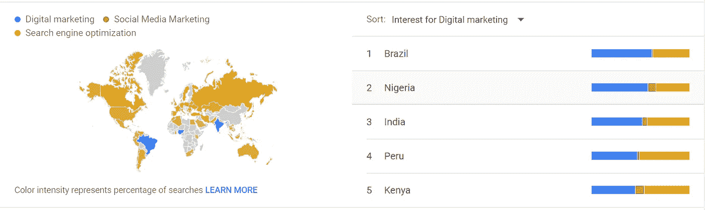

# 一个完整的指南，开始一个博客，在线赚取 6 位数。

> 原文：<https://blog.devgenius.io/a-complete-guide-to-start-a-blog-and-earn-6-figures-online-f3df6551b2fa?source=collection_archive---------8----------------------->

## 将你的收入提高 50 倍。

[真诚媒体](https://unsplash.com/@sincerelymedia?utm_source=medium&utm_medium=referral)在 [Unsplash](https://unsplash.com?utm_source=medium&utm_medium=referral) 上拍摄的照片

对学习和开博客赚钱感兴趣？是的，那么博客是最赚钱的在线业务之一，启动成本非常低。在这里，我将与众不同，这将是我自己开博客的观点。

新冠肺炎疫情爆发后，生活在隔离区而无所事事只是在浪费你的钱，是的，我的意思是说你在浪费自己的钱。是的，开一家新公司写博客能赚更多钱。你所获得的时间能够产生金钱，你自己的观点是赚到钱还是浪费你从博客或类似的生意中赚到的钱。

我夸张了吗？不，一点也不。我和我的一个朋友创建了一个网站来写文章。是的，我们一点也不擅长写出像蒂姆·丹宁、约翰·布罗西奥等更好的故事。同样在 1 个月内，我们没有做太多事情就赚了 100 多美元。

事实上，这个博客的成功启发了我用媒介写作，甚至也从媒介中获得了收益。

没有别的事了，让我们开始吧。

# **1。选择多生态位而不是单一生态位。**

作家，博客，选择一个特定的利基在几天甚至几周内就毁掉了想法，这是事实。例如，medium 是一个博客平台，拥有 1.7 亿以上的读者，他们的兴趣领域不止一个，比如艺术、书籍、漫画、小说、游戏、恐怖、诗歌、摄影、文化、美食、体育、平等、健身、科技等等。

我知道一个技术人员可以写关于人工智能、UI/UX 设计、AR/VR 等技术的文章，但他/她也可以写关于商业、创业、领导力、营销、自由职业者、远程工作、创造力、金钱、最好的编码书籍，这是无限的。

> 我的意思是选择相互关联的多领域。

读者不想一辈子只阅读一个特定的主题，即使你也是如此。因此也有其他的话题。在这里，这并不意味着同时为技术和时尚而写作。

> 一个现实世界例子是，我们都想通过各种方式赚钱，即使我们只擅长一种或两种方式。即便如此，我们还是通过多种渠道赚钱，有些人可能称之为被动收入。

# 你如何找到一个符合上述标准的利基？

我不知道你们中的许多人，所以你只是想问问你自己。

1.  你擅长什么？
2.  什么工作让你开心？
3.  你热衷于什么？
4.  你想做什么？

答案就在它旁边。

此外，从中选择一个利基，并在谷歌趋势搜索它。

比如我选择数字营销，社交媒体营销，搜索引擎优化。

来源:谷歌趋势。

并对比了以上所有的。结果令人震惊，但我找到了最合适的趋势利基。获胜者是搜索引擎优化。

来源:谷歌趋势

它给出了搜索最多的利基或主题的概述。不仅如此，它甚至还提供特定国家的热门话题。比如下面这些。

来源:谷歌趋势

# 访问 Ubersuggest，成为一名专业的博客写手或搜索引擎优化专家。

想要更多的流量，关键词那就用 Ubersuggest。Ubersuggest 让你赢得 SEO 这场游戏。键入域名或关键字开始。选择一个国家，比如美国、印度，然后进行搜索。

例如，搜索 medium.com，你可以了解一切，是的，我的意思是一切从有机关键词，有机每月流量，域名得分，反向链接，甚至更多。

除此之外，你还可以查看首页和每个故事的最大访问量，如估计访问量、反向链接。你可以查看任何关键字，甚至从各种网站了解他们如何利用自己的观点，他们在哪里得到反向链接，甚至更绝对免费。

当我开始写博客的时候，我不知道这是一个很好的工具来利用我的观点和金钱。我不能告诉你写什么，但我告诉你如何用谷歌广告和 Ubersuggest 来写。

# 2.如何制作网站

**A)使用 WordPress**

创建网站是博客作者最突出的手段之一。网站可以通过编码、WordPress 或使用 [Webflow](https://bit.ly/2Zzx9sm) 来创建。如果你不知道编码，这不是问题，学习 WordPress。用 WordPress 创建一个网站比写一个故事更容易。同样， [Webflow](https://medium.com/dev-genius/webflow-basic-guide-dffce68b5117) 只是一个创建网站的拖拽工具。

我打算用 WordPress.org 的，因为它免费且易于使用。我甚至和 WordPress.org 一起创建了自己的网站

**B)域名和托管**

我们这里要用 [Hostinger。](https://www.hostg.xyz/SH4Ou)仅仅是因为我喜欢它，你用了之后也会喜欢它。

> 在这里，有一个附属链接，给我一些佣金，没有任何额外的费用给你。

域名就是你网站的名字。

此外，购买域名不是一件大事，也不是一个问题。你可以在任何网站上买到，比如 Hostinger T1，甚至是 T2 name cheap T3。如果您使用 Hostinger 进行托管，那么您将获得一个 1 年绝对免费的域名。

现在是最重要的部分，也就是为你的网站购买主机。托管就是你的网站数据将要被托管的地方。虚拟主机使你的网站出现在网络世界。

基于一些评论、研究和使用后，我选择了 [Hostinger](https://www.hostg.xyz/SH4Ou) 。其中一个最好的和负担得起的主机服务提供商。

# 如何购买托管？

有各种类型的主机，如共享主机，云主机等。

据 domain.com 称，共享主机，也称为虚拟主机，是一种在一台物理服务器上托管你的网站的方式，这台服务器也托管其他网站。在服务器中，有一些软件应用程序可以使管理和访问您的网站变得容易。

云托管是一个由虚拟云服务器组成的网络，托管网站。

**要开始使用，请访问**[**Hostinger**](https://www.hostg.xyz/SH4Zr)**。我们将使用共享主机，因为它主要用于创建中小型网站。除此之外，它也是负担得起的。**

选择一个最适合你的计划。对于博客或类似的，你需要溢价共享主机。因为我们必须使用无限的带宽，如果流量来到我们的网站，它可以处理它。

除此之外，你可以托管无限数量的网站，获得无限的电子邮件帐户，等等。

选择计划并将其添加到购物车中。在下一张幻灯片中，您可以选择时间段。为你的网站选择最合适的月份。选择更少的周期是没有用的。在时间/周期结束后，您必须支付更多的费用。而且每个托管服务公司都有。

选择期限，创建账户，选择你喜欢的付款方式，然后购买。

注:Hostinger 为您提供 30 天的退款保证，如果你不满意他们的服务。所以是双赢。

# 你会得到什么？

> a)共享托管。
> 
> b)免费 SSL 证书。
> 
> c)一年免费域名。
> 
> d)完成设置
> 
> E) 24/7/365 全天候聊天支持等。

# 3.推广你的内容。

免费推广内容需要时间，甚至不可能在一天之内完成。我将提供许多迄今为止我使用过的、从各种伟大人物那里学到的最好的、值得信赖的方法。

从竞争对手那里了解他们如何使用 Ubersuggest 生成反向链接。访问能让你产生反向链接的网站，联系他们，向他们推销你的内容，并从他们那里获得反向链接。

在 medium、Quora、LinkedIn 上写内容，让自己变得受欢迎，让自己的网站成为一个品牌。写有质量的内容，从读者的角度看有趋势的内容。

如果没有以上这些东西，你可以利用谷歌广告、脸书广告、各种名人在你的博客上做广告。是的，做广告需要付费。

[搜索引擎优化](https://medium.com/dev-genius/seo-is-killing-the-internet-and-you-should-learn-it-a4b245ec4a9f)也在影响你的观点方面发挥着重要作用。各种战术，策略能够在谷歌排名较高。

# 4.明确你的目标。

既然你已经找到了主题(多领域)，创建了一个网站，推广它。是时候瞄准了。

1.你想要多少个视图？

2.你想达到多少订户？

3.最后，你想挣多少钱？

确定目标是通往成功的道路。它鼓励我越来越努力，实现我的目标。

一开始，目标不应该太大，因为它会打击你的积极性，甚至会毁掉你的事业。

> 根据你的能力选择一个目标，并随着时间的推移不断提高。

**第一次我不太自信，所以第一个月我选择了 100 美元，但是我没有成功。证明将在下面显示。**

# 5.将你的博客货币化来创造收入。

赚钱最简单的方法之一是通过谷歌广告。除此之外，还有各种替代方案，例如

1.  亚马逊联盟计划。
2.  对抗性的。
3.  Taboola 本地广告。
4.  Media.net

还有很多。

想对联盟营销有一个简单的了解，看看下面的帖子。

 [## 我的朋友从联盟营销中赚了 1000 多美元，并告诉了我这个秘密。

### 学习如何通过向目标受众推荐真实产品来增加自己的被动收入。

medium.com](https://medium.com/datadriveninvestor/my-friend-earned-more-than-1-000-from-affiliate-marketing-and-told-me-the-secret-be4f7a9bf90a) 

到目前为止，我一直使用亚马逊联盟。我从 Google Adsense 和 Medium 赚的大部分钱。在网站上张贴大量广告是没有用的，因为读者想要的是知识，而不是广告。这也会导致低流量，所以不要在每个帖子上使用超过 3-4 个广告。

# 我写博客的第一个月赚了多少钱？

我知道超过 90%的读者没有看完整个故事就离开了。不管怎样，对你们所有人来说，拿奖金激励自己。

在 Google Adsense 接受我的网站显示广告后，我从 Google Adsense 写博客的第一个月就赚了 79.27 美元。对我来说，这绝对不容易，但我已经努力了一点，所以这就是结果。

最后但不是最不重要的，如果我能赚，那么你也可以赚得比我多得多。所以停止浪费你的时间，开始赚钱吧。