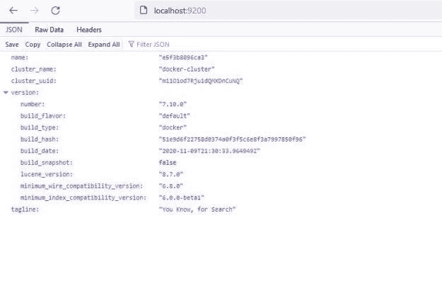
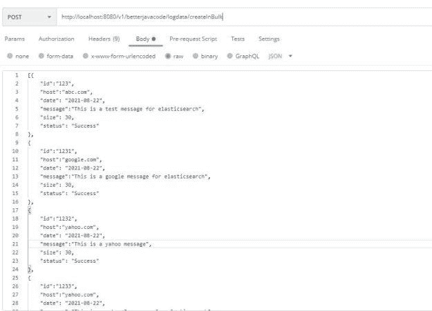
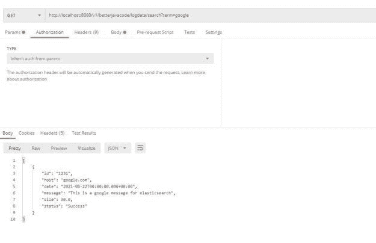

# 与 Spring Boot 一起使用 ElasticSearch 的完整指南

> 原文：<https://blog.devgenius.io/a-complete-guide-to-using-elasticsearch-with-spring-boot-f9a527b375ff?source=collection_archive---------1----------------------->

在这篇文章中，我将详细介绍如何在 Spring Boot 上使用 Elasticsearch。我还将介绍 Elasticsearch 的基础知识以及它在行业中的应用。

# 什么是 Elasticsearch？

[Elasticsearch](https://www.elastic.co/what-is/elasticsearch) 是一个分布式、免费和开放的搜索和分析引擎，适用于所有类型的数据，包括文本、数字、地理空间、结构化和非结构化数据。

它是基于 Apache Lucene 构建的。Elasticsearch 通常是 ELK 堆栈(Elastic、LogStash 和 Kibana)的一部分。人们可以使用 Elasticsearch 来存储、搜索和管理以下数据

随着数据的不断增加，搜索已经成为许多领域的中心思想。随着大多数应用程序变得数据密集型，快速灵活地搜索大量数据变得非常重要。ElasticSearch 两者都有。

在本帖中，我们将关注 Spring 数据弹性搜索。它提供了一个简单的界面来进行搜索、存储和运行分析操作。我们将展示如何使用 Spring 数据来索引和搜索日志数据。

# 弹性研究的关键概念

Elasticsearch 有索引、文档和字段。这个想法很简单，非常类似于数据库。Elasticsearch 将数据作为**文档**(行)存储在**索引**(数据库表)中。用户可以使用**字段**(列)搜索该数据。

通常，elasticsearch 中的数据会经过不同的分析器来拆分这些数据。默认的分析器在标点符号如空格或逗号上分割数据。

我们将使用`spring-data-elasticsearch`库来构建这篇文章的演示。在 Spring 数据中，文档只不过是一个 POJO 对象。我们将在同一个类中添加来自 elasticsearch 的不同注释。

如前所述，elasticsearch 可以存储不同类型的数据。然而，我们将在这个演示中看到简单的文本数据。

# 创建 Spring Boot 应用程序

让我们创建一个简单的 spring boot 应用程序。我们将使用`spring-data-elasticsearch`依赖关系。

```
dependencies {  
implementation 'org.springframework.boot:spring-boot-starter-data-elasticsearch'  
implementation 'org.springframework.boot:spring-boot-starter-thymeleaf'  
implementation 'org.springframework.boot:spring-boot-starter-web'  testImplementation 'org.springframework.boot:spring-boot-starter-test' 
}
```

随后，我们需要创建 Elasticsearch 客户端 bean。现在有两种方法来创建这个 bean。

添加这个 bean 的简单方法是在`application.properties`中添加属性。

```
spring.elasticsearch.rest.uris=localhost:9200 spring.elasticsearch.rest.connection-timeout=1s spring.elasticsearch.rest.read-timeout=1m spring.elasticsearch.rest.password= spring.elasticsearch.rest.username=
```

但是在我们的应用程序中，我们将以编程方式构建这个 bean。我们将使用 Java 高级 Rest 客户端(JHLC)。JHLC 是 elasticsearch 的默认客户。

```
[@Configuration](http://twitter.com/Configuration)
[@EnableElasticsearchR](http://twitter.com/EnableElasticsearchR)epositories
public class ElasticsearchClientConfiguration extends AbstractElasticsearchConfiguration
{[@Override](http://twitter.com/Override)
    [@Bean](http://twitter.com/Bean)
    public RestHighLevelClient elasticsearchClient ()
    {
        final ClientConfiguration clientConfiguration =
                ClientConfiguration.builder().connectedTo("localhost:9200").build();return RestClients.create(clientConfiguration).rest();
    }
}
```

从今以后，我们有了一个客户机配置，它也可以使用来自`application.properties`的属性。我们用`RestClients`创造`elasticsearchClient`。

此外，我们将使用`LogData`作为我们的模型。基本上，我们将为`LogData`构建一个文档以存储在索引中。

```
[@Document](http://twitter.com/Document)(indexName = "logdataindex")
public class LogData
{
    [@Id](http://twitter.com/Id)
    private String id;[@Field](http://twitter.com/Field)(type = FieldType.Text, name = "host")
    private String host;[@Field](http://twitter.com/Field)(type = FieldType.Date, name = "date")
    private Date date;[@Field](http://twitter.com/Field)(type = FieldType.Text, name = "message")
    private String message;[@Field](http://twitter.com/Field)(type = FieldType.Double, name = "size")
    private double size;[@Field](http://twitter.com/Field)(type = FieldType.Text, name = "status")
    private String status;// Getters and Setters}
```

*   `@Document` -指定我们的索引。
*   `@Id` -表示文档的 field _id，对于每条消息都是唯一的。
*   `@Field` -代表数据中可能存在的不同类型的字段。

有两种方法可以使用弹性搜索来搜索或创建索引-

1.  使用 Spring 数据仓库
2.  使用 ElasticsearchRestTemplate

# 带有弹性搜索的 Spring 数据仓库

总的来说，Spring Data Repository 允许我们创建存储库，用于编写简单的 CRUD 方法，以便在弹性搜索中进行搜索或索引。但是如果你想更多的控制查询，你可以使用`ElasticsearchRestTemplate`。尤其是，它允许您编写更高效的查询。

```
public interface LogDataRepository extends ElasticsearchRepository<LogData, String> { }
```

该存储库提供了 Spring 从实现角度处理的基本 CRUD 方法。

# 使用 ElasticsearchRestTemplate

如果我们想使用聚合、建议等高级查询，可以使用`ElasticsearchRestTemplate`。Spring 数据库提供了这个模板。

```
public List getLogDatasByHost(String host) { 
    Query query = new NativeSearchQueryBuilder() .withQuery(QueryBuilders.matchQuery("host", host)).build(); 
    SearchHits searchHits = elasticsearchRestTemplate.search(query, LogData.class); 
    return SearchHits.get().map(SearchHit::getContent).collect(Collectors.toList()); }
```

当我们进行更复杂的查询时，我将进一步展示`ElasticsearchRestTemplate`的用法。

`ElasticsearchRestTemplate`机具`ElasticsearchOperations`。您可以使用`ElasticsearchRestTemplate`进行一些关键查询，与 Spring 数据存储库相比，这些查询使用起来更方便。

`index()`或`bulkIndex()`允许批量创建一个或多个索引。可以构建一个索引查询对象并在`index()`方法调用中使用。

```
private ElasticsearchRestTemplate elasticsearchRestTemplate; public List createLogData (final List logDataList) 
{ 
   List queries = logDataList.stream().map(logData -> new IndexQueryBuilder().withId(logData.getId().toString()) .withObject(logData).build()).collect(Collectors.toList()); return elasticsearchRestTemplate.bulkIndex(queries,IndexCoordinates.of("logdataindex")); }
```

`search()`方法帮助在索引中搜索文档。通过构建`Query`对象可以进行搜索操作。`Query`一个人可以建造三种类型的建筑。`NativeQuery`、`CriteriaQuery`和`StringQuery`。

# Rest Controller 查询弹性搜索实例

让我们创建一个 rest 控制器，用于在我们的弹性搜索实例中添加大量数据以及查询相同的实例。

```
[@RestController](http://twitter.com/RestController)
[@RequestMapping](http://twitter.com/RequestMapping)("/v1/betterjavacode/logdata")
public class LogDataController
{
    [@Autowired](http://twitter.com/Autowired)
    private LogDataService logDataService;[@GetMapping](http://twitter.com/GetMapping)
    public List searchLogDataByHost([@RequestParam](http://twitter.com/RequestParam)("host") String host)
    {
        List logDataList = logDataService.getAllLogDataForHost(host);return logDataList;
    }[@GetMapping](http://twitter.com/GetMapping)("/search")
    public List searchLogDataByTerm([@RequestParam](http://twitter.com/RequestParam)("term") String term)
    {
        return logDataService.findBySearchTerm(term);
    }[@PostMapping](http://twitter.com/PostMapping)
    public LogData addLogData([@RequestBody](http://twitter.com/RequestBody) LogData logData)
    {return logDataService.createLogDataIndex(logData);
    }[@PostMapping](http://twitter.com/PostMapping)("/createInBulk")
    public  List addLogDataInBulk([@RequestBody](http://twitter.com/RequestBody) List logDataList)
    {
        return (List) logDataService.createLogDataIndices(logDataList);
    }
}
```

# 运行弹性搜索实例

到目前为止，我们已经展示了如何创建索引，如何使用弹性搜索客户端。但是，我们没有显示将这个客户端连接到我们的弹性搜索实例。

我们将使用一个 docker 实例在本地环境中运行弹性搜索。AWS 提供自己的服务来运行弹性搜索。

要运行您自己的 elastic search docker 实例，请使用以下命令

```
docker run -p 9200:9200 -e "discovery.type=single-node" docker.elastic.co/elasticsearch/elasticsearch:7.10.0
```

随后，这将启动弹性搜索节点，您可以通过访问`[http://localhost:9200](http://localhost:9200)`进行验证



# 创建索引和搜索数据

总之，如果我们启动应用程序，我们将使用一个 Postman 来创建一个初始索引，并继续向其中添加文档。



这也将创建一个索引并将文档添加到该索引中。在 elasticsearch 实例上，我们可以看到如下日志:

```
{ 
"type": "server", 
"timestamp": "2021-08-22T18:48:46,579Z", 
"level": "INFO", 
"component": "o.e.c.m.MetadataCreateIndexService", 
"cluster.name": "docker-cluster", 
"node.name": "e5f3b8096ca3", 
"message": "[logdataindex] creating index, cause [api], templates [], shards [1]/[1]", 
"cluster.uuid": "mi1O1od7Rju1dQMXDnCuNQ", 
"node.id": "PErAmAWPRiCS5tv-O7HERw" 
}
```

该消息清楚地显示它已经创建了一个索引`logdataindex`。现在如果添加更多的文档到同一个索引，它将更新那个索引。

现在让我们运行一个搜索查询。我将运行一个简单的查询来搜索文本术语“Google”



这是一个简单的搜索查询。如前所述，我们可以使用不同类型的查询编写更复杂的搜索查询——字符串、标准或原生查询。

# 结论

这个演示的代码可以在我的 [GitHub 库](https://github.com/yogsma/betterjavacode/tree/main/elasticsearchdemo)上找到。

在这篇文章中，我们讨论了以下内容

*   弹性搜索和弹性搜索的关键概念
*   Spring 数据仓库和 ElasticsearchRestTemplate
*   与 Spring Boot 应用程序集成
*   针对 Elasticsearch 执行不同的查询

如果你没有看过我写的关于春天安全的书，你可以在这里查看。

你觉得 Gradle 作为一个构建工具令人困惑吗？为什么理解起来这么复杂？我正在写一本关于 Gradle 的简单的新书——Gradle For Humans。[关注我这里](https://yogsma.gumroad.com/)了解更多更新。

*原载于 2021 年 8 月 24 日 https://betterjavacode.com**的* [*。*](https://betterjavacode.com/programming/elasticsearch-spring-boot)