# AZURE 存储的完整概述:AZ-104(第 3 天)

> 原文：<https://blog.devgenius.io/a-complete-overview-on-azure-storage-az-104-day-3-98cd0b49346f?source=collection_archive---------8----------------------->

美国宇航局在 [Unsplash](https://unsplash.com?utm_source=medium&utm_medium=referral) 拍摄的照片

你好，学习者！希望你们都身体健康。这是由 [Azure 开发者](https://medium.com/u/a33f3d5ab0a5?source=post_page-----98cd0b49346f--------------------------------)社区 Dehradun 组织的 AZ: 104 训练营第三天。在这篇博客中，您将看到 Azure 存储帐户、存储帐户类型、存储帐户服务、如何创建存储帐户以及如何删除存储帐户的概述。

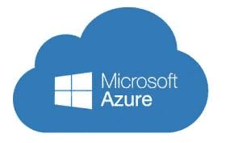

在这篇博客中，我讨论了下面列出的各种重要话题:

> 什么是 Azure 存储帐户？
> 
> 存储帐户类型
> 
> Azure 存储服务
> 
> 虚拟图像的存储
> 
> 存储客户中的性能层
> 
> 创建存储帐户
> 
> 删除存储帐户

# **1。什么是 Azure 存储帐户？**

Azure 存储帐户包含所有 Azure 存储数据对象，包括 blobs、文件共享、队列、表和磁盘。存储帐户为您的 Azure 存储数据提供了一个唯一的命名空间，您可以通过 HTTP 或 HTTPS 从世界任何地方访问该命名空间。

Azure 存储账户是**高可用**、**通用**和**耐用**。通过利用 Azure 存储帐户服务，我们不必为空间而紧张，因为它将根据我们的兴趣而扩展。Azure 存储帐户是一个容器，它将一组 Azure 存储服务组合在一起。存储帐户中只能包含来自 Azure 存储的数据服务。

Azire 中的存储帐户是一种为在其中存储数据而创建存储服务的技术。它包含了所有 azure 存储对象决定的所有单个资源组。它包含 Blob、队列、表和带有磁盘映像的文件。有趣的是，它为命名空间和服务提供了对存储功能的访问。

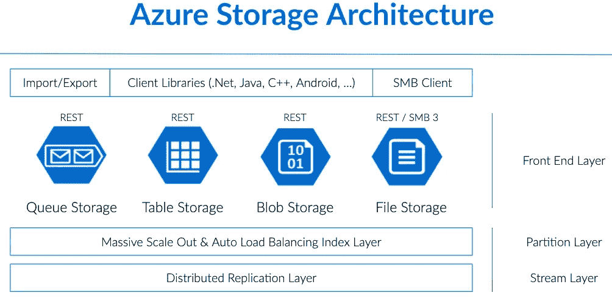

# **2。存储账户类型**

Azure 存储帐户是组成 Azure 存储领域的所有元素的访问点。一旦用户创建了存储帐户，他们就可以选择所需的弹性级别，Azure 会处理剩下的事情。单个存储帐户可以存储高达 500TB 的数据，像任何其他 Azure 服务一样，用户可以利用按使用付费的定价模式。

有两组存储帐户:

**A)可通过 REST API** 访问:队列存储、表存储、Blob 存储

**B)专为微软 Azure 虚拟机设计**:文件存储，磁盘存储。

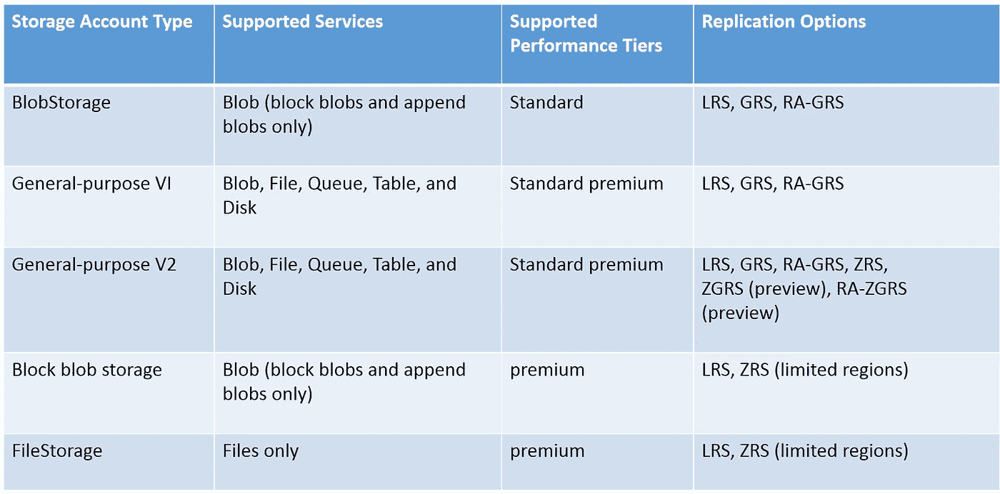

# **3。Azure 存储服务**

利用独立于类型的 Azure 存储有一些好处。Azure 存储功能多样，适应性强，成本适中，取决于你的选择。

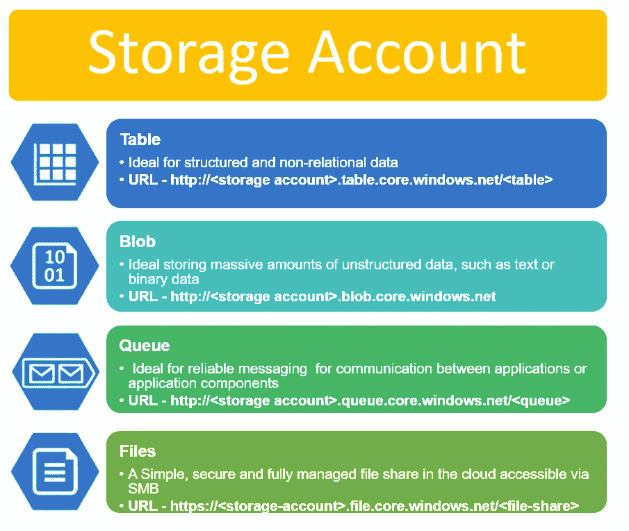

# A) Azure Blob 存储

当一个文件存储在 block blob 中时——这意味着它以块的形式到达存储器，并且仅在完成上载之后——blob 将其自身放在单个块中。在这种架构下，如果没有完整的重新上传，就无法修改文件。这是在 Azure 中存储文件的最基本也是最便宜的方式。

1.  它是 Azure 中的一个对象存储解决方案。
2.  它用于存储非结构化数据。
3.  当您拥有文件、视频、日志文件和图像的存储解决方案时，这是理想之选
4.  它有不同的层级:

> **●热存储层**:非常适合频繁访问的对象
> 
> **●冷存储层:**针对不常访问的数据进行了优化。这是一个比热存储层更便宜的选项
> 
> **●实现存储层:**针对很少访问的数据进行优化。主要用于存档或备份数据。这是最便宜的服务

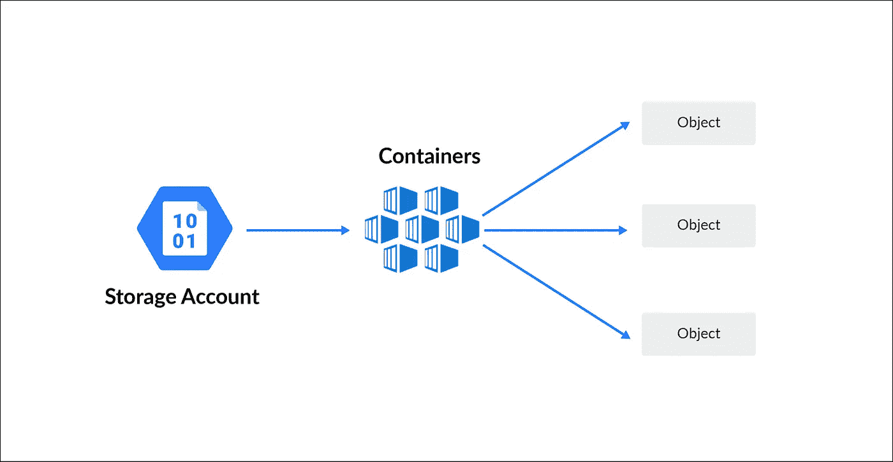

# B) Azure 桌面储物

Microsoft Azure 表存储用于存储结构化的 NoSQL 数据。存储的可扩展性非常好，同时保存数据的成本也非常低。但是，当您频繁访问文件时，它的开销会更大。

1.  它用于存储结构化的 NoSQL 数据
2.  它是一个关键属性存储
3.  对于存储应用程序的表状数据，这是一个经济高效的选择

除了使用 SQL 数据库来存储数据，您还可以以一种更具成本效益的方式使用 Azure 表存储。

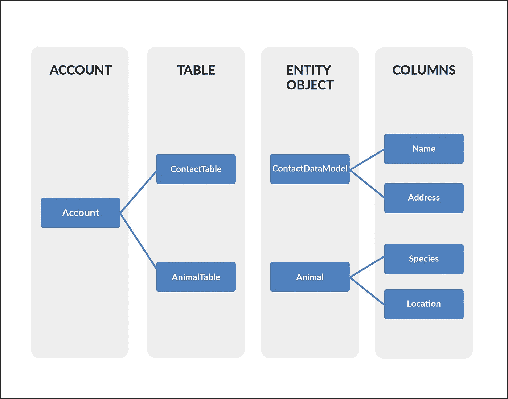

# C) Azure 文件存储

微软 Azure 文件存储是一种 Azure 服务，旨在支持 Azure VM 环境的需求。该存储本质上是一个网络共享。您可以在那里存储可从不同虚拟机访问的文件。它类似于亚马逊 EFS，是其直接竞争对手。

1.  它允许通过服务器消息块协议检索文件。
2.  使用文件存储，您可以在基于 Windows、Linux 和 Mac 的机器上挂载文件共享。
3.  在这里，您不需要管理文件服务器。

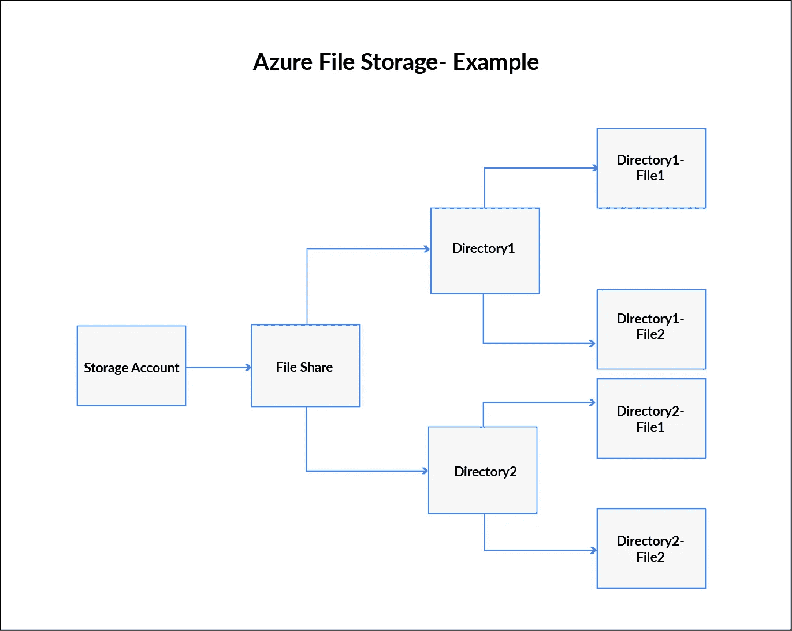

# D) Azure 队列存储

队列存储是一种为连接应用程序组件而构建的存储类型。它允许您使用依赖于异步消息队列的解耦且独立的组件来构建灵活的应用程序。

1.  此服务用于存储和检索消息
2.  当您想要解耦应用程序的组件时，这个服务是很好的
3.  队列中的一条消息最大可达 64kb
4.  您可以在队列中存储数百万条消息

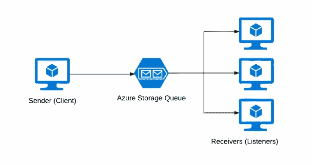

# 4.虚拟图像的存储

它就像操作系统映像，虚拟机映像是元数据和指向一堆 VHD(每个圆圈一个 VHD)的指针的分类，作为页面质量存放在 Azure 存储中。这包括盘子和唱片。通过利用云中的记录共享来完全监督文档。

# a)非结构化数据

这结合了大众和信息湖商店。Blobs 是非常通用的。数据湖是一个 Hadoop 循环记录框架服务。相对于有组织的信息，非结构化数据是独特的，因为它的构造是不可预测的。文档、电子邮件、博客、数字图像、视频和卫星图像都是非结构化数据的例子。还包括机器或传感器产生的一些数据。

# b)结构化数据

Cosmos DB、Azure SQL DB、Tables 都处理有组织的信息。表是重要的自动缩放没有价值的存储，Cosmos DB 是全球传播的信息库帮助，Azure SQL DB 是完全监督的数据集，作为基于 SQL 的辅助。有组织的信息暗指对于大量信息具有特征长度和组织的信息。数字、日期和单词的集合都是有组织信息的例子。

# 5.存储客户中的性能层

# a)标准

标准容量由硬盘驱动器等有吸引力的硬盘驱动器支持，每 GB 成本最低。它们最适合于需要大部分数据存储的应用程序，在这些应用程序中，信息很少被访问，因为与 premium 相比，读-写速度较慢。

# b)溢价

SSD(固态硬盘)支持高级容量帐户，并提供低延迟执行。它们通常用于质量非常好的框架和极端集中的应用程序，如数据集。您不能在任何时间点从标准容量记录更改为高级容量帐户，您应该根据需要创建另一个高级或标准容量帐户，然后复制信息。

# 6.创建存储帐户

**步骤 1)** 在 Azure 门户中，搜索并选择**存储账户**。(在执行所有这些操作之前，请确保您有订阅。如果您是第一次创建免费帐户，您将拥有 1 个月的免费试用订阅。

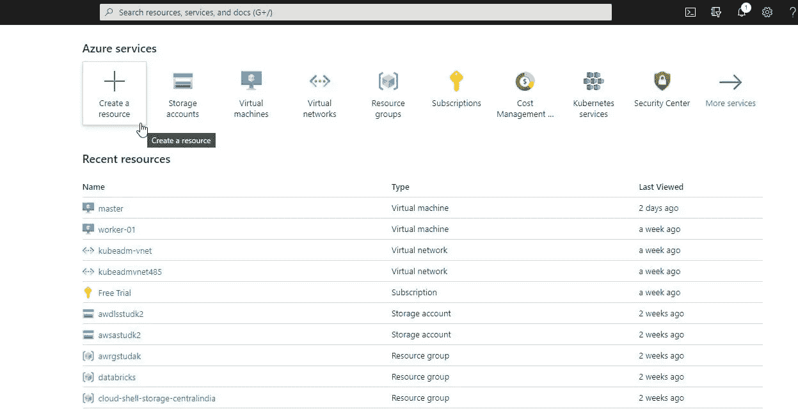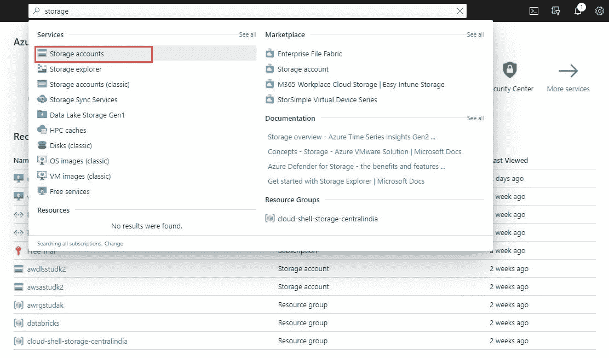

**步骤 2)** 现在，点击**添加**。然后选择您的**订阅**，然后选择您想要在其中创建该存储帐户的**资源组**。输入您的存储帐户的名称和位置。然后，选择**帐户种类、复制和访问层**。现在，点击**审查+创建**。

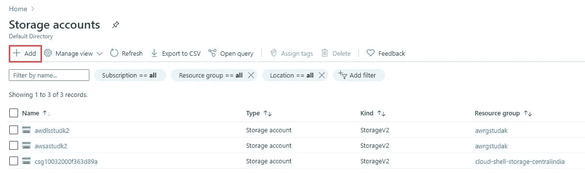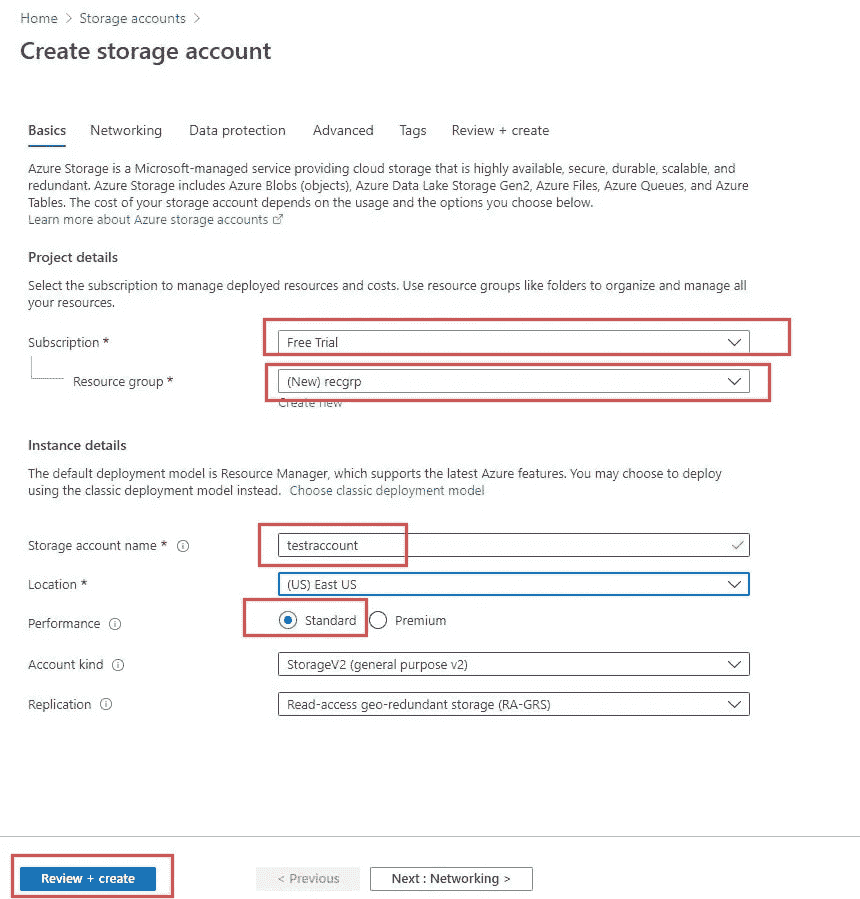

**步骤 3)** 现在，等待验证成功，然后点击**创建**。将进行资源部署。一旦完成，您将收到通知。然后点击**转到资源**转到新创建的存储帐户。

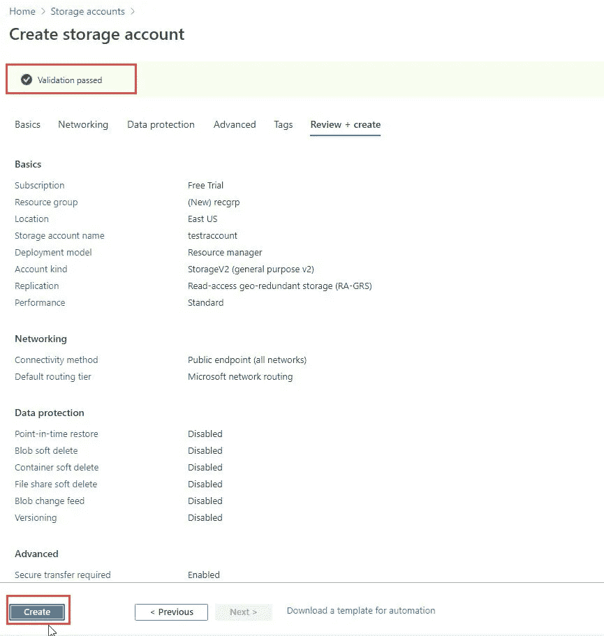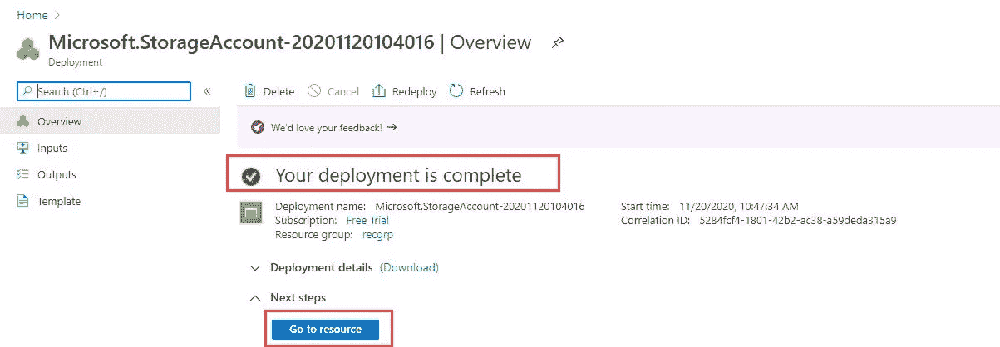

# 7.删除存储帐户

删除存储帐户比创建要简单得多，下面是删除存储帐户的步骤。

**步骤 1)** 点击**存储账户**，如果找不到也可以再次搜索。

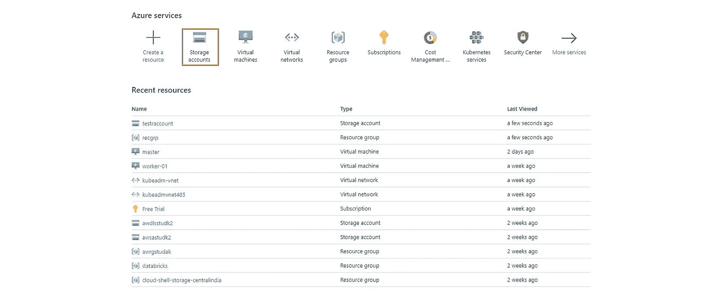

**步骤 2)** 现在让我们选择要删除的存储帐户，在这里我选择 **testraccount。**

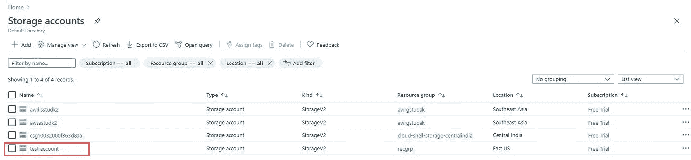

**步骤 3)** 现在你可以看到一个带有存储选项的新窗口出现，在这里点击**删除**选项。

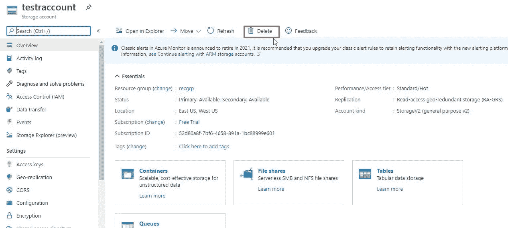

**步骤 4)** 要完成删除过程，我们必须进行确认，为此，您必须在**空框**中键入我们的存储帐户名称，然后单击**删除**按钮。

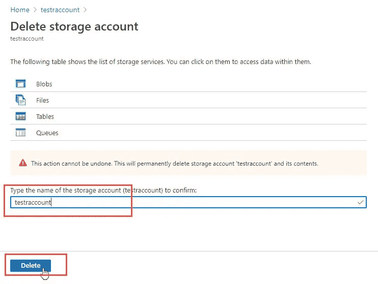

**第 5 步)**现在完成了，几秒钟后您会在**通知**下看到一条通知，告知您的资源已**成功删除存储帐户**的消息。

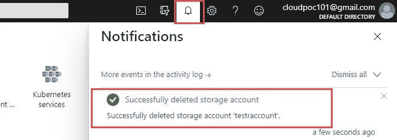

希望你们都喜欢这个博客。寻找更多令人惊叹的此类会议 [Sauravraghuvanshi](https://medium.com/u/6893ec6e51c?source=post_page-----98cd0b49346f--------------------------------) ！