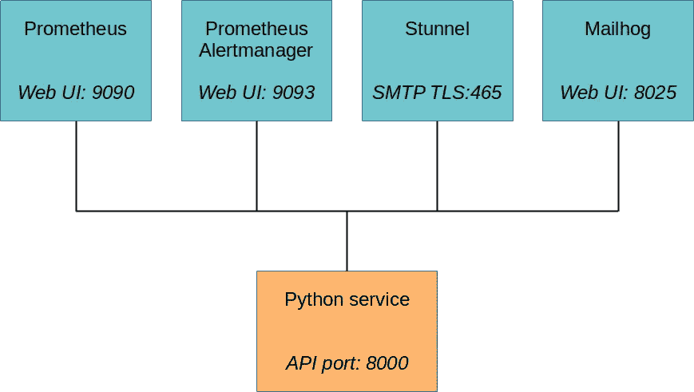
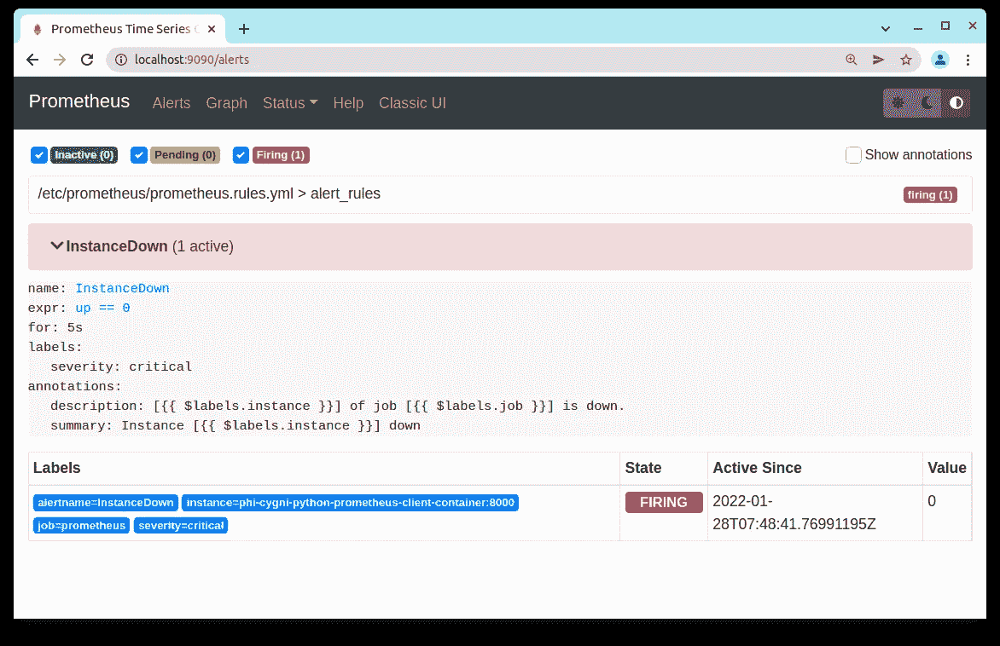
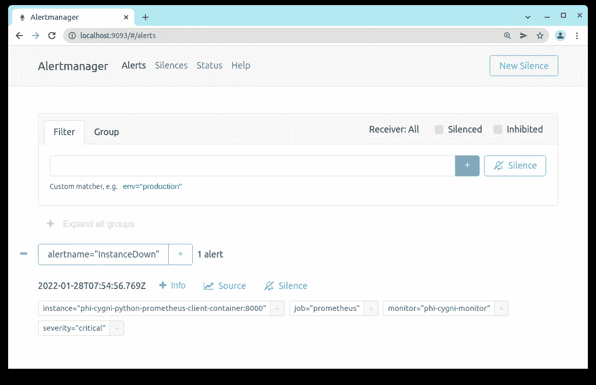
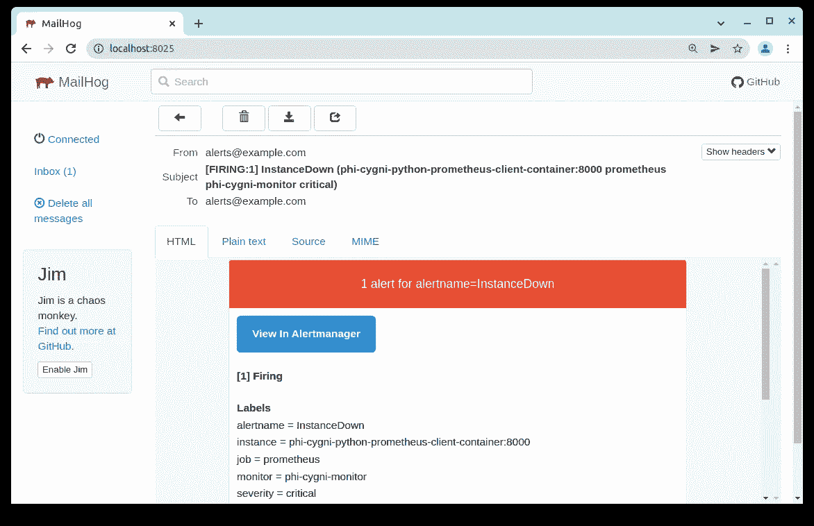
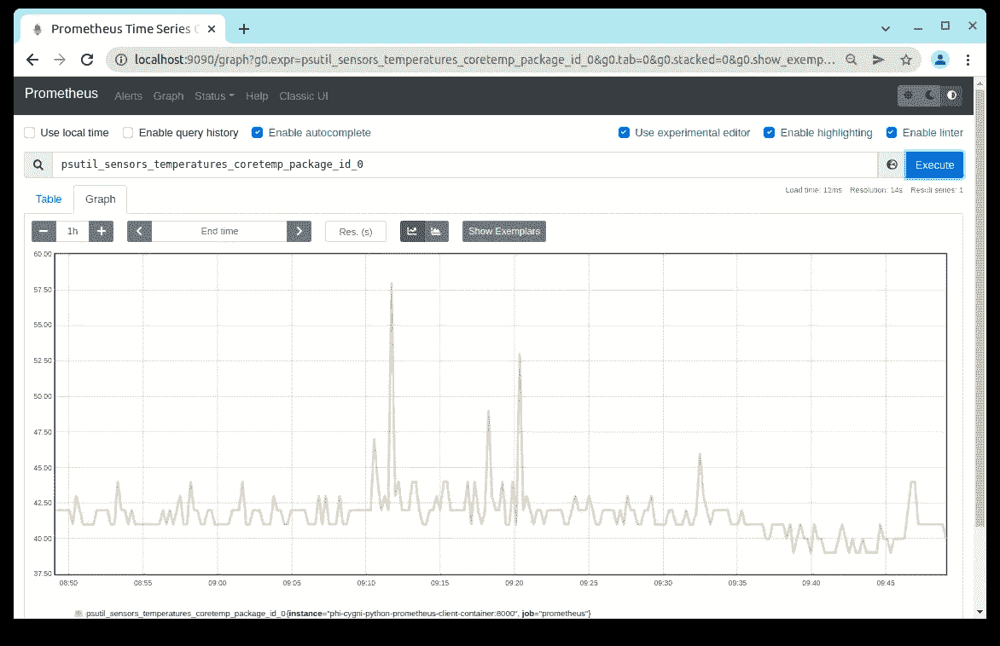
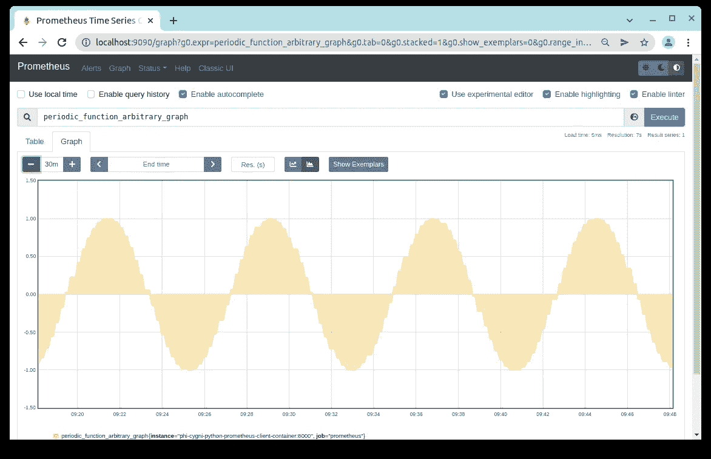

# 一个完整的基于 Prometheus 的电子邮件监控系统

> 原文：<https://blog.devgenius.io/a-complete-prometheus-based-email-monitoring-system-using-docker-compose-acbd4cc3676a?source=collection_archive---------3----------------------->

需要帮助设置监控系统吗？这是一个完整的、易于部署的、基于文档的监控系统，用于本地开发环境，带有电子邮件提醒。


克里斯蒂安·保罗·斯托贝在 [Unsplash](https://unsplash.com?utm_source=medium&utm_medium=referral) 上拍摄的照片

# TL；速度三角形定位法(dead reckoning)

开源软件 [Prometheus](https://prometheus.io/) 是一种有效可靠的监控软件服务的方式，比如网络应用。它将监控您的服务，并在服务关闭时通知您。此外，Prometheus 还从目标收集多种度量数据，用于诊断和显示目的。下面展示的是一个方便可靠的 [docker compose 脚本](https://github.com/PhiCygni/prometheus-plus-altermanager-mailhog-smtp-docker-compose)，它包含一整套组件，可用于在本地环境中运行完整的 Prometheus 监控系统，以进行评估和集成测试。用一个 docker 命令操作。compose 设计中包括 Prometheus 的容器、 [Prometheus Alertmanager](https://prometheus.io/docs/alerting/latest/alertmanager/) 、 [Mailhog](https://github.com/mailhog/MailHog) (一个测试 SMTP 服务器)和一些作为持续监控目标的 Python 代码。Prometheus 还能够监控用 Node、Java、Ruby、Go、Rust、C++、C#和 PHP 等语言开发的代码。轻松地更新组合脚本，以合并您要监控的特定服务。

# 目录

–[简介](#e0c5)
–[Docker 撰写设计](#6d34)
— [容器描述](#c667)
—[Prometheus](#c727)
—[Prometheus alert manager](#16bf)
—[Stunnel](#aa6f)
—[Mailhog](#94e2)
—[Python 目标容器(目标服务)](#d209)
— [撰写脚本用法](#0a25)

# 介绍

我最近参与了一个项目，为一个客户设计并实现了一个 web 应用程序。为了评估所述 web 应用程序的稳定性，我觉得随着时间的推移监视服务并在它关闭时有一个通知我的机制是很重要的。在做了一些粗略的研究后，我意识到开源监控软件普罗米修斯(Prometheus)，这是一个用于监控服务并在服务中断时发送警报的工具包。

根据 Git 回购:“*Cloud Native Computing Foundation 项目 Prometheus 是一个系统和服务监控系统。它以给定的时间间隔从已配置的目标收集指标，评估规则表达式，显示结果，并在观察到指定条件时触发警报* [ [2](https://github.com/prometheus/prometheus) 】。

到目前为止听起来不错，但是它能满足我的具体要求吗？我需要的功能是:

*   能够持续监控目标 web 应用服务。
*   让 SMTP 功能在服务关闭时通知我。
*   拥有一个 Django 或通用 Python 客户端库。这是因为要监控的目标 web 应用程序是在 Django 中开发的。
*   为了简化在云计算机上的部署，最终的解决方案必须能够被归档。
*   如果除了监视服务是否关闭之外，还收集其他指标，如 CPU 使用率、内存使用率和磁盘使用率，这将是一个额外的收获。

初步研究表明，Prometheus 软件将满足我的所有要求，在行业中也很受好评。然而，在将它部署到云之前，我需要一种方法在我的本地开发机器上评估它的功能。下面展示的是我创建的基于 docker compose 的设计，用于评估 Prometheus，并了解如何将客户端库集成到目标服务中。最后，我的评估测试表明 Prometheus 非常适合监控，我创建的 docker-compose 脚本非常有用，不仅显示了 Prometheus 知道服务何时关闭的整体能力，还显示了测试环境可以:

*   了解 Prometheus 如何与其他组件配合使用，构成一个完整的监控系统。
*   能够调整和优化监控参数。
*   闭环验证客户端库是否已正确集成到目标服务中。
*   通过在 Docker 中运行容器，使整个设置与平台无关。

在接下来的部分中，我们将描述这个监控和警报系统的 docker compose 设计，解释如何使用它，最后说明它如何适用于处理和显示自定义指标信息。

# Docker 排版设计

下面是 docker 撰写脚本。这是完整的 Github 回购的一部分，你可以在这里找到。

docker 撰写脚本包含以下图像:

*   普罗米修斯:[prom/普罗米修斯:v2.30.3](https://hub.docker.com/r/prom/prometheus)
*   普罗米修斯警报器管理器:[prom/警报器管理器:v0.23.0](https://hub.docker.com/r/prom/alertmanager)
*   Stunnel: [dweomer/stunnel:最新](https://hub.docker.com/r/dweomer/stunnel)
*   邮件猪:[邮件猪/邮件猪:1.0.1 版](https://hub.docker.com/r/mailhog/mailhog)
*   python:[python:3.8-alpine 3.15](https://hub.docker.com/_/python)

所有容器通过一个共享的桥接网络连接，如下图所示:



*这些是连接到桥接网络的 docker 编写脚本的容器。*

# 容器描述

# 普罗米修斯

Prometheus 容器负责持续监视目标服务，以确定它是否仍在运行，并收集其他度量信息。当它检测到服务关闭时，会生成一个警报，然后发送到 Prometheus Alertmanager 容器进行通知处理。

# 普罗米修斯警报管理器

Prometheus Alertmanager 容器负责处理 Prometheus 生成的警报并生成电子邮件通知。

# Stunnel

Stunnel 是一个代理，旨在为现有的客户端和服务器添加 TLS 加密功能，而无需对程序代码进行任何更改[ [4](https://www.stunnel.org/) ]。这是必要的，因为 Mailhog(SMTP 服务器)目前只支持未加密的 SMTP 功能[5]。Prometheus Alertmanager 将通过这个 Stunnel 代理向 Mailhog 发送一封电子邮件。

# 邮件猪

Mailhog 是一个测试 SMTP 服务器，配有一个 web UI，非常方便。为这个应用程序设置一个完美的 SMTP 服务器是很容易的。我以前写过一篇关于 Mailhog 的更详细的文章，可以在这里找到。

# Python 目标容器(目标服务)

最后，我们有了运行我们想要监控的目标服务的 Python 容器。对于评估测试，Python 代码被生成作为监控的目标服务。官方 Python 客户端库与代码和调用的适当函数集成在一起，为监控提供度量信息。在这里找到来源作为回购[的一部分。](https://github.com/PhiCygni/prometheus-plus-altermanager-mailhog-smtp-docker-compose)

# 撰写脚本用法

要检查回购，请键入以下内容:

```
$ git clone [https://github.com/PhiCygni/prometheus-plus-altermanager-mailhog-smtp-docker-compose.git](https://github.com/PhiCygni/prometheus-plus-altermanager-mailhog-smtp-docker-compose.git)
```

将目录更改为刚刚签出的目录:

```
$ cd prometheus-plus-altermanager-mailhog-smtp-docker-compose/
```

要构建和运行 docker 容器，请键入以下内容:

```
$ docker-compose up
```

所有的容器都将被创建并启动。以下端口已公开供使用:

要停止容器，请键入以下内容:

```
$ docker-compose stop
```

在 Linux 中，要停止并删除所有容器，请键入以下内容:

```
$ ./script-docker-compose-down-remove-everything.sh
```

在 Windows 中，要停止并删除所有容器，请键入以下内容:

```
$ script-docker-compose-down-remove-everything.bat
```

# 电子邮件警报流程

Prometheus 容器持续监视 Python 目标服务，并在它关闭时生成警报。通过使用以下命令停止 Python 服务，可以引发目标关闭事件:

```
$ docker-compose stop phi-cygni-python-prometheus-client-container
```

Prometheus UI 上显示活动警报，如下图所示:



*Prometheus UI 显示目标服务已关闭。*

从这里开始，在生成电子邮件之前需要执行几个步骤。下图显示了普罗米修斯警报如何最终转化为通知电子邮件:


*生成邮件时容器间的流动。*

上图中的四个步骤可以描述为:

*(1)* 目标服务关闭后，Prometheus 将生成一个警报，并通过端口 9093 将其发送到 Alertmanager 容器。

*(2)*alert manager 通过生成 SMTP 电子邮件并经由端口 SMTP TLS 端口 465 将其发送到 Stunnel 容器来响应警报。

*(3)*Stunnel 通过端口 1025 将未加密的 SMTP 电子邮件转发到 Mailhog 容器。

*(4)*mail hog 容器接收未加密的 SMTP 电子邮件，并将其显示在其 Web UI 上。

Alertmanager 收到的警报将显示在其 UI 上，如下图所示:



*alert manager UI 显示服务已关闭。*

Mailhog 收到的警报电子邮件通知示例如以下屏幕截图所示:



*mail hog 上收到的实例关闭电子邮件警报。*

# 其他指标

除了监视服务是否关闭，Prometheus 还收集和显示各种度量信息。该屏幕截图显示了 Prometheus UI 显示从目标 Python 服务捕获的 CPU 温度:



*Prometheus 以图表形式显示 CPU 温度信息。*

还可以通过在目标服务中调用适当的客户端库函数来监控自定义指标。出于演示的目的，我设计了目标 Python 代码来从正弦函数生成浮点值，以便随时间显示。这是一个完全随意的例子，但演示了功能。下面显示的是 Prometheus UI 的一个屏幕截图，以图表形式显示了自定义指标。



*由 Python 目标服务生成的任意自定义指标的图表。*

# 也可以监控其他开发语言

还应该注意的是，Prometheus 的用途不仅限于监视 Python 代码。Prometheus 还提供了 Go、Java、Scala、Ruby 和 Rust 语言的官方库。除此之外，还有 Bash、C、C++、Common Lisp、Dart、Elixir、Erlang、Haskell、Lua、C#、Node (Javascript)、OCaml、Perl、PHP 和 R [ [3](https://prometheus.io/docs/instrumenting/clientlibs/) ]的非官方第三方客户端库。因此，普罗米修斯将与几乎所有需要监控的代码兼容。

# 结论

Prometheus 是备受尊敬的企业级监控服务，上面介绍的 docker compose 脚本将其整合到一个完整且易于使用的监控系统中，该系统包括电子邮件警报。除了展示当目标服务关闭时如何生成电子邮件警报之外，还解释了脚本的设计和用法。还展示了通过 Prometheus Web UI 显示的指标信息示例。从这里，用户可以轻松地修改 composer 脚本，以结合他们自己的特定服务进行监控。监控系统的文档化设计意味着它可以快速部署、可重复，并且还提供了方便的开发环境来调整监控参数、评估警报生成以及对收集的诊断度量信息进行必要的集成。

# 参考

[1]:[https://prometheus.io/](https://prometheus.io/)

【2】:【https://github.com/prometheus/prometheus 

【3】:【https://prometheus.io/docs/instrumenting/clientlibs/ 

[https://www.stunnel.org/](https://www.stunnel.org/)

[https://github.com/mailhog/MailHog/issues/84](https://github.com/mailhog/MailHog/issues/84)

[](https://phicygni.com/) [## Phi Cygni

### 多线程 Python 为什么这么慢？真相和可能的解决方法。使用 Mailhog 可以非常…

phicygni.com](https://phicygni.com/)