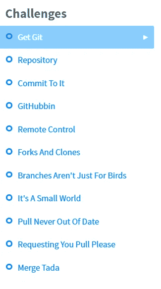
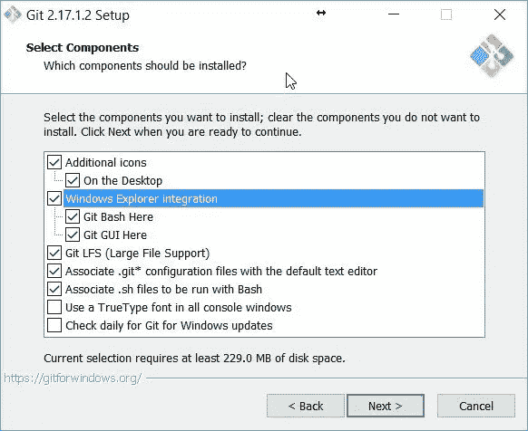
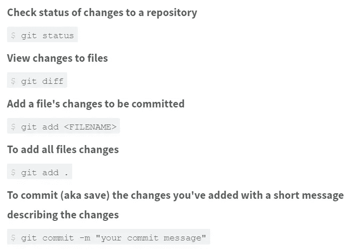
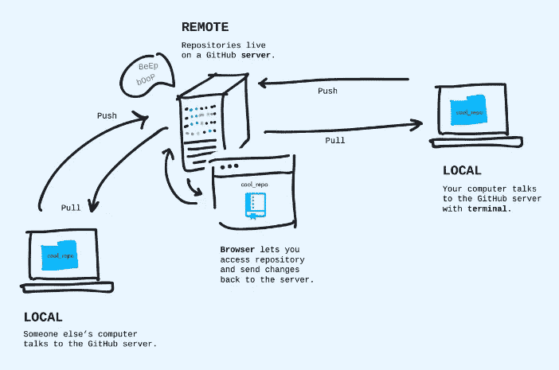
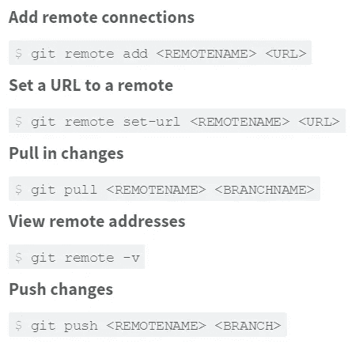
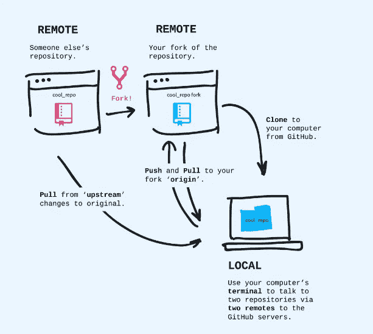
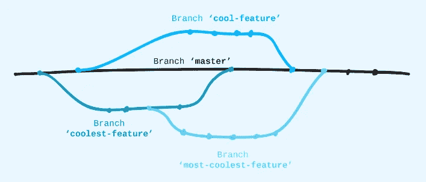
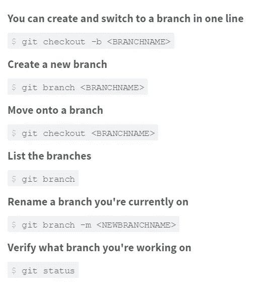
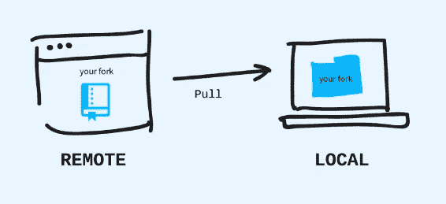
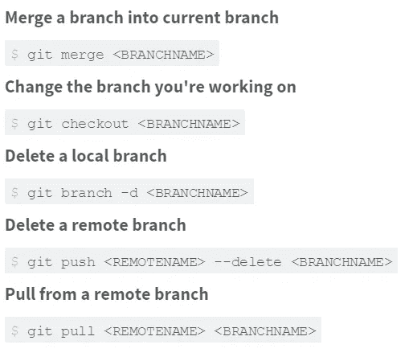

# GitHub 综合教程

> 原文：<https://blog.devgenius.io/a-comprehensive-course-on-github-27f2b0f67c78?source=collection_archive---------6----------------------->


罗曼·辛克维奇·🇺🇦在 [Unsplash](https://unsplash.com?utm_source=medium&utm_medium=referral) 上拍摄的照片

# 介绍

如果你是一个做梦都想成为软件开发人员的人，那么 Git 是我建议你学习的第一件事。Git 是一个版本控制系统，GitHub 是其中一个不同的工具。

撇开技术术语不谈，你有没有和不同的人合作开发同一个代码，然后每次你做了一个改变，你就压缩它，把 zip 文件发给其他人，然后使用它？如此痛苦的通知其他队友改变的方式，专业人士读到这里会很奇怪，但不骗你，这就是我 80%的大学生在大一交换代码的方式。如果你在你的编码生涯中曾经面临过任何类似的问题，那么你正处在即兴发挥的正确位置。

如果你是一个常规的人，想要了解各种版本控制系统及其用例，那么你可以阅读这篇文章([版本控制系统](https://dev.to/indirakumar/version-control-system-3hd4))并回到这篇文章，或者如果你是那种只想去工作而不是阅读理论的人，那么你可以继续阅读当前的文章。

# 先决条件

所有的 best❤️都是为了你的新事业，我相信在完成这个课程后，这肯定会改变你在团队中管理代码的方式。首先，在开始之前，转到 [git-it](https://github.com/jlord/git-it-electron) 存储库并下载整个存储库，然后运行。exe 文件来打开一个小应用程序，通过它你将学会使用 GitHub。

您需要完成以下挑战，并通过这些挑战学习 git。



*图片致谢:*[*git-it*](https://github.com/jlord/git-it-electron)*app*

# 如何接近:

为了简单和避免过度，我将课程挑战分成了 5 天。无论你想做什么，都由你来完成。我建议你一天一次进行 5 天，但是如果你认为你更快，那么你显然可以一次完成💯💯。

# 第一天:

**获取 Git:**

*   Git 是由 Linus Torvalds 编写的免费开源软件(源代码是公开的),他也编写了 Linux 操作系统的内核。
*   我推荐通过安装 [GitHub 桌面 app](https://desktop.github.com/) 来安装 Git
*   这是在您的计算机上安装 git bash 的最佳方式，尤其是如果您是初学者。另外，不要忘记选择“在 Windows 资源管理器集成中添加 git bash”



*图片来源:*[*git-it*](https://github.com/jlord/git-it-electron)*app*

现在从开始菜单打开 git。
步骤:

1.  **您可以使用以下方式设置您的姓名:**

```
git config --global user.name "Your Name"
```

1.  **现在设置您的电子邮件:**

```
git config --global user.email "youremail@example.com"
```

****Repository:**
你可以把它想象成一个项目文件夹，里面放着所有相关的文件。有时它们简称为“回购”。
你告诉 Git 你的项目是什么，Git 将开始跟踪对该文件夹的所有更改。这使它成为一个 Git 存储库:Git 正在跟踪的项目的文件夹。Git 跟踪文件何时被添加、删除，甚至是单个文件中的一个字母
你将使用命令行界面(CLI)在 Git 上工作，因为一旦你掌握了它，这是完成事情的最有效的方式。该命令的第一部分让您的计算机知道您正在与 Git 对话。接下来的部分是您希望 Git 执行的命令和不同选项。**

**导航到您的首选文件夹并右键单击(选择更多选项)，然后选择用 git bash 打开。**

****步骤:****

1.  **首先，创建一个新文件夹:
    提示:mkdir 代表创建目录**

```
mkdir hello-world
```

1.  **然后进入那个文件夹:
    提示:cd 代表变更目录**

```
cd hello-world
```

1.  **最后，告诉 Git 初始化(开始跟踪)您现在所在的文件夹:**

```
git init
```

**最后一个命令应该返回以“初始化的空 Git 存储库”开始的内容。这是告诉 git 这是我的项目文件夹并负责这里所有更改的方式。Git 将创建一个隐藏文件夹，并使用它来跟踪这个“hello-world”文件夹中的所有更改。**

# **第二天:**

****提交:**
提交是使用 Git 的核心。它们是您使用提交消息保存和描述您已经完成的工作的时刻。简单地说，提交是你文件夹中的一个历史点，每个提交都有一个 id，你可以用它来恢复到你文件夹中的那个历史点，稍后会有更多的介绍。导航到你的 hello world 文件夹，右击(选择更多选项)，然后选择用 git bash 打开。**

****步骤:****

1.  **使用记事本创建一个新文件，并将其作为 readme.txt 保存在 hello world 文件夹中。**
2.  **您可以使用以下方法检查文件夹的状态:**

```
git status
```

**Git 应该会告诉您已经添加了一个文件。**

1.  **然后使用以下命令将这些文件添加到 stage(只有在此之后，我们才能提交我们的任何更改):**

```
git add readme.txt
```

**为什么要添加命令？实时地，我们的存储库中有如此多的文件被改变。但是我们可能不希望在我们的提交中保存所有的文件。我们希望历史记录中只保存少量的文件更改。因此，使用这个 add 命令，我们可以添加我们希望在提交中保存的所有文件。**

1.  **最后，用一条描述更新的短消息(m)将这些更改提交到存储库的历史中。**

```
git commit -m "Created readme"
```

**-m 后面跟的是您的提交消息。总是建议放置有意义的提交消息。不是“advasdma”。相信我，如果您的应用程序在某个地方出错，好的提交消息会节省您大量的时间。**

1.  **现在，在“readme.txt”中添加另一行，并再次保存文件。在终端中，你可以看到文件现在和上次提交时的不同。
    告诉 Git 向您展示差异:
    git diff**

****

***图片来源:* [*git-it*](https://github.com/jlord/git-it-electron)**

**到目前为止，您创建的存储库就在您的计算机上，这很方便，但是很难与他人共享和使用。别担心，这就是 GitHub 的作用！
GitHub 充当你和其他人共享的中央存储库。你把你的改变推给它，把别人的改变拉下来。**

****步骤:****

1.  **创建一个 GitHub 账户
    访问[github.com](http://github.com/)并注册一个免费账户。击掌，欢迎！**

**当你在 GitHub 上放东西时，副本会存在于 GitHub 的服务器上。这使它成为一个远程存储库，因为它不在您的计算机上，而是在一个“远程”服务器或其他地方。通过将您的本地(在您的计算机上)更改推送到它，您可以保持它是最新的。**

****

***图片来源:* [*git-it*](https://github.com/jlord/git-it-electron)**

****创建远程回购的步骤:**
转到[github.com](http://github.com/)，登录，点击右上角的“+”，然后点击“新建存储库”。给它起一个与你的本地存储库的名字相匹配的名字，“hello-world”和一个简短的描述。公开它。这意味着它将列在您的公开个人资料中。
不要用自述文件初始化，因为我们在本地已经有一个名为“readme.txt”的文件。这是 GitHub 的一个助手选项，如果你还没有做的话。离开。“gitignore”和“license”设置为“none”。我们不会在本教程中使用它们。
·点击创建存储库！**

****注:****

*   **自述文件解释了项目是什么，如何使用它，以及通常如何贡献(尽管有时会有一个额外的文件，' [CONTRIBUTING.md 【T1 ' '，用于那些细节)。](http://contributing.md/)**
*   **答。gitignore 是 Git 不应该跟踪的文件列表，例如，带有密码的文件！**
*   **许可文件是您放在项目上的许可类型。这让其他人知道他们可以如何使用它。关于种类的信息在这里:【choosealicense.com】T2。**

**现在，在顶部你会看到“快速设置”，确保“HTTPS”按钮被选中，然后复制地址——这是你在 GitHub 服务器上的库的地址。
回到您的终端，在您在之前的挑战中初始化为 Git 存储库的“hello-world”文件夹中，您想要告诉 Git 记住 GitHub 服务器上远程版本的地址。您可以有多个遥控器，因此每个遥控器都需要一个名称。主遥控器通常被命名为 origin。**

**要将名为“origin”的遥控器添加到存储库中，请执行以下操作:**

```
git remote add origin <URLFROMGITHUB>
```

**【Windows 用户注意:
如果您的计算机上安装了 GitHub Desktop，则会在您的本地存储库中自动创建一个名为“origin”的遥控器。在这种情况下，你只需要告诉它与“起源”相关联的 URL。使用此命令代替上面的“添加”命令:**

```
git remote set-url origin <URLFROMGITHUB>
```

**接下来，您希望将您在本地所做的一切推送到 GitHub 上的远程存储库中。**

**Git 有一个分支系统，这样你可以在不同的时间处理一个项目的不同部分。稍后我们将了解更多，但默认情况下，第一个分支被命名为“master”。当您从一个项目中推送(以及后来的拉取)时，您告诉 Git 您想要的分支名称和它所在的远程的名称。**

****Push:**
接下来，您想要将您在本地所做的一切都推(发送)到您在 GitHub 上的远程存储库。Git 有一个分支系统，这样你可以在不同的时间处理一个项目的不同部分。稍后我们将了解更多，但默认情况下，第一个分支被命名为“master”。当您从一个项目中推送(以及后来的拉取)时，您告诉 Git 您想要的分支名称和它所在的远程的名称。
在这种情况下，我们将名为‘master’的分支发送到 GitHub 上名为‘origin’的远程。**

```
git push origin master
```

****

***图片致谢:* [*git-it*](https://github.com/jlord/git-it-electron)**

# **第三天:**

****Forks:**
到目前为止，我们已经看到了如何使用 git 来管理你的回购。现在我们将看到一个正在与其他人的回购进行交互的分叉。
当你创建一个存储库时，你就在你的 GitHub 账户上创建了一个副本。你的分叉副本作为一个远程存储库开始了它的生命——它只存在于你的 GitHub 帐户上，而不在你的电脑上。分叉用于创建您自己的项目版本，或者将您的更改(例如错误修复或新特性)反馈到原始项目。**

****

***图片来源:* [*git-it*](https://github.com/jlord/git-it-electron)**

**本地克隆您的 Fork
现在，在终端中，您将把存储库克隆到您的计算机上。
退出你的“hello-world”文件夹:
提示:这两个点表示退出一级目录**

```
cd ..
```

**现在，克隆你的叉子:**

```
git clone <URLFROMGITHUB>
```

**这里**

```
git clone https://github.com/Indira-kumar/patchwork.git or 
git clone https://github.com/jlord/patchwork.git
```

**进入它为您的 fork 本地副本创建的文件夹(在本例中，名为‘patchwork’)。**

```
cd <FOLDERNAME>
```

**键入 git remote -v，查看已经设置了 fork 的地址。**

**连接到原始存储库
您可以将这个远程连接命名为任何您想要的名称，但是通常人们使用“上游”这个名称；我们就用这个吧。**

```
git remote add upstream https://github.com/jlord/patchwork.git
```

**为了确保设置了正确的遥控器，请键入 git remote -v 列出您存储的地址。您应该有一个“源”远程与您的叉的地址，然后一个“上游”远程与原始的地址，在这一步上面提到的网址。**

****分支:**
在处理一个项目或与他人一起处理一个项目时，通常会创建一个分支来保存您的工作变更。这样，您可以在主要分支(通常称为“主”分支)保持稳定的情况下完成工作。你甚至可以为分支创建一个分支。**

****

***图片来源:* [*git-it*](https://github.com/jlord/git-it-electron)**

**当您创建一个分支时，Git 会从您所在的当前分支复制所有内容，并将其放在您请求创建的分支中。
分支是区分大小写的，所以要按照 GitHub 的名称来命名分支。**

```
git branch <BRANCHNAME>
```

**要进入该分支并对其进行操作，您需要检出一个分支。转到您的新分支机构:**

```
git checkout <BRANCHNAME>
```

**现在，在您的本地存储库中随意进行更改，然后在推送时，您可以选择要推送至哪个远程和哪个分支。**

```
git push origin <BRANCHNAME>
```

****

***图片来源:* [*git-it*](https://github.com/jlord/git-it-electron)**

# **第四天:**

**协作者是其他 GitHub 用户，他们被允许对其他人拥有的存储库进行编辑。Contributor，这描述了另一个 GitHub 用户，他通过 Fork 和 Pull 请求对一个项目做出了贡献。
网址应该是这样的，但是要有你的用户名。

此时在您的存储库中，您可以添加 reporobot 作为合作者。**

**如果你正在和别人一起工作，你需要了解最新的变化。因此，您需要将任何可能已经被推送到中央 GitHub 存储库的更改拉进来。**

****

***图片致谢:* [*git-it*](https://github.com/jlord/git-it-electron)**

**使用以下命令对本地代码进行更改:**

```
git pull <REMOTENAME> <BRANCHNAME>
```

****第 5 天:**
**拉取请求:**
当您对已经分叉的项目进行变更和改进时，您会想要将这些变更发送给原始项目的维护者，并请求他们将这些变更拉取到原始项目中，以便每个人都可以从更新中受益——这是一个拉取请求。
[https://open source . com/article/19/7/create-pull-request-github](https://opensource.com/article/19/7/create-pull-request-github)**

****本地合并:**
首先，移动到你想要合并到的分支——在这个例子中，分支是‘GH-pages’。**

```
git checkout gh-pages
```

**现在告诉 Git 您想要合并到哪个分支——在本例中，是以“add-”开头的特性分支。**

```
git merge <BRANCHNAME>
```

**通过删除您的特征分支进行整理。现在它已经被合并了，你真的不需要它了。**

```
git branch -d <BRANCHNAME>
```

****

***图片来源:* [*git-it*](https://github.com/jlord/git-it-electron)**

****注:****

```
git rm - -cached <FILENAME>
```

**将文件从 stage(从 track)中移除
Git 合并工具
管理合并冲突，并轻松合并(winmerge 很流行)**

**当你在一个特定的分支(分支 A)上工作时，你还没有完成所做的变更，所以你不想提交你的变更，但是你必须切换到另一个分支(分支 B)进行一些变更。然后，为了在不提交的情况下保存分支 A 中的更改，您可以使用“git stash”。
然后现在您可以切换到分支 B，进行更改并提交，当您回到分支 A 工作时，您可以执行“git stash apply”来带回那些未保存的更改**

**这里有一个[视频](https://www.youtube.com/watch?v=lH3ZkwbVp5E)进行深度定义。**

**祝贺你完成了基础 GitHub 课程，现在你可以学习更高级的主题，如 rebase，force push 等。在这次[课程中](https://ooloo.io/project/github-flow)**

# **参考资料:**

*   **[20 分钟学会 Git](https://www.youtube.com/watch?v=Y9XZQO1n_7c&t=21s&ab_channel=CodeInsights)**
*   **Git-it 项目 —本课程基于该软件。感谢[*jrod*](https://github.com/jlord)如此惊人的内容。**
*   **[CS50 GitHub](https://www.youtube.com/watch?v=eulnSXkhE7I)**

**非常感谢您的宝贵时间！！快乐 Coding❤️**