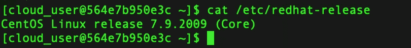
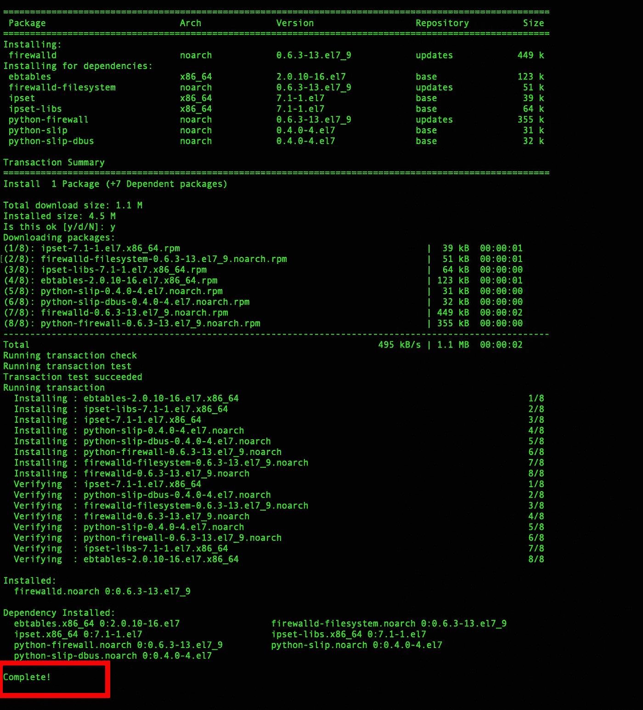
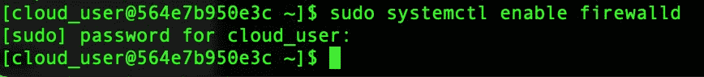
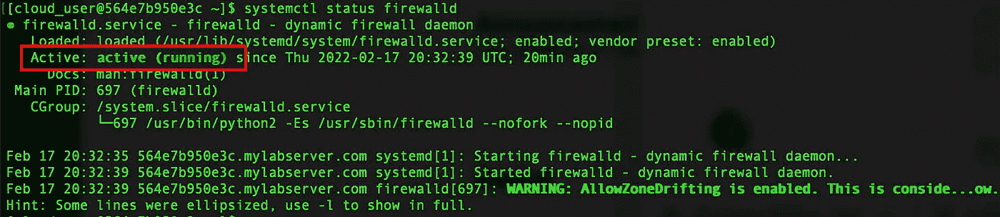
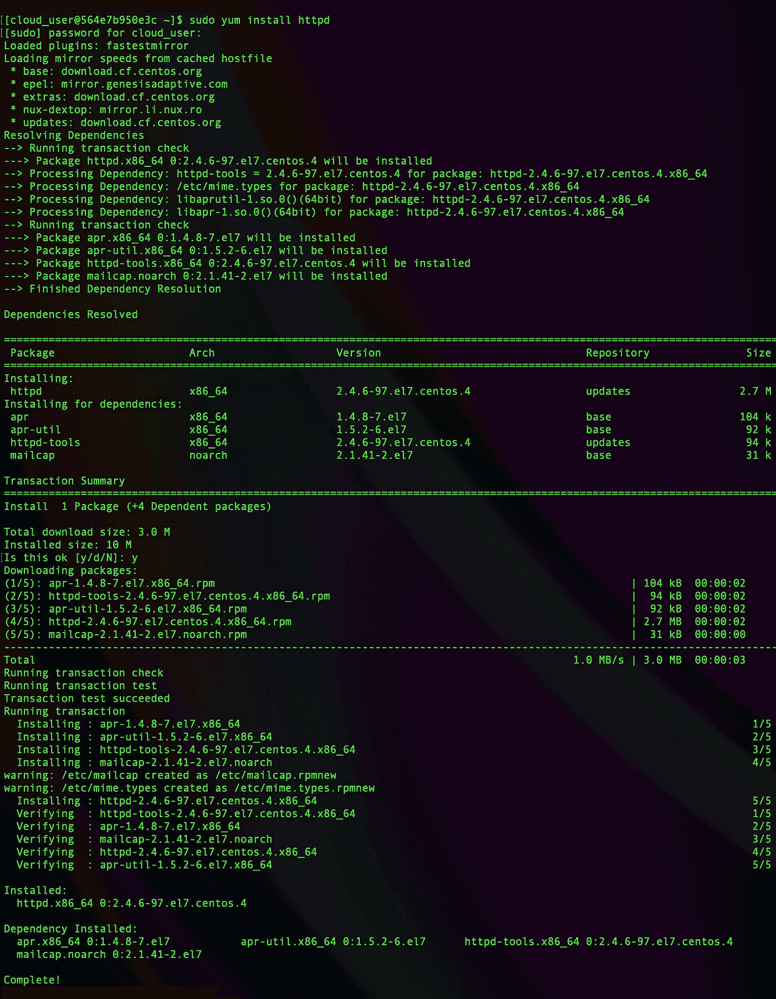
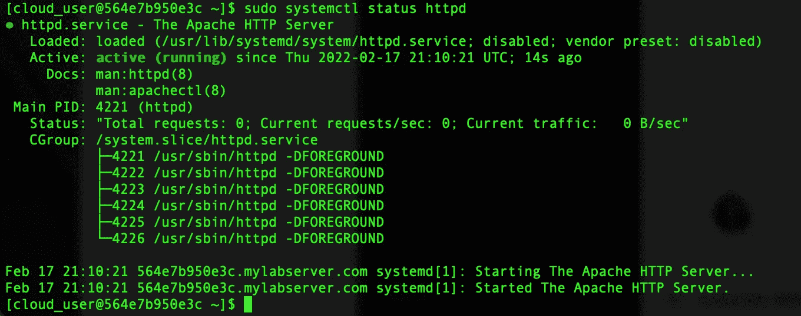
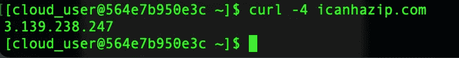
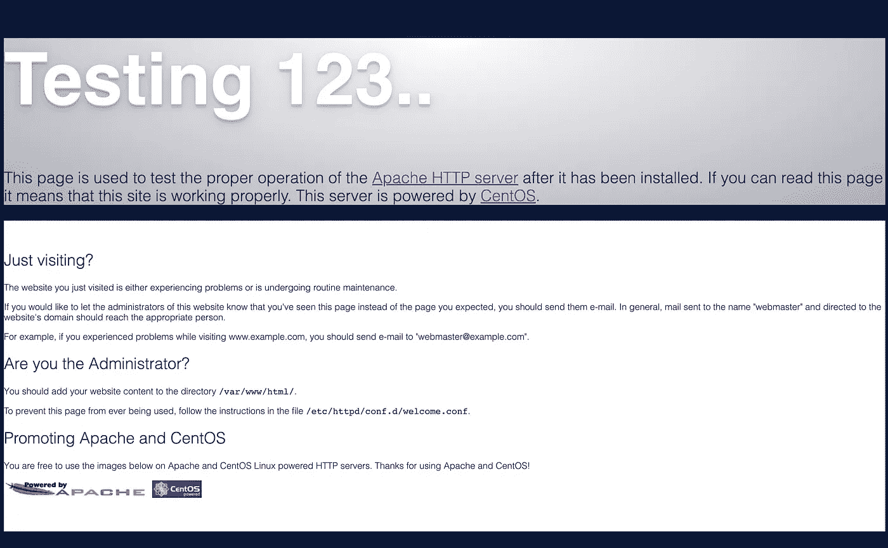

# 在 CentOS 7 上安装 Apache Web 服务器的全面指南

> 原文：<https://blog.devgenius.io/a-comprehensive-guide-to-installing-apache-web-server-on-centos-7-b945744953e6?source=collection_archive---------3----------------------->


我们将一起介绍在 Linux CentOS 7 发行版上安装 Apache web 服务器的最简单、最有效的方法。如果您正在阅读这篇文章，您可能已经知道 CentOS 和 Apache 是什么，但是让我们一起快速浏览一下:

***CentOS:*** CentOS 是 Linux 的一个发行版，它提供了一个免费的、开源的、受社区支持的计算平台，在功能上与其上游源代码 Red Hat Enterprise Linux 兼容。它最初的制作是因为制作红帽的公司停止了免费提供。现在，许多人在 CentOS 上工作，更多的人在电脑上使用它。通常，CentOS 用于服务器(为人们或其他计算机提供服务的计算机),因为它很稳定，可以在很短的时间内安装。 *(* [*来源*](https://simple.wikipedia.org/wiki/CentOS) *)*

***Apache:****Apache 是应用最广泛的 web 服务器软件。Apache 由 Apache 软件基金会开发和维护，是一个免费的开源软件。它运行在世界上 67%的网络服务器上。它快速、可靠、安全。通过使用扩展和模块，它可以被高度定制以满足许多不同环境的需要。大多数 WordPress 主机提供商使用 Apache 作为他们的网络服务器软件。然而，WordPress 也可以在其他网络服务器软件上运行。 *(* [*来源*](https://www.wpbeginner.com/glossary/apache/)) *)**

## *在我们开始之前，您需要完成以下工作:*

*   *在您的设备上启动命令行终端，并通过 SSH 建立到您的云服务器的连接。*
*   *拥有 sudo 权限的帐户。*
*   *最后，您需要一台安装了 CentOS 7 的服务器。*

****SSH 使用以下命令:****

```
*ssh user_name@host_ip_addres*
```

*   ***ssh(“安全外壳”)命令**指示系统与主机建立加密的安全连接。*
*   ***用户名**代表主机上正在被访问的账户。*
*   ***主机**是指被访问的机器，可以是电脑，也可以是路由器。它可以是 IP 地址(如 102.468.2.28)或域名。*

# ***步骤 1:更新服务器上的所有软件包***

*在我们真正开始安装 Apache 之前，我们将检查 CentOS 7 是否需要任何可能的更新。我们为什么要这样做？更新是预防性维护，是保持机器最新、稳定、安全，免受恶意软件和其他潜在安全威胁的必要手段。*

****使用以下命令检查可用的 CentOS 7 更新:****

```
*sudo yum update*
```

*系统将显示可用更新的列表，包括核心操作系统更新。浏览这些以确保一切正常。系统应该给你一个要下载的包的列表，以及需要的磁盘空间。*

**注意:这可能需要几分钟——所以去热一下你的咖啡，吃点零食吧！**

## *可选:**验证当前 CentOS 版本**:*

*要在 CentOS 7 上验证当前版本，请在终端中输入命令。从下面的终端图片我们可以看到，web 服务器上运行的是 7.9.2009x。*

****使用以下命令验证当前的 CentOS:****

```
*cat /etc/redhat-release*
```

**

# *步骤 2:安装防火墙并使其在启动时启动*

*Firewalld 默认安装在一些 Linux 发行版上——尽管可能需要自己安装防火墙。*

****使用以下命令安装 firewalld:****

```
*sudo yum install firewalld*
```

**

*注意我们现在是完整的！*

*在我们安装了 firewalld 之后，我们将启用该服务并重启我们的服务器。请记住，启用 firewalld 将导致服务在启动时启动。*

****使用以下命令启用防火墙:****

```
*sudo systemctl enable firewalld*
```

**

*随后快速重启服务器。*

****用以下命令启动防火墙:****

```
*systemctl start firewalld*
```

****使用以下命令检查防火墙状态:****

```
*systemctl status firewalld*
```

**

*注意活动状态*

****使用以下命令启用防火墙的 http(端口 80)服务:****

```
*sudo firewall-cmd --permanent --add-service=http*
```

****使用以下命令启用防火墙的 http(端口 443)服务:****

```
*sudo firewall-cmd --permanent --add-service=https*
```

*最后，我们必须重新加载 firewalld 以使更改生效。*

****使用以下命令重新加载 firewalld:****

```
*sudo firewall-cmd — reload*
```

# *步骤 3:安装 Apache HTTP Web 服务器*

*终于！我们期待已久的时刻！*

*由于 CentOS 7 的默认软件中提供了 Apache，因此我们可以使用 yum package manager 命令轻松安装 Apache。*

****用下面的命令安装 Apache:****

```
*sudo yum install httpd*
```

**

*注意底部的“完成”*

# *步骤 4:手动启用 Apache*

*与我们启动和检查防火墙状态的方式相同，我们需要对 Apache 做同样的事情。*

****使用以下命令手动启用 Apache:****

```
*sudo systemctl start httpd*
```

****使用以下命令验证 Apache 状态:****

```
*sudo systemctl status httpd*
```

**

*请注意，状态为“活动”并正在运行*

*Apache web 服务器现在正在运行！*

# *步骤 5:测试网页*

*让我们通过收集公共 ip 地址来测试我们的网页。*

****使用以下命令获取公有 IP 地址:****

```
*curl -4 icanhazip.com*
```

**

*一旦你获得了公共 IP，在你的网络浏览器中输入“http://your_public_ip”并点击回车。您应该会看到下面的测试页面。如果是，这意味着服务器配置正确！*

**

## *恭喜你！您现在有一个活动的服务器了！*

*如果这个分步指南对你有帮助，请在下面留言告诉我！我等不及收到你的来信了！*

**